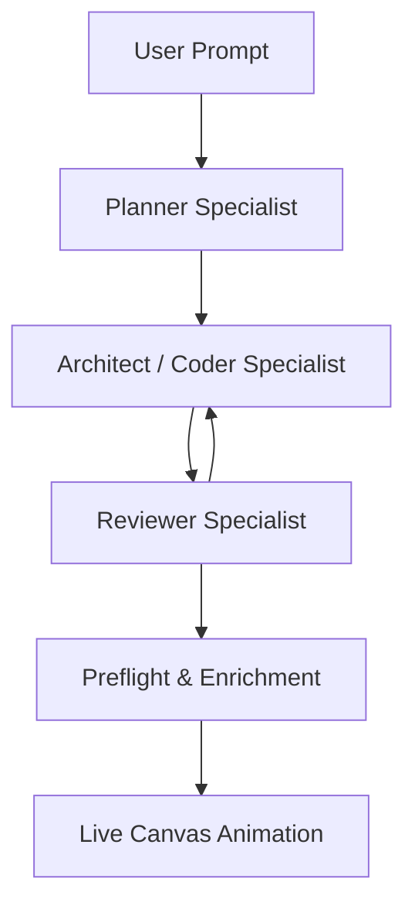

# Specialist Creation Swarm & Semi-Deterministic Synthesis Pipeline

## V1.5 Blueprint For 10x Workflow Creation In Agentis

May 2026. This blueprint defines the next leap in Agentis workflow creation:
a multi-agent specialist creation swarm plus a strict, machine-first synthesis
grammar. The system should generate workflows that use deterministic nodes,
Extensions, integrations, memory, and agent judgment in the right places instead
of defaulting to long chains of expensive `agent_task` nodes.

## 1. The Honest Assessment

Workflow creation breaks down when a single model is asked to invent the whole
graph at once:

1. **Agent-task bloat.** Simple deterministic work becomes serial language-model
   work.
2. **Unused specialists.** Planner, coder, reviewer, analyst, and operator-facing
   roles are bypassed during synthesis.
3. **Extension/ability ambiguity.** Deterministic machine execution and
   behavioral agent context need different product surfaces and different runtime
   contracts.

Agentis should make workflow creation feel like a structured cognitive loop, not
a silent batch generation step.

## 2. Specialist Creation Swarm



## 3. Specialist Roles

**Planner**

- Converts the natural language request into named phases.
- Estimates cost, latency, and risk before node placement.
- Chooses the logical archetype: atomic, pipeline, orchestrated, or enterprise.

**Architect / Coder**

- Compiles the phase plan into typed `WorkflowGraph` JSON.
- Prioritizes deterministic nodes for deterministic work.
- Uses `extension_task` when reusable code-backed capability is appropriate.
- Uses `agent_task` only when judgment, synthesis, or tool reasoning is needed.

**Reviewer**

- Audits graph grammar.
- Rejects lazy serial agent chains when deterministic branches are possible.
- Forces corrections before the graph is saved or animated.

## 4. Workflow Grammar

| Rule | Title | Correct Bias |
|---|---|---|
| 1 | Single Responsibility | Each node does one thing |
| 2 | Determinism First | Use machine execution when output is determined by input |
| 3 | Native Integration | Delivery systems use integration nodes |
| 4 | Source Fetching | Fetching uses HTTP, browser, integration, or Extension nodes |
| 5 | Knowledge Before Agent | Retrieve facts before asking an agent to reason |
| 6 | Guard Expensive Steps | Approval or evaluation before irreversible actions |
| 7 | Scheduled Is Autonomous | Cron workflows avoid blocking checkpoints |
| 8 | Parallel Over Serial | Independent work fans out and merges |
| 9 | Output-Driven Naming | Node titles describe produced value |
| 10 | Terminal Guarantee | Every workflow ends with explicit output |
| 11 | Trigger Scheduling | Scheduling belongs on triggers |
| 12 | Credentials Drive Wiring | Missing credentials become pending-config |
| 13 | State Memory | Recurring workflows read and write state |

## 5. Extension And Ability Boundary

Extensions are deterministic runtime units. They expose typed operations, declare
permissions, and run locally under the Extension runtime. Use them for reusable
machine work such as scraping, parsing, enrichment, file transforms, and API
orchestration.

Abilities are behavioral context. They shape how an agent thinks and responds by
providing instructions, policies, examples, and learned patterns.

```text
Agentis Workspace
  Extension Runtime
    - zero-token execution
    - typed operations
    - local sandbox
    - permissions and credentials

  Ability Service
    - behavioral context
    - prompt blocks
    - examples and memory
    - semantic retrieval
```

The synthesis system should prefer:

- `extension_task` for reusable deterministic capability
- `http_request`, `transform`, `filter`, and `integration` for simple native work
- `agent_task` for reasoning-heavy work
- `knowledge` and memory nodes before reasoning over known workspace facts

## 6. Live Canvas Co-Authoring

The creation flow should become an interactive Builder Session:

- Planner phase cards appear in chat.
- Coder graph drafts animate onto the canvas.
- Reviewer feedback streams as graph audit notes.
- Pending-config nodes glow amber and open inline wiring controls.
- Credentials can be connected without leaving the canvas.

## 7. Implementation Milestones

**Milestone 1: Synthesis Grammar**

- Enforce the 13 workflow grammar rules in prompts and preflight validation.
- Repair lazy agent-only graphs into machine-first structures when safe.

**Milestone 2: Specialist Swarm**

- Run planner, coder, and reviewer as structured synthesis turns.
- Preserve review critiques and correction loops.

**Milestone 3: Extension Creation**

- Allow operators and coding specialists to create local `node_worker`
  Extensions.
- Store editable Extension source under `extensions/<slug>.md`.
- Bind workflows through `extension_task.extensionId` and `operationName`.

**Milestone 4: Canvas Wiring**

- Render pending-config nodes clearly.
- Mount OAuth and credential selection directly in the inspector.
- Patch the graph immediately after credential binding.

## 8. Implemented Work

> **Reconciliation (2026-06-02).** Earlier this section over-claimed: synthesis was
> single-shot (no reviewer loop), `preflightAndEnrich` only *warned* (no structural
> repair), and synthesis silently fell back to a deterministic skeleton when no model
> resolved for the `synthesis` role — which produced the trivial 4-node graphs. The
> items below marked ✅ NOW are what is actually built and tested as of this date.
>
> **Architectural correction (2026-06-02).** Workflow *creation* is now **AI-only**.
> The deterministic graph builders (`buildWorkflowDraft`, `matchTemplate`,
> `pipelineGraph`, the digest/static-output templates) are **deleted**. Agentis is an
> agentic platform — a model-less workspace must *configure a model*, not receive a
> dumb template. With no model (or invalid model output), `build_workflow` emits a
> `workflow.build.phase: blocked` event and throws `WORKFLOW_SYNTHESIS_UNAVAILABLE`
> with a "configure a model in Settings → Runtimes" message. The ONLY remaining
> determinism in creation is (a) **structural repair** that enforces Iron Rules *on the
> AI's graph* and (b) **plan-driven assembly** from an operator-approved Phase plan —
> neither generates a workflow from scratch. (Runtime semi-deterministic nodes are
> unaffected — that's a separate, intentional execution feature.)

- ✅ **NOW — Model resolution.** `OrchestratorModelRouter.profile(role, workspaceId)` precedence:
  per-ws role override → explicit env role profile → **per-ws conversation model (workspace
  default for every role)** → env default. Setting the orchestrator model now drives synthesis/
  planning/evaluation, so the architect prompt actually runs instead of the regex fallback.
- ✅ **NOW — Structural repair (Milestone 1).** `repairGraph()` turns the top Iron-Rule
  violations into real fixes: delivery integration node (Rule 3/10) and `workflow_store`
  read+write for recurring triggers (Rule 13), each as an inspectable `RepairAction`.
- ✅ **NOW — Reviewer/critic swarm (Milestone 2).** `reviewWorkflowGraph()` audits the candidate
  vs the 13 rules via the model router, returns inspectable critiques + an optionally repaired
  graph, looped up to 2 rounds; structural repair re-applied + re-validated each round.
- ✅ **NOW — Full inspectability / no silent fallbacks.** A `trace` (synthesis mode, reviewed,
  rounds, repairs, critiques) is returned and streamed as `WORKFLOW_BUILD_PHASE` /
  `WORKFLOW_BUILD_REPAIR` / `WORKFLOW_BUILD_CRITIQUE` events; the deterministic-fallback path is
  announced in the phase detail and the result message.
- ✅ **NOW — Live-canvas-from-chat.** The global chat dock streams an inline `WorkflowBuildTimeline`
  (phases + repairs + critiques) and an animating mini-canvas while the build runs.
- Phase-driven graph compilation upgraded.
- Semi-deterministic graph repair added.
- Recurring digest builder emits deterministic skeletons.
- Cron and recurring-memory normalization improved.
- Preflight grammar warnings expanded.
- Extension inventory is available to workflow creation.
- Local node-worker Extension creation writes an executable database row and
  editable workspace source.
- Builder Session route exists at `/workflows/build`.
- Amber pending-config experience is active in the canvas.
- Node palette exposes the current node taxonomy, including Extension nodes.

## 9. Verification Targets

- API typecheck
- Web typecheck
- Core and database typechecks
- Creation pipeline tests
- Extension route/runtime tests
- Workflow canvas tests
- Packages library end-to-end test

## 10. Current Direction

The deterministic runtime vocabulary is now Extension everywhere in Agentis
runtime and UI surfaces. Future work should build on this shape: richer operation
schema editors, draft tests before install, registry provenance, signed bundles,
and usage-aware upgrade flows.
