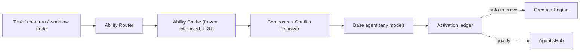

# Abilities 10x RFC: LoRA for Agents

**Status:** RFC — full rewrite · **core implemented & tested** (see §15)
**Date:** June 2026
**Owner:** Agentis architecture
**Scope:** Make **Abilities** the agentic-era equivalent of LoRA — lightweight, composable, hot-swappable add-ons that turn any base agent into a specialist — and build a creation engine so good that anyone can author and share one in minutes, at zero infrastructure cost, forever. The moat is the platform and the hub, never the compute.

---

## 0. The one idea

> An **Ability** is to an agent what a **LoRA adapter** is to a model: a small add-on that snaps onto a generic base and makes it a specialist — without retraining the base, without bloating it, without owning it. Stack a deeper Ability and the agent goes deeper. Stack several and it composes expertise. The base stays generic; the Ability carries the specialization.

One noun: the **Ability**. It is the unit a user creates, shares, installs, stacks, and sells. Nothing sits above it.

And one decision that defines this whole document: **an Ability is pure behavior — never weights.** No fine-tuning, no GPUs, no adapter artifacts, no hosted training. An Ability is compiled persona + specs + rules + examples + knowledge + (optionally) execution and routing policy. That is what makes creation **free and instant for everyone, always.**

---

## 1. Why behavior beats weights — and why that makes the metaphor *stronger*

It is tempting to chase literal LoRA: train real weight deltas, serve them on GPUs. We are not doing that, and dropping it is an upgrade, not a compromise. Here is the honest comparison:

| | Real LoRA adapter | Agentis Ability |
|---|---|---|
| What it is | Weight delta | Compiled behavior + knowledge + policy |
| Tied to | One base model + tokenizer + rank | **Nothing — runs on any model, any agent** |
| Cost to create | GPU training job | **Zero — reuses the model you already run** |
| Cost to serve | Adapter pool, GPU memory | A cache lookup + prompt-cache-friendly block |
| Who can make one | Someone with data + compute + ML skill | **Anyone who can describe what they want** |
| Portability | Brittle (base/tokenizer locked) | **Total — share it, it works everywhere** |

Real LoRA's biggest weakness is lock-in to a specific base model. An Ability has none of that: because it lives in behavior and context, **the same Ability snaps onto a Claude agent, a GPT agent, a local-model agent, a workflow node, or a multi-agent cast — unchanged.** That is *more* composable than LoRA, not less. It is also model-agnostic by construction, which is exactly how Agentis already treats every capability.

So we keep the LoRA metaphor — it's the perfect mental model for "lightweight add-on that specializes a base" — and we quietly win on the dimensions LoRA struggles with: cost, portability, and accessibility.

---

## 2. Depth: the specialization dial

Your core intuition — *"the greater the Ability, the greater the agent's specialty"* — is the design's central axis. Depth is how much specialization an Ability carries. A shallow Ability sharpens instincts; a deep one rebuilds how the agent works. **Every depth is zero-cost.** None of them touch a GPU.

| Depth | What it adds | Effort to create | Effect on the agent |
|---|---|---|---|
| **D0 — Instinct** | Compiled persona + specs + always/never rules + tool hints | one sentence | Sharper judgment, right voice |
| **D1 — Knowledge** | + curated/auto examples + embedded domain knowledge | drop in material | Knows the domain's facts and patterns |
| **D2 — Tuned** | + instructions/examples auto-optimized against the Ability's own eval set | one click | Measurably better on the task shape |
| **D3 — Method** | + execution policy: tool plan, verify/retry loop, sub-graph | guided | *Works* differently, not just answers differently |
| **D4 — Conductor** | + routing policy: picks model/tool/path per task signal | guided | Chooses the right approach per case |

The engine always activates the **shallowest depth that wins on the Ability's own evals**. You earn depth from evidence; you never pay for it in compute. D0–D1 largely exist in the repo today (§5). D2–D4 are the build — and all of them are prompt/policy compilation, runnable on the model the workspace already uses.

---

## 3. The heart: the 10x Ability Creation Engine

This is the centerpiece. Today, creating an Ability means filling a form: name, specs, rules, examples, knowledge, compile. That's already decent — but "fill a form well" is not 10x. **10x is: you describe an outcome, or point at your work, and a finished, evaluated, shareable specialist exists minutes later — having cost nothing.**

The engine reuses the workspace's existing model for everything. No new infrastructure, no per-Ability cost. That constraint is a feature: it's what lets us promise *free creation, forever, for everyone.*

### 3.1 Five on-ramps — an Ability comes into being with near-zero effort

A user should never start from a blank form. Every on-ramp produces a fully populated, compiled draft:

1. **From intent (natural language).** *"An Ability that drafts SOC2-aware security review comments."* The engine synthesizes the persona, `rulesAlways`/`rulesNever`, `toolHints`, a starter spec, and proposes seed examples — then compiles. One sentence → ready Ability.
2. **From your work (promote-a-run).** Any good agent output, chat turn, or workflow run can be promoted: *"Make this repeatable."* The run becomes the seed example and the engine reverse-engineers the spec that produced it. **This is the flywheel — ordinary work becomes Abilities** with one click, exactly where the value was created.
3. **From material.** Drop a doc, URL, transcript, brand guide, codebase folder, or PDF. The engine extracts rules and patterns, embeds the knowledge, and generates synthetic examples from the high-signal chunks (this step already exists in the compiler). Material in → specialist out.
4. **From examples.** Paste a few input→output pairs. The engine infers the spec, rules, and voice that explain them, then back-tests itself against the same pairs.
5. **From another Ability (fork / merge).** Clone-and-specialize, or merge two Abilities into a deeper composite — with conflict resolution (§4.4) handled for you.

### 3.2 Refinement — the engine makes the Ability *good*, not just *exist*

After a draft is born, the engine actively improves it, all on the existing model:

- **Spec synthesis & tightening.** Turn vague intent into concrete, deduplicated specs and rules; flag contradictions.
- **Auto-example generation.** Generate diverse positive *and negative* examples from the knowledge and the stated rules (negatives are what most hand-made skills lack).
- **Gap detection.** *"This Ability has no edge-case examples and no failure cases. Generate 5?"* — proactive, one-click.
- **Self-eval (zero-cost).** The engine compiles a small golden set from the Ability's examples and **self-grades candidate-vs-base** with an LLM judge, so depth is only promoted when it measurably wins. No vibes-based promotion, no GPU.
- **Auto-improve from usage.** The activation ledger (§4.5) surfaces real failures; the engine proposes new examples or rule tweaks. **The Ability gets better the more it's used — for free.**

### 3.3 Sharing — one click to the Hub

Creation and distribution are a single, continuous flow:

- **One-click publish** to AgentisHub with a trust envelope (content hash, scan status, license, optional signature).
- **One-click install** — the Ability snaps onto any agent, in any workspace, on any model.
- **Versioning + provenance** travel with it, so an installed Ability can show where it came from and how it's scored.

### 3.4 The creation contract

```
draft  →  compile  →  self-eval  →  (refine ↺)  →  publish/install
  ▲                                                        │
  └────────────  promote-a-run / auto-improve  ◀───────────┘
```

Every arrow runs on the model the workspace already has. **Zero incremental infrastructure cost at every step.** That is the promise we never break.

---

## 4. The runtime: Activated Abilities

Creating Abilities cheaply is half the job. The other half is making *attaching and stacking* them nearly free — or the "lightweight add-on" metaphor is a lie. We borrow the best ideas from the 2025–2026 adapter literature and apply them in the behavioral plane (no weights required).

### 4.1 Pre-activation: compile once, freeze forever

When an Ability reaches `ready`, everything that doesn't depend on the live task is precomputed and frozen: the tokenized persona/spec block with a stable content hash, the domain embedding (routing), the example/knowledge embeddings (retrieval), and for D3+ the validated execution/routing policy. At dispatch we never recompile — we assemble.

### 4.2 The Ability Cache (the aLoRA insight, in the context plane)

IBM's Activated-LoRA showed adapters can skip reprocessing by reusing the KV cache — 20–30× faster per task. We get the same effect without weights: Abilities are injected in a **deterministic, content-addressed order** so the provider's prompt/prefix cache (Anthropic prompt caching, OpenAI/vLLM prefix cache) *hits* across turns and across tasks that share a stack. A per-process **LRU cache** of tokenized blocks bounds memory like S-LoRA's adapter pool. **The marginal cost of attaching one more Ability is a cache lookup and a prefix-cache-friendly block — never a recompile, ideally not even a model re-read.**

### 4.3 The Ability Router

Per task: score every ready Ability by `cosine(task, domain_embedding)` plus pin/gate signals, take the top-K above `minRelevance` within a stack token/latency budget, order them by content hash for cache stability, hand the stack to the Composer. Pins (an operator says "this agent always wears Ability X") and gates (env/capability requirements) are hard constraints over the soft semantic score. This exists in skeletal form today in `WorkflowEngine.#buildAbilityBlock`.

### 4.4 The Composer & Conflict Resolver

Stacking is where naïve systems break — the production literature is blunt that composed adapters fight. We treat composition as a *resolved* operation, not string concatenation:

- **Rule reconciliation** by precedence: `pinned > deeper > more-relevant`; conflicts are **surfaced in the ledger**, not silently gambled.
- **Tool-policy intersection** unless an Ability is explicitly authoritative.
- **Bounded blast radius**: per-Ability and total-stack token budgets keep one Ability from crowding the base agent or its peers.

Output: one ordered, deduplicated, budget-clamped activation set with a recorded provenance trail.

### 4.5 The activation ledger — the free flywheel

That provenance trail *is* the training signal, captured as a byproduct of serving (no separate "trace platform"). One small table records: which Abilities fired, why, conflicts resolved, and the outcome. It feeds auto-improvement (§3.2) and Hub quality signals (§7). Consent defaults to private; sharing it is explicit opt-in.



---

## 5. Repo reality: what exists vs. what we build

Per `docs/brain/ABILITIES.md` (live on `main` since 2026-05-26):

**Already shipped (the D0–D1 foundation + compile):**
- Workspace-scoped Abilities; `compiled` and `static` modes.
- Compile pipeline (`abilityCompilerService.ts`): embed examples, contextualize + embed knowledge, **generate synthetic examples from knowledge**, synthesize persona, deterministic fallback with no LLM.
- Semantic dispatch injection (`WorkflowEngine.#buildAbilityBlock`), token-budget aware.
- Agent pins, gates, env keys, slash commands, preferred model, `minRelevanceScore`.
- KNN examples + embedded knowledge; real token counting (`gpt-tokenizer`).
- `.ability` import/export; `.agentiswf` bundle integration (`packager.ts`).
- Activation telemetry via `brain_quality_events.ability_used`.
- Tables (migration v44): `abilities`, `ability_examples`, `ability_knowledge`, `agent_ability_pins`.

**What this RFC adds:**
- The **Creation Engine** (§3): the five on-ramps, refinement, self-eval, auto-improve. *This is the biggest lift and the highest leverage — it's all prompt orchestration on the existing model.*
- The **Ability Cache** + prefix-cache ordering (§4.2) — the lightweight breakthrough, pure serving-side.
- The **Composer + Conflict Resolver** (§4.4) — turns today's concatenated block into a resolved stack.
- D2 **self-eval** + promotion gate; D3 **execution** and D4 **routing** policies (reusing `validateGraph`, retry machinery, and `OrchestratorModelRouter`).
- The **activation ledger** table (§4.5).
- The **AgentisHub** registry + trust envelope (§7).

We extend the existing `ability_*` tables. **No adapter tables, no training-job tables, no GPU anything.**

---

## 6. Data model: extend Abilities, stay lean

**`abilities` (extend):**
- `depth` — `d0_instinct | d1_knowledge | d2_tuned | d3_method | d4_conductor`.
- `execution_policy_json` — D3 (nullable).
- `routing_policy_json` — D4 (nullable).
- `eval_suite_id` — promotion gate (nullable until D2).
- `visibility` — `private | workspace | unlisted | hub`.
- `content_hash` — drives the Ability Cache and prefix ordering.
- `origin_json` — provenance: which on-ramp / run / fork it came from.

**`ability_eval_suites` / `ability_eval_runs` (new, scoped to one Ability):** golden examples (from `ability_examples`), regression cases (past failures), rule checks (from `rulesNever`), tool-use checks, plus cost/latency. Promotion rule, deliberately humble:

```
promote a deeper version only if:
  score >= current_score + min_delta
  AND blocking_regressions == 0
  AND cost <= ceiling AND latency <= ceiling
```

Evals *measure*; they don't *prove*. A bad metric ships a bad Ability faster — the UI says so.

**`ability_activations` (new — the free flywheel):** `run_id, agent_id, model, ability_ids[], conflicts_resolved_json, outcome, quality_score, consent_scope`. Populated as a byproduct of serving.

That's the whole delta: a few columns + three small tables, all hanging off the Ability. No second noun, no parallel pipeline.

---

## 7. AgentisHub: the distribution moat

The moat is **not** any single Ability and **not** compute. It's the network the platform and Hub create around Abilities — the thing a lone skill-file or a GPT can't reach.

- **Create → publish in one flow.** The easiest place in the world to make a sharable agent specialist.
- **Trust envelope.** Content hash, scan status, license, optional signing — install with confidence.
- **Quality signals from real use.** Install counts, activation success rates, eval scores, version history. Abilities surface by *evidence*, not marketing.
- **Native integration nobody else has.** A Hub Ability doesn't just drop into one chat — it composes inside the Agentis workflow engine, the omnichannel orchestrator, and multi-agent casts, and it keeps improving from the activation ledger. That integration *is* the moat.
- **Creators become distribution.** Publish once; earn on installs/usage; get featured when an Ability proves itself in the wild.

Why this is defensible: a `.ability` file is portable (we encourage that — trust matters), but the *living* Ability inside Agentis carries eval history, activation-driven auto-improvement, Hub trust signals, and runtime composition the exported file loses the moment it leaves. **Users can leave with their files; they won't want to, because the file stops getting better outside the platform.** Open-core done honestly: dependency on the flywheel and the network, never on holding artifacts hostage and never on selling compute.

---

## 8. Business model: free creation as the engine, platform + Hub as the moat

**Creation is free and zero-cost, forever, for everyone.** That is non-negotiable and it is the entire adoption strategy. No GPUs to amortize means no reason to meter authoring. Anyone can make and share Abilities on the model they already run.

Monetization comes from the *network and the platform*, never from charging for the act of creating:

- **The Hub.** Paid/premium Abilities with revenue share; featured placement; verified-publisher programs.
- **Teams & orgs.** Private Hub, shared Ability libraries, permissions, governance, audit — the collaboration layer around a now-valuable asset.
- **Platform conveniences at scale.** Activation analytics, fleet-wide auto-improvement, org-level Ability management.
- **Enterprise.** Private Hub, data residency, audit, SSO — the platform wrapped around the company's own specialists.

The wedge:

> **Give any agent a superpower in one click. Describe one, and it exists in minutes — free. Stack a few and it's a specialist. The good ones, you publish.**

Activation target: **first agent visibly specialized by an Ability in under 5 minutes, zero config, zero cost.**

---

## 9. Implementation phases

**Phase 0 — Depth + provenance (1 wk).** Add `depth`, `visibility`, `content_hash`, `origin_json` to `abilities`. Update `docs/brain/ABILITIES.md` to the D0–D4 ladder.

**Phase 1 — Creation Engine v1 (3–4 wk). _Highest leverage; do this first._** The five on-ramps (§3.1) + refinement (§3.2), all on the existing model. Ship promote-a-run and from-intent first — they create the flywheel.

**Phase 2 — Activated Abilities runtime (2–3 wk).** Ability Cache (freeze + tokenize + LRU) + deterministic prefix-cache ordering. Prove marginal-attach cost ≈ one cache lookup; instrument before/after.

**Phase 3 — Composer + Conflict Resolver (2 wk).** Precedence reconciliation, tool-policy intersection, stack budget, provenance → write `ability_activations`.

**Phase 4 — Self-eval + D2 (2–3 wk).** `ability_eval_suites`/`_runs`, candidate-vs-base LLM-judge grading, promotion gate. No depth ≥ D2 promotes without an eval run.

**Phase 5 — D3 Method + D4 Conductor (3–4 wk).** Execution and routing policies via existing graph/router machinery.

**Phase 6 — AgentisHub (4 wk).** Remote registry, trust envelope, quality signals, publish/install, revenue-share + featured hooks.

**Phase 7 — Auto-improve flywheel (ongoing).** Activation ledger → proposed examples/rules → one-click apply. The Ability that improves itself.

Sequencing rationale: Phase 1 (creation) is the product the user is asking for; Phases 2–3 make the metaphor *true* (cheap, composable); Phase 6 (the Hub) is the moat. Nothing in the entire plan requires a GPU.

---

## 10. Honest reality check

No cheerleading — you asked for the truth, and this version earns a cleaner verdict than the weights-heavy draft did.

**Is "specialization-via-add-on" the single biggest bottleneck of the agentic era? No.** The hardest frontier problems are reliability, long-horizon planning, durable memory, and verification. Abilities touch the "domain behavior + knowledge" slice — real, valuable, but also the slice good prompting and RAG already half-solve.

**So why is *this* version the right bet?** Because dropping weights removed the two things that made the old plan weak: a crowded, thin-margin GPU-serving market we'd have lost in, and a brittle base-model lock-in that fought the metaphor. What's left is exactly where Agentis is strong:

- **Creation is the product, and it's nearly free to operate.** Zero-cost authoring on the existing model means we can give it away to win the market without bleeding on compute.
- **The moat is the platform and Hub, which you already have the substrate for** — the workflow engine, orchestrator, and bundle system that a standalone skill format can't match.
- **Portability is now a strength, not a liability.** A behavioral Ability runs on any model and any agent; a real LoRA can't.

**The competition is still real:** Anthropic Agent Skills, OpenAI GPTs/Apps, and MCP all want to own agent-capability packaging from inside the model runtime. We don't beat them on "a skill format." We beat them on **the easiest creation experience in the category + native composition inside a full agent platform + a Hub with real quality signals.** That's a creation-and-distribution bet, and for a platform that owns an engine, it's a strong one.

**What would falsify it — pivot if, after Phases 1–3:**
- People create an Ability for the novelty and never again → it's a demo, not a flywheel. (Watch promote-a-run repeat-rate.)
- Composed stacks don't beat the base agent on real evals → specialization isn't where the quality gap lives.
- The creation engine feels like a fancier form, not a 10x → the on-ramps (especially promote-a-run and from-intent) aren't pulling their weight; fix those before anything else.

**Recommendation: build it, in the stated order, and hold the zero-cost line absolutely.** The moment creation gets metered, the adoption engine stalls and the whole thesis weakens.

---

## 11. Success metrics

- **Creation is 10x:** median time from intent → published, eval-passing Ability < 10 min; ≥ 50% of Abilities born from an on-ramp (not a blank form); promote-a-run used by > 30% of active workspaces.
- **Lightweight is true:** marginal cost of attaching one more Ability ≤ one cache lookup + prefix-cache hit (no recompile/re-tokenize); multi-Ability turn latency overhead vs. base < 5%.
- **Specialization is real:** % of tasks where a routed stack beats the base on its eval > 20%; post-promotion regression < 2%.
- **Flywheel turns:** % of Abilities improved by auto-improve at least once > 40%; activation-ledger opt-in rate climbing.
- **Hub network:** installs/active workspace > 2; creator Abilities passing trust scan > 80%; repeat-install creators growing.
- **Zero-cost held:** infrastructure cost per created Ability ≈ $0 (only the workspace's own model usage).

---

## 12. What we deliberately do **not** build

1. **No weight training / fine-tuning / LoRA artifacts.** Abilities are behavior.
2. **No GPU pools or multi-adapter serving stacks** (vLLM/LoRAX/S-LoRA). Not our business; not our moat.
3. **No metered creation.** Authoring is free, always.
4. **No second primitive.** One noun: the Ability.
5. **No standalone trace/dataset/eval *platform*.** Just the activation ledger + Ability-scoped evals.
6. **No file lock-in.** Depend on the network and the living runtime, not on trapping artifacts.

These are kept here on purpose so a future planner doesn't "rediscover" them.

---

## 13. Grounding

Applied as conceptual leverage in the behavioral plane — we borrow the *ideas* (routing, composition, cache-cheap activation), not the weight machinery.

- IBM Research — Activated LoRA (KV-cache reuse, 20–30× faster): https://research.ibm.com/blog/inference-friendly-aloras-lora — *inspires §4.2 prefix-cache discipline.*
- Adaptive Minds — adapters as tools, semantic selection/composition: https://arxiv.org/html/2510.15416 — *inspires the §4.3 router.*
- MoLoRA — per-token routing with learned gating: https://arxiv.org/pdf/2603.15965 — *inspires §4.4 composition.*
- LoRAtorio — intrinsic skill composition: https://arxiv.org/pdf/2508.11624.
- LoRA composition in production (interference is real): https://tianpan.co/blog/2026-04-19-lora-adapter-composition-production — *why §4.4 has a conflict resolver.*

---

## 14. Final position

An Ability is LoRA for agents — minus the weights, minus the GPUs, minus the lock-in. A small, hot-swappable, composable behavioral add-on that turns any agent into a specialist and stacks for compound expertise, on any model, at zero cost to create.

The revolution is twofold: **creation so easy and so free that anyone can make and share a specialist in minutes**, and **attachment so cheap that wearing five Abilities costs almost nothing.** The moat is the platform that composes them and the Hub that distributes them — a network that makes every Ability worth more alive inside Agentis than as a file outside it.

One noun. One metaphor. Free to create, forever.

---

## 15. Implementation log (kept reconciled with real code)

Shipped to the working tree on 2026-06-08, all zero-cost (reuses the workspace model; no GPU/weights anywhere). 31 ability tests green; api builds; web typechecks.

**Schema** — migration **v61** (`abilities_10x_depth_eval_activations`):
- `abilities` += `depth`, `visibility`, `content_hash`, `origin_json`, `execution_policy_json`, `routing_policy_json`
- new tables `ability_eval_runs`, `ability_activations` (`packages/db/src/sqlite/schema.ts`)

**Core types** (`packages/core/src/types/ability.ts`): `AbilityDepth` + `ABILITY_DEPTH_ORDER`, `AbilityVisibility`, `AbilityOrigin`, `AbilityExecutionPolicy`, `AbilityRoutingPolicy`, `AbilityEvalRun`, `AbilityActivation`, `AbilityDraft*`.

**§3 Creation Engine** (`apps/api/src/services/abilityCreationService.ts`): on-ramps `draft()` (intent | examples | material) + `forkAbility()`; `refine()` (+/- coverage); `selfEval()` (LLM-judge, NEVER-rule block); `promoteDepth()` (§6 eval-gated, content-capped). Every LLM path has a deterministic fallback.

**§4 Runtime** (`apps/api/src/services/abilityComposer.ts` + `WorkflowEngine.#buildAbilityBlock`): precedence reconciliation (pinned/required > deeper > relevant), NEVER-vs-ALWAYS conflict detection + suppression, content-hash-stable prefix ordering for the task-invariant tiers, task-invariant **LRU compose cache** (hit/miss stats). Activation ledger emitted on every dispatch that fires ≥1 ability.

**§2 Depth ladder D0–D4** persisted + enforced: D3 `executionPolicy` rendered as an `<execution-policy>` directive; D4 `routingPolicy.preferredModel` wins model selection.

**API** (`routes/abilities.ts`): `POST /draft`, `/fork`, `/:id/refine`, `/:id/eval`, `/:id/promote`, `GET /:id/eval-runs`, `/activations`. **Web** (`apps/web/src/lib/abilities.ts` + `AbilitiesPage`): typed client for all of the above + a "Create with AI" entry point.

**Deferred (honest):** AgentisHub **remote** registry (local `.ability` + `hub-install` stub exist; the hosted service does not); a richer creation **wizard UI** (today: one-line intent prompt → draft); rule-text **excision** in the rendered block (conflicts are detected, precedence-ordered, and surfaced in the ledger, but the losing rule's text is not yet physically removed from the winning block); `/metrics` + `/verify` remain stubs. None block the core loop: **create → compile → eval → promote → compose → serve → ledger.**
