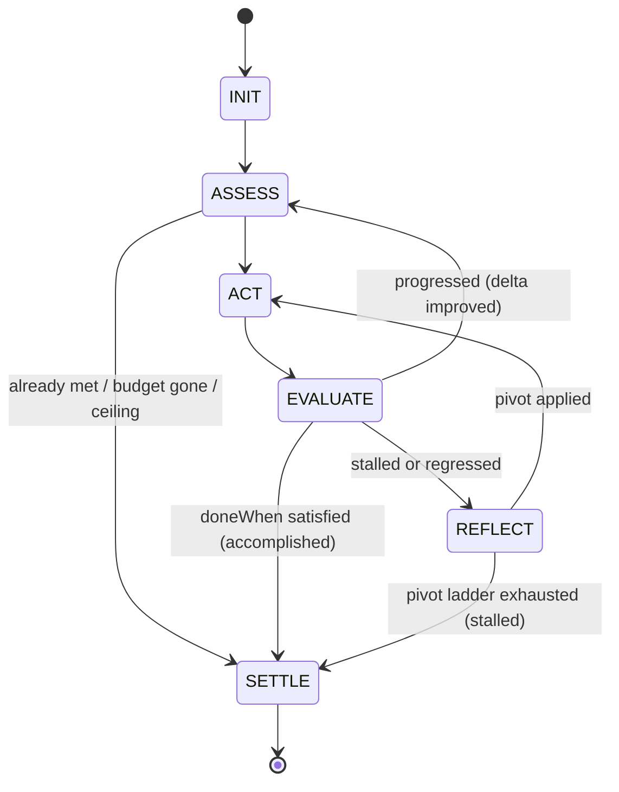

# RFC: Cognitive Looping — the Pursuit primitive & run-scoped Objectives

**Status:** Draft for comment
**Author:** Principal AI Architect (with Agentis engine grounding)
**Date:** 2026-07-06
**Scope:** `apps/api/src/engine/WorkflowEngine.ts` (`converge` → `pursue`), `packages/core` node types + schema, SWIFT verdict engine, agent inner loop, canvas.
**Supersedes/extends:** [AGENT-COOPERATION-10X](AGENT-COOPERATION-10X-MASTERPLAN.md) §Pillar 1 (the `converge` node), [WORKFLOW-10X-MASTERPLAN](WORKFLOW-10X-MASTERPLAN.md) §6 (verdict), [AGENT-PRIMARY-POSTURE](AGENT-PRIMARY-POSTURE-ARCHITECTURE.md) (`evolveGraph`).

---

## 0. TL;DR — the one-paragraph thesis

We do **not** need to build an "Intelligent Loop" subsystem. **We already built it — it is the `converge` node**, and that is precisely the problem: it is hidden behind a mathematics word, boxed as an opt-in node, its progress signal is coarse, and it *stops* when stuck instead of *pivoting*. This RFC does four things, in strict non-breaking order: **(1) Name the family** — retire `converge` for `pursue` (a *Pursuit*), invert `continuation` into a forward-reading `doneWhen`, and reserve "Goal" for the future long-term tier by promoting the already-in-code word **Objective** to first class. **(2) Measure the delta** — add an `ASSESS` step that scores *distance-to-goal* every iteration (a process signal, not just the outcome verdict). **(3) Teach it to pivot** — add a `REFLECT` step so a stuck loop self-critiques and changes approach before it quits. **(4) Make it the default posture** — a goal-bearing workflow compiles to a Pursuit, and the same control library governs the agent's own inner tool loop. ~80% of the state machine below is already running in production; this RFC adds two states and a vocabulary.

---

## 0.5 Positioning & naming (for marketing)

**The term to own: Verified Cognitive Loops** — self-reflective, goal-driven agentic loops whose convergence is verified against the world, not the model's self-report.

- **Primitive name (product + code):** a **Pursuit** — "pursue an Objective until verifiably done."
- **Category name (the coinage to market):** **Verified Cognitive Looping** (a.k.a. *World-Grounded Agentic Loops*).

**One-line technical definition:** a verification-grounded, self-reflective agentic control loop — a durable state machine (`ASSESS → ACT → EVALUATE → REFLECT → SETTLE`) that drives a cohort toward a world-verified objective, measures a continuous progress signal, and self-corrects on stagnation under hard budget / stall / pivot bounds.

**Why this differentiates us (lead with it):** every other agent loop — AutoGPT, LangGraph cycles, CrewAI, ReAct — decides it is "done" from the model's *self-report*. A Pursuit decides from the **world**: both its stop condition and its progress signal are the SWIFT acceptance checks run against reality (a `200` from the deployed URL, a row in the datastore, files on disk). In reward-modeling terms, most agents optimize an *outcome self-report*; a Pursuit optimizes a **process reward measured against ground truth** (COMPLETED ≠ ACCOMPLISHED). The claim competitors structurally cannot make: **the loop cannot lie to itself.**

**How Pursuit earns each industry term (all honestly):**

| Industry / research term | What in Agentis backs it |
|---|---|
| **Agentic loop engineering** | The bounded Pursuit state machine — hard iteration ceiling + USD/ms/token circuit breaker + multi-signal stall detection + `maxPivots` cap. Runaway-safe by construction. |
| **Self-reflective AI loops** | `REFLECT`: on a stall the loop writes a verbal self-critique (Reflexion) and feeds it forward, escalating reflect → reframe → switch-strategy. |
| **Goal-driven agent cyclic graphs** | `doneWhen: { type: 'objective' }` — the loop is driven by a declared **Objective** and re-enters the cohort sub-graph each iteration (a controlled, hash-stable cycle). |
| **LLM self-correction mechanisms** | The stagnation detector (structural / oscillation / plateau / regression) + tool-call loop guard + progress-delta measurement = detect-then-correct, not blind retry. |

**Taglines:**
- *"Loops that finish the job — and can't fake it."*
- *"Goal-driven agentic loops with world-verified convergence."*
- *"Self-reflective loops that measure progress against reality, not the model's word."*

---

## 1. Context — the five loops we already run (and why they feel messy)

Agentis already loops in five different places, under five different names, with five different amounts of intelligence. The "messiness" the team feels is not missing capability — it is **an unnamed family**.

| # | Where | Name today | Intelligence | Code |
|---|-------|-----------|--------------|------|
| L1 | Inside one agent | agent tool loop | High — idle watchdog, turn deadline, budgeted context, tool cap | `agentSession*` / `agentToolLoop.ts` |
| L2 | Map over a list | `loop` node | **None** — deterministic for-each, bounded concurrency | `WorkflowEngine.#runLoop` |
| L3 | Iterate-until-goal | **`converge` node** | **High** — continuation policy, stall detection, budget breaker, worktree, knowledge promotion, honest verdicts | `WorkflowEngine.#runConverge` :7817 |
| L4 | Rewrite own graph | `evolveGraph` / `evolve_plan` | Structural — green-ratchet self-evolution mid-run | `AGENT-PRIMARY-POSTURE` |
| L5 | Build→verify→repair | deliver orchestrator (SWIFT) | High — `RunVerdict` world-checks, bounded repair | `workflowDeliveryOrchestrator.ts` |

Two observations that motivated this RFC:

1. **"Goals for workflows would be amazing."** — Yes. L3 is *already* a goal loop; it just has no first-class notion of the goal it pursues. We fix that with **Objectives** (§3).
2. **"The converge logic is messy, even the naming is terrible."** — Agreed, and it is symptomatic of a broader habit: *naming things so technically that they become hard to work with over time.* `converge` (a calculus word), `continuation` (a policy that reads backwards — it says when to *keep going*, not when we're *done*), `carryStrategy`, `stallStreak`. The rename is not cosmetic; **a name you can reason about is load-bearing infrastructure** (§9).

### The reserved-name resolution (from the design conversation)

"**Goals**" is a **reserved** term for a *future* long-term tier (Agent goals, App goals — persistent intent that spans many runs). What this RFC introduces now is the **narrower, procedural, run-scoped** layer. To avoid colliding with the reservation we name that layer using a word the codebase already uses for exactly this: **Objective**.

```
Goal          (RESERVED — future)   long-term, cross-run, aspirational   "Grow MRR to $50k"
  └─ decomposes into ─▶
Objective     (THIS RFC — now)      run-scoped, procedural, verifiable   "Ship the March invoice batch, zero failures"
       └─ pursued by ─▶
Pursuit       (the loop primitive)  iterate-until-Objective-met          the renamed `converge`
```

This layering is a **forward seam**, not scope creep: when the Goals tier eventually lands, a Goal decomposes into Objectives and each Objective is realized by a Pursuit. We build the bottom two tiers now and document the seam (Phase 5).

---

## 2. Research baseline

The bleeding-edge literature converges (pun intended) on a small set of mechanisms. Mapped to what we adopt:

- **Reflexion — verbal reinforcement without weight updates.** An agent writes its own natural-language post-mortem after a failed attempt and feeds it forward as episodic memory; the next attempt reads the reflection before acting. 91% pass@1 on HumanEval vs GPT-4's 80%. → **This is our `REFLECT` state.** Agentis already has the substrate: episodic Brain memory ([Brain scale 10x], bundled e5-small) + the Pursuit blackboard. ([Reflexion](https://beancount.io/bean-labs/research-logs/2026/04/25/reflexion-language-agents-verbal-reinforcement-learning), [Meta-Policy Reflexion](https://arxiv.org/pdf/2509.03990), [SAMULE multi-level reflection](https://arxiv.org/pdf/2509.20562))
- **Process Reward Models vs Outcome Reward Models.** A *per-step* reward (PRM) is a denser, more effective training/inference signal than a sparse *final-answer* reward (ORM). → Agentis already has the ORM (`RunVerdict.outcome = accomplished | partial | hollow | failed_checks`). We add the **PRM analog: a 0..1 progress score per iteration** — the "delta" the brief asks for (§3, §6). ([GenPRM](https://arxiv.org/abs/2504.00891), [Process Reward Models That Think](https://openreview.net/forum?id=FPVCb0WMuN))
- **Adaptive test-time compute.** Don't spend a flat budget per step; allocate inference compute where it buys marginal accuracy. → **Progress-gated budget** (§7): the loop spends more while the delta improves and tightens the moment it plateaus. ([Allocate test-time compute adaptively](https://arxiv.org/pdf/2602.01070))
- **LATS — tree search over agent trajectories.** MCTS + LM value function + self-reflection; deliberate over *multiple* candidate actions rather than a single linear chain. → Our **`explore` pivot** (§8): when linear iteration stalls, branch K approaches, evaluate, keep the best. Maps onto existing `dynamic_swarm` / `parallel`. ([LATS, ICML 2024](https://arxiv.org/pdf/2310.04406))
- **Loop / stagnation detection in production agents.** Hard iteration caps, tool-call deduplication, embedding-based loop detection, and "three identical tool calls = a loop." A single runaway loop can burn thousands of dollars in minutes. → §6 codifies these as a multi-signal detector; several already exist in `converge`. ([Infinite loop detection](https://inkog.io/glossary/infinite-loop-ai-agent), [Stop your agent looping](https://dev.to/alanwest/how-to-stop-your-llm-agent-from-looping-itself-into-oblivion-27eh), [3-layer rate-limit gateway](https://www.truefoundry.com/blog/rate-limiting-ai-agents-preventing-llm-api-exhaustion))
- **Self-correction is not innate; termination is attackable.** Models do not reliably self-correct from scalar feedback alone, and "early-exit"/"termination-poisoning" work shows agents can be talked into stopping too early *or* never stopping. → Our discipline: **honest verdicts only, never a fake green**, and every pivot is grounded in a *worldly* check, not the model's self-assessment. ([Self-correction is not innate](https://arxiv.org/pdf/2410.20513), [LoopTrap: termination poisoning](https://arxiv.org/pdf/2605.05846), [Early-exit behavior](https://arxiv.org/pdf/2505.17616))

**Net:** the research validates the shape Agentis already has and points at exactly two additions — a *process* signal (measure the delta) and a *reflective pivot* (change approach when stuck).

---

## 3. Theoretical model — Objective, Progress, Distance

### 3.1 The Objective (promote `WorkflowSpec`)

An **Objective** is the run-scoped definition of done. It is not a new type — it is the existing `WorkflowSpec` promoted to first class and attached to a run:

```ts
// already exists (agentis.workflow.scope, build.ts):
//   WorkflowSpec { objective: string; acceptance: AcceptanceCheck[]; sufficiency?; constraints?; reworkBudget? }
//   AcceptanceCheck.verify ∈ 'judge' | 'http_probe' | 'data_probe' | 'expr' | 'file_probe'
```

The acceptance checks are the **definition of done**. Crucially, they already run **against the world, not the run's own claims** (`WorkflowEngine` §"Execute the spec's acceptance checks against the WORLD" :10262), and the scope tool already refuses a spec whose checks are *all* judge-only — at least one *worldly* check is required to trust a workflow unattended. This is the guardrail the termination-poisoning literature demands, and **we already have it.**

### 3.2 Outcome vs Progress — two signals, not one

| Signal | Question | Range | Source | Analogy |
|--------|----------|-------|--------|---------|
| **Outcome** | Is the Objective *met*? | `accomplished / partial / hollow / failed_checks` | `RunVerdict` (exists) | ORM |
| **Progress** | How *close* are we, and did this iteration help? | `0.0 … 1.0` | acceptance-pass-fraction + graded judge score on the unmet checks (**new, §6**) | PRM |

**Distance-to-goal** `d = 1 − progress`. The Pursuit's whole job is to drive `d → 0` under budget. This is the literal answer to the brief's *"continuously evaluate the results achieved against the target goal (measuring the delta)."* The **trajectory** of `d` — not any single value — is what powers stagnation detection (§6) and adaptive budgeting (§7).

---

## 4. The Pursuit primitive — the state machine

A Pursuit is a five-state machine wrapped around a body sub-graph. Three states already exist in `#runConverge`; the two **bold** ones are the net-new engineering.

```
        ┌────────┐
        │  INIT  │  seed from Objective + durable PursuitState (crash resume)
        └───┬────┘
            ▼
      ┌───────────┐  measure distance-to-goal BEFORE acting.
      │ **ASSESS**│  guards: already-met? → SETTLE.accomplished (never act if done)
      └───┬───────┘          budget/ceiling gone? → SETTLE.exhausted / ceiling
          ▼
        ┌─────┐   run the body cohort once (the expensive step; L1 agents live here)
        │ ACT │
        └──┬──┘
           ▼
      ┌──────────┐  run doneWhen (acceptance | judge | signal) + recompute progress
      │ EVALUATE │  ├─ done?              → SETTLE.accomplished
      └──┬───────┘  ├─ progressed (Δ↑)?   → ASSESS  (next iteration, reset stall)
         │          └─ stalled / regressed → REFLECT
         ▼
     ┌────────────┐  verbal self-critique (Reflexion) → pick a pivot from the ladder
     │ **REFLECT**│  ├─ pivot available → apply, then → ACT
     └──┬─────────┘  └─ ladder exhausted → SETTLE.stalled
        ▼
    ┌────────┐  terminal, ALWAYS an honest verdict:
    │ SETTLE │  accomplished | stalled | budget_exhausted | ceiling_reached | abandoned(human)
    └────────┘
```

Mermaid (for rendered docs):



### 4.1 What already exists vs what's new

| State / guard | Status | Where |
|---|---|---|
| INIT + durable resume (`ConvergeRunState`) | **Exists** | `#runConverge` :7830 |
| ACT (delegate body to `SubflowExecutor`) | **Exists** | `#runConvergeIteration` :7974 |
| EVALUATE via continuation (deterministic/judge/signal) | **Exists** | `#evaluateConvergeContinuation` :8005 |
| SETTLE with honest verdicts | **Exists** | `ConvergeVerdict` :12418 |
| Budget breaker (usd/ms/tokens, across descendant runs) | **Exists** | `#convergeBudgetExceeded` |
| Stall detection (structural signature) | **Exists (shallow)** | `convergeStableSignature` :12461 |
| Knowledge promotion on success | **Exists** | `#promoteConvergedKnowledge` :7941 |
| **ASSESS — measure delta before acting** | **NEW** | §6 |
| **REFLECT — pivot instead of quit** | **NEW** | §8 |
| **Progress score (0..1) + trajectory** | **NEW** | §3.2, §6 |

The honest read for the team: this is a *surgical* addition to a working loop, not a rewrite.

---

## 5. State & memory management

Rename `ConvergeRunState` → **`PursuitState`**, extend additively (all new fields optional → old persisted runs deserialize unchanged):

```ts
interface PursuitState {
  history?: PursuitIterationRecord[];   // exists
  accumulated?: Record<string, unknown>; // exists — blackboard carry
  lastSignature?: string;               // exists — structural stall
  lastOutput?: Record<string, unknown>; // exists
  stallStreak?: number;                 // exists
  // — NEW, all optional —
  deltaTrajectory?: number[];           // progress 0..1 per iteration (the PRM signal)
  reflections?: string[];               // Reflexion critiques, fed forward
  pivotsUsed?: PivotKind[];             // which rungs of the ladder we've spent
  signatureRing?: string[];             // recent-K signatures for oscillation detection
}
```

- **Carry across iterations** — the run-scoped blackboard (`scratchpad`) namespaced by `stateKey` (exists). `carryStrategy` accumulate|replace|diff (exists) — rename to plain `carry: 'keep' | 'latest' | 'delta'` under the naming doctrine.
- **Durable resume** — `PursuitState` is persisted every iteration (`#persistConvergeState` :8121) so a crash recovery resumes mid-flight, skipping completed iterations. Pattern already proven by both `loop` (`_loopState`) and `converge`.
- **Filesystem isolation** — one worktree per cohort for the Pursuit's lifetime (`isolation: auto|shared|worktree|tempdir`, exists), released with `preserve: discard|branch|pr` (exists).
- **Graduation** — on `accomplished` only, surviving claims are promoted from the run blackboard to durable Brain memory through the formation judge (exists). Reflections that led to success are *also* worth promoting (new, cheap) — they become reusable strategy hints for the next Pursuit of a similar Objective.

---

## 6. Stagnation-detection algorithms

The brief asks specifically for *"the stagnation-detection algorithms."* Today `converge` has exactly one signal (`s1`) and it *stops* on stall. We define a **multi-signal detector** whose output drives a *pivot* (§8), and only stops when the pivot ladder is exhausted.

Each iteration computes signal set **S** over the body output `oₙ` and the progress trajectory `Δ`:

| id | Signal | Test | Cost | Status |
|----|--------|------|------|--------|
| `s1` | **Structural repeat** | `sig(oₙ) == sig(oₙ₋₁)` — order-independent structural hash | free | **exists** |
| `s2` | **Semantic repeat** | `cos(embed(oₙ), embed(oₙ₋₁)) > τ_sem` (default 0.97) — "reworded the same thing" | ~1 embed | new (reuse Brain e5-small) |
| `s3` | **Progress plateau** | `|Δₙ − Δₙ₋₁| < ε` for `w` iterations (default ε=0.02, w=2) | free | new |
| `s4` | **Regression** | `Δₙ < Δₙ₋₁ − δ` (default δ=0.05) — actively getting worse | free | new (strong pivot trigger) |
| `s5` | **Oscillation** | `sig(oₙ) ∈ ring(K) ∧ sig(oₙ) ≠ sig(oₙ₋₁)` — A→B→A→B cycles | free | new |
| `s6` | **Tool-call repeat** | inside ACT: same `(tool, args-hash)` seen `≥ N` times (default 3) | free | new (also wired into L1) |

**Decision rule** (weighted vote, tunable per Objective):

```
stallScore = 1.0·s1 + 0.8·s2 + 0.7·s3 + 1.0·s4 + 0.9·s5 + 0.6·s6
if stallScore ≥ θ (default 1.0)  →  REFLECT     // pivot, don't quit
else                             →  ASSESS      // healthy progress, keep going
```

- `s1`, `s4`, `s5` alone each trip the threshold (exact-repeat, regression, and oscillation are unambiguous stalls). `s2/s3/s6` corroborate.
- `s6` is deliberately shared with the L1 agent loop — "three identical tool calls is definitionally a loop" is the cheapest, highest-yield guard in the literature, and it belongs in *one* library both loops import (§10).
- The window `w` and thresholds live on the Pursuit config so a noisy Objective (e.g. creative writing, where outputs legitimately churn) can loosen `s2`, while a convergent one (bug-fixing, where output should monotonically shrink) can tighten `s3/s4`.

---

## 7. Token efficiency — the circuit-breaker stack

Aggressive, layered, cheapest-first. Layers 1–3 exist; 4–8 are new and mostly free.

1. **Hard ceiling** — `maxIterations` (default 8, clamped ≤100). Absolute fail-safe. *(exists)*
2. **Budget breaker** — abort on `usd | ms | tokens`, summed across the Pursuit's descendant cohort runs via `resolveRunSpend`. *(exists)*
3. **Stall stop** — §6, but now a *last resort* after pivots. *(exists, upgraded)*
4. **Short-circuit ASSESS** — if the Objective is already satisfied on entry, **never ACT**. The cheapest iteration is the one you don't run. *(new)*
5. **Progress-gated (adaptive) budget** — per-iteration spend is not flat. While `Δ` improves, allow full budget; on plateau (`s3`) drop to a cheaper model tier and shorten context before spending more. Implements "allocate test-time compute adaptively." *(new)*
6. **Cheap ASSESS/REFLECT, expensive ACT** — `routeModelForTask` (exists, [Model routing]) already picks the minimum-sufficient tier. ASSESS scoring and REFLECT critiques run on the cheap tier; only ACT and worldly judges pay for the strong model. *(new wiring, existing router)*
7. **Tool-call dedup** — `s6` short-circuits a repeated tool call inside ACT before it hits a provider. *(new, shared with L1)*
8. **Bounded pivot budget** — REFLECT can spend at most `maxPivots` rungs (default 3) so the *pivot ladder cannot itself become a runaway*. *(new)*

**Worked cost intuition:** a healthy Pursuit spends ~1 strong ACT + 1 cheap ASSESS per iteration. A stuck one spends 1 cheap REFLECT + at most 3 pivots, then settles honestly. The failure mode the brief fears — "burn thousands of dollars while hallucinating in a cycle" — is bounded by (1)∧(2)∧(8) independently.

---

## 8. The pivot ladder — REFLECT in detail

When §6 trips, we do **not** immediately stop (today's behavior) and we do **not** blindly retry (the classic runaway). We climb a ladder, cheapest rung first, each rung grounded by re-running ASSESS afterward:

| Rung | Pivot | Mechanism | Research |
|------|-------|-----------|----------|
| 1 | **Retry-with-reflection** | Generate a verbal critique of *why* the last iteration didn't advance; append to `reflections[]` and into the next ACT context. | Reflexion |
| 2 | **Perturb** | Same approach, changed parameters — raise temperature, reframe the sub-goal, reorder steps. | Self-Refine |
| 3 | **Escalate tier / strategy** | Swap to a stronger model or a different body strategy (e.g. add a verification step the cohort was skipping). | test-time compute |
| 4 | **Explore (branch)** | Fan out K candidate approaches in parallel (via `dynamic_swarm`/`parallel`), score each with ASSESS, keep the best trajectory. | LATS |
| 5 | **Escalate to human** | Emit a `checkpoint`/`human_input` with the reflection history and the exact distance-to-goal. Honest hand-off, not silent failure. | — |

`maxPivots` bounds the climb. Regression (`s4`) skips rungs 1–2 and jumps to 3+ (perturbing a *worsening* trajectory wastes tokens). The **abandoned(human)** verdict is reached only at rung 5, and it carries the full reflection trail so the operator inherits context, not a shrug.

---

## 9. The naming doctrine (the meta-fix)

The team's real complaint is a *pattern*: **names so technical they become friction.** This RFC adopts a small, enforceable doctrine and applies it to this subsystem as the reference case.

**Doctrine — node kinds and config fields read like intent, in plain language:**
1. **Verb-first for actions** — `pursue`, not `converge`; `for_each`, not `loop`.
2. **Forward-reading policies** — a policy names the *goal state*, not the *continue condition*. `doneWhen: "openBugs == 0"` reads forward; `continuation` (loop-continues-while-true) reads backwards. *This inversion alone removes a recurring source of confusion.*
3. **Reserve jargon for internals** — `stallStreak`, `signature`, `deltaTrajectory` are fine *inside* the engine; they never surface in the authoring API or canvas.
4. **Match words the codebase already uses** — we did not coin "Objective"; SWIFT already says `objective`, `acceptance`, `accomplished`. Promote existing good words before inventing new ones.

**The rename map:**

| Today (technical) | Proposed (intent) | Rationale |
|---|---|---|
| `converge` (node kind) | **`pursue`** | "Pursue the objective until done." Not calculus. |
| a "convergence loop" (prose) | **a Pursuit** | noun that pairs with the verb |
| `continuation` (policy) | **`doneWhen`** | forward-reading definition of done |
| `carryStrategy: accumulate/replace/diff` | **`carry: keep/latest/delta`** | plain |
| `stallPolicy.window` | **`stopWhenStalled.after`** | reads as English |
| the run-scoped `WorkflowSpec` | **the Objective** | first-class, reserves "Goal" |
| `loop` (node kind) | **`for_each`** *(optional, low-priority)* | it is literally a map |

> **Decision D1 (open):** `pursue` is the recommendation. Alternatives if the team prefers: `iterate` (generic), `refine` (implies improving an existing artifact — narrower), `until` (cute, vague). See §13.

`converge`/`continuation` do **not** disappear — they become permanently accepted **aliases** (§10) so nothing breaks. The rename is what a human reads and writes; the old strings keep loading forever.

---

## 10. Agentis integration — exact seams, non-breaking

### 10.1 The hash-safe aliasing strategy (the crux of "don't break the tracks")

A naive rename that rewrites stored `converge` → `pursue` in every saved graph would **change each graph's content hash and demote every blessed Blueprint** (self-heal compares `graphContentHash`; a hardened spec carries a `reconciledHash`). That is unacceptable.

**Therefore: never rewrite stored graphs.** Instead:
- **On-disk canonical stays as authored.** Existing graphs keep `kind: 'converge'` / `continuation`; their hashes are untouched; blueprints stay blessed.
- **A load-time normalizer** presents both `converge` and `pursue` (and `continuation`/`doneWhen`) to the engine as the same internal shape. New graphs author as `pursue`; both dispatch to one handler.
- **Display/authoring layer** shows `pursue` everywhere; the SWIFT patterns and doctrine emit `pursue` for *new* work only.

This gives 100% backward compatibility with zero hash churn — the single most important non-breaking guarantee in this document.

### 10.2 Wiring points (the "new node kind = 4 wiring points" checklist, +canvas +prose)

| # | File | Change |
|---|------|--------|
| 1 | `packages/core/src/types/workflow.ts` | Add `'pursue'` to `WorkflowNodeType`; add `PursueNodeConfig` (alias of `ConvergeNodeConfig` with `objective?`, `doneWhen`, `carry`, `stopWhenStalled`, `maxPivots?`, `assess?`). Keep `ConvergeNodeConfig` exported + `@deprecated`. |
| 2 | `packages/core/src/schemas/workflow.ts` | Zod: accept both kinds; **normalize** `converge→pursue`, `continuation→doneWhen` at parse. Discriminated union stays intact. |
| 3 | `apps/api/src/engine/WorkflowEngine.ts` | `case 'pursue'` → `#runPursuit` (rename of `#runConverge`); `case 'converge'` falls through to the same. Emit `PURSUIT_ITERATION` (+ legacy `CONVERGE_ITERATION` during a deprecation window). Add ASSESS + REFLECT (§4). |
| 4 | `apps/api/src/engine/validateGraph.ts` | Validate `pursue`/`doneWhen` (mirror the existing `converge`/`continuation` checks at :408). |
| 5 | `apps/web/.../canvas/nodeKindMeta.ts`, `nodeKindIcon.ts`, `nodeConfigRegistry.ts` | Register `pursue` (label "Pursue until done", icon, config form). Keep `converge` mapping as an alias so old graphs still render. |
| 6 | `build.ts`, `workflowDesignDoctrine.ts`, `workflowPatterns.ts` | Teach the agent `pursue`/Objective; keep the semantics, swap the words. `workflowPatterns` :126 cohort pattern → `pursue`. |

### 10.3 Reuse, don't fork

- **Objective = `WorkflowSpec`** already produced by `agentis.workflow.scope`. A `pursue` node's `doneWhen: { type: 'objective' }` reads the workflow's acceptance checks directly instead of a hand-written predicate — *the same world-verified checks the deliver orchestrator already trusts.*
- **Progress score** extends the existing judge return (`{ passed, score, critique }`) — the judge already yields a 0..10 score; we normalize it and fold in the acceptance-pass fraction. No new evaluator.
- **REFLECT memory** writes to the existing blackboard + Brain formation path.
- **One control library** — extract §6 (stagnation) + §8 (pivot) + §7.7 (tool-dedup) into `apps/api/src/engine/pursuitControl.ts`, imported by **both** `#runPursuit` **and** the L1 agent tool loop. This is how "the loop family" stops being scattered: one place defines what stuck means and what to do about it.

---

## 11. Execution plan

Each phase is independently shippable and ordered so value lands before risk. "Restart required" flagged where the API process must reload.

| Phase | Deliverable | New vs existing | Breaking? | Restart |
|-------|-------------|-----------------|-----------|---------|
| **P0 — Name the family** | `pursue`/`Objective`/`doneWhen` canonical; load-time normalizer; `converge`/`continuation` permanent aliases; canvas + doctrine + patterns prose updated; Naming Doctrine note added. | Mostly rename + one shim. | **No** (hash-safe §10.1). | Yes |
| **P1 — Objectives first-class** | Attach `WorkflowSpec` to the run as an Objective; `doneWhen: { type: 'objective' }` binds to acceptance checks; canvas shows "Objective — progress N%". | Reuse `WorkflowSpec`/`RunVerdict`. | No | Yes |
| **P2 — ASSESS (the delta)** | Progress 0..1 + `deltaTrajectory`; short-circuit when already met; emit per-iteration delta; `s3`/`s4` join stall detection. | New state, existing judge. | No (default preserves current behavior) | Yes |
| **P3 — REFLECT (pivot)** | Reflexion critique + pivot ladder rungs 1–3; `maxPivots`; `s2`/`s5`/`s6`; `pursuitControl.ts` shared with L1. | New state + shared lib. | No (opt-in; default `maxPivots:0` ⇒ today's stop-on-stall) | Yes |
| **P4 — Default posture** | `build_workflow`/doctrine compile an open-ended, goal-bearing request into a Pursuit over an Objective by default (not a hand-wired evaluator-retry). Pivot rungs 4–5 (`explore`, human). | Wiring + policy. | No | Yes |
| **P5 — Goals seam (forward)** | Document how a future **Goal** decomposes into Objectives → Pursuits. Build nothing; reserve the name; land the interface stub only. | Doc + type stub. | No | No |

**Acceptance for the RFC itself (dogfood the doctrine):**
- P0 done ⇔ a workflow authored with `pursue`/`doneWhen` runs, **and** an existing `converge` blueprint still loads with an unchanged hash and stays blessed.
- P2 done ⇔ the run drawer shows a monotonically-updating "progress N%" for a real Pursuit.
- P3 done ⇔ a deliberately-stuck Pursuit (e.g. a body that returns the same output twice) emits a reflection and *changes approach* before settling, and settles `stalled` (honest) if the pivot also fails — verified on a real run, not a unit mock.

---

## 12. Risks & non-goals

- **Non-goal: turn every workflow into an unbounded loop.** A Pursuit is opt-in-by-default *for goal-bearing flows only*, and is *always* bounded by ceiling ∧ budget ∧ stall ∧ pivot-cap. Deterministic pipelines stay deterministic.
- **Risk: reflection runaway.** Mitigated by `maxPivots` (§7.8) and cheap-tier reflection (§7.6).
- **Risk: judge unreliability / gaming the delta.** Mitigated by the existing worldly-check requirement (§3.1) — progress is anchored to acceptance checks that hit the real world, and a judge-only spec is already flagged UNVERIFIED.
- **Risk: hash churn demoting blueprints.** Mitigated by the never-rewrite-stored-graphs rule (§10.1). This must be tested explicitly (P0 acceptance).
- **Risk: naming reservation collision.** Resolved — run-scoped tier is **Objective**; "Goal" stays reserved (§1, §11 P5).

---

## 13. Open decisions

- **D1 — the loop verb.** Recommend **`pursue`**. Alternatives: `iterate`, `refine`, `until`. *(Requested from the team; the RFC is written in `pursue` and is mechanically find-replaceable.)*
- **D2 — rename `loop` → `for_each`?** Recommended for clarity but higher-churn (touches more graphs). Could defer to a later pass. Default: **defer**, alias only.
- **D3 — default `maxIterations` / `maxPivots`.** Proposed 8 / 3. Tunable per Objective.
- **D4 — should ASSESS run a full judge every iteration, or a cheap heuristic with a periodic full judge?** Proposed: cheap heuristic each iteration, full worldly check on candidate-done + every k-th iteration (cost control).

---

## Appendix A — worked example: "make the test suite green"

**Objective** (from `agentis.workflow.scope`): `objective: "All tests pass"`, `acceptance: [{ verify: 'data_probe', … suite.failed == 0 }]` (worldly).

**Pursuit** `{ kind: 'pursue', bodyWorkflowId: <read→edit→run-tests cohort>, doneWhen: { type: 'objective' }, maxIterations: 8, budget: { usd: 5 }, stopWhenStalled: { after: 2 }, maxPivots: 3, isolation: 'worktree', preserve: 'pr' }`.

| Iter | ASSESS (Δ) | ACT | EVALUATE | Detector | Action |
|------|-----------|-----|----------|----------|--------|
| 0 | d=1.0 (12 failing) | edit + run | 12→5 failing, progress 0.58 | healthy | → ASSESS |
| 1 | d=0.42 | edit + run | 5→2, progress 0.83 | healthy | → ASSESS |
| 2 | d=0.17 | edit + run | 2→2, progress 0.83 | `s1`+`s3` stall | → **REFLECT** |
| 2' | — | REFLECT: "same two tests fail; both touch the timezone helper — my edits keep patching call-sites, not the helper." pivot rung 1 (retry-with-reflection) | ACT with critique | — | → ACT |
| 3 | d=0.17 | edit helper + run | 2→0, progress 1.0 | done | → **SETTLE.accomplished**, open PR, promote reflection to Brain |

Without REFLECT, iteration 2's stall would have **stopped** the loop one edit short of done. That single behavior change is the difference between "a loop that gives up" and "a loop that finishes the job."

---

## Appendix B — glossary (plain language, per the doctrine)

- **Goal** — *reserved, future.* Long-term Agent/App intent across many runs.
- **Objective** — run-scoped, verifiable definition of done (promoted `WorkflowSpec`).
- **Pursuit** — the loop that drives an Objective to done; the renamed `converge`.
- **doneWhen** — how a Pursuit knows it's finished (acceptance checks | judge | signal).
- **Progress / delta** — how close we are (0..1) and whether the last iteration helped.
- **Stall** — measurable non-advancement (§6), which triggers a pivot, not a stop.
- **Pivot** — a deliberate change of approach when stuck (the ladder, §8).
- **Verdict** — the honest terminal outcome; never a fake green.

---

## Implementation log

### 2026-07-06 — Core primitive shipped (P0 + P2 + P3-rung-1), non-breaking

Implemented the Pursuit primitive end-to-end against the real engine. `converge`
is byte-for-byte unchanged (8/8 regression tests green); `pursue` is the new
front door with ASSESS + REFLECT on by default.

**What shipped**
- **P0 — Name the family.** New `pursue` node kind (`PursueNodeConfig` with
  `doneWhen` / `stopWhenStalled` / `carry`, the forward-reading renames). It
  normalizes to `ConvergeNodeConfig` at dispatch (`pursueConfigToConverge`), so
  the whole proven converge machine — worktree, budget breaker, durable resume,
  knowledge promotion, realtime events — is shared, no fork. **Stored `converge`
  graphs are never rewritten** → content hash / blueprint blessing preserved
  (hash-safe, §10.1). Canvas (palette/meta/icon/config/explainer), `validateGraph`
  (+ the `SUPPORTED_NODE_KINDS` allowlist), and the agent-facing prose
  (build.ts / doctrine / patterns / robustness audit) all teach `pursue`.
- **P2 — ASSESS.** Per-iteration progress `0..1` (`computeProgress`, PRM-style),
  a `deltaTrajectory` in durable state, and `delta` emitted on the iteration
  event for a canvas "progress N%". Progress plateau (s3) + regression (s4) feed
  the detector when the done-check is a graded judge.
- **P3 — REFLECT (rung 1).** On a stall the loop synthesizes a verbal
  self-critique (`chooseReflection` — the judge's own critique, or a structural
  hint), feeds it into the next iteration's body input, and tries again up to
  `maxPivots` (default 2) before settling `stalled`. Multi-signal stagnation
  detector (`detectStagnation`: s1 structural, s5 oscillation + s3/s4 progress)
  extracted into a pure, dependency-free `apps/api/src/engine/pursuitControl.ts`
  so the agent inner loop (L1) can share it later.

**Files:** `packages/core/src/types/workflow.ts` (PursueNodeConfig + `assess`/
`maxPivots` on ConvergeNodeConfig); `apps/api/src/engine/pursuitControl.ts` (new);
`apps/api/src/engine/WorkflowEngine.ts` (dispatch case, normalizer, ASSESS/REFLECT
in `#runConverge`, state + event enrichment); `apps/api/src/engine/validateGraph.ts`;
`apps/api/src/services/{agentisToolHandlers/build.ts,workflowDesignDoctrine.ts,workflowPatterns.ts,workflowRobustnessAudit.ts}`;
web canvas `nodeKindMeta / nodeKindIcon / nodeConfigRegistry / nodeExplainer / NodePalette`.

**Tests:** `pursuitControl.test.ts` (15, pure), `WorkflowEngine.pursue.test.ts`
(4, e2e: dispatch→goal_met; parity; REFLECT adds exactly `maxPivots` iterations +
records that many reflections), `WorkflowEngine.converge.test.ts` (8, regression —
all green). api + web typecheck clean (only the pre-existing artifacts/assetStore
failures remain, unrelated). ⚠️ needs API restart to load the new node kind.

**Deferred to pass 2 (below).**

### 2026-07-06 (pass 2) — Objectives, pivot ladder, entry short-circuit, s6 (RFC 100% built)

Second pass completed the RFC end-to-end. All green: **95/95** across the pursue,
converge (regression), pursuitControl, agentToolLoop, verdict, SWIFT-lifecycle,
patterns, and robustness suites; core + api + web typecheck clean (only the two
pre-existing artifacts/assetStore failures remain).

- **P1 — Objectives are real.** New done-check `doneWhen: { type: 'objective' }`
  (§3.1): the Pursuit verifies each iteration's output against the workflow's
  scoped `WorkflowSpec` acceptance checks through the **same SWIFT verdict engine
  the run-settle uses** — http/data/file/expr/judge, against the WORLD. Progress =
  the fraction of acceptance checks passing (a real distance-to-goal); an unmet
  objective feeds the failed check straight into the REFLECT critique. The probe
  deps were extracted into one shared `#verdictProbeDeps` so settle-verdict and
  objective-doneWhen verify through an identical evidence path (no fork). Proven
  e2e: satisfied spec → `goal_met`; unmet spec → 0 progress, reflects with the
  deficiency, settles `stalled` (never a fake green).
- **P2 completed — ASSESS entry short-circuit (§7.4).** On a durable resume, if the
  prior output already satisfies the done-check, the Pursuit settles without acting
  — gated on real prior state, so a fresh run never pays for it (and `converge`
  never enters it).
- **P3 completed — pivot ladder (§8) + s6.** REFLECT now escalates across attempts
  (reflect → reframe → switch strategy, clamped) instead of one fixed critique. The
  **s6 tool-call loop guard** (`toolCallSignature` / `isRepeatedToolCall`) lives in
  the shared `pursuitControl` and is wired into the **agent inner loop**
  (`agentToolLoop`): the same tool+args called ≥3× is blocked with a nudge instead
  of burning steps — realizing the "one control library shared by L1 and the
  Pursuit" vision (§10.3).
- **P4 — default posture (steer + flag).** The doctrine, the D7 pattern, and the
  robustness audit all lead with `pursue` for open-ended goals; an iterative graph
  missing a Pursuit is flagged. Deliberately a *nudge*, not a silent graph rewrite
  — auto-wrapping an arbitrary workflow into a Pursuit (which needs a cohort body)
  is the wrong default; steering the author is the safe, correct one.

**True remainder (honest, by design):**
- **Pivot rungs 4–5** (explore-branch via `dynamic_swarm`; human checkpoint) are not
  built — the controller-level *escalating-guidance* ladder (rungs 1–3: reflect →
  reframe → switch strategy) is shipped, which is the part a Pursuit can drive
  generically. Rung 4 needs the body structured to fan out; rung 5 changes settle
  to a WAITING approval — both are follow-ups, not blockers.
- **s2 (semantic stall)** stays a documented hook: the engine has no embedder in its
  deps (the `embedText` import is currently unused), and threading an ONNX embedder
  through the engine constructor is disproportionate risk for one *corroborating*
  signal — s1/s3/s4/s5 already give strong multi-signal detection. Wire it when an
  embedder lands in engine deps.
- **P5 (long-term Goals tier)** is intentionally **not** coded: "Goals" is a reserved
  name and the tier is future work. The seam (Goal → decomposes into → Objectives →
  pursued by → Pursuit) is documented in §1; a Goal will decompose into the
  Objectives that now exist.
- Internal method names kept as `#runConverge` / `converge.*` events (private;
  renaming is pure churn) — deliberately not renamed. ⚠️ needs API restart to load
  the new node kind + objective done-check.

**Pass-2 files:** `packages/core/src/types/workflow.ts` (`objective` done-check);
`apps/api/src/engine/WorkflowEngine.ts` (`#verdictProbeDeps` extraction, objective
branch in `#evaluateConvergeContinuation`, entry short-circuit, graded-objective);
`apps/api/src/engine/pursuitControl.ts` (pivot ladder + s6 helpers);
`apps/api/src/services/agentToolLoop.ts` (s6 guard wired). Tests: `WorkflowEngine.pursue.test.ts`
(+2 objective e2e), `pursuitControl.test.ts` (+escalation +s6 = 19), `agentToolLoop.test.ts`
(+guard = 6).

### 2026-07-06 (pass 3) — "Fail-forward, don't dead-end" as workflow DNA + learn-on-failure

Trigger: a real run hard-stopped at a Transform guard (`BLOCKED_UNRESOLVED_BIO_LINK`)
instead of feeding the block back, retrying better, and learning. The guard was
*agent-authored* into the workflow — so the gap is twofold: agents build linear
hard-fail guards, and a logical failure taught the Brain nothing. Fixed both,
non-breaking. Full engine suite green (**392/392**); core + api + web typecheck clean.

- **Learn-on-failure (the priority — "save it so it never misses again").** The
  engine now emits *every* hard node failure through a new optional
  `recordFailureLesson?` dep (invoked in `#failNode`, any node kind, first
  occurrence). The bootstrap wiring classifies **instructive** failures
  (`isInstructiveFailure` — a guard / precondition / validation / contract reject,
  NOT transient infra) and records a workspace **playbook lesson**
  (`distillFailureLesson` → `recordWorkflowLesson`). This plugs into an EXISTING
  pipeline: `build_workflow` already recalls playbook lessons into every synthesis
  brief ("design around them"), so the **next build avoids the dead-end**. Proven
  e2e: a `stop_error`/guard failure emits the lesson with the block reason + node
  identity.
- **The fail-forward law (build-time DNA).** New doctrine **D8**: never dead-end on
  a *correctable* precondition — wrap the producer→guard as a `pursue`
  (`doneWhen` = the guard/objective) OR add a correction edge that re-runs the
  producer with the block reason injected as feedback, so the SECOND try satisfies
  it; hard-stop only for genuinely out-of-scope input (and filter it earlier). The
  robustness audit now flags a true dead-end guard (`stop_error` / `guardrails`-block
  with no outgoing edge) that has no corrective loop anywhere (`code: DEAD_END`).
- **How the "second try better" is delivered.** Run-time self-correction is the
  Pursuit, *authored in* — the recalled lesson + D8 + the audit flag drive the next
  build to wire the corrective loop, so the rebuilt workflow fails forward on its own
  runs. This is deliberately NOT a hidden engine auto-retry on the universal failure
  path (unsafe to ship unreviewed; masks real errors). The DNA is "agents build the
  loop + the platform learns," matching "agents should know this extremely well."

**Pass-3 files:** `apps/api/src/services/workflowPlaybook.ts` (`isInstructiveFailure` +
`distillFailureLesson`); `apps/api/src/engine/WorkflowEngine.ts` (`recordFailureLesson?`
dep + `#failNode` emit); `apps/api/src/bootstrap.ts` (wiring → `recordWorkflowLesson`);
`apps/api/src/services/workflowDesignDoctrine.ts` (D8 + D7→pursue);
`apps/api/src/services/workflowRobustnessAudit.ts` (dead-end-guard check). Tests:
`workflowPlaybook.failureLesson.test.ts` (6), `WorkflowEngine.failureLesson.test.ts` (1 e2e).

**Remainder (honest):** an engine-level *automatic* corrective retry (re-run the
identified upstream producer with feedback WITHIN the current run, before failing)
is the natural next step but is a hot-path change to universal failure semantics —
left for a reviewed pass. Today the current run still fails (recording the lesson);
the corrective loop is authored into the next build.
