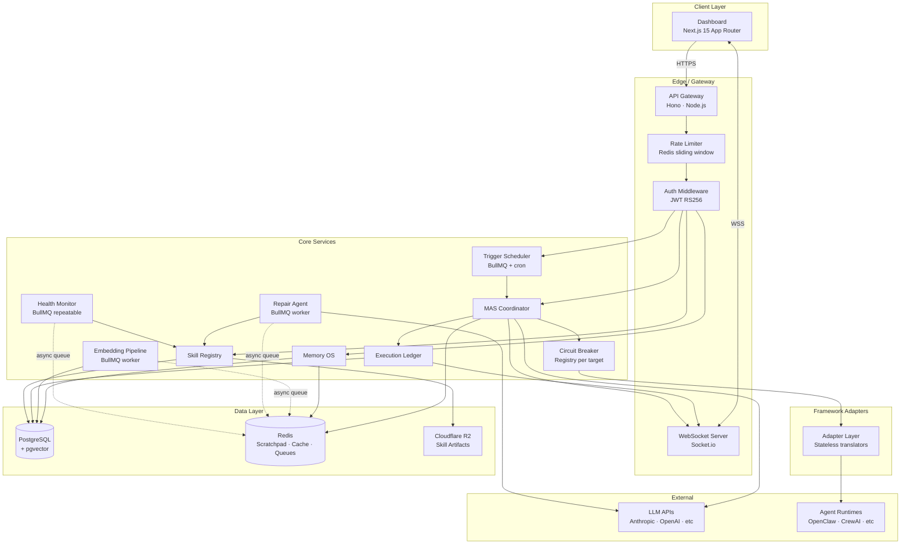
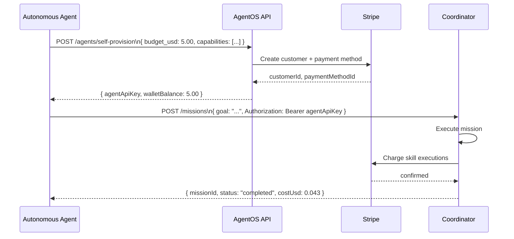
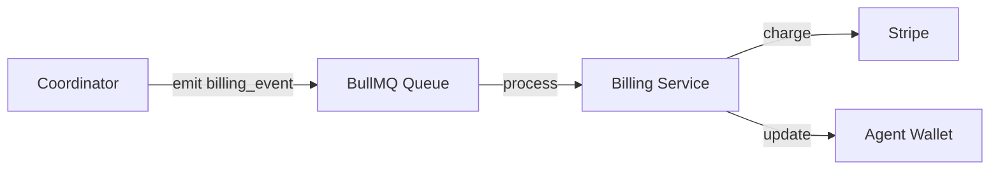

# Agentis — Platform Vision & Technical North Star

> **This document is the strategic vision artifact — the full-scope architecture of what Agentis will become.** It is NOT the immediate buildable V1 spec. It exists to align investors, collaborators, and future contributors on the complete platform picture.
>
> The real buildable V1 spec lives in `V1-SPEC.md` (to be written after the research phase). That spec will be a strict subset of this vision, focused on the minimum viable product that proves the "n8n for agents" thesis.

<!-- Original full platform specification merged here. Sections 0–13 + Future Roadmap (Sections 14–22) -->

**Document Status:** VISION — informs design decisions; not a build checklist  
**Spec Version:** 2.0.0  
**Date:** April 21, 2026  
**Contains:** Full platform architecture (§0–§13) + Post-V1 Roadmap (§14–§22)

---

## Meta-Rules (Enforced Throughout This Document)

Before reading any section, internalize these rules. They are constraints on both the spec itself and every implementation artifact generated from it.

1. **Every interface is complete.** `[key: string]: unknown` is only permitted with an explicit comment explaining why. Every field is named, typed, and documented.
2. **Every timeout is justified.** Not just stated — the reasoning appears inline.
3. **Every index has a named query.** If the query it serves cannot be stated, the index is deleted.
4. **Every external call has a timeout, retry count, and circuit breaker.** No call is fire-and-forget.
5. **No magic numbers.** Every threshold is a named constant with rationale in the Glossary.
6. **No TODOs.** Every open question is resolved to a decision in this document. If it was unresolved in the conversation history, this spec resolves it.
7. **Every external dependency is justified.** If the value of a library cannot be stated in one sentence, it is not used.

---

## Section 0 — Document Header & Contract Block

### 0.1 Reading Order

Read this document in the following order for maximum context coherence when generating implementation code:

```
Glossary (§0.5) ? System Boundaries (§1.3) ? Architecture Overview (§2) ?
Data Layer (Part 2, §4) ? Core Services (§3) ? API Contracts (Part 2, §5) ?
Real-Time Events (Part 2, §6) ? Frontend (Part 2, §7) ?
Security (Part 3, §8) ? Infrastructure (Part 3, §9) ? Error Handling (Part 3, §10) ?
Observability (Part 3, §11) ? Testing (Part 3, §12) ? Scope Boundaries (Part 3, §13)
```

**Rationale:** The data layer defines what exists. Services define what transforms it. APIs define how it is accessed. Frontend defines how it is displayed. Security, infrastructure, and testing are constraints applied to the complete system.

### 0.2 Definition of "Production-Ready"

A section is production-ready when:
- Every interface has zero missing fields
- Every state machine has every transition enumerated
- Every service has a named failure behavior for every dependency failure
- Every external call has timeout + retry + circuit breaker specified
- The corresponding test contracts in §12 cover the section's behavior
- An implementation agent can write code from the section without asking a clarifying question

### 0.3 Architectural Decision Record (ADR) Log

| ID | Decision | Rationale | Alternatives Rejected |
|---|---|---|---|
| ADR-001 | TypeScript over Python | npm ecosystem, runs everywhere (CLI, browser, edge), largest developer audience | Python: ML-native but wrong audience for a platform product |
| ADR-002 | Hono over Express/Fastify | Fastest Node.js HTTP framework, runs on edge runtimes, first-class TypeScript | Express: no native TS; Fastify: heavier plugin model |
| ADR-003 | React Flow over custom canvas | Purpose-built for node graphs, handles virtualization, active maintenance | Three.js: 3D overkill for V1; D3: too low-level, no React integration |
| ADR-004 | PostgreSQL + pgvector over separate vector DB | Single database reduces operational complexity; pgvector performance adequate at V1 scale (<1M embeddings) | Pinecone: vendor lock-in; Weaviate: separate service overhead |
| ADR-005 | Redis for scratchpad over SQLite | Mission scratchpad requires sub-millisecond read/write with pub/sub for change events; SQLite cannot publish changes | SQLite: no native pub/sub; Kafka: overkill for V1 |
| ADR-006 | Event-sourced ledger over mutable state | Enables timeline scrubbing, audit trails, and crash recovery without additional infrastructure | Mutable state: no history, no replay, no recovery |
| ADR-007 | `isolated-vm` V8 isolate for `node_worker` skills; Docker sandbox for Skill registry-installed (`docker_sandbox`) skills | Docker per execution has 2–5 s cold start unacceptable for local skills; `isolated-vm` provides a real V8 heap boundary (<50 ms cold start) with no shared memory and no access to the host module graph — far stronger than `vm.createContext`. Skill registry-installed third-party skills require a harder OS-level boundary: Docker containers with read-only filesystems, CPU/memory caps, and network namespace restriction to declared `allowedDomains`. Container warming pool targets <200 ms warm latency. | Workers + `vm.createContext` only: not a real security boundary — shared process heap, monkey-patched fetch bypassable; Firecracker: correct for hosted untrusted execution but requires Linux KVM hypervisor, not portable to macOS or Windows dev machines in V1 |
| ADR-008 | IVFFlat over HNSW for pgvector | At V1 scale (<100K embeddings), IVFFlat `lists=100` has equivalent recall to HNSW with simpler maintenance; HNSW promoted in V2 when index exceeds 500K vectors | HNSW: better at scale, more complex maintenance |
| ADR-009 | BullMQ over raw Redis queues | Background jobs (skill repair, embedding pipeline, ELO updates) need retry logic, dead-letter queues, and concurrency control; BullMQ provides this on top of existing Redis | Raw Redis: no retry, no DLQ; RabbitMQ/SQS: separate service |
| ADR-010 | Railway for initial infra over AWS | Railway reduces ops burden to near-zero for V1; AWS promoted when enterprise customers require VPC isolation | AWS: correct long-term, wrong short-term ops complexity |
| ADR-011 | Drizzle ORM over Prisma | Drizzle: SQL-first, no runtime code generation, better TypeScript inference, works in edge environments | Prisma: heavier runtime, query engine sidecar |
| ADR-012 | Cursor-based pagination over offset | Offset pagination breaks on concurrent inserts; cursor-based is stable for real-time data | Offset: simple but incorrect for live mission feeds |
| ADR-013 | HNSW promoted in V2 | See ADR-008; flagged here for V2 migration planning | — |
| ADR-014 | V1: `isolated-vm` isolates for `node_worker` + Docker sandbox for `docker_sandbox` (Skill registry skills) ? Firecracker (V3) | `isolated-vm` + Docker covers V1 threat model: operator-installed local skills get a real V8 heap boundary; Skill registry-installed third-party skills get Docker OS-level containment. Firecracker (Linux KVM microVMs) is promoted in V3 when Nexseed operates a hosted/metered execution environment where fully untrusted paid code runs on shared infrastructure — Docker is not sufficient there. | Workers only: not a real security boundary; Firecracker in V1: requires Linux KVM, not portable to macOS/Windows dev machines |
| ADR-015 | ELO K=32 as routing signal | Standard chess K-factor; provides meaningful signal after ~20 games per capability tag without over-indexing on early outliers | K=16: too slow to respond to quality changes; K=64: too volatile |
| ADR-016 | Planner always uses `PLANNER_MODEL` env var | Decouples planning quality from per-user LLM config; ensures consistent DAG quality regardless of user's chosen model | Per-user planner model: quality variance makes coordinator behavior unpredictable |
| ADR-017 | Motion One (`@motionone/dom`) over Framer Motion for FLIP animations | Motion One is 2KB vs Framer Motion's 31KB; provides an imperative `animate()` API ideal for FLIP that works outside React's component tree without requiring component lifecycle involvement | Framer Motion: larger bundle; layout animations require React component lifecycle wrapping; CSS transitions only: insufficient control for the multi-step FLIP orchestration needed in KanbanCardAnimator |
| ADR-018 | Direct DOM mutations for agent presence overlay positions | Presence overlays update at up to 20 events/second; routing those through React state causes cascading re-renders that exceed the 16ms frame budget; `useRef` + `element.style.transform` via `requestAnimationFrame` bypasses the reconciler entirely and stays compositor-only | Zustand-driven re-renders: update frequency triggers too many downstream component renders; `requestAnimationFrame` with React state: reconciler overhead compounds with each presence event |
| ADR-019 | Ephemeral `usePresenceStore` separate from `useMissionStore` | Presence state is high-frequency (up to 20 Hz), short-lived (`PRESENCE_EVENT_TTL_MS`), and never persisted to the Ledger; mixing it with mission state would contaminate the event log, distort timeline scrubbing, and trigger unnecessary re-renders of permanent UI components | Single store: presence mutations trigger too many downstream component re-renders across the canvas, feed, and sidebar; session storage: adds synchronous I/O for ephemeral data |
| ADR-020 | Solid dark surfaces over glass-morphism | `backdrop-filter: blur()` incurs GPU compositing cost on every repaint; on the mission canvas (many nodes, frequent updates) this compounds into missed frames. Solid dark layered surfaces achieve the same visual depth through border contrast and the elevation shadow system at zero GPU cost. Reference: guiding screenshot `/docs/design-reference.png` | Glass-morphism: GPU compositor overhead; reduces readability on dark node canvas; `backdrop-filter` not supported in all WebViews used by CI screenshot tests |

### 0.4 Named Constants Registry

Every magic number in this spec is declared here. Implementation code must import these from `packages/core/constants.ts`.

```typescript
export const CONSTANTS = {
  // Memory OS
  SEMANTIC_SIMILARITY_THRESHOLD: 0.78,   // Minimum cosine similarity for memory retrieval injection
  // Rationale: Below 0.78 produces noise that degrades agent context; tuned empirically
  
  SEMANTIC_MEMORY_INJECTION_LIMIT: 5,    // Max semantic memories injected per step
  // Rationale: At ~200 tokens each, 5 episodes = ~1000 tokens, within 10% of typical context budgets
  
  EPISODIC_MEMORY_INJECTION_LIMIT: 10,   // Max recent episodes injected per step
  // Rationale: Last 10 covers one full typical mission phase without context saturation

  STM_TTL_SECONDS: 86400,                // 24 hours — short-term memory session TTL
  // Rationale: 24h covers multi-day work sessions; longer risks stale context injection
  
  EPISODE_IMPORTANCE_DEFAULT: 0.5,       // Default importance for new memory episodes
  // Rationale: Midpoint; adjusted up by coordinator on mission completion, down on failure

  // ELO System
  ELO_K_FACTOR: 32,                      // Standard ELO K-factor (see ADR-015)
  ELO_BASELINE_SCORE: 1200,              // Starting ELO for new agents and tasks
  ELO_TASK_BASELINE_DIFFICULTY: 1200,   // Baseline task difficulty (calibrated to median task)

  // Skill Registry
  SKILL_HEALTH_REPAIR_THRESHOLD: 0.7,   // Below this health_score, trigger repair agent
  // Rationale: 0.7 = 30% failure rate, which degrades mission reliability detectably
  
  SKILL_HEALTH_BROKEN_THRESHOLD: 0.5,   // Below this, mark skill as "broken" pending repair
  SKILL_PATCH_APPROVAL_QUORUM: 3,       // Minimum local reviewer approvals to auto-apply a patch in multi-user deployments
  SKILL_PATCH_EXPIRY_DAYS: 30,          // Unvoted patches expire after this many days
  SKILL_REPAIR_CONFIDENCE_MIN: 0.75,    // Repair agent must meet this confidence to auto-submit patch
  // Rationale: Below 0.75, the repair is more likely to introduce bugs than fix them

  // Scratchpad
  SCRATCHPAD_MAX_SIZE_BYTES: 10_485_760, // 10MB per mission scratchpad
  // Rationale: Covers largest expected research mission outputs; beyond this = design smell
  
  // Circuit Breaker
  CIRCUIT_BREAKER_FAILURE_THRESHOLD: 5, // Failures before open
  CIRCUIT_BREAKER_WINDOW_SECONDS: 60,   // Rolling window for failure counting
  CIRCUIT_BREAKER_HALF_OPEN_DELAY_SECONDS: 30, // Time before half-open probe

  // Timeouts (all in milliseconds)
  SKILL_EXECUTION_TIMEOUT_MS: 30_000,   // 30s — default skill execution timeout
  // Rationale: 95th percentile of all web scraping + API calls; skills declaring longer must be explicit
  
  SKILL_EXECUTION_MAX_TIMEOUT_MS: 300_000, // 5 min — hard cap regardless of skill declaration
  PLANNING_LLM_TIMEOUT_MS: 60_000,      // 60s — Planner LLM call
  // Rationale: DAG generation for complex 20-task missions takes 30–45s on Opus; 60s is safe ceiling
  
  REPAIR_AGENT_TIMEOUT_MS: 120_000,     // 2 min — Repair agent cycle
  AGENT_TASK_RESPONSE_TIMEOUT_MS: 300_000, // 5 min — framework adapter waits this long for agent
  CHECKPOINT_APPROVAL_TIMEOUT_MS: 86_400_000, // 24h — auto-continues if no human action
  ADAPTER_HEALTH_CHECK_INTERVAL_MS: 15_000,   // 15s cadence for adapter health checks
  AGENT_HEARTBEAT_INTERVAL_MS: 15_000,        // 15s — agent heartbeat emission interval

  // Rate Limiting
  RATE_LIMIT_WINDOW_MS: 60_000,         // 1 minute sliding window
  RATE_LIMIT_MAX_REQUESTS: 1000,        // Per user per window
  RATE_LIMIT_MAX_REQUESTS_ANON: 20,    // Per IP for unauthenticated endpoints

  // Missions
  // Self-hosted note: all mission limits below are DEFAULT values enforced by the API out of the box.
  // Operators can override every limit via env vars (documented in §9.7). There are no hosted-tier
  // gates. The defaults reflect stable starting points, not commercial restrictions.
  MAX_CONCURRENT_MISSIONS_PER_USER: 10, // Default; override with MAX_CONCURRENT_MISSIONS_PER_USER env var
  MAX_TASKS_PER_MISSION: 100,           // Default; override with MAX_TASKS_PER_MISSION env var. Protects Coordinator memory on small VMs.
  MAX_RETRIES_PER_TASK: 3,             // Default retry budget per task
  
  // Context
  AGENT_CONTEXT_WARNING_THRESHOLD: 0.80, // Context utilization % that triggers warning ring
  AGENT_CONTEXT_CRITICAL_THRESHOLD: 0.90, // Context utilization % that triggers critical ring

  // ELO minimum games before routing preference
  ELO_MIN_GAMES_FOR_ROUTING: 5,        // Agents with < 5 games treated as unrated (ELO_BASELINE_SCORE used)

  // Skill registry imports / shareable content
  MAX_AGENT_PACKAGE_SKILLS: 20,
  MAX_TEMPLATE_VARIABLES: 20,
  TEMPLATE_VARIABLE_MAX_LENGTH: 500,
  ACTIVITY_GRAPH_DAYS: 365,

  // Projects
  // These are DEFAULT values. Override via env vars MAX_PROJECTS_PER_USER and MAX_PROJECT_MEMBERS.
  // Self-hosted deployments have no commercial restriction on these values.
  MAX_PROJECTS_PER_USER: 20,
  MAX_PROJECT_MEMBERS: 25,
  PROJECT_SLUG_MAX_LENGTH: 40,

  // Skill bundle limits
  SKILL_BUNDLE_MAX_SIZE_BYTES: 52_428_800, // 50MB hard cap on uploaded skill bundles
  SKILL_MAX_NPM_DEPENDENCIES: 20,          // Max npm packages declared in skill manifest

  // Living UI — Agent Presence & Animation
  PRESENCE_EVENT_TTL_MS: 5_000,
  // Rationale: 5s is long enough to absorb network jitter; short enough that stale ghost overlays never linger after an agent stops working

  PRESENCE_EVENT_THROTTLE_MS: 50,
  // Rationale: 50ms = 20 Hz max per agent — matches the threshold of smooth perceived motion; beyond 20 Hz the difference is imperceptible and wastes WS bandwidth

  SCRATCHPAD_WRITE_CHUNK_SIZE: 10,
  // Rationale: 10 chars ˜ 33ms at 300 wpm reading speed; chunks feel genuinely live without flooding the WebSocket bus

  PRESENCE_MAX_AGENTS_VISIBLE: 8,
  // Rationale: Beyond 8 simultaneous overlay indicators on one surface, visual noise outweighs informational value; matches AGENT_COLOR_PALETTE length

  AGENT_FOCUS_GLOW_DURATION_MS: 3_000,
  // Rationale: 3s ensures users see the glow even when presence.blur arrives milliseconds after the focus event due to rapid task transitions

  FLIP_ANIMATION_DURATION_MS: 350,
  // Rationale: 350ms is within the "felt instant" perceptual window (<400ms); longer reads as sluggish for card movement that users did not initiate

  TYPEWRITER_CHAR_DELAY_MS: 28,
  // Rationale: 28ms ˜ 35 chars/sec ˜ fast human typing speed; feels genuinely live without becoming unreadable

  PRESENCE_BATCH_WINDOW_MS: 16,
  // Rationale: 16ms = 1 frame at 60 Hz; all presence events arriving within one frame are batched and applied together in a single DOM mutation pass, preventing mid-frame layout queries

  AGENT_COLOR_PALETTE: [
    '#6366f1', // indigo   — slot 0
    '#f59e0b', // amber    — slot 1
    '#10b981', // emerald  — slot 2
    '#ef4444', // red      — slot 3
    '#8b5cf6', // violet   — slot 4
    '#06b6d4', // cyan     — slot 5
    '#f97316', // orange   — slot 6
    '#84cc16', // lime     — slot 7
  ] as const,
  // Rationale: 8 perceptually distinct colors that pass WCAG AA contrast against the dark base (--color-canvas: #0a0b0e);
  // agent color is assigned as AGENT_COLOR_PALETTE[agentIndex % PRESENCE_MAX_AGENTS_VISIBLE]

  LIVE_ACTIVITY_MAX_ENTRIES: 7,
  // Rationale: 7 visible rows at the LiveActivityStream's default height; oldest entry fades out as new one enters

  // -- Replanning -------------------------------------------------------------------------------
  MAX_REPLAN_ATTEMPTS: 3,
  // Rationale: Three replanning cycles cover the great majority of transient task failures without
  // allowing runaway LLM spend. After 3, the mission terminates with FAILED — the user must review
  // what caused repeated downstream failures before retrying.

  // -- Ledger -----------------------------------------------------------------------------------
  LEDGER_PAGE_SIZE: 100,
  // Rationale: 100 events per page keeps response payloads < 50 KB for the densest missions;
  // cursor-based pagination is used so clients can lazily load historical events.

  // -- Webhooks ---------------------------------------------------------------------------------
  WEBHOOK_TIMESTAMP_TOLERANCE_MS: 300_000,   // 5 minutes
  // Rationale: 5-minute window matches GitHub's webhook tolerance; balances NTP clock drift
  // tolerance against replay attack surface. Requests older than this window are rejected.
  WEBHOOK_MAX_RETRY_ATTEMPTS: 5,
  // Rationale: Five attempts cover transient endpoint outages (5s ? 30s ? 2m ? 10m ? 1h
  // retry schedule). After five failures the delivery is dead-lettered and the user is notified.

  // -- Health Monitor ---------------------------------------------------------------------------
  HEALTH_MONITOR_INTERVAL_MS: 300_000,       // 5 minutes
  // Rationale: Five-minute polling catches degrading skills before the Coordinator routes new
  // tasks to them; shorter cadences produce excessive DB reads on large deployments.
  HEALTH_SCORE_WINDOW_DAYS: 7,
  // Rationale: Seven-day rolling window smooths single-day API instability while reflecting
  // recent skill reliability. ELO history uses the same window for consistency.
  HEALTH_SCORE_MIN_EXECUTIONS: 5,
  // Rationale: Require at least 5 recent executions before computing health; prevents false
  // "broken" classifications for newly installed or infrequently-used skills.

  // -- Skill registry Integration --------------------------------------------------------------------------
  SKILL_REGISTRY_TIMEOUT_MS: 10_000,                // 10 seconds
  // Rationale: Skill registry calls are non-critical read operations; 10 s is 3× typical response
  // time and fast enough that the UI shows a meaningful "Skill registry unavailable" state promptly.
  HUB_API_RETRY_COUNT: 2,
  // Rationale: Two retries handle transient Skill registry network blips without blocking the UI for > 30 s.
  HUB_CACHE_TTL_SECONDS: 300,                // 5 minutes
  // Rationale: Matches the Redis TTL for hub:registry:entry:* keys; keeps the in-app panel
  // reasonably fresh without overwhelming the Skill registry API with per-page-load requests.

  // -- BullMQ Worker Concurrency ----------------------------------------------------------------
  COORDINATOR_WORKER_CONCURRENCY: 20,
  // Rationale: 20 concurrent coordinator event-processing jobs; each job is short-lived (< 50 ms)
  // and I/O-bound. Matches Railway Pro worker thread count.
  SKILL_EXECUTOR_WORKER_CONCURRENCY: 10,
  // Rationale: Each skill execution spawns a Node.js Worker thread; 10 concurrent threads
  // saturate a 4-vCPU Railway instance without exceeding memory budget.
  EMBEDDING_WORKER_CONCURRENCY: 5,
  // Rationale: Limited by OpenAI Embeddings API rate limit (3000 req/min on tier 1);
  // 5 workers at ~10 req/job = 50 req/s = 3000 req/min — exactly at rate limit ceiling.
  ELO_WORKER_CONCURRENCY: 10,
  // Rationale: ELO updates are fully idempotent by task_id; high concurrency is safe.

  // -- Auth -------------------------------------------------------------------------------------
  BCRYPT_COST: 12,
  // Rationale: Cost 12 produces ~300 ms hash time on a 2-vCPU cloud instance — expensive enough
  // to make offline dictionary attacks impractical, cheap enough to not block API response.
  PASSWORD_MIN_LENGTH: 12,
  PASSWORD_MAX_LENGTH: 128,
  // Rationale: Length is the strongest single predictor of password entropy. No forced complexity
  // requirements in V1 — length requirements alone deter brute-force attacks; additional complexity
  // rules reduce entropy by encouraging predictable substitutions.

  // -- Miscellaneous -----------------------------------------------------------------------------
  MAX_CONCURRENT_MISSIONS_PER_USER: 10,
  // Rationale: Prevents a single user from monopolising the Coordinator's in-memory state;
  // 10 simultaneous missions covers any realistic parallel workflow.
  MAX_CONCURRENT_TASKS_PER_MISSION: 5,
  // Default; override with MAX_CONCURRENT_TASKS_PER_MISSION env var.
  // Limits simultaneous active tasks in one mission to protect adapter connection pools on small VMs.
} as const;
```

### 0.5 Glossary

Every domain term used in this document. No synonym is used — one term per concept.

| Term | Definition |
|---|---|
| **Mission** | A goal object with natural language intent, constraints, budget, and a success condition. The top-level unit of work. Not a script — it is a live execution graph. |
| **Task** | A single atomic unit of work within a Mission. Assigned to one Agent. Mapped to one Skill. Has typed inputs and outputs. |
| **DAG** | Directed Acyclic Graph. The execution plan for a Mission. Nodes are Tasks; edges are dependencies with optional conditions. Generated by the Planner, executed by the Coordinator. |
| **Skill** | A local executable capability registered inside Agentis. In V1 it consists of TypeScript code plus a semantic wrapper and health metadata that let the platform route it, observe it, and repair it safely. |
| **Living Skill** | A Skill whose wrapper adds intent contracts, health telemetry, and repair metadata so Agentis can detect breakage, reason about failures, and surface fixes. The Living layer is a reliability wrapper around a capability, not a competing agent framework or runtime. |
| **Agent** | An autonomous process running on a supported framework (OpenClaw, CrewAI, etc.). Registered in Agentis, assigned Tasks by the Coordinator, reports events back via its Adapter. |
| **Adapter** | A stateless translator between Agentis's normalized protocol and a specific agent framework's native API. Never holds state — all state lives in core services. |
| **Coordinator** | The stateful Agentis service responsible for Mission lifecycle: planning, task routing, replanning, checkpoint management, and event emission. |
| **Planner** | A single LLM call (using `PLANNER_MODEL`) that decomposes a Mission goal into a typed Task DAG. Invoked exactly once per Mission (or once per replan). |
| **Scratchpad** | A mission-scoped key-value store (Redis) that is the only communication channel between Agents in the same Mission. All inter-agent data flows through it. |
| **Ledger** | An append-only, immutable log of every event in a Mission. The source of truth for mission state, timeline scrubbing, and crash recovery. |
| **Episode** | A single entry in the Persistent Memory OS representing something that happened (action, observation, decision, outcome). Permanent record. |
| **Checkpoint** | A defined pause point in a Mission DAG where human approval is required before execution continues. State is fully preserved during the pause. |
| **ELO** | An agent capability rating derived from task success/failure history. Used to route Tasks to the best-fit Agent for a given capability tag. |
| **Repair Agent** | An LLM-powered process invoked when a Skill's health drops below `SKILL_HEALTH_REPAIR_THRESHOLD`. It reads the skill's semantic intent contract and generates a patch. |
| **Semantic Wrapper** | The machine-readable intent contract attached to every Living Skill. Describes inputs, outputs, capability tags, and intent in a format both the Coordinator and Repair Agent can reason about. |
| **Circuit Breaker** | A fault isolation mechanism that stops calls to a failing dependency after `CIRCUIT_BREAKER_FAILURE_THRESHOLD` failures. Transitions through CLOSED ? OPEN ? HALF-OPEN states. |
| **STM** | Short-Term Memory. Redis-backed session context for a single Agent session. TTL: `STM_TTL_SECONDS`. |
| **LTM** | Long-Term Memory (Episodic). PostgreSQL-backed permanent record of what happened. Never deleted, only archived. |
| **Semantic Memory** | pgvector-backed embeddings of LTM episode summaries. Enables similarity search for context injection. |
| **Agent Package** | A versioned, forkable, one-click-deployable configuration unit that bundles a framework + capability tags + required skills + memory config. In V1 public packages are published on Skill registry and imported into a self-hosted Agentis deployment on demand. |
| **Mission Template** | A versioned, forkable mission plan with variable substitution. Users fill in {{variables}} and click "Fork & Run" to immediately launch a mission. Public templates live on Skill registry; imported copies execute locally inside Agentis. |
| **Activity Graph** | A 365-day contribution heatmap on a user's Skill registry profile. Counts missions run, skills executed, agents deployed, and patches submitted per day — the Agentis equivalent of GitHub's contribution graph. |
| **Agent Presence** | The ephemeral state of which element an agent is currently focused on. Never persisted to the Ledger. Conveyed via `agent.presence.*` WebSocket events with TTL `PRESENCE_EVENT_TTL_MS`. |
| **Focus Overlay** | An absolutely-positioned colored ring that appears on a task node, Kanban card, or scratchpad entry when an agent is actively processing it. Rendered by `AgentFocusOverlayManager` using direct DOM mutations — no React re-renders. |
| **FLIP Animation** | First–Last–Invert–Play. The technique used to animate Kanban card movement between columns without triggering layout recalculation. Records element position before and after a DOM update, then plays back an inverted `transform` to zero — compositor-only. |
| **Typewriter Effect** | Character-by-character reveal of scratchpad content as an agent writes it, powered by `agent.scratchpad.writing` chunk events and CSS `transform`/`opacity` keyframe animations on individual character `<span>` elements. |
| **Thinking Pulse** | A radiating concentric-ring SVG animation applied to an agent's constellation node when it emits `agent.presence.thinking`. Signals that the agent is in a multi-step reasoning loop. Clears on the next `task.assigned` or `task.completed`. |
| **Live Activity Stream** | A fixed, collapsible ticker on the mission detail page showing the last `LIVE_ACTIVITY_MAX_ENTRIES` agent actions in real time, derived from presence events and filtered ledger events. Distinct from the full persistent `EventFeed`. |
| **Presence Slot** | A stable 0–7 index assigned to each agent on first appearance in a browser session. Determines the agent's color from `AGENT_COLOR_PALETTE` across all presence surfaces. |

---

## Section 1 — Product Identity & System Boundaries

### 1.1 What Agentis Is and Is Not

**Agentis is** a self-hosted operating environment for multi-agent systems. It provides coordination, memory, observability, recovery, and execution hygiene that no individual agent framework provides. It is framework-agnostic by design: OpenClaw, CrewAI, LangGraph, AutoGen, Claude SDK, and generic HTTP agents are all first-class citizens. Agentis is the layer above frameworks, never a replacement for them.

**Agentis is not** an agent framework. It does not replace OpenClaw or CrewAI. It does not generate code, browse the web, or write files on its own — those are Agent capabilities. Agentis orchestrates Agents that do those things, provides the environment they operate in, and makes their work observable, recoverable, and steerable.

**Agentis is not** a hosted cloud control plane in V1. There is no Nexseed-managed Agentis cloud, no centralized SaaS workspace, and no hosted execution tier in the launch release. Every V1 deployment is installed and operated on the user's own infrastructure.

**Agentis is not** the community platform. Community identity, public profiles, launches, stars, forks, monetization, and contribution workflows live on Skill registry at `https://clawhub.ai`, which is a separate application. For launch, the official product landing surface is the GitHub repository; Agentis itself does not depend on a separate marketing site.

### 1.2 User Archetypes & Mental Models

These are mental models — the cognitive frameworks users bring to the product — not marketing personas.

**The Agent Operator**  
Mental model: "I have agents running. I need to see what they're doing, know when they fail, and be able to steer them without killing everything."  
Primary surface: Mission Canvas. Primary pain: zero observability in existing frameworks. Primary success signal: sees all agents running in real time, gets notified on checkpoints, never loses a mission to a silent timeout again.

**The Skill Author**  
Mental model: "I already have a capability. I need it to stay reliable when websites, APIs, or surrounding context change, and I may want to publish that wrapped capability to the community."  
Primary surface: local Skill Registry + Skill registry listing. Primary pain: previously published scripts broke silently and there was no health or repair layer around them. Primary success signal: wraps a capability as a Living Skill, sees health/repair telemetry locally, and optionally publishes it to Skill registry for installs or paid use.

**The Skill registry Publisher**  
Mental model: "I want to distribute a complete pattern, not just one skill. I need profiles, releases, contributors, forks, verification, and optional monetization."  
Primary surface: Skill registry + in-app Skill registry panel. Primary pain: there is no GitHub-like home for agent configs, mission templates, and bundles in the agentic ecosystem. Primary success signal: publishes a package, template, or config on Skill registry, sees installs and contributions there, and users can import it into self-hosted Agentis in one flow.

**The Mission Builder**  
Mental model: "I want to automate complex goals without writing a DAG by hand. I describe what I want, I set constraints, and I watch it execute."  
Primary surface: Mission creation form + Canvas. Primary pain: n8n requires manual arrow-drawing; existing harnesses are CLI-only. Primary success signal: types a goal, sets a budget, watches the DAG form and execute, approves one checkpoint, receives output.

**The Platform Developer**  
Mental model: "I'm building an agentic product and need reliable infrastructure beneath it. I want API-first access, framework flexibility, and execution guarantees."  
Primary surface: API + Adapters. Primary pain: every framework is a silo; switching is expensive. Primary success signal: registers any agent via a single adapter, gets mission coordination and memory for free.

### 1.3 System Boundary Diagram

```
+-----------------------------------------------------------------+
¦                         AGENTIS BOUNDARY                        ¦
¦                                                                 ¦
¦  +----------+  +----------+  +----------+  +---------------+  ¦
¦  ¦Coordinator¦  ¦Memory OS ¦  ¦  Ledger  ¦  ¦ Skill Registry¦  ¦
¦  +----------+  +----------+  +----------+  +---------------+  ¦
¦  +----------+  +----------+  +----------+  +---------------+  ¦
¦  ¦Scratchpad¦  ¦ Trigger  ¦  ¦Skill     ¦  ¦  API Gateway  ¦  ¦
¦  ¦ (Redis)  ¦  ¦Scheduler ¦  ¦Runtime   ¦  ¦  + WS Server  ¦  ¦
¦  +----------+  +----------+  +----------+  +---------------+  ¦
¦  +----------------------------------------------------------+  ¦
¦  ¦               Framework Adapter Layer                    ¦  ¦
¦  ¦  OpenClaw ¦ CrewAI ¦ LangGraph ¦ AutoGen ¦ Generic HTTP  ¦  ¦
¦  +----------------------------------------------------------+  ¦
+-----------------------------------------------------------------+
                            ¦ Adapters cross this boundary
      +---------------+--------------------------------------------+
      ¦               ¦                     ¦                      ¦
  +-----?------+  +-----?--------+  +--------?--------+  +----------?---------+
  ¦  External  ¦  ¦   External   ¦  ¦    External     ¦  ¦      External      ¦
  ¦Agent Runtm ¦  ¦ LLM Provider ¦  ¦  User Infra     ¦  ¦   Skill registry      ¦
  ¦(OpenClaw   ¦  ¦(Anthropic,   ¦  ¦ (their DB, CRM, ¦  ¦ clawhub.ai     ¦
  ¦ process)   ¦  ¦ OpenAI, etc) ¦  ¦  filesystem)    ¦  ¦ public registry/API ¦
  +------------+  +--------------+  +-----------------+  +--------------------+
```

**Inside Agentis boundary:** All services, all databases, all queues, the Dashboard frontend, API Gateway, WebSocket server, Skill sandboxes, Repair Agent process, and the local import/install workflows.

**Always external:** Agent runtime processes (OpenClaw runs on user's machine or their infra), LLM API providers (Anthropic, OpenAI, Gemini, Ollama — Agentis only calls these for planning and repair; agents call them for execution), user's own infrastructure that agents may access during skill execution, and Skill registry (`clawhub.ai`), which owns public registry data, profiles, launches, contributions, and optional paid listings.

### 1.4 Non-Goals (Hard Constraints)

These are architectural constraints, not wishes. Building any of these in V1 is a specification violation.

- **Agentis does not provide LLM inference.** It calls external LLM APIs. It never hosts a model (until V5).
- **Agentis does not run agents.** Agents run on their own runtimes. Agentis coordinates them via adapters.
- **Agentis does not provide cloud hosting in V1.** No Nexseed-managed control plane, no managed workspace tenancy, and no hosted execution tier ship in the launch release. Cloud deployment is explicitly deferred.
- **Agentis does not provide OAuth inside the self-hosted product.** Core app authentication is local username + password only. Skill registry login is external to the self-hosted app.
- **Agentis does not provide an in-product public skill registry or social graph.** Public discovery, profiles, forks, launches, ratings, and monetization live on Skill registry.
- **Agentis does not provide metered cloud skill execution.** V1 skills execute in the API process via Worker threads. No container orchestration. (V3 feature.)
- **Agentis does not provide enterprise SSO.** SAML/OIDC is deferred to V4.
- **Agentis does not have real-time collaborative mission steering.** V1 supports one human steering per mission. (V2 feature.)
- **Agentis does not bill agents autonomously.** No Agent-as-Customer API in V1. (V3 feature.)

### 1.5 V1 vs V2 Scope Decision Criteria

A feature crosses into V1 if and only if:
1. It directly solves one of the 7 documented openclaw community pain points (Issues #10010, #39093, #7783, #64549/#57334, #17065, #50073/#35203, #69681/#22673), **OR**
2. Its absence makes the V1 product non-functional for the primary user archetypes, **AND**
3. It can be implemented without container orchestration, enterprise billing infrastructure, or an LLM trained on platform data.

### 1.6 Skill registry Integration Contract (V1)

Skill registry is a separate system at `https://clawhub.ai`. The self-hosted Agentis dashboard exposes a built-in Skill registry panel, but that panel is an integration surface, not the system of record for community content.

**Read-only in-app flows:** browse registry entries, search, inspect health and verification metadata, view launches/changelog entries, inspect author profiles, and fetch artifact manifests required to install content locally.

**Write flows stay on Skill registry:** publishing, contributing, starring, forking, commenting, billing setup, paid listing management, and contributor management always redirect the user to `https://clawhub.ai`. The self-hosted app never stores Skill registry credentials tokens and never performs Skill registry writes on the user's behalf.

```typescript
interface RegistryEntry {
  entryId: string;
  entryType: 'skill' | 'agent_config' | 'mission_template' | 'package';
  slug: string;
  title: string;
  summary: string;
  version: string;
  verification: {
    automatedChecksPassed: boolean;
    verifiedBadge: boolean;
    lastScannedAt: string;
  };
  pricing: {
    model: 'free' | 'one_time' | 'subscription';
    amountUsd?: number;
  };
  artifacts: Array<{
    artifactType: 'skill_bundle' | 'agent_config' | 'mission_template';
    sha256: string;
    downloadUrl: string;
  }>;
}
```

**Install flow contract:**
1. User browses Skill registry content from the in-app Skill registry panel with no login requirement.
2. The panel fetches registry metadata directly from `https://clawhub.ai/api/v1/` over HTTPS.
3. If the entry is a Package, the user can select all components or a subset before install.
4. Agentis downloads only the selected manifests/artifacts, verifies every advertised SHA-256 hash, and displays any declared domains or external dependencies before applying the import.
5. Imported skills, configs, and templates become local Agentis resources owned by the self-hosted deployment; subsequent execution is fully local.
6. If the user clicks Publish, Contribute, or any other write action, the dashboard opens the relevant Skill registry URL in the browser. Login is required only there.

**Skill registry API call contract (from the in-app panel):**

Every outbound call from the in-app Skill registry panel to `https://clawhub.ai/api/v1/` obeys this contract:

```typescript
interface HubApiCallConfig {
  method: 'GET';                    // In-app panel is read-only; all writes go to the browser
  timeout: typeof CONSTANTS.SKILL_REGISTRY_TIMEOUT_MS;         // 10 000 ms absolute timeout
  retries: typeof CONSTANTS.HUB_API_RETRY_COUNT;        // 2 retries on timeout / 5xx
  cacheKey: string;                 // Redis key: hub:registry:entry:{entryId} or hub:registry:search:{hash(query)}
  cacheTtlSeconds: typeof CONSTANTS.HUB_CACHE_TTL_SECONDS; // 300 s
}
```

**Skill registry error-state handling rules (non-negotiable):**

| Skill registry API error | Dashboard behaviour |
|---|---|
| Timeout (> `SKILL_REGISTRY_TIMEOUT_MS`) | Show "Skill registry is currently unavailable" inline banner in the Skill registry panel; retry after 30 s |
| HTTP 5xx from Skill registry | Identical to timeout |
| HTTP 4xx from Skill registry | Show error message specific to status (e.g. 404 ? "Entry not found on Skill registry") |
| Network/DNS failure | Show "Cannot reach Skill registry. Check your internet connection." |
| Skill registry cache hit (Redis) | Serve stale data immediately; refresh in background |

**Skill registry availability independence guarantee:** Skill registry unavailability MUST NEVER degrade any self-hosted Agentis functionality outside the Skill registry panel. All mission execution, agent management, skill execution, memory, ledger, and authentication operations proceed normally when `clawhub.ai` is unreachable. The Skill registry panel is the only component that depends on the external Skill registry API; it renders a degraded state when Skill registry is down and recovers automatically.

---

## Section 2 — Architecture Overview

### 2.1 Full System Diagram



### 2.2 Data Flow Narrative — "Run Mission" End-to-End

This prose describes every service touched from the moment a user clicks "Run Mission" to final output. Every service is named.

1. **User submits mission goal** via the Dashboard (`POST /v1/missions`). Request hits the API Gateway (Hono), passes through Rate Limiter (Redis sliding window check), then Auth Middleware (JWT RS256 verification). Request is validated against the Mission creation Zod schema.

2. **Mission row created** in PostgreSQL (`missions` table, status: `CREATED`). The Execution Ledger emits `mission.created` event to the BullMQ Ledger queue. Ledger worker persists the event and broadcasts it via Socket.io to all clients subscribed to `mission:{id}`.

3. **Coordinator picks up the mission.** The mission row transition to `PLANNING` is written to PostgreSQL and emitted via Ledger. Coordinator calls the **Planner** — one LLM call to `PLANNER_MODEL` with a structured prompt containing: goal, constraints, budget, available Skills (from Skill Registry, filtered by health > `SKILL_HEALTH_REPAIR_THRESHOLD`), registered Agents with their capability tags and ELO scores, and injected Memory context (if the user has prior episodic/semantic memories relevant to the goal).

4. **Planner returns a Task DAG.** Coordinator validates the DAG against a Zod schema. DAG cycle detection runs (topological sort). If cycles exist, planning fails with `PLANNING_CYCLE_DETECTED` error; mission marked `FAILED`. If valid, `plan` column is written to the mission row.

5. **Task routing begins.** For each Task with no dependencies (root nodes in the DAG), Coordinator calls the ELO Router: queries `agent_elo` table for agents with matching `capability_tags`, selects the highest-ELO agent with status `online` and no current task assigned. Updates `tasks.assigned_agent_id`.

6. **Task dispatched to Agent** via Framework Adapter. Coordinator builds the `NormalizedTask` (task description + `InjectedContext` from Memory OS + current Scratchpad state + Ledger summary). Adapter translates to framework-native protocol and delivers to the Agent runtime. Circuit Breaker is checked before every adapter call.

7. **Agent executes the Task.** During execution, the Agent may: read/write the Scratchpad (all writes emit `scratchpad.written` to Socket.io), emit progress events (translated by Adapter to normalized `EventType`, written to Ledger), and report completion via Adapter.

8. **Task completion received.** Coordinator receives normalized task output via Adapter event handler. Output is validated against the Skill's `output_schema`. Ledger emits `task.completed`. ELO scores updated asynchronously (BullMQ job). Scratchpad updated with task output if the skill declared a scratchpad write key.

9. **DAG advancement.** Coordinator evaluates all edges from the completed task. For conditional edges (`condition` field), the condition expression is evaluated safely against the task output (no `eval()` — see §3.1.4). Tasks whose dependencies are all satisfied are queued for routing. Parallel tasks are dispatched concurrently (bounded by `MAX_CONCURRENT_TASKS_PER_MISSION`).

10. **Checkpoint reached** (if configured after this task). Mission status ? `CHECKPOINT_PENDING`. Socket.io emits `checkpoint.reached` event with structured summary. The Dashboard shows a blocking approval UI. A BullMQ delayed job is scheduled for `CHECKPOINT_APPROVAL_TIMEOUT_MS` to auto-continue if no human action. Human approves ? mission resumes. Human rejects ? mission cancelled.

11. **Mission completes.** All tasks in `COMPLETED` state. Coordinator writes final mission status. Ledger emits `mission.completed`. Memory OS writes an Episode to LTM for the completed mission (async BullMQ job). Embedding Pipeline job queued for the new Episode. ELO scores for all participating agents updated. Socket.io emits `mission.completed`.

### 2.3 Concurrency Model

```typescript
interface ConcurrencyConfig {
  MAX_CONCURRENT_MISSIONS_PER_USER: 10;        // Named constant; soft limit
  MAX_CONCURRENT_TASKS_PER_MISSION: 5;         // Hard limit on parallel DAG branches
  // Rationale: 5 concurrent tasks = 5 simultaneous agent connections;
  // beyond this, coordinator overhead exceeds benefit for V1 mission sizes
  
  COORDINATOR_WORKER_CONCURRENCY: 20;          // BullMQ concurrency for coordinator jobs
  SKILL_EXECUTOR_WORKER_CONCURRENCY: 10;       // Parallel skill executions per API instance
  EMBEDDING_WORKER_CONCURRENCY: 5;             // Embedding jobs (LLM API rate-limited)
}
```

**Mission isolation:** Each mission's state (Redis keys, Ledger sequence, Scratchpad namespace) is scoped by `missionId`. A failure in one mission's DAG execution cannot corrupt another mission's state.

**Tenant isolation (V1):** PostgreSQL Row Level Security enforces user_id scoping on all tables. Redis keys are prefixed with `{userId}:`. WebSocket subscriptions require auth and are validated against mission ownership before join. A user cannot see another user's mission events.

### 2.4 Failure Topology

This defines what fails independently vs. what cascades.

| Failure | Impact | Isolation |
|---|---|---|
| Single skill execution timeout | Task retried; other tasks unaffected | Circuit breaker per skill |
| Framework adapter down | Tasks on that adapter fail/retry; other adapters unaffected | Circuit breaker per adapter |
| Redis unavailable | Scratchpad writes fail; active missions pause (not fail); Coordinator falls back to DB-only mode | Circuit breaker on Redis client |
| PostgreSQL unavailable | All write operations fail; active in-memory coordinator state preserved for `AGENT_TASK_RESPONSE_TIMEOUT_MS` | Coordinator queues events locally |
| LLM API unavailable | Planning fails with `PLANNING_FAILED`; Repair Agent pauses; active missions continue with current plan | Circuit breaker on LLM client |
| WebSocket server restart | Clients reconnect with `lastSequence`; missed events replayed from Ledger | BullMQ persists events; WS is stateless |
| Coordinator crash | On restart, replays Ledger events to restore in-memory state; in-flight tasks resume after `AGENT_TASK_RESPONSE_TIMEOUT_MS` | Event-sourced state |
| API Gateway crash | New requests fail until restart; no mission state loss | Stateless service |

### 2.5 Design Principles

1. **Event-sourced state.** Every mutation is an immutable event. State is derived from replay. This enables timeline scrubbing, crash recovery, and audit trails without additional infrastructure.
2. **Adapter isolation.** Adapters are stateless translators. Adding a framework never touches core services. Removing a framework never breaks others.
3. **Scratchpad-first coordination.** Agents never communicate directly. All inter-agent data flows through the mission-scoped Scratchpad. This makes all communication observable, replayable, and auditable.
4. **Fail-forward recovery.** A failed step triggers: retry ? reroute ? skill repair ? human escalation. Silent failure is architecturally impossible.
5. **Idempotency by default.** Every write operation is idempotent. Mission creation, task assignment, and ledger event emission are safe to retry without side effects. Idempotency keys enforced on mission creation and skill publish.
6. **Tenant isolation.** Data is always scoped to `user_id`. No cross-tenant data access is possible through the API layer. RLS enforces this at the database layer.
7. **Observability-by-default.** Every service emits structured logs. Every external call emits a trace span. No operation is unobservable.

---

## Section 3 — Core Services

### 3.1 MAS Coordinator

#### Single Responsibility
Manage the complete lifecycle of a Mission: from goal intake through DAG execution, replanning, checkpoint management, constraint injection, and final outcome.

#### State Owned
- In-memory: active mission execution state (DAG progress, agent assignments, pending checkpoints). Rebuilt from Ledger on restart.
- PostgreSQL: `missions` table, `tasks` table (persistent, source of truth).
- Does NOT own: Scratchpad (Redis, separate service), Ledger events (append-only, Ledger service owns), agent ELO (PostgreSQL, updated async).

#### Interfaces Exposed (Internal)

```typescript
interface ICoordinator {
  // Called by API Gateway
  createMission(input: CreateMissionInput, userId: string): Promise<Mission>;
  pauseMission(missionId: string, userId: string): Promise<void>;
  resumeMission(missionId: string, userId: string): Promise<void>;
  cancelMission(missionId: string, userId: string): Promise<void>;
  injectConstraint(missionId: string, constraint: string, userId: string): Promise<void>;
  approveCheckpoint(checkpointId: string, userId: string): Promise<void>;
  rejectCheckpoint(checkpointId: string, userId: string): Promise<void>;
  skipTask(taskId: string, userId: string): Promise<void>;
  
  // Called by Trigger Scheduler
  fireTrigger(triggerId: string): Promise<Mission>;
  
  // Called by Framework Adapters (event callbacks)
  onTaskEvent(event: NormalizedAgentEvent): Promise<void>;
}
```

#### Dependencies

**Calls:** Planner (LLM API), Framework Adapter Layer, Memory OS (read only — context injection), Skill Registry (read only — capability lookup), Execution Ledger (write only — event emission), Scratchpad (read/write), Circuit Breaker Registry.

**Must never call:** Database directly for reads (all DB reads go through repository layer), WebSocket server directly (all WS emissions go through Ledger ? WS fan-out).

**Dependency direction rule:** Coordinator ? Ledger ? WebSocket. Coordinator never imports from WS server.

#### Mission State Machine

```
                    +--------------+
                    ¦   CREATED    ¦
                    +--------------+
                           ¦ createMission()
                    +------?-------+
                    ¦   PLANNING   ¦?----------------------+
                    +--------------+                       ¦ replanMission() 
             success ¦     ¦ failure                       ¦ (on task failure)
                    +?------------+  +-----------------------+
                    ¦   RUNNING   ¦  ¦        FAILED          ¦
                    +-------------+  +------------------------+
       all tasks done ¦   ¦ checkpoint reached
                    +-?----------------+
                    ¦CHECKPOINT_PENDING ¦
                    +------------------+
              approve ¦    ¦ reject
                    +-?-------+  +----------------+
                    ¦ RUNNING  ¦  ¦   CANCELLED    ¦
                    +----------+  +----------------+
         all done ¦      ¦ pauseMission()
                +-?------------+
                ¦   PAUSED     ¦
                +--------------+
           resume ¦
                +-?------------+
                ¦  COMPLETED   ¦
                +--------------+
```

Guards:
- `PLANNING ? RUNNING`: Requires valid DAG (no cycles, at least 1 task, all `required_capabilities` have at least 1 registered agent online).
- `RUNNING ? CHECKPOINT_PENDING`: Requires a checkpoint configuration that matches the completed task.
- `PAUSED ? RUNNING`: Only allowed if mission is in `PAUSED` status and owned by requesting user.
- Any state ? `CANCELLED`: Only allowed by mission owner; cannot cancel `COMPLETED` or `FAILED`.

#### 3.1.1 Planner Contract

The Planner is invoked as a single structured LLM call. It is not an agentic loop — it is one request, one response, validated by Zod.

```typescript
interface PlannerSystemPrompt {
  // The system prompt instructs the Planner to return ONLY valid JSON
  // matching the PlannerOutput schema. No prose. No explanation.
  // The schema is embedded in the system prompt as a JSON Schema string.
}

interface PlannerInput {
  goal: string;
  constraints: string[];
  budget: BudgetConfig;
  availableSkills: Array<{
    skillId: string;
    slug: string;
    intent: string;                    // Semantic wrapper intent field
    inputSchema: JSONSchema;
    outputSchema: JSONSchema;
    capabilityTags: string[];
    healthScore: number;
  }>;
  registeredAgents: Array<{
    agentId: string;
    name: string;
    capabilityTags: string[];
    eloScores: Record<string, number>; // { capabilityTag: eloScore }
    framework: string;
  }>;
  memoryContext?: string;              // Formatted string of injected episodes
}

interface PlannerOutput {
  title: string;                       // Auto-generated mission title
  tasks: Array<{
    taskId: string;                    // UUID generated by Planner (validated as UUID v4)
    name: string;
    description: string;
    requiredCapabilities: string[];
    suggestedSkillSlug?: string;       // Planner can suggest; Coordinator may override
    estimatedDurationMs: number;
    maxRetries: number;                // Planner sets per-task retry budget
  }>;
  dag: Array<{
    from: string;                      // taskId
    to: string;                        // taskId
    condition?: string;                // SAFE expression — see §3.1.4
  }>;
  checkpointSuggestions: Array<{
    afterTaskId: string;
    reason: string;
  }>;
  estimatedTotalCostUsd: number;
  plannerReasoning: string;           // One paragraph — stored for debugging, not shown to agents
}
```

#### 3.1.2 DAG Cycle Detection

Algorithm: **Kahn's topological sort** (synchronous, runs immediately after Planner response).

1. Build an in-degree map and adjacency list from the task and edge arrays.
2. Enqueue all nodes with in-degree = 0.
3. While queue is non-empty: dequeue a node, decrement in-degree of each successor; if successor reaches 0, enqueue it.
4. If visited count < total node count ? a cycle exists.

Signature: `detectCycles(tasks: Task[], edges: DAGEdge[]): boolean`

If `detectCycles` returns `true`, mission transitions to `FAILED` with error code `PLANNING_CYCLE_DETECTED`.

#### 3.1.3 Concurrent Task Execution

Tasks with no unresolved dependencies are dispatched in parallel, bounded by `MAX_CONCURRENT_TASKS_PER_MISSION` (default 5).

`advanceDAG(missionId)` logic:
1. Load mission tasks. Compute `completedIds` (status `completed` or `skipped`).
2. Count currently `running` tasks. Compute `slotsAvailable = MAX_CONCURRENT_TASKS_PER_MISSION - runningCount`.
3. If `slotsAvailable = 0` ? return (no work to do this cycle).
4. Filter `pending` tasks whose every upstream dependency is in `completedIds` AND every conditional edge from those dependencies evaluates true (see §3.1.4).
5. Dispatch up to `slotsAvailable` of those ready tasks via `dispatchTask`.

#### 3.1.4 Conditional Edge Evaluation (No eval())

Conditional edges use the `expr-eval` library (MIT, zero dependencies) configured with only comparison and logical operators. No `eval()`, no `new Function()`.

**Supported grammar:**
```
expression  = comparison | logical
comparison  = path operator literal
path        = identifier ("." identifier)*     -- e.g., output.score, output.count
operator    = ">" | "<" | ">=" | "<=" | "==" | "!=" | "includes"
literal     = number | string | boolean
logical     = expression ("&&" | "||") expression
```

Signature: `evaluateCondition(expression: string, output: Record<string, unknown>): boolean`

- Parse error ? returns `true` (fail-open; logged as warning). Rationale: a broken condition should not silently halt the mission; humans can skip if needed.
- All arithmetic and bitwise operators are disabled in the parser config.

#### 3.1.5 Replanning Logic

Replanning is triggered when:
- A task fails after exhausting all retries (`retryCount >= maxRetries`)
- AND the mission's current budget has not been exceeded
- AND the failed task is not marked `skipOnFailure: true`

Replanning algorithm:
1. Identify the failed task and all tasks downstream of it (descendants in the DAG).
2. Mark all downstream tasks as `pending` (reset their state).
3. Construct a replan prompt: original goal + constraints + remaining budget + completed task outputs + failure description + same available skills/agents list.
4. Call Planner with this replan prompt. The Planner generates a replacement sub-DAG for the failed task onwards.
5. Merge the replacement sub-DAG into the existing DAG (completed tasks are immutable).
6. DAG cycle detection runs on the merged graph.
7. If replan DAG is valid, Ledger emits `mission.replanned`. Coordinator calls `advanceDAG()`.
8. If replan fails (cycle, empty, budget exceeded), mission ? `FAILED`.

Maximum replanning attempts per mission: 3 (named constant `MAX_REPLAN_ATTEMPTS = 3`). After 3, any task failure ? `FAILED`.

#### 3.1.6 Constraint Injection Propagation

When a human injects a constraint via `POST /missions/:id/constraints`:

1. Constraint is appended to `missions.constraints` (JSONB array), with `injectedAt` and `injectedBy` fields.
2. Ledger emits `constraint.injected`.
3. For all tasks currently in `running` state: the constraint is prepended to the task's active prompt on the **next** LLM call cycle within the agent. The adapter sends a `constraint_update` notification to the agent runtime.
4. For tasks in `pending` state: constraint is included in the `NormalizedTask.constraints` array when they are dispatched.
5. The Planner is NOT re-invoked. Constraints are injected into execution, not replanning.

**Constraint types and their effects:**

| Constraint Type | Effect on Running Tasks | Effect on Pending Tasks |
|---|---|---|
| `filter` | Injected into next agent prompt cycle | Included in NormalizedTask.constraints |
| `exclude` | Injected into next agent prompt cycle | Included in NormalizedTask.constraints |
| `require_approval` | Adds a checkpoint after current task | Adds a checkpoint before dispatch |
| `budget` | Coordinator enforces immediately — tasks pause if budget exceeded | Included in NormalizedTask budget |
| `prioritize` | Injected into next agent prompt cycle | Included in NormalizedTask.constraints |

#### 3.1.7 ELO Rating System — Full Algorithm

Agent capability scores are maintained as ELO ratings, one score per `(agentId, capabilityTag)` pair. Updates are enqueued as BullMQ jobs (`elo-update` queue) on every task completion — never on the hot path.

```typescript
interface EloUpdateJobPayload {
  taskId: string;
  agentId: string;
  capabilityTag: string;         // The capability tag the task was routed on
  outcome: 'win' | 'loss';       // win = task succeeded; loss = all retries exhausted
}
```

**ELO formula:**

$$E = \frac{1}{1 + 10^{(D - S) / 400}}$$

where $S$ = agent's current score, $D$ = task difficulty (`ELO_TASK_DIFFICULTY = 1200` in V1), $E$ = expected win probability.

$$\Delta = K \times (\text{actual} - E)$$

where $K = $ `ELO_K_FACTOR = 32`, actual = 1 (win) or 0 (loss). New score = max(0, S + ?). No negative ELO.

**ELO update flow (BullMQ job):**
1. Worker receives `EloUpdateJobPayload` deduped by `taskId` (same task outcome processed exactly once).
2. Read `agent_elo_scores.score` for `(agentId, capabilityTag)` in a DB transaction.
3. Apply the ELO formula above.
4. `UPSERT` row with new score; INSERT into `agent_elo_history` with delta.
5. If no existing row for this pair: start from `ELO_BASELINE_SCORE = 1200`, then apply update.

**Task routing tie-breaking:** When multiple agents share a capability tag, the Coordinator selects the highest ELO score for that tag. Agents with fewer than `ELO_MIN_GAMES_FOR_ROUTING = 5` recorded outcomes are treated as unrated and scheduled round-robin (prevents cold-start starvation). Ties broken by most-recently-active agent.

#### Failure Behavior

| Dependency Failure | Coordinator Response |
|---|---|
| LLM API unavailable during planning | Emit `mission.failed` with `PLANNING_LLM_UNAVAILABLE`; circuit breaker opens |
| Framework adapter timeout | Task ? `retrying`; reroute to different agent on retry 2; checkpoint on retry 3 |
| Scratchpad (Redis) unavailable | Coordinator continues in degraded mode: task outputs stored in PostgreSQL `tasks.output` column; Scratchpad writes queued for retry when Redis recovers |
| Ledger write failure | Retry 3x with exponential backoff; if all fail, in-memory state preserved, alert fired |
| Coordinator crash | On restart: replay Ledger events per mission to rebuild in-memory DAG state; tasks in `running` state at crash time are treated as timed-out after `AGENT_TASK_RESPONSE_TIMEOUT_MS` |

#### Scaling Characteristics

- **Stateful.** Cannot scale horizontally in V1 without distributed lock coordination. Single Coordinator instance per deployment.
- **Bottleneck:** The Coordinator's in-memory DAG state. At 10 active missions × 20 tasks = 200 task objects in memory. Well within Node.js heap for V1.
- **V2 path:** Coordinator state can be moved entirely to Redis (Coordinator becomes stateless), enabling horizontal scaling. Event-sourced design makes this migration non-breaking.

#### Performance Budget

| Operation | Max Latency |
|---|---|
| `createMission` (pre-planning) | 100ms |
| Planning LLM call | `PLANNING_LLM_TIMEOUT_MS` (60s) |
| Task dispatch to adapter | 50ms (excluding adapter's own latency) |
| `advanceDAG` evaluation | 10ms (in-memory) |
| Constraint injection | 50ms |
| Checkpoint approval/rejection | 50ms |

---

### 3.2 Shared Scratchpad

#### Single Responsibility
Provide a mission-scoped, real-time key-value store that is the sole communication channel between Agents in the same Mission.

#### State Owned
All scratchpad data. Redis hashes keyed by `scratchpad:{missionId}`. Also owns the scratchpad change feed (pub/sub channel per mission).

#### Interfaces Exposed (Internal)

```typescript
interface IScratchpad {
  read(missionId: string, key: string): Promise<ScratchpadEntry | null>;
  readAll(missionId: string): Promise<ScratchpadEntry[]>;
  write(
    missionId: string,
    key: string,
    value: unknown,
    writtenBy: string,            // agentId
    schema?: JSONSchema,          // Optional — validated before write
    expectedVersion?: number,     // Optimistic lock — write fails if version mismatch
  ): Promise<ScratchpadEntry>;
  delete(missionId: string, key: string): Promise<void>;
  getTotalSizeBytes(missionId: string): Promise<number>;
}
```

#### Conflict Resolution Protocol (Full Specification)

Two agents writing the same key simultaneously is handled via optimistic concurrency control.

1. The caller includes `expectedVersion: number` (the version it last read).
2. The Scratchpad service opens a Redis transaction (MULTI/EXEC with WATCH):
   - `WATCH` the key's metadata entry.
   - Read current `version` from the metadata hash.
   - If `currentVersion !== expectedVersion` ? DISCARD ? return `ScratchpadConflictError`.
   - MULTI: update the data hash, bump the version in the metadata hash, increment the size counter, PUBLISH the change event to the mission's pub/sub channel. EXEC.
3. If the WATCH fires (another writer won the race), return `ScratchpadConflictError` with the current value. The caller re-reads and retries.
4. Framework adapters handle `ScratchpadConflictError` by retrying the read–compute–write cycle up to 3 times before surfacing it as a task error.

**Read access rules:** Any Agent registered to a Mission can read ALL keys in that Mission's scratchpad. Agents are not restricted to keys they wrote. This is intentional — the scratchpad is a shared mission context, not a private channel.

#### Schema Enforcement

If a `schema` field is provided on write, the value is validated against it using `ajv` (fastest JSON Schema validator, used elsewhere in the codebase) before the Redis write executes. Invalid values return `ScratchpadSchemaError` without writing. Schema is stored in the metadata hash for the key.

#### Size Budget & Eviction

- Max total scratchpad size per mission: `SCRATCHPAD_MAX_SIZE_BYTES` (10MB).
- Size is tracked via an approximate byte counter in Redis (incremented on write, decremented on delete).
- When total size exceeds limit: write returns `ScratchpadSizeExceededError`. No automatic eviction — the agent must explicitly delete old keys.
- Rationale: Silent eviction would corrupt agent context. Explicit errors force agents to manage their own scratchpad budget.

#### Dependencies
Calls: Redis only.  
Must never call: PostgreSQL (no persistence in the hot path), Coordinator, Ledger directly.

The Scratchpad publishes change events to a Redis pub/sub channel. The WebSocket server subscribes and fans them out to dashboard clients. This is a pub/sub relationship — Scratchpad does not know about WebSocket.

#### Failure Behavior
If Redis is unavailable: All writes return `ScratchpadUnavailableError`. Coordinator degrades to DB-backed fallback (task outputs stored directly in `tasks.output`). A health check job retries Redis connection every 5 seconds.

#### Performance Budget

| Operation | Max Latency |
|---|---|
| `read` (single key) | 5ms |
| `write` (with conflict check) | 10ms |
| `readAll` (up to 100 keys) | 20ms |
| Size check | 5ms |

---

### 3.3 Persistent Memory OS

#### Single Responsibility
Provide three-tier persistent memory (STM, LTM, Semantic) for Agents across sessions and missions, and inject relevant context at each agent step.

#### State Owned
- STM: Redis hashes keyed `stm:{userId}:{agentId}:{sessionId}`.
- LTM (Episodes): `memory_episodes` PostgreSQL table.
- Semantic: `memory_embeddings` PostgreSQL table (pgvector).
- Embedding job queue: BullMQ queue `embedding-pipeline` in Redis.

#### Interfaces Exposed (Internal)

```typescript
interface IMemoryOS {
  // STM — called during active agent sessions
  writeSTM(userId: string, agentId: string, sessionId: string, entry: STMEntry): Promise<void>;
  readSTM(userId: string, agentId: string, sessionId: string): Promise<STMEntry[]>;
  
  // LTM — called on session end and mission completion
  flushSTMToLTM(userId: string, agentId: string, sessionId: string): Promise<void>;
  writeEpisode(episode: CreateEpisodeInput): Promise<Episode>;
  
  // Context injection — called by Coordinator before each task dispatch
  buildContext(params: ContextBuildParams): Promise<InjectedContext>;
  
  // Semantic search — internal, called by buildContext
  semanticSearch(query: string, userId: string, limit: number): Promise<Episode[]>;
}

interface ContextBuildParams {
  userId: string;
  agentId: string;
  missionId: string;
  taskDescription: string;
  scratchpadSummary: string;          // Coordinator-provided summary of current scratchpad
  ledgerSummary: string;              // Coordinator-provided summary of completed tasks
}

interface InjectedContext {
  recentEpisodes: Episode[];          // Last EPISODIC_MEMORY_INJECTION_LIMIT episodes
  semanticEpisodes: Episode[];        // Top SEMANTIC_MEMORY_INJECTION_LIMIT by similarity
  scratchpadSummary: string;
  ledgerSummary: string;
  tokenEstimate: number;             // Rough estimate for context budget awareness
}
```

#### Memory Write Triggers (Precisely Defined)

"Session end" is defined as **any of the following events**, whichever occurs first:
- Agent deregisters from Agentis (`DELETE /agents/:id`)
- Agent heartbeat timeout: no heartbeat received for `AGENT_HEARTBEAT_INTERVAL_MS × 3 = 45s`
- Task completion: Agent completes all assigned tasks for the session
- Explicit session end: Agent sends `POST /sessions/:id/end`
- Mission completion or failure: All agents in a mission have STM flushed automatically

On session end, `flushSTMToLTM` is called as a BullMQ job (async, never blocks the hot path).

#### Embedding Pipeline

Embedding is asynchronous. It never blocks a write to LTM.

1. `writeEpisode` writes to PostgreSQL and enqueues an `embed-episode:{episodeId}` BullMQ job.
2. The Embedding Pipeline worker dequeues the job, calls the embedding API (`text-embedding-3-small` via OpenAI by default, configurable via `EMBEDDING_MODEL` env var).
3. Embedding is written to `memory_embeddings` table.
4. If the embedding API is unavailable: job retries with exponential backoff (3 retries over 5 minutes). If all retries fail, the job goes to the Dead Letter Queue. The Episode remains in LTM without an embedding — semantic search will miss it until the embedding is eventually computed.

**Embedding model abstraction:**
```typescript
interface IEmbeddingProvider {
  embed(text: string): Promise<number[]>;
  readonly dimensions: number;
  readonly model: string;
}
// Implementations: OpenAIEmbeddingProvider, OllamaEmbeddingProvider (local fallback)
```

#### Importance Scoring (Precisely Defined)

`importance` (0–1) is computed deterministically at episode write time — no LLM call.

**Formula (clamped to [0, 1]):**

| Condition | Adjustment |
|---|---|
| Base | +0.5 (`EPISODE_IMPORTANCE_DEFAULT`) |
| `episode.type === 'outcome'` | +0.2 |
| Mission completed successfully | +0.15 |
| Mission failed | -0.1 |
| `episode.entities.length > 0` | +0.05 |
| `episode.rawData.confidence > 0.9` | +0.1 |

Signature: `computeImportance(episode: CreateEpisodeInput, missionContext: MissionContext): number`

#### Memory Retrieval Budget

Context injection must not overflow the agent's context window. `MEMORY_TOKEN_BUDGET = 2000` tokens (configurable) are reserved for memory.

**Budget allocation algorithm:**
1. Semantic episodes take priority over episodic (more task-relevant).
2. Iterate semantic results in similarity-score order; accumulate estimated token count per episode summary using `estimateTokens(summary)`.
3. Stop when remaining budget < next episode's token estimate.
4. Fill remaining budget with episodic (recent) episodes in reverse-chronological order.
5. Return both filtered lists; caller discards any episodes beyond the budget.

#### Cross-User Isolation

Every query in the Memory OS is **always** scoped by `userId`. This is enforced at two levels:
1. Application layer: all repository methods require `userId` as a parameter.
2. Database layer: PostgreSQL Row Level Security on `memory_episodes` and `memory_embeddings` (see §4.1) — a SQL injection bypassing the ORM still cannot retrieve another user's memories.

#### Failure Behavior

| Dependency Failure | Memory OS Response |
|---|---|
| Redis unavailable | STM reads return empty array (no crash); STM writes are logged but dropped; Agent continues without STM context |
| PostgreSQL unavailable | `buildContext` returns empty context; `writeEpisode` queues to BullMQ for retry when DB recovers |
| Embedding API unavailable | Episode written to LTM immediately; embedding queued for retry; semantic search unaffected for previously embedded episodes |

#### Performance Budget

| Operation | Max Latency |
|---|---|
| `buildContext` (full injection) | 50ms |
| `semanticSearch` (pgvector) | 30ms |
| `writeEpisode` (sync LTM write) | 20ms |
| Embedding (async, BullMQ) | Not on hot path |

---

### 3.4 Execution Ledger

#### Single Responsibility
Maintain an append-only, ordered, immutable log of every event in a Mission. Serve as the source of truth for mission state reconstruction and timeline scrubbing.

#### State Owned
`execution_events` PostgreSQL table. `ledger:seq:{missionId}` Redis counter (sequence generation).

#### Interfaces Exposed (Internal)

```typescript
interface ILedger {
  emit(event: CreateLedgerEvent): Promise<LedgerEvent>;
  getEvents(missionId: string, params: LedgerQueryParams): Promise<LedgerPage>;
  replayFromSequence(missionId: string, fromSeq: number): Promise<LedgerEvent[]>;
  getLatestSequence(missionId: string): Promise<number>;
}

interface CreateLedgerEvent {
  missionId: string;
  taskId?: string;
  agentId?: string;
  eventType: EventType;
  payload: Record<string, unknown>;  // Must be JSON-serializable; validated against EventType payload schema
}

interface LedgerQueryParams {
  fromSeq?: number;                  // Cursor-based pagination
  limit: number;                     // Max LEDGER_PAGE_SIZE = 100
  eventTypes?: EventType[];          // Optional filter
}
```

#### Sequence Number Generation

Sequence numbers are generated using a Redis `INCR` command: `INCR ledger:seq:{missionId}`.

**Failure mode if Redis is unavailable:**
- Primary strategy: Use PostgreSQL sequence as fallback: `SELECT nextval('ledger_seq_{missionId}')`. A sequence is created per mission on mission creation.
- If both Redis and PostgreSQL are unavailable: the `emit` call fails. The Coordinator queues the event in a local in-memory buffer (max 100 events) and retries with exponential backoff. If the buffer fills, the mission is paused and a `LEDGER_UNAVAILABLE` alert is fired.

#### Event Replay Consistency

When a WebSocket client reconnects with `{ type: "resume", lastSequence: N }`:

1. Server queries `SELECT * FROM execution_events WHERE mission_id = ? AND sequence_num > N ORDER BY sequence_num ASC LIMIT 500`.
2. Events are delivered in `sequence_num` order — guaranteed because the DB query uses `ORDER BY sequence_num ASC`.
3. If events were written out of order (impossible in normal operation — sequence is generated before DB write — but possible during DB retry): the `ORDER BY` ensures correct delivery order regardless of insertion order.

**Out-of-order write prevention:** The sequence number is obtained from Redis `INCR` synchronously before the `INSERT`. The sequence is part of the INSERT statement. If two concurrent emits race, the higher sequence number will insert after the lower — PostgreSQL's MVCC ensures this. The unique index on `(mission_id, sequence_num)` prevents duplicates.

#### Compaction Strategy (For Timeline Scrubbing at Scale)

At V1 scale (< 10K events per mission), full table scan with index is fast enough. Compaction is a V2 concern.

V2 compaction plan (documented here for architectural awareness):
- Materialized mission snapshots at every 100 events (`mission_snapshots` table with serialized DAG state).
- Timeline scrubbing at sequence N: load nearest snapshot = N, then replay delta events from snapshot to N.
- This reduces timeline scrub from O(N) to O(100) for any position in the timeline.

#### Failure Behavior

| Failure | Response |
|---|---|
| Redis unavailable (seq gen) | Fall back to PostgreSQL sequence |
| PostgreSQL write failure | Retry 3x exponential backoff; buffer in memory; alert |
| WebSocket fan-out failure | Events are in DB; client reconnects and replays |

#### Performance Budget

| Operation | Max Latency |
|---|---|
| `emit` (write + sequence + publish) | 15ms |
| `getEvents` (100 events, indexed) | 20ms |
| `replayFromSequence` (500 events) | 50ms |

---

### 3.5 Living Skill Registry

#### Single Responsibility
Maintain the local registry of installed Living Skills: their executable bundles, intent contracts, health signals, imported source metadata, and repair lifecycle. Provide capability-based search for the Coordinator's task routing. The registry owns local execution reliability, not the public community graph.

#### State Owned
`skills`, `skill_patches`, `skill_execution_logs` PostgreSQL tables plus locally cached bundle artifacts in Cloudflare R2. If a skill originated from Skill registry, the registry stores the imported release metadata locally after install; Skill registry remains the source of truth for public listings, authorship, stars, forks, and pricing.

#### Interfaces Exposed (Internal)

```typescript
interface ISkillRegistry {
  // Coordinator-facing
  findByCapabilities(tags: string[], healthMin?: number): Promise<Skill[]>;
  getSkill(skillId: string): Promise<Skill>;
  
  // Import / install-facing
  installLocalBundle(input: InstallLocalSkillInput, userId: string): Promise<Skill>;
  importHubRelease(input: ImportHubSkillInput, userId: string): Promise<Skill>;

  // Execution-facing (called by Skill Runtime)
  getBundle(skillId: string): Promise<SkillBundle>;
  logExecution(log: SkillExecutionLog): Promise<void>;
  
  // Health Monitor-facing
  updateHealthScore(skillId: string, score: number): Promise<void>;
  triggerRepair(skillId: string, failureSamples: SkillExecutionLog[]): Promise<void>;

  // Patch lifecycle inside the local deployment
  submitPatch(input: SubmitPatchInput): Promise<SkillPatch>;
  reviewPatch(patchId: string, userId: string, vote: 'approve' | 'reject'): Promise<void>;
  applyPatch(patchId: string, userId: string): Promise<void>;
}
```

**Positioning constraint:** A Living Skill is not the capability category itself. The capability may come from custom code, an imported community release, or a locally authored bundle. The "Living" part is the wrapper layer: intent contract, health scoring, failure sampling, repairability, and safe update metadata.

#### Dependency Installation & Caching

Skills declare npm dependencies in their manifest. On first execution of a given skill version, dependencies are installed into a version-specific cache directory. Subsequent executions reuse the cache.

```typescript
interface SkillDependencies {
  npm: Record<string, string>;       // { "playwright": "^1.40.0" }
  // Python and other runtimes are V2+
}

// Cache key: `skill-deps:{skillId}:{version}:{hash(dependencies)}`
// Cache location: persistent volume at /var/agentis/skill-deps/
// Cache miss: Run `npm ci` in isolated temp directory, then move to cache
// Cache TTL: Indefinite (cleared on skill version publish)
```

**Security:** `npm ci` runs with `--ignore-scripts` to prevent postinstall execution. Only packages in the skill's declared `dependencies` are installed — no devDependencies.

#### Skill Sandboxing — Exact API Surface

Skills execute in a Node.js Worker thread. The Worker receives the serialized `SkillInput` and `SkillContext` (without the raw Redis/PG clients — these are replaced with safe proxy objects). The following Node.js built-ins are explicitly blocked via `vm.createContext` restrictions:

**Blocked (explicitly):**
- `child_process` — no subprocess execution
- `fs` — no file system access
- `net`, `dgram` — no raw socket access
- `cluster` — no process forking
- `worker_threads` — no nested workers
- `v8` — no heap inspection
- `process.env` — no environment variable access (credential theft vector)
- `process.exit` — no process termination

**Allowed (explicitly):**
- `fetch` — HTTP requests (filtered through domain allowlist from skill manifest)
- `crypto` — for hashing and UUID generation
- `URL`, `URLSearchParams` — URL parsing
- `Buffer`, `TextEncoder`, `TextDecoder` — binary data
- `setTimeout`, `setInterval`, `clearTimeout`, `clearInterval` — timing (bounded by `AbortSignal`)
- `JSON`, `Math`, `Date` — standard globals

**Network domain allowlist enforcement:**
```typescript
// Monkey-patched fetch inside the Worker context
const originalFetch = globalThis.fetch;
globalThis.fetch = async (url: string | Request, init?: RequestInit) => {
  const hostname = new URL(typeof url === 'string' ? url : url.url).hostname;
  if (!skill.allowedDomains.includes(hostname)) {
    throw new Error(`SKILL_NETWORK_VIOLATION: ${hostname} not in allowedDomains`);
  }
  return originalFetch(url, init);
};
```

#### Repair Agent — Full Specification

The Repair Agent is a BullMQ worker that executes a structured LLM call (not an agentic loop).

```typescript
interface RepairAgentInput {
  skillId: string;
  skillName: string;
  intentContract: string;            // skill.intent field
  inputSchema: JSONSchema;
  outputSchema: JSONSchema;
  currentCode: string;               // Full source code of the skill's entry point
  failureSamples: Array<{
    input: unknown;
    error: string;
    timestamp: string;
  }>;
  recentApiChanges?: string;         // Optional: web-fetched changelog for known dependencies
}

interface RepairAgentOutput {
  patch: string;                     // Unified diff format (diff -u)
  confidence: number;                // 0–1; must be >= SKILL_REPAIR_CONFIDENCE_MIN to auto-submit
  explanation: string;               // Human-readable explanation of the fix
  newDependencies?: Record<string, string>; // If the repair requires new npm deps
}
```

**System prompt contract:** The Repair Agent system prompt instructs the LLM to:
1. Read the `intentContract` to understand what the skill is supposed to do.
2. Analyze `failureSamples` to identify the failure pattern.
3. Inspect `currentCode` and produce a minimal unified diff that fixes the failure.
4. Return ONLY valid JSON matching `RepairAgentOutput`. No prose outside JSON.
5. Set `confidence` to 0 if it cannot confidently identify the root cause.

**Patch application process:**
1. Repair Agent outputs a unified diff.
2. The diff is applied to the skill bundle in a temporary directory using the `diff` npm package (safe, no shell exec).
3. The patched code runs the skill's own test suite (if declared in manifest — optional in V1).
4. If `confidence >= SKILL_REPAIR_CONFIDENCE_MIN` AND local review quorum is met: patch auto-applied, version bumped (patch version), new bundle uploaded to R2, `artifact_hash` updated.
5. If confidence < threshold: patch is submitted for local human review inside the self-hosted deployment.

#### Semantic Search for Task Routing

`findByCapabilities(tags, healthMin)` is the Coordinator's task-routing query. It returns active skills whose `capability_tags` array overlaps with the requested tags and whose `health_score >= healthMin`.

```sql
-- Uses GIN index on capability_tags (defined in §4.1)
-- The && operator = array overlap (any of the requested tags match)
WHERE capability_tags && $tags
  AND health_score >= $healthMin
  AND status = 'active'
ORDER BY health_score DESC
LIMIT 10
```

For free-text capability search in the local registry, full-text search on `name`, `description`, and `intent` fields uses the `tsvector` index defined in §4.1. Public discovery happens on Skill registry, not inside the self-hosted database.

#### Health Score Computation Algorithm

`skills.health_score` is a `NUMERIC(4,3)` in [0, 1] representing the skill's recent execution reliability. Used by task routing, Repair Agent triggers, and the Skill registry export profile (V2).

**Formula:** `score = successes / (successes + failures + timeouts)` over the last `HEALTH_SCORE_WINDOW_DAYS = 7` days.

- **Minimum executions gate:** If `total < HEALTH_SCORE_MIN_EXECUTIONS = 5` in the window, the score is not updated (insufficient signal). The skill keeps its previous score.
- Timeouts count as failures — the skill could not fulfil its contract.

Signature: `computeHealthScore(skillId, windowDays, minExecutions): HealthScoreResult | null`

**Health transition rules (enforced by Health Monitor, §3.7):**

| Computed score | Previous status | Action |
|---|---|---|
| `>= 0.7` (`SKILL_HEALTH_REPAIR_THRESHOLD`) | any | Update score; set status ? `active` if was `repairing` |
| `< 0.7` AND `>= 0.5` (`SKILL_HEALTH_BROKEN_THRESHOLD`) | `active` | Update score; set status ? `repairing`; enqueue Repair Agent job |
| `< 0.5` | `repairing` AND no pending repair job | Update score; set status ? `broken`; fire alert `skill_broken_without_repair` |
| `null` (< 5 executions) | any | No change |

**Event emission:** Emit `skill.health_updated` WS event only when `|newScore - oldScore| = 0.05` to avoid flooding clients with micro-updates.

#### Failure Behavior

| Failure | Response |
|---|---|
| R2 unavailable during execution | Skill execution fails with `SKILL_BUNDLE_UNAVAILABLE`; task retries |
| npm dep install fails | Skill execution fails with `SKILL_DEP_INSTALL_FAILED`; health monitor notified |
| Repair Agent LLM unavailable | Repair job retries 3x; skill stays in `repairing` status; alert fired |
| Patch application fails | Patch marked `rejected` with error reason; skill stays in `broken` status |

#### Performance Budget

| Operation | Max Latency |
|---|---|
| `findByCapabilities` (indexed) | 10ms |
| `getBundle` (R2 cached locally) | 50ms |
| Skill execution sandbox startup | < 100ms (Worker thread) |
| `logExecution` | 10ms (async BullMQ job) |

---

### 3.6 Framework Adapter Layer

#### Single Responsibility
Translate between Agentis's normalized protocol and a specific agent framework's native communication protocol. Stateless — holds no mission or task state.

#### State Owned
None. All state lives in the Coordinator and Ledger.

#### Agentis Agent Protocol — Full Specification

Any agent runtime can integrate with Agentis by implementing three HTTP endpoints. This is the `generic` adapter contract.

**POST /agentis/task** — Deliver a task to the agent

Request:
```typescript
interface TaskDeliveryRequest {
  taskId: string;
  missionId: string;
  name: string;
  description: string;
  skill?: {
    slug: string;
    version: string;
    input: Record<string, unknown>;   // Pre-validated against skill's input_schema
  };
  context: {
    recentEpisodes: Array<{ summary: string; type: string; createdAt: string }>;
    semanticEpisodes: Array<{ summary: string; type: string; createdAt: string }>;
    scratchpadSnapshot: Record<string, unknown>; // Current scratchpad state at dispatch time
    completedTasksSummary: string;
  };
  constraints: string[];
  timeoutMs: number;
  checkpointAfter: boolean;          // Whether human approval is required after this task
}
```

Response (202 Accepted):
```typescript
interface TaskAcceptedResponse {
  taskHandle: string;                 // Opaque string; used for cancellation
  estimatedStartMs?: number;         // Optional: when agent expects to start
}
```

Response (503 Unavailable):
```typescript
interface TaskRejectedResponse {
  reason: 'AGENT_BUSY' | 'CAPABILITY_MISMATCH' | 'SHUTTING_DOWN';
  retryAfterMs?: number;
}
```

**POST /agentis/event** — Agent emits events to Agentis

Request:
```typescript
interface AgentEventRequest {
  taskId: string;
  missionId: string;
  eventType: 
    | 'task.progress'               // Intermediate update
    | 'task.completed'              // Task finished successfully
    | 'task.failed'                 // Task failed (retryable or not)
    | 'skill.execution_started'
    | 'skill.execution_completed'
    | 'skill.execution_failed'
    | 'scratchpad.write_request';   // Agent requests Coordinator to write to scratchpad
  payload: Record<string, unknown>;
  timestamp: string;                // ISO 8601
  confidence?: number;             // 0–1, agent's self-reported confidence
  contextUtilization?: number;     // 0–1, fraction of context window used
}
```

Response: 204 No Content (always — fire and forget from agent's perspective).

**GET /agentis/status** — Health and capability info

Response:
```typescript
interface AgentStatusResponse {
  agentId: string;
  status: 'online' | 'busy' | 'offline';
  framework: string;
  capabilityTags: string[];
  currentTaskId?: string;
  contextUtilization?: number;
  llmModel: string;
  uptime: number;                   // Seconds
}
```

#### Timeout Enforcement

**Who enforces the task timeout:** The **Adapter**, not the Coordinator.

When the Adapter delivers a task with `timeoutMs: N`:
1. Adapter starts an internal timer for `N` milliseconds.
2. If `POST /agentis/event` with `task.completed` or `task.failed` is NOT received within N ms, the Adapter emits a synthetic `task.failed` event to the Coordinator with `{ reason: "TIMEOUT", retryable: true }`.
3. Adapter sends `DELETE /agentis/task/{taskHandle}` to the agent runtime as a best-effort cancellation signal.

The Coordinator has its own secondary timeout at `AGENT_TASK_RESPONSE_TIMEOUT_MS` (5 min) as a safety net. If the Adapter fails to enforce its timeout (adapter crash), the Coordinator's safety net fires.

#### Event Ordering Guarantees

The Agent Protocol does not guarantee in-order event delivery (HTTP is request-response, agents may emit from concurrent goroutines/threads). The Ledger handles this:

- Ledger sequence numbers are generated at event *receipt* time (not agent emission time).
- Events that arrive out of chronological order (by agent `timestamp`) are recorded in receipt order.
- The `timestamp` field in event payload is stored and shown in the timeline as the agent's claimed time.
- For the purpose of mission state machine transitions, only `task.completed` and `task.failed` events are state-changing — and these are guaranteed to be emitted exactly once per task by the adapter.

#### Adapter Health Check Cadence

Every `ADAPTER_HEALTH_CHECK_INTERVAL_MS` (15s), the Coordinator calls `GET /agentis/status` on every registered agent. 

Failure thresholds:
- 1 missed health check: agent status ? `DEGRADED` (logged, no action)
- 3 consecutive missed health checks: agent status ? `OFFLINE`; running tasks on this agent trigger retry/reroute
- Health check circuit breaker: if an agent misses 10 consecutive checks, the adapter's circuit breaker opens; the agent is deregistered and must re-register

#### Failure Behavior

| Failure | Adapter Response |
|---|---|
| Agent runtime HTTP error on task delivery | Retry 2x; emit `task.failed` to Coordinator after retries exhausted |
| Task timeout | Emit synthetic `task.failed { reason: "TIMEOUT", retryable: true }` |
| Agent deregisters mid-task | Task ? `failed`; Coordinator reroutes |
| Adapter itself crashes | Coordinator's secondary timeout (`AGENT_TASK_RESPONSE_TIMEOUT_MS`) catches in-flight tasks |

#### Performance Budget

| Operation | Max Latency |
|---|---|
| Task delivery (HTTP POST to agent) | 50ms (adapter's own latency; agent runtime may be slower) |
| Event receipt processing | 10ms |
| Health check | 100ms (timeout on health check HTTP call) |

---

### 3.7 Health Monitor Service

#### Single Responsibility
Compute rolling health scores for all active skills and trigger the Repair Agent when scores drop below thresholds. Never executes skills or modifies mission state — it is a read-observe-enqueue loop only.

#### State Owned
None beyond what it writes to `skills.health_score` and `skills.status`. All source data is read from `skill_execution_logs`.

#### Execution Model

BullMQ **repeatable** job (`health-monitor` queue, every `HEALTH_MONITOR_INTERVAL_MS` = 5 minutes). A single job run sweeps all skills with `status IN ('active', 'repairing')`.

```typescript
interface HealthMonitorJobResult {
  scanned: number;           // Total skills evaluated in this run
  updated: number;           // Skills whose health_score changed
  repairEnqueued: number;    // Repair Agent jobs enqueued this run
  markedBroken: number;      // Skills promoted to 'broken' this run
  skipped: number;           // Skills with < HEALTH_SCORE_MIN_EXECUTIONS in window
  durationMs: number;
}
```

#### Algorithm

For each skill with `status IN ('active', 'repairing')`:

1. Call `computeHealthScore({ skillId, windowDays: HEALTH_SCORE_WINDOW_DAYS, minExecutions: HEALTH_SCORE_MIN_EXECUTIONS })` (defined in §3.5).
2. If result is `null` (< 5 executions): **skip** — do not modify the skill's score or status.
3. Apply health transition rules from §3.5 table:
   - Score `>= 0.7` + status `repairing` ? status ? `active`; score updated.
   - Score `< 0.7` + status `active` ? status ? `repairing`; score updated; enqueue `repair-agent` job with `{ skillId, failureSamples: last10FailureLogs }`.
   - Score `< 0.5` + status `repairing` + no pending repair job in queue ? status ? `broken`; score updated; fire `skill_broken_without_repair` Axiom alert.
4. If `|new_score - old_score| >= 0.05`: emit `skill.health_updated` WS event.
5. Write `skills.health_score = new_score` and (if changed) `skills.status = new_status` using a single `UPDATE`.
6. Log `skill.health_computed` structured event with `{ skillId, score, status, executions, durationMs }`.

#### Interfaces Exposed (Internal)

```typescript
interface IHealthMonitor {
  // Triggered by BullMQ repeatable job scheduler
  runHealthPass(): Promise<HealthMonitorJobResult>;

  // Called by SkillRegistry after a skill execution to trigger an immediate partial re-score
  // (used when a skill just crossed below BROKEN threshold mid-mission, not waiting for next cycle)
  triggerImmediateCheck(skillId: string): Promise<void>;
}
```

#### Dependencies

| Dependency | Used For |
|---|---|
| `skill_execution_logs` (PostgreSQL) | Source of execution outcomes for rolling window computation |
| `skills` (PostgreSQL) | Read current score/status; write new score/status |
| `repair-agent` BullMQ queue | Enqueue repair jobs when threshold crossed |
| Redis | Check for existing pending repair job before enqueuing to avoid duplicates |
| WebSocket emitter | Emit `skill.health_updated` events |

#### Repair Job Deduplication

Before enqueuing a repair job, the Health Monitor checks for an existing pending job in Redis (`repair:pending:{skillId}` key, 24-hour TTL). If a key exists, the new enqueue is skipped. This prevents the Health Monitor from flooding the repair queue on every 5-minute pass while a repair is already in-flight.

#### Failure Behavior

| Failure | Response |
|---|---|
| PostgreSQL unavailable during sweep | Entire job fails; BullMQ retries with backoff; alert fired if job fails 3× |
| `computeHealthScore` throws for one skill | That skill is skipped; sweep continues; error logged |
| Repair Agent queue full (> 100 pending jobs) | Log `repair_queue_saturated` warning; skip enqueueing (skill stays in `repairing`); alert fired |
| BullMQ repeatable job scheduler crash | Railway restarts the API server; repeatable job re-registers on startup |

#### Performance Budget

| Operation | Max Latency |
|---|---|
| Full health pass (1000 active skills) | < 5 s (10ms DB read × 1000 serialized; can be batched in V2) |
| Single skill health check (cold) | < 20ms |
| Repair job enqueue | < 10ms |

---

*End of Part 1 — Sections 0 through 3.*  
*Continues below: Data Layer (§4), API Contracts (§5), Real-Time Events (§6), Frontend (§7).*

___________________________//______________________________
# Agentis — Full Platform Specification (Part 2 of 3)
<!-- Sections 4–7: Data Layer, API Contracts, Real-Time Events, Frontend -->

**Reads after:** Part 1 above (Sections 0–3)  
**Continues below:** Part 3 (Sections 8–13: Security, Infrastructure, Error Handling, Observability, Testing, Scope)  
**Spec Version:** 2.0.0  
**Date:** April 21, 2026

---

## Section 4 — Data Layer

### 4.1 PostgreSQL Schema (Complete)

All tables are in the `public` schema unless noted. Every table has RLS enabled. Every column has a `NOT NULL` constraint or explicit rationale for nullable. Every index has the query it serves.

#### Table: `users`

```sql
CREATE TABLE users (
  id            UUID PRIMARY KEY DEFAULT gen_random_uuid(),
  email         TEXT NOT NULL UNIQUE,
  username      TEXT NOT NULL UNIQUE,
  password_hash TEXT NOT NULL,
  display_name  TEXT NOT NULL,
  avatar_url    TEXT,
  bio           TEXT,
  website_url   TEXT,
  role          TEXT NOT NULL DEFAULT 'user' CHECK (role IN ('user', 'admin')),
  disabled_at   TIMESTAMPTZ,              -- NULL = active; non-NULL = disabled by admin
  -- disabled_at is set/cleared by POST /v1/admin/users/:id/disable|enable
  -- On disable: all active refresh tokens for this user are immediately revoked
  last_login_at TIMESTAMPTZ,             -- Updated on every successful /auth/login and /auth/refresh
  created_at    TIMESTAMPTZ NOT NULL DEFAULT now(),
  updated_at    TIMESTAMPTZ NOT NULL DEFAULT now()
);

ALTER TABLE users ENABLE ROW LEVEL SECURITY;
-- Users can only read/write their own row. Admins bypass RLS.
CREATE POLICY users_self_access ON users
  USING (id = current_setting('app.current_user_id')::uuid OR
         current_setting('app.is_admin', true)::boolean = true);

-- Query: local credential login by email
CREATE UNIQUE INDEX users_email_idx ON users (email);
-- Query: local credential login by username
CREATE UNIQUE INDEX users_username_idx ON users (username);
```

#### Table: `projects`

Projects are named, colored workspaces that group missions and agents under a shared context. They are lightweight — one row per project, no execution logic. Memory is namespaced per project so agents accumulate domain knowledge across missions within the same project.

**Design decision:** Projects are NOT Notion-style "spaces" with separate interfaces. They are organizational scopes with view presets (saved JSON config) that remap terminology and pre-configure the dashboard layout. The underlying UI is identical; only presentation differs per project type.

```sql
CREATE TABLE projects (
  id              UUID PRIMARY KEY DEFAULT gen_random_uuid(),
  owner_id        UUID NOT NULL REFERENCES users(id) ON DELETE CASCADE,
  name            TEXT NOT NULL,
  description     TEXT,
  slug            TEXT NOT NULL,          -- URL-safe identifier; unique per user
  type            TEXT NOT NULL DEFAULT 'custom'
    CHECK (type IN ('sales', 'engineering', 'research', 'ops', 'custom')),
  color_accent    TEXT NOT NULL DEFAULT '#6366f1', -- Hex color for sidebar + header accent
  view_preset     JSONB NOT NULL DEFAULT '{}',
  -- view_preset shape: {
  --   kanbanColumnNames: { pending: string, planning: string, running: string, paused: string, done: string },
  --   defaultWidgets: string[],          -- ordered list: 'kanban'|'constellation'|'feed'|'cost'|'scratchpad'
  --   suggestedSkillSlugs: string[]      -- pre-shown from Skill registry suggestions for this project
  -- }
  memory_namespace TEXT NOT NULL,         -- Scopes LTM queries: format "{owner_id}:{project_id}"
  -- No skill installs are project-scoped; skills are user-global. Only missions + agents are scoped.
  deleted_at      TIMESTAMPTZ,            -- NULL = active; non-NULL = soft-deleted
  -- Soft-delete: DELETE /v1/projects/:id sets deleted_at = now(); rows not hard-deleted.
  -- All application queries add WHERE deleted_at IS NULL.
  -- Hard deletion is reserved for GDPR erasure requests (handled out-of-band).
  created_at      TIMESTAMPTZ NOT NULL DEFAULT now(),
  updated_at      TIMESTAMPTZ NOT NULL DEFAULT now(),
  UNIQUE (owner_id, slug)
);

ALTER TABLE projects ENABLE ROW LEVEL SECURITY;
-- Owner and members can read; only owner can write.
CREATE POLICY projects_read ON projects FOR SELECT
  USING (
    owner_id = current_setting('app.current_user_id')::uuid OR
    EXISTS (
      SELECT 1 FROM project_members pm
      WHERE pm.project_id = projects.id
        AND pm.user_id = current_setting('app.current_user_id')::uuid
    )
  );
CREATE POLICY projects_owner_write ON projects FOR ALL
  USING (owner_id = current_setting('app.current_user_id')::uuid);

-- Query: sidebar project list for current user (active only)
CREATE INDEX projects_owner_idx ON projects (owner_id, created_at DESC) WHERE deleted_at IS NULL;
```

**Default view_preset values per project type:**

| Type | Kanban column renames | Default widgets |
|---|---|---|
| `sales` | pending?Prospecting, planning?Researching, running?Outreach, paused?On Hold, done?Closed | kanban, feed, cost |
| `engineering` | pending?Backlog, planning?Scoping, running?In Review, paused?Blocked, done?Merged | kanban, constellation, feed |
| `research` | pending?Queued, planning?Framing, running?Gathering, paused?Paused, done?Published | constellation, feed, scratchpad |
| `ops` | pending?Scheduled, planning?Configuring, running?Monitoring, paused?Paused, done?Done | kanban, cost, feed |
| `custom` | Default names | kanban, feed |

#### Table: `project_members`

```sql
CREATE TABLE project_members (
  project_id  UUID NOT NULL REFERENCES projects(id) ON DELETE CASCADE,
  user_id     UUID NOT NULL REFERENCES users(id) ON DELETE CASCADE,
  role        TEXT NOT NULL CHECK (role IN ('editor', 'viewer')),
  -- 'owner' is not stored here — it is projects.owner_id. Only collaborators are members.
  invited_by  UUID NOT NULL REFERENCES users(id),
  joined_at   TIMESTAMPTZ NOT NULL DEFAULT now(),
  PRIMARY KEY (project_id, user_id)
);

ALTER TABLE project_members ENABLE ROW LEVEL SECURITY;
-- Members can see other members of projects they belong to.
CREATE POLICY project_members_read ON project_members FOR SELECT
  USING (
    user_id = current_setting('app.current_user_id')::uuid OR
    EXISTS (
      SELECT 1 FROM projects p
      WHERE p.id = project_members.project_id
        AND p.owner_id = current_setting('app.current_user_id')::uuid
    )
  );
-- Only project owner can add/remove members (via API — not direct table write).
CREATE POLICY project_members_owner_write ON project_members FOR ALL
  USING (
    EXISTS (
      SELECT 1 FROM projects p
      WHERE p.id = project_members.project_id
        AND p.owner_id = current_setting('app.current_user_id')::uuid
    )
  );

-- Query: list members of a project
CREATE INDEX project_members_project_idx ON project_members (project_id);
-- Query: list projects a user is a member of (for sidebar)
CREATE INDEX project_members_user_idx ON project_members (user_id);
```

#### Table: `agents`

```sql
CREATE TABLE agents (
  id               UUID PRIMARY KEY DEFAULT gen_random_uuid(),
  user_id          UUID NOT NULL REFERENCES users(id) ON DELETE CASCADE,
  project_id       UUID REFERENCES projects(id) ON DELETE SET NULL,
  -- NULL = agent is global (usable in any mission). Non-null = agent is scoped to that project.
  -- Project-scoped agents appear first in the AgentSelector when creating a mission inside that project.
  name             TEXT NOT NULL,
  description      TEXT,
  framework        TEXT NOT NULL CHECK (framework IN ('openclaw', 'crewai', 'langgraph', 'autogen', 'claude_sdk', 'generic_http')),
  endpoint_url     TEXT NOT NULL,          -- Base URL for Agentis Agent Protocol calls
  api_key_hash     TEXT,                   -- Bcrypt hash of the agent's API key (used to validate inbound events)
  capability_tags  TEXT[] NOT NULL DEFAULT '{}',
  llm_model        TEXT NOT NULL,
  status           TEXT NOT NULL DEFAULT 'offline' CHECK (status IN ('online', 'offline', 'degraded', 'busy')),
  last_heartbeat   TIMESTAMPTZ,
  metadata         JSONB NOT NULL DEFAULT '{}',
  created_at       TIMESTAMPTZ NOT NULL DEFAULT now(),
  updated_at       TIMESTAMPTZ NOT NULL DEFAULT now()
);

ALTER TABLE agents ENABLE ROW LEVEL SECURITY;
CREATE POLICY agents_owner_access ON agents
  USING (user_id = current_setting('app.current_user_id')::uuid);

-- Query: find online agents with matching capability tags for task routing
CREATE INDEX agents_capability_routing_idx ON agents USING GIN (capability_tags)
  WHERE status IN ('online', 'busy');

-- Query: dashboard listing by owner
CREATE INDEX agents_user_id_idx ON agents (user_id, status);
```

#### Table: `agent_elo`

```sql
CREATE TABLE agent_elo (
  id              UUID PRIMARY KEY DEFAULT gen_random_uuid(),
  agent_id        UUID NOT NULL REFERENCES agents(id) ON DELETE CASCADE,
  capability_tag  TEXT NOT NULL,
  elo_score       NUMERIC(8,2) NOT NULL DEFAULT 1200,  -- ELO_BASELINE_SCORE
  games_played    INTEGER NOT NULL DEFAULT 0,
  wins            INTEGER NOT NULL DEFAULT 0,
  losses          INTEGER NOT NULL DEFAULT 0,
  updated_at      TIMESTAMPTZ NOT NULL DEFAULT now(),
  UNIQUE (agent_id, capability_tag)
);

ALTER TABLE agent_elo ENABLE ROW LEVEL SECURITY;
-- ELO scores are read-public (anyone can see agent ratings), write-internal only
CREATE POLICY agent_elo_read_public ON agent_elo FOR SELECT USING (true);
CREATE POLICY agent_elo_write_internal ON agent_elo FOR INSERT WITH CHECK (false);
-- Internal writes use SECURITY DEFINER functions only

-- Query: find highest-ELO agent for a capability tag during task routing
CREATE INDEX agent_elo_routing_idx ON agent_elo (capability_tag, elo_score DESC);
```

#### Table: `agent_elo_history`

```sql
-- Immutable record of every ELO change.
-- V2 note: will be exported to Skill registry profile graphs via a scheduled sync endpoint.
-- In V1 this data stays local; Skill registry shows only aggregate stats surfaced via the Skill registry publish flow.
CREATE TABLE agent_elo_history (
  id               UUID PRIMARY KEY DEFAULT gen_random_uuid(),
  agent_id         UUID NOT NULL REFERENCES agents(id) ON DELETE CASCADE,
  capability_tag   TEXT NOT NULL,
  task_id          UUID NOT NULL,          -- The task that caused this ELO change
  score_before     NUMERIC(8,2) NOT NULL,
  score_after      NUMERIC(8,2) NOT NULL,
  delta            NUMERIC(8,2) NOT NULL,  -- score_after - score_before; negative on loss
  outcome          TEXT NOT NULL CHECK (outcome IN ('win', 'loss')),
  created_at       TIMESTAMPTZ NOT NULL DEFAULT now()
);

ALTER TABLE agent_elo_history ENABLE ROW LEVEL SECURITY;
CREATE POLICY agent_elo_history_read_public ON agent_elo_history FOR SELECT USING (true);

-- Query: agent reputation graph on profile page
CREATE INDEX agent_elo_history_agent_time_idx ON agent_elo_history (agent_id, created_at DESC);
-- Query: recent ELO changes for a specific capability tag
CREATE INDEX agent_elo_history_tag_idx ON agent_elo_history (agent_id, capability_tag, created_at DESC);
```

#### Table: `missions`

```sql
CREATE TABLE missions (
  id              UUID PRIMARY KEY DEFAULT gen_random_uuid(),
  user_id         UUID NOT NULL REFERENCES users(id) ON DELETE CASCADE,
  project_id      UUID REFERENCES projects(id) ON DELETE SET NULL,
  -- NULL means the mission is not associated with any project (global mission).
  -- SET NULL on project delete preserves mission history.
  title           TEXT NOT NULL,
  goal            TEXT NOT NULL,
  constraints     JSONB NOT NULL DEFAULT '[]',   -- Array of ConstraintEntry objects
  budget          JSONB NOT NULL,                -- BudgetConfig object
  status          TEXT NOT NULL DEFAULT 'created'
    CHECK (status IN ('created','planning','running','checkpoint_pending','paused','completed','failed','cancelled')),
  plan            JSONB,                         -- PlannerOutput; NULL until planning completes
  trigger_id      UUID REFERENCES triggers(id),  -- Non-null if mission was trigger-fired
  replan_count    INTEGER NOT NULL DEFAULT 0,
  estimated_cost_usd NUMERIC(10,4),
  actual_cost_usd    NUMERIC(10,4),
  started_at      TIMESTAMPTZ,
  completed_at    TIMESTAMPTZ,
  created_at      TIMESTAMPTZ NOT NULL DEFAULT now(),
  updated_at      TIMESTAMPTZ NOT NULL DEFAULT now()
);

ALTER TABLE missions ENABLE ROW LEVEL SECURITY;
CREATE POLICY missions_owner_access ON missions
  USING (user_id = current_setting('app.current_user_id')::uuid);

-- Query: mission dashboard listing, paginated, sorted by recency
CREATE INDEX missions_user_status_idx ON missions (user_id, created_at DESC);
-- Query: missions scoped to a specific project (project detail page listing)
CREATE INDEX missions_project_idx ON missions (project_id, created_at DESC) WHERE project_id IS NOT NULL;
-- Query: active missions for health monitor
CREATE INDEX missions_active_idx ON missions (status) WHERE status IN ('running','checkpoint_pending','planning');
```

#### Table: `tasks`

```sql
CREATE TABLE tasks (
  id                UUID PRIMARY KEY DEFAULT gen_random_uuid(),
  mission_id        UUID NOT NULL REFERENCES missions(id) ON DELETE CASCADE,
  user_id           UUID NOT NULL REFERENCES users(id),   -- Denormalized for RLS
  name              TEXT NOT NULL,
  description       TEXT NOT NULL,
  required_capabilities TEXT[] NOT NULL DEFAULT '{}',
  suggested_skill_slug  TEXT,
  assigned_agent_id UUID REFERENCES agents(id),
  assigned_skill_id UUID REFERENCES skills(id),
  status            TEXT NOT NULL DEFAULT 'pending'
    CHECK (status IN ('pending','running','completed','failed','retrying','skipped')),
  retry_count       INTEGER NOT NULL DEFAULT 0,
  max_retries       INTEGER NOT NULL DEFAULT 3,
  input             JSONB,
  output            JSONB,
  error             TEXT,
  skip_on_failure   BOOLEAN NOT NULL DEFAULT false,
  estimated_duration_ms INTEGER,
  actual_duration_ms    INTEGER,
  started_at        TIMESTAMPTZ,
  completed_at      TIMESTAMPTZ,
  created_at        TIMESTAMPTZ NOT NULL DEFAULT now(),
  updated_at        TIMESTAMPTZ NOT NULL DEFAULT now()
);

ALTER TABLE tasks ENABLE ROW LEVEL SECURITY;
CREATE POLICY tasks_owner_access ON tasks
  USING (user_id = current_setting('app.current_user_id')::uuid);

-- Query: all tasks for a mission (DAG display, advancement logic)
CREATE INDEX tasks_mission_id_idx ON tasks (mission_id, status);
-- Query: tasks assigned to an agent (health monitor, rerouting)
CREATE INDEX tasks_agent_id_idx ON tasks (assigned_agent_id) WHERE status = 'running';
```

#### Table: `mission_cost_ledger`

```sql
-- Every billable cost event tracked here. Source of truth for billing and cost dashboards.
CREATE TABLE mission_cost_ledger (
  id              UUID PRIMARY KEY DEFAULT gen_random_uuid(),
  mission_id      UUID NOT NULL REFERENCES missions(id) ON DELETE CASCADE,
  task_id         UUID REFERENCES tasks(id),
  user_id         UUID NOT NULL REFERENCES users(id),
  cost_type       TEXT NOT NULL CHECK (cost_type IN ('llm_tokens','skill_execution','storage','embedding')),
  amount_usd      NUMERIC(12,8) NOT NULL,
  provider        TEXT NOT NULL,           -- e.g., 'anthropic', 'openai', 'cloudflare-r2'
  model           TEXT,                    -- e.g., 'claude-opus-4-7'
  input_tokens    INTEGER,
  output_tokens   INTEGER,
  metadata        JSONB NOT NULL DEFAULT '{}',
  created_at      TIMESTAMPTZ NOT NULL DEFAULT now()
);

ALTER TABLE mission_cost_ledger ENABLE ROW LEVEL SECURITY;
CREATE POLICY mission_cost_ledger_owner_access ON mission_cost_ledger
  USING (user_id = current_setting('app.current_user_id')::uuid);

-- Query: cost breakdown for a mission detail page
CREATE INDEX mission_cost_mission_idx ON mission_cost_ledger (mission_id, created_at DESC);
-- Query: user's total spend over time period
CREATE INDEX mission_cost_user_time_idx ON mission_cost_ledger (user_id, created_at DESC);
```

#### Table: `execution_events`

```sql
CREATE TABLE execution_events (
  id            UUID PRIMARY KEY DEFAULT gen_random_uuid(),
  mission_id    UUID NOT NULL REFERENCES missions(id) ON DELETE CASCADE,
  user_id       UUID NOT NULL REFERENCES users(id),   -- Denormalized for RLS
  task_id       UUID REFERENCES tasks(id),
  agent_id      UUID REFERENCES agents(id),
  sequence_num  BIGINT NOT NULL,
  event_type    TEXT NOT NULL,            -- EventType enum value
  payload       JSONB NOT NULL,
  agent_timestamp TIMESTAMPTZ,           -- Claimed time from agent (may differ from DB insert time)
  created_at    TIMESTAMPTZ NOT NULL DEFAULT now(),   -- DB receipt time
  UNIQUE (mission_id, sequence_num)
);

ALTER TABLE execution_events ENABLE ROW LEVEL SECURITY;
CREATE POLICY execution_events_owner_access ON execution_events
  USING (user_id = current_setting('app.current_user_id')::uuid);

-- Query: event feed for a mission (primary timeline query)
CREATE INDEX execution_events_timeline_idx ON execution_events (mission_id, sequence_num ASC);
-- Query: reconnect replay from lastSequence
CREATE INDEX execution_events_replay_idx ON execution_events (mission_id, sequence_num)
  WHERE sequence_num > 0;  -- Partial index — all rows qualify, used as hint for planner
-- Query: filter by event type (e.g., show only task.completed events)
CREATE INDEX execution_events_type_idx ON execution_events (mission_id, event_type, sequence_num ASC);
```

#### Table: `checkpoints`

```sql
CREATE TABLE checkpoints (
  id              UUID PRIMARY KEY DEFAULT gen_random_uuid(),
  mission_id      UUID NOT NULL REFERENCES missions(id) ON DELETE CASCADE,
  task_id         UUID NOT NULL REFERENCES tasks(id),
  user_id         UUID NOT NULL REFERENCES users(id),
  status          TEXT NOT NULL DEFAULT 'pending' CHECK (status IN ('pending','approved','rejected','auto_continued')),
  reason          TEXT NOT NULL,            -- Planner-generated reason for checkpoint
  context_summary TEXT NOT NULL,            -- Coordinator-generated summary of mission state
  decided_by      UUID REFERENCES users(id),
  decided_at      TIMESTAMPTZ,
  auto_continue_at TIMESTAMPTZ NOT NULL,   -- CHECKPOINT_APPROVAL_TIMEOUT_MS from created_at
  created_at      TIMESTAMPTZ NOT NULL DEFAULT now()
);

ALTER TABLE checkpoints ENABLE ROW LEVEL SECURITY;
CREATE POLICY checkpoints_owner_access ON checkpoints
  USING (user_id = current_setting('app.current_user_id')::uuid);

-- Query: pending checkpoints for a mission
CREATE INDEX checkpoints_mission_pending_idx ON checkpoints (mission_id, status) WHERE status = 'pending';
-- Query: auto-continue scheduler
CREATE INDEX checkpoints_auto_continue_idx ON checkpoints (auto_continue_at) WHERE status = 'pending';
```

#### Table: `triggers`

```sql
CREATE TABLE triggers (
  id              UUID PRIMARY KEY DEFAULT gen_random_uuid(),
  user_id         UUID NOT NULL REFERENCES users(id) ON DELETE CASCADE,
  name            TEXT NOT NULL,
  trigger_type    TEXT NOT NULL CHECK (trigger_type IN ('cron','webhook','manual')),
  cron_expression TEXT,                    -- Required if trigger_type = 'cron'; validated as valid cron
  webhook_secret  TEXT,                    -- HMAC-SHA256 secret; stored encrypted at rest
  mission_template JSONB NOT NULL,         -- CreateMissionInput template; goal may have {{variables}}
  is_active       BOOLEAN NOT NULL DEFAULT true,
  last_fired_at   TIMESTAMPTZ,
  next_fire_at    TIMESTAMPTZ,             -- Computed from cron_expression on save
  created_at      TIMESTAMPTZ NOT NULL DEFAULT now(),
  updated_at      TIMESTAMPTZ NOT NULL DEFAULT now()
);

ALTER TABLE triggers ENABLE ROW LEVEL SECURITY;
CREATE POLICY triggers_owner_access ON triggers
  USING (user_id = current_setting('app.current_user_id')::uuid);

-- Query: scheduler polling for due triggers
CREATE INDEX triggers_scheduler_idx ON triggers (next_fire_at) WHERE is_active = true AND trigger_type = 'cron';
```

#### Table: `skills`

```sql
CREATE TABLE skills (
  id              UUID PRIMARY KEY DEFAULT gen_random_uuid(),
  author_id       UUID NOT NULL REFERENCES users(id),
  forked_from     UUID REFERENCES skills(id),
  slug            TEXT NOT NULL UNIQUE,    -- e.g., 'scrape-url-v2'
  name            TEXT NOT NULL,
  description     TEXT NOT NULL,
  intent          TEXT NOT NULL,           -- Semantic wrapper: natural language intent contract
  version         TEXT NOT NULL,           -- Semver string
  capability_tags TEXT[] NOT NULL DEFAULT '{}',
  input_schema    JSONB NOT NULL,          -- JSON Schema
  output_schema   JSONB NOT NULL,          -- JSON Schema
  allowed_domains TEXT[] NOT NULL DEFAULT '{}',   -- Network allowlist
  declared_timeout_ms INTEGER NOT NULL DEFAULT 30000,  -- SKILL_EXECUTION_TIMEOUT_MS default
  npm_dependencies JSONB NOT NULL DEFAULT '{}',   -- { "package": "version" }
  artifact_bundle_key TEXT NOT NULL,       -- R2 object key for the skill bundle
  artifact_hash   TEXT NOT NULL,           -- SHA-256 of bundle content; verified on execution
  health_score    NUMERIC(4,3) NOT NULL DEFAULT 1.0 CHECK (health_score BETWEEN 0 AND 1),
  status          TEXT NOT NULL DEFAULT 'active' CHECK (status IN ('active','repairing','broken','deprecated')),
  install_count   INTEGER NOT NULL DEFAULT 0,
  is_public       BOOLEAN NOT NULL DEFAULT true,
  license         TEXT NOT NULL DEFAULT 'MIT',
  repository_url  TEXT,
  search_vector   tsvector GENERATED ALWAYS AS (
    to_tsvector('english', coalesce(name,'') || ' ' || coalesce(description,'') || ' ' || coalesce(intent,''))
  ) STORED,
  created_at      TIMESTAMPTZ NOT NULL DEFAULT now(),
  updated_at      TIMESTAMPTZ NOT NULL DEFAULT now()
);

ALTER TABLE skills ENABLE ROW LEVEL SECURITY;
-- Public skills are readable by all; private skills only by author
CREATE POLICY skills_public_read ON skills FOR SELECT
  USING (is_public = true OR author_id = current_setting('app.current_user_id')::uuid);
CREATE POLICY skills_author_write ON skills FOR ALL
  USING (author_id = current_setting('app.current_user_id')::uuid);

-- Query: capability-based routing (coordinator)
CREATE INDEX skills_capability_routing_idx ON skills USING GIN (capability_tags)
  WHERE status = 'active';
-- Query: full-text search in the local skill registry
CREATE INDEX skills_search_idx ON skills USING GIN (search_vector);
-- Query: local registry listing by install count / health
CREATE INDEX skills_registry_browse_idx ON skills (install_count DESC, health_score DESC) WHERE is_public = true AND status = 'active';
-- Query: health monitor — find skills needing repair
CREATE INDEX skills_health_monitor_idx ON skills (health_score ASC, status) WHERE status IN ('active', 'repairing');
```

#### Table: `skill_execution_logs`

```sql
-- High-frequency write table. Partitioned by created_at (monthly).
CREATE TABLE skill_execution_logs (
  id              UUID NOT NULL DEFAULT gen_random_uuid(),
  skill_id        UUID NOT NULL REFERENCES skills(id),
  task_id         UUID NOT NULL REFERENCES tasks(id),
  mission_id      UUID NOT NULL REFERENCES missions(id),
  user_id         UUID NOT NULL REFERENCES users(id),
  status          TEXT NOT NULL CHECK (status IN ('success','failure','timeout')),
  duration_ms     INTEGER NOT NULL,
  error_message   TEXT,                    -- NULL on success
  input_hash      TEXT,                    -- SHA-256 of input for dedup debugging
  created_at      TIMESTAMPTZ NOT NULL DEFAULT now()
) PARTITION BY RANGE (created_at);

-- Monthly partitions created at migration time + future partitions via pg_partman
CREATE TABLE skill_execution_logs_2026_04 PARTITION OF skill_execution_logs
  FOR VALUES FROM ('2026-04-01') TO ('2026-05-01');

ALTER TABLE skill_execution_logs ENABLE ROW LEVEL SECURITY;
CREATE POLICY skill_execution_logs_owner_access ON skill_execution_logs
  USING (user_id = current_setting('app.current_user_id')::uuid);

-- Query: health monitor computes rolling 7-day success rate per skill
CREATE INDEX sel_health_monitor_idx ON skill_execution_logs (skill_id, created_at DESC, status);
-- Query: recent failures fed to repair agent
CREATE INDEX sel_repair_failures_idx ON skill_execution_logs (skill_id, status, created_at DESC)
  WHERE status = 'failure';
```

#### Table: `skill_patches`

```sql
CREATE TABLE skill_patches (
  id              UUID PRIMARY KEY DEFAULT gen_random_uuid(),
  skill_id        UUID NOT NULL REFERENCES skills(id) ON DELETE CASCADE,
  author_id       UUID NOT NULL REFERENCES users(id),
  source          TEXT NOT NULL CHECK (source IN ('repair_agent','local')),
  patch_content   TEXT NOT NULL,           -- Unified diff format
  explanation     TEXT NOT NULL,
  confidence      NUMERIC(4,3),            -- Repair agent confidence; NULL for locally-authored patches
  status          TEXT NOT NULL DEFAULT 'pending' CHECK (status IN ('pending','approved','rejected','applied','expired')),
  approve_count   INTEGER NOT NULL DEFAULT 0,
  reject_count    INTEGER NOT NULL DEFAULT 0,
  expires_at      TIMESTAMPTZ NOT NULL,    -- SKILL_PATCH_EXPIRY_DAYS from created_at
  applied_at      TIMESTAMPTZ,
  created_at      TIMESTAMPTZ NOT NULL DEFAULT now()
);

ALTER TABLE skill_patches ENABLE ROW LEVEL SECURITY;
-- Patches are publicly readable
CREATE POLICY skill_patches_public_read ON skill_patches FOR SELECT USING (true);
CREATE POLICY skill_patches_author_write ON skill_patches FOR INSERT
  WITH CHECK (author_id = current_setting('app.current_user_id')::uuid);

-- Query: patches awaiting local review for a skill
CREATE INDEX skill_patches_review_idx ON skill_patches (skill_id, status, created_at DESC)
  WHERE status = 'pending';
-- Query: auto-expire scheduler
CREATE INDEX skill_patches_expiry_idx ON skill_patches (expires_at) WHERE status = 'pending';
```

#### Table: `patch_votes`

```sql
CREATE TABLE patch_votes (
  patch_id    UUID NOT NULL REFERENCES skill_patches(id) ON DELETE CASCADE,
  user_id     UUID NOT NULL REFERENCES users(id),
  vote        TEXT NOT NULL CHECK (vote IN ('approve', 'reject')),
  created_at  TIMESTAMPTZ NOT NULL DEFAULT now(),
  PRIMARY KEY (patch_id, user_id)    -- One vote per user per patch
);

ALTER TABLE patch_votes ENABLE ROW LEVEL SECURITY;
CREATE POLICY patch_votes_public_read ON patch_votes FOR SELECT USING (true);
CREATE POLICY patch_votes_self_write ON patch_votes FOR INSERT
  WITH CHECK (user_id = current_setting('app.current_user_id')::uuid);
```

#### Table: `skill_installs`

```sql
CREATE TABLE skill_installs (
  skill_id    UUID NOT NULL REFERENCES skills(id) ON DELETE CASCADE,
  user_id     UUID NOT NULL REFERENCES users(id) ON DELETE CASCADE,
  installed_at TIMESTAMPTZ NOT NULL DEFAULT now(),
  PRIMARY KEY (skill_id, user_id)
);

ALTER TABLE skill_installs ENABLE ROW LEVEL SECURITY;
CREATE POLICY skill_installs_self_access ON skill_installs
  USING (user_id = current_setting('app.current_user_id')::uuid);

-- Query: total install count (updated via trigger on INSERT/DELETE)
CREATE INDEX skill_installs_skill_idx ON skill_installs (skill_id);

-- Trigger: maintain skills.install_count in sync with skill_installs rows.
-- Using a trigger (rather than a subquery on every read) keeps the count O(1) to read
-- and amortises the aggregation cost to insert/delete time.
CREATE OR REPLACE FUNCTION fn_update_skill_install_count()
RETURNS TRIGGER LANGUAGE plpgsql AS $$
BEGIN
  IF TG_OP = 'INSERT' THEN
    UPDATE skills SET install_count = install_count + 1 WHERE id = NEW.skill_id;
  ELSIF TG_OP = 'DELETE' THEN
    UPDATE skills SET install_count = GREATEST(0, install_count - 1) WHERE id = OLD.skill_id;
  END IF;
  RETURN NULL;  -- AFTER trigger; return value is ignored
END;
$$;

CREATE TRIGGER trg_skill_installs_count
  AFTER INSERT OR DELETE ON skill_installs
  FOR EACH ROW EXECUTE FUNCTION fn_update_skill_install_count();
```

#### Table: `memory_episodes`

```sql
CREATE TABLE memory_episodes (
  id              UUID PRIMARY KEY DEFAULT gen_random_uuid(),
  user_id         UUID NOT NULL REFERENCES users(id) ON DELETE CASCADE,
  agent_id        UUID REFERENCES agents(id),
  mission_id      UUID REFERENCES missions(id),
  type            TEXT NOT NULL CHECK (type IN ('action','observation','decision','outcome','error')),
  summary         TEXT NOT NULL,           -- Human-readable summary (used for embedding)
  raw_data        JSONB,                   -- Full structured data; may be large
  entities        TEXT[],                  -- Extracted entity tags for filtering
  importance      NUMERIC(4,3) NOT NULL DEFAULT 0.5 CHECK (importance BETWEEN 0 AND 1),
  is_archived     BOOLEAN NOT NULL DEFAULT false,
  created_at      TIMESTAMPTZ NOT NULL DEFAULT now()
);

ALTER TABLE memory_episodes ENABLE ROW LEVEL SECURITY;
CREATE POLICY memory_episodes_owner_access ON memory_episodes
  USING (user_id = current_setting('app.current_user_id')::uuid);

-- Query: recent episodes for context injection (episodic memory)
CREATE INDEX memory_episodes_recent_idx ON memory_episodes (user_id, agent_id, created_at DESC)
  WHERE is_archived = false;
-- Query: episodes for a specific mission (mission recap)
CREATE INDEX memory_episodes_mission_idx ON memory_episodes (mission_id, created_at ASC);
-- Query: filter by entity tag
CREATE INDEX memory_episodes_entities_idx ON memory_episodes USING GIN (entities);
```

#### Table: `memory_embeddings`

```sql
CREATE TABLE memory_embeddings (
  id              UUID PRIMARY KEY DEFAULT gen_random_uuid(),
  episode_id      UUID NOT NULL UNIQUE REFERENCES memory_episodes(id) ON DELETE CASCADE,
  user_id         UUID NOT NULL REFERENCES users(id) ON DELETE CASCADE,
  embedding       vector(1536) NOT NULL,   -- OpenAI text-embedding-3-small dimensions
  model           TEXT NOT NULL,           -- Embedding model used; enables re-embedding on model change
  created_at      TIMESTAMPTZ NOT NULL DEFAULT now()
);

ALTER TABLE memory_embeddings ENABLE ROW LEVEL SECURITY;
CREATE POLICY memory_embeddings_owner_access ON memory_embeddings
  USING (user_id = current_setting('app.current_user_id')::uuid);

-- IVFFlat index for semantic search (see ADR-008)
-- lists=100: appropriate for < 100K embeddings per user
-- Promoted to HNSW in V2 when global embedding count exceeds 500K
CREATE INDEX memory_embeddings_ivfflat_idx ON memory_embeddings
  USING ivfflat (embedding vector_cosine_ops) WITH (lists = 100);
```

#### Table: `webhook_deliveries`

```sql
-- Audit trail for every webhook attempt (trigger webhooks and outbound event webhooks)
CREATE TABLE webhook_deliveries (
  id              UUID PRIMARY KEY DEFAULT gen_random_uuid(),
  trigger_id      UUID REFERENCES triggers(id),
  mission_id      UUID REFERENCES missions(id),
  user_id         UUID NOT NULL REFERENCES users(id),
  direction       TEXT NOT NULL CHECK (direction IN ('inbound','outbound')),
  status          TEXT NOT NULL CHECK (status IN ('pending','delivered','failed','retrying')),
  http_status     INTEGER,
  request_headers JSONB NOT NULL DEFAULT '{}',
  request_body    TEXT NOT NULL,           -- Raw body (for HMAC replay on retry)
  response_body   TEXT,
  attempt_count   INTEGER NOT NULL DEFAULT 1,
  next_retry_at   TIMESTAMPTZ,
  delivered_at    TIMESTAMPTZ,
  created_at      TIMESTAMPTZ NOT NULL DEFAULT now()
);

ALTER TABLE webhook_deliveries ENABLE ROW LEVEL SECURITY;
CREATE POLICY webhook_deliveries_owner_access ON webhook_deliveries
  USING (user_id = current_setting('app.current_user_id')::uuid);

-- Query: pending retries for outbound webhook worker
CREATE INDEX webhook_deliveries_retry_idx ON webhook_deliveries (next_retry_at, status)
  WHERE status = 'retrying';
-- Query: delivery history for a trigger
CREATE INDEX webhook_deliveries_trigger_idx ON webhook_deliveries (trigger_id, created_at DESC);
```

#### Skill registry-Owned Community Data (Explicitly Excluded From Local Schema)

Public profiles, activity graphs, stars, forks, contributor graphs, launches, paid listings, and public registry search indexes are owned by Skill registry and are **not** stored in the self-hosted Agentis PostgreSQL schema. The local deployment only persists import/install state and imported artifacts needed for local execution.

#### Table: `hub_content_imports`

```sql
CREATE TABLE hub_content_imports (
  id                  UUID PRIMARY KEY DEFAULT gen_random_uuid(),
  user_id             UUID NOT NULL REFERENCES users(id) ON DELETE CASCADE,
  registry_entry_id        TEXT NOT NULL,
  hub_entry_type      TEXT NOT NULL CHECK (hub_entry_type IN ('skill','agent_config','mission_template','package')),
  hub_slug            TEXT NOT NULL,
  registry_version         TEXT NOT NULL,
  selected_components JSONB NOT NULL DEFAULT '[]',   -- Array of selected artifact descriptors for partial package installs
  manifest_json       JSONB NOT NULL,
  artifact_hashes     JSONB NOT NULL,                -- Array of { artifactType, sha256, downloadUrl }
  status              TEXT NOT NULL DEFAULT 'installed' CHECK (status IN ('installed','superseded','removed','failed')),
  installed_at        TIMESTAMPTZ NOT NULL DEFAULT now(),
  updated_at          TIMESTAMPTZ NOT NULL DEFAULT now(),
  UNIQUE (user_id, registry_entry_id, registry_version)
);

ALTER TABLE hub_content_imports ENABLE ROW LEVEL SECURITY;
CREATE POLICY hub_content_imports_owner_access ON hub_content_imports
  USING (user_id = current_setting('app.current_user_id')::uuid);

-- Query: list Skill registry imports for the current deployment
CREATE INDEX hub_content_imports_user_idx ON hub_content_imports (user_id, installed_at DESC);
-- Query: find the installed local copy of a Skill registry entry
CREATE INDEX hub_content_imports_lookup_idx ON hub_content_imports (user_id, hub_entry_type, hub_slug, registry_version);
```

#### Table: `imported_agent_configs`

Imported agent configs are local materializations of Skill registry entries. They are executable inside the self-hosted deployment after import, but Skill registry remains the source of truth for public metadata and collaboration history.

```sql
CREATE TABLE imported_agent_configs (
  id              UUID PRIMARY KEY DEFAULT gen_random_uuid(),
  user_id         UUID NOT NULL REFERENCES users(id) ON DELETE CASCADE,
  hub_import_id   UUID NOT NULL REFERENCES hub_content_imports(id) ON DELETE CASCADE,
  slug            TEXT NOT NULL,
  name            TEXT NOT NULL,
  description     TEXT NOT NULL,
  version         TEXT NOT NULL,
  framework       TEXT NOT NULL CHECK (framework IN ('openclaw', 'crewai', 'langgraph', 'autogen', 'claude_sdk', 'generic_http')),
  capability_tags TEXT[] NOT NULL DEFAULT '{}',
  llm_model       TEXT NOT NULL,
  llm_provider    TEXT NOT NULL,
  required_skills UUID[] NOT NULL DEFAULT '{}',
  memory_config   JSONB NOT NULL DEFAULT '{}',
  readme          TEXT,
  created_at      TIMESTAMPTZ NOT NULL DEFAULT now(),
  updated_at      TIMESTAMPTZ NOT NULL DEFAULT now(),
  UNIQUE (user_id, slug, version)
);

ALTER TABLE imported_agent_configs ENABLE ROW LEVEL SECURITY;
CREATE POLICY imported_agent_configs_owner_access ON imported_agent_configs
  USING (user_id = current_setting('app.current_user_id')::uuid);

-- Query: list imported agent configs in deployment UI
CREATE INDEX imported_agent_configs_user_idx ON imported_agent_configs (user_id, created_at DESC);
-- Query: capability-based local deploy suggestions
CREATE INDEX imported_agent_configs_capability_idx ON imported_agent_configs USING GIN (capability_tags);
```

#### Table: `imported_mission_templates`

```sql
CREATE TABLE imported_mission_templates (
  id              UUID PRIMARY KEY DEFAULT gen_random_uuid(),
  user_id         UUID NOT NULL REFERENCES users(id) ON DELETE CASCADE,
  hub_import_id   UUID NOT NULL REFERENCES hub_content_imports(id) ON DELETE CASCADE,
  slug            TEXT NOT NULL,
  name            TEXT NOT NULL,
  description     TEXT NOT NULL,
  version         TEXT NOT NULL,
  goal_template   TEXT NOT NULL,
  constraints     TEXT[] NOT NULL DEFAULT '{}',
  budget          JSONB NOT NULL DEFAULT '{}',
  checkpoints     JSONB NOT NULL DEFAULT '[]',
  variables       JSONB NOT NULL DEFAULT '[]',
  required_skills UUID[] NOT NULL DEFAULT '{}',
  readme          TEXT,
  created_at      TIMESTAMPTZ NOT NULL DEFAULT now(),
  updated_at      TIMESTAMPTZ NOT NULL DEFAULT now(),
  UNIQUE (user_id, slug, version)
);

ALTER TABLE imported_mission_templates ENABLE ROW LEVEL SECURITY;
CREATE POLICY imported_mission_templates_owner_access ON imported_mission_templates
  USING (user_id = current_setting('app.current_user_id')::uuid);

-- Query: template picker for local "Run from imported template"
CREATE INDEX imported_mission_templates_user_idx ON imported_mission_templates (user_id, created_at DESC);
```

#### Table: `imported_template_runs`

```sql
CREATE TABLE imported_template_runs (
  id                   UUID PRIMARY KEY DEFAULT gen_random_uuid(),
  imported_template_id UUID NOT NULL REFERENCES imported_mission_templates(id) ON DELETE CASCADE,
  user_id              UUID NOT NULL REFERENCES users(id) ON DELETE CASCADE,
  mission_id           UUID NOT NULL REFERENCES missions(id) ON DELETE CASCADE,
  variables            JSONB NOT NULL DEFAULT '{}',
  launched_at          TIMESTAMPTZ NOT NULL DEFAULT now()
);

ALTER TABLE imported_template_runs ENABLE ROW LEVEL SECURITY;
CREATE POLICY imported_template_runs_owner_access ON imported_template_runs
  USING (user_id = current_setting('app.current_user_id')::uuid);

-- Query: recent runs from an imported mission template
CREATE INDEX imported_template_runs_template_idx ON imported_template_runs (imported_template_id, launched_at DESC);
```

#### Migration Strategy

1. All migrations are written in SQL using `drizzle-kit generate` ? reviewed as plain SQL ? applied via `drizzle-kit migrate`.
2. Migrations are additive only in V1. No column drops. No table drops.
3. Each migration file has a forward-only content. Rollback is achieved by deploying the previous version (Railway deployment rollback).
4. The `drizzle_migrations` table tracks applied migrations.
5. On deployment: migrations run before the API server starts (Railway release command: `pnpm db:migrate && pnpm start`).
6. Partitioned tables (`skill_execution_logs`) have partitions created 30 days ahead by a monthly BullMQ cron job.

---

### 4.2 Redis Key Naming Convention, TTL Policy & Data Structure

All keys follow the pattern: `{service}:{entity}:{id}:{field}` — colon-separated, no slashes.

| Key Pattern | Data Type | TTL | Purpose |
|---|---|---|---|
| `stm:{userId}:{agentId}:{sessionId}` | Hash | `STM_TTL_SECONDS` (86400s) | Short-term agent memory |
| `stm:{userId}:{agentId}:{sessionId}:entries` | List | `STM_TTL_SECONDS` | Ordered STM entries |
| `scratchpad:{missionId}:data:{key}` | String | Mission TTL + 7 days | Scratchpad value |
| `scratchpad:{missionId}:meta:{key}` | String | Mission TTL + 7 days | Version + author metadata |
| `scratchpad:{missionId}:size` | String | Mission TTL + 7 days | Approximate byte counter |
| `scratchpad:{missionId}:pub` | — | — | Pub/Sub channel name (not a stored key) |
| `ledger:seq:{missionId}` | String (counter) | Mission TTL + 30 days | Monotonic sequence counter |
| `agent:status:{agentId}` | Hash | `ADAPTER_HEALTH_CHECK_INTERVAL_MS × 4 = 60s` | Cached agent status |
| `ratelimit:{userId}:sliding` | Sorted Set | `RATE_LIMIT_WINDOW_MS` (60s) | Sliding window rate limit |
| `ratelimit:ip:{ip}:sliding` | Sorted Set | `RATE_LIMIT_WINDOW_MS` | Anon IP rate limit |
| `circuit:{target}:state` | String | None (explicit deletion) | Circuit breaker state (CLOSED/OPEN/HALF_OPEN) |
| `circuit:{target}:failures` | String (counter) | `CIRCUIT_BREAKER_WINDOW_SECONDS` (60s) | Failure count in window |
| `job:idempotency:{key}` | String | 86400s (24h) | Idempotency key dedup |
| `mission:lock:{missionId}` | String | 30s (auto-expire) | Coordinator advisory lock |
| `embed:queue` | — | — | BullMQ queue (managed by BullMQ) |
| `repair:queue` | — | — | BullMQ queue |
| `health:queue` | — | — | BullMQ queue |
| `ledger:queue` | — | — | BullMQ queue |
| `hub:import:{hubEntryId}:{userId}:{version}` | String | None (explicit deletion) | Import dedup flag — prevents duplicate installs of the same Skill registry release |
| `hub:template:run:{templateId}:{userId}:{idempotencyKey}` | String | 300s | Imported-template run idempotency key — prevents duplicate missions if the user double-clicks "Run Template" |
| `hub:registry:entry:{entryId}` | String (JSON) | 300s (5 min) | Cached Skill registry entry metadata used by the in-app Skill registry panel |
| `hub:launches:feed` | String (JSON) | 300s (5 min) | Cached Skill registry launches/changelog feed for the dashboard Skill registry panel |

**Redis memory budget estimate (V1, 100 active missions):**
- 100 scratchpads × 10MB = 1GB max (worst case; typical 100KB each = 10MB)
- STM: 1000 active agents × 50KB = 50MB
- Rate limit sets: 10K active users × 1KB = 10MB
- Sequence counters + circuit breakers: negligible
- BullMQ job data: ~5MB for 1000 queued jobs
- **Target: 4GB Redis instance (Upstash Pro)**

**Data structure rationale:**
- Scratchpad values as Strings (not Hash): allows atomic GET/SET per key without loading the entire scratchpad.
- Rate limit as Sorted Set (score = timestamp): enables O(log N) add + O(log N) window trim without Lua scripts.
- STM as Hash: O(1) field access; entire session context in one GET.

---

### 4.3 Cloudflare R2 Artifact Bundle Structure

**Bucket:** `agentis-skill-artifacts` (V1: one bucket per self-hosted deployment; V2: staging/prod split)

**Object key convention:**
```
skills/{authorId}/{slug}/{version}/bundle.tar.gz
skills/{authorId}/{slug}/{version}/manifest.json
skills/{authorId}/{slug}/{version}/index.js        (entry point, also in bundle)
```

**`manifest.json` structure:**
```typescript
interface SkillManifest {
  skillId: string;
  slug: string;
  version: string;                   // Semver
  entryPoint: string;                // Relative path within bundle (default: 'index.js')
  npmDependencies: Record<string, string>;
  allowedDomains: string[];
  declaredTimeoutMs: number;
  inputSchema: JSONSchema;
  outputSchema: JSONSchema;
  intentContract: string;
  capabilityTags: string[];
  artifactHash: string;              // SHA-256 of bundle.tar.gz; verified on load
  publishedAt: string;               // ISO 8601
}
```

**CDN strategy:**
- R2 objects are served via Cloudflare CDN using the R2 public bucket domain.
- Skill bundles are immutable per version — content-addressable by version string.
- CDN cache is set to `Cache-Control: public, max-age=31536000, immutable`.
- On skill publish: new version creates a new object; no cache invalidation needed.
- Artifact hash is verified by the Skill Runtime on every load — CDN tampering is detectable.

**Access control:**
- Bundles are served via pre-signed URLs for private skills (5-minute expiry).
- Public skill bundles are served via the public CDN URL.
- Write access to R2 is via the API server using R2 API tokens; never client-direct.

---

## Section 5 — API Contracts

All endpoints are prefixed with `/v1`. OpenAPI 3.1 spec is the source of truth and is generated from Zod schemas using `@asteasolutions/zod-to-openapi`. The generated spec is served at `/v1/openapi.json`.

### 5.1 Authentication

All authenticated endpoints require:
```
Authorization: Bearer {jwt}
```
JWT is RS256-signed and issued only by the self-hosted Agentis auth service after local username/password authentication. The public key is served at `/.well-known/jwks.json`. Access tokens expire in 1 hour. Refresh tokens last 30 days and are stored in an httpOnly, secure cookie. Passwords are hashed with bcrypt before persistence; raw passwords are never logged or stored.

Self-hosted Agentis does **not** expose OAuth flows. GitHub / Google / any other social login belongs exclusively to Skill registry and never appears in the core product.

Unauthenticated endpoints: `/v1/openapi.json`, `/v1/health`, `/v1/ready`, `/v1/auth/bootstrap`, `/v1/auth/register`, `/v1/auth/login`, `/v1/auth/refresh`, `/.well-known/jwks.json`.

**`GET /.well-known/jwks.json`** — Returns the RS256 public key set in JWK format so external agents and framework adapters can verify Agentis-issued JWTs independently without calling the auth service on every request. Response is `Cache-Control: public, max-age=3600`. Key format follows RFC 7517.

#### 5.1.1 Local Auth Endpoints

```typescript
// POST /v1/auth/bootstrap
// Allowed only when the deployment has zero users.
// Creates the first local account with role = 'admin'.
interface BootstrapRequest {
  email: string;
  username: string;
  password: string;                // 12–128 chars
  displayName: string;
}
// Response: 201 { data: AuthSession }

// POST /v1/auth/register
// Enabled when AUTH_ALLOW_SELF_SIGNUP=true.
// First registered account becomes 'admin'; subsequent accounts become 'user'.
interface RegisterRequest {
  email: string;
  username: string;
  password: string;                // PASSWORD_MIN_LENGTH–PASSWORD_MAX_LENGTH chars (12–128)
  displayName: string;
}
// Response: 201 { data: AuthSession }

// Password rules (enforced at API layer — Zod refinement — and surfaced in UI):
// • Minimum PASSWORD_MIN_LENGTH = 12 characters
// • Maximum PASSWORD_MAX_LENGTH = 128 characters
// • No mandatory complexity pattern (uppercase / digit / symbol) in V1.
// Rationale: Length alone is the strongest entropy driver. Forced complexity patterns
// predictably degrade to "Password1!" substitutions. Passphrases of 12+ chars are
// preferred and are not penalised by complexity rules.
//
// Enforcement: Zod schema `.min(12).max(128)` applied to all RegisterRequest and
// BootstrapRequest password fields. bcrypt hash uses BCRYPT_COST = 12.

// POST /v1/auth/login
interface LoginRequest {
  identifier: string;              // username or email
  password: string;
}
// Response: 200 { data: AuthSession }

// POST /v1/auth/refresh
// Uses refresh token from httpOnly cookie
// Response: 200 { data: AuthSession }

// POST /v1/auth/logout
// Clears refresh token cookie and invalidates the refresh token server-side.
// Response: 204

// GET /v1/auth/me
// Response: 200 { data: CurrentUser }

interface AuthSession {
  accessToken: string;
  expiresAt: string;
  user: {
    id: string;
    email: string;
    username: string;
    displayName: string;
    role: 'user' | 'admin';
  };
}
```

### 5.2 Standard Response Envelope

```typescript
// Success
interface ApiSuccess<T> {
  data: T;
  meta?: PaginationMeta;
}

// Error
interface ApiError {
  error: {
    code: string;                    // Named error code from error registry (§10.1 in Part 3)
    message: string;                 // Human-readable; safe to show in UI
    requestId: string;               // UUID; correlates to logs and traces
    details?: Record<string, unknown>;
  };
}

// Cursor-based pagination meta
interface PaginationMeta {
  cursor: string | null;            // Opaque cursor; pass as ?cursor= on next request
  hasMore: boolean;
  total?: number;                    // Only included when explicitly requested (?includeTotal=true)
}
```

### 5.3 Standard Headers

```
X-Request-Id: {uuid}               -- Set by server on every response; trace ID
X-RateLimit-Limit: 1000
X-RateLimit-Remaining: 847
X-RateLimit-Reset: 1713700000      -- Unix timestamp when window resets
Idempotency-Key: {uuid}            -- Required on POST /missions, POST /skills, POST /hub/imports
```

### 5.4 Versioning Strategy

- Current version: `v1`
- Breaking changes introduce `v2` prefix. `v1` is supported for 12 months after `v2` launch.
- Non-breaking additions (new optional fields, new endpoints) are made to the current version.
- Deprecation notice: `Deprecation: true` and `Sunset: {date}` headers on deprecated endpoints.

### 5.5 Idempotency Key Enforcement

Required on: `POST /missions`, `POST /skills`, and `POST /hub/imports`.

- Client provides `Idempotency-Key: {uuid}` header.
- Server checks Redis key `job:idempotency:{key}`. If exists: return the cached response (200 OK, not 201).
- If not exists: process the request, store `{ status, responseBody }` in Redis with 24h TTL, return 201.
- If a second request with the same key arrives while the first is in-flight: return 409 with `IDEMPOTENCY_CONFLICT`.

### 5.6 Mission Endpoints

```typescript
// POST /v1/missions
// Idempotency-Key required
interface CreateMissionRequest {
  goal: string;                      // 1–2000 characters
  constraints?: string[];            // Max 20 items; each max 500 chars
  budget?: {
    maxUsd?: number;                 // Max spend; null = no limit
    maxDurationMs?: number;          // Wall-clock timeout for the mission
    maxTasks?: number;               // Max tasks in DAG (hard cap: MAX_TASKS_PER_MISSION)
  };
  checkpoints?: Array<{
    afterTaskIndex?: number;         // Position-based (0-indexed); overridden by Planner suggestions
    reason: string;
  }>;
  triggerId?: string;                // If mission was created from a trigger
}
// Response: 201 { data: Mission }

// GET /v1/missions
// ?cursor={cursor}&limit={n}&status={status}&q={search}
// Response: 200 { data: Mission[], meta: PaginationMeta }

// GET /v1/missions/:id
// Response: 200 { data: MissionDetail }  (includes full task list and latest events)

// POST /v1/missions/:id/pause
// Response: 204
// Error: 409 MISSION_NOT_RUNNING if status != 'running'

// POST /v1/missions/:id/resume
// Response: 204
// Error: 409 MISSION_NOT_PAUSED if status != 'paused'

// POST /v1/missions/:id/cancel
// Response: 204
// Error: 409 MISSION_ALREADY_TERMINAL if status in ('completed','failed','cancelled')

// POST /v1/missions/:id/constraints
interface InjectConstraintRequest {
  constraint: string;               // Max 500 characters
  type: 'filter' | 'exclude' | 'require_approval' | 'budget' | 'prioritize';
}
// Response: 204

// POST /v1/missions/:id/tasks/:taskId/skip
// Response: 204
// Error: 409 TASK_NOT_SKIPPABLE if task is 'completed' or has dependents with data

// GET /v1/missions/:id/events
// ?cursor={seqNum}&limit={n}&eventTypes={comma-separated}
// Response: 200 { data: LedgerEvent[], meta: PaginationMeta }

// GET /v1/missions/:id/cost
// Response: 200 { data: MissionCostSummary }
```

### 5.7 Checkpoint Endpoints

```typescript
// GET /v1/checkpoints
// ?status=pending  (default: all statuses)
// Response: 200 { data: Checkpoint[], meta: PaginationMeta }

// POST /v1/checkpoints/:id/approve
interface CheckpointDecisionRequest {
  note?: string;                    // Optional human comment; stored in checkpoint row
}
// Response: 204

// POST /v1/checkpoints/:id/reject
// Same body as approve
// Response: 204
// Effect: Mission ? CANCELLED
```

### 5.8 Agent Endpoints

```typescript
// POST /v1/agents
interface RegisterAgentRequest {
  name: string;
  description?: string;
  framework: 'openclaw' | 'crewai' | 'langgraph' | 'autogen' | 'claude_sdk' | 'generic_http';
  endpointUrl: string;             // Must be a valid HTTPS URL (HTTP only allowed in development env)
  capabilityTags: string[];        // Max 20 tags; each max 50 chars
  llmModel: string;
  metadata?: Record<string, string>; // Max 10 keys; each value max 200 chars
}
// Response: 201 { data: Agent & { apiKey: string } }
// apiKey is shown ONCE — it is the raw value before hashing. Not stored in plaintext.

// GET /v1/agents
// Response: 200 { data: Agent[] }

// GET /v1/agents/:id
// Response: 200 { data: AgentDetail }  (includes ELO scores and recent history)

// PATCH /v1/agents/:id
// Partial update: name, description, capabilityTags, endpointUrl, metadata
// Response: 200 { data: Agent }

// DELETE /v1/agents/:id
// Response: 204
// Effect: Agent deregistered; STM flushed asynchronously

// POST /v1/agents/:id/heartbeat
// Called by agent runtime every AGENT_HEARTBEAT_INTERVAL_MS
// Response: 204
// Body: { contextUtilization?: number, currentTaskId?: string }

// GET /v1/agents/:id/elo
// Response: 200 { data: { scores: Record<string, number>, history: EloHistoryEntry[] } }

// POST /v1/agents/:id/rotate-key
// Generates a new API key for the agent. The previous key is invalidated immediately on success.
// Use this when the existing key is suspected to be compromised (see §8.5 Key Rotation).
// Response: 200 { data: { apiKey: string } }
// The new apiKey is shown ONCE — it is the raw value before hashing. Store it securely immediately.
// Error: 404 AGENT_NOT_FOUND if agent does not belong to the authenticated user
```

### 5.9 Skill Endpoints

```typescript
// POST /v1/skills
// Idempotency-Key required
// Content-Type: multipart/form-data
// Fields: manifest (JSON string), bundle (tar.gz file, max 50MB)
// Response: 202 { data: { jobId: string } }
// Rationale: Bundle upload triggers async validation pipeline (manifest schema check ?
// npm audit ? sandbox harness tests ? R2 upload). This is not an instant operation.
// Poll GET /v1/jobs/:jobId for 'completed' status, then retrieve the created skill via
// GET /v1/skills/:slugOrId. The Idempotency-Key deduplicates re-uploaded bundles.
// Error: 422 VALIDATION_ERROR if manifest JSON is malformed (synchronous pre-check)

// GET /v1/skills
// ?q={search}&tags={comma-separated}&cursor={cursor}&limit={n}&sort=health|recent|installs
// Response: 200 { data: Skill[], meta: PaginationMeta }

// GET /v1/skills/:slugOrId
// Response: 200 { data: SkillDetail }  (includes recent patches, health history)

// POST /v1/skills/import-from-hub
interface ImportHubSkillRequest {
  hubEntryId: string;
  version: string;
  downloadUrl: string;
  sha256: string;
}
// Response: 202 { data: { jobId: string } }
// Effect: verifies hash, downloads artifact, registers the skill locally, and records a hub_content_imports row

// POST /v1/skills/:id/patches
interface SubmitPatchRequest {
  patchContent: string;            // Unified diff format
  explanation: string;             // Max 2000 chars
}
// Response: 201 { data: SkillPatch }

// POST /v1/skills/patches/:patchId/review
interface ReviewPatchRequest {
  vote: 'approve' | 'reject';
}
// Response: 204
// Error: 409 ALREADY_VOTED if user already reviewed this patch

// POST /v1/skills/patches/:patchId/apply
// Response: 204
// Effect: applies an already-reviewed local patch to the installed skill
```

### 5.10 Memory Endpoints

```typescript
// GET /v1/memory/episodes
// ?agentId={id}&missionId={id}&type={type}&cursor={cursor}&limit={n}
// Response: 200 { data: Episode[], meta: PaginationMeta }

// GET /v1/memory/episodes/:id
// Response: 200 { data: Episode }

// POST /v1/memory/search
interface MemorySearchRequest {
  query: string;                   // Natural language query
  limit?: number;                  // Max 20; default 5
  agentId?: string;                // Optional scope
}
// Response: 200 { data: Array<Episode & { similarity: number }> }
```

### 5.11 Trigger Endpoints

```typescript
// POST /v1/triggers
interface CreateTriggerRequest {
  name: string;
  triggerType: 'cron' | 'webhook' | 'manual';
  cronExpression?: string;         // Required if triggerType = 'cron'; validated
  missionTemplate: CreateMissionRequest;
}
// Response: 201 { data: Trigger & { webhookUrl?: string, webhookSecret?: string } }
// webhookSecret shown once if triggerType = 'webhook'

// GET /v1/triggers
// Response: 200 { data: Trigger[] }

// POST /v1/triggers/:id/fire
// For manual triggers only
// Response: 201 { data: Mission }

// DELETE /v1/triggers/:id
// Response: 204

// POST /v1/triggers/:id/rotate-secret
// Applicable only to webhook-type triggers.
// Generates a new HMAC secret. The previous secret is invalidated immediately on success.
// Response: 200 { data: { webhookSecret: string } }
// The new webhookSecret is shown ONCE — it is the raw value before AES-256-GCM encryption.
// Update the secret in your webhook sender before this response is dismissed.
// Error: 409 if trigger is not of type 'webhook'
// Error: 404 RESOURCE_NOT_FOUND if trigger does not belong to the authenticated user

// POST /v1/webhooks/:triggerId
// Inbound webhook for webhook-type triggers
// Headers: X-Agentis-Signature: sha256={hmac}
// Response: 202 (if signature valid); 401 (if invalid)
// Async: fires mission creation job
```

### 5.12 Skill registry Import Endpoints

```typescript
// POST /v1/hub/imports
// Idempotency-Key required
interface CreateHubImportRequest {
  hubEntryId: string;
  hubEntryType: 'skill' | 'agent_config' | 'mission_template' | 'package';
  version: string;
  selectedArtifacts?: string[];    // Optional subset when importing a package
  artifacts: Array<{
    artifactType: 'skill_bundle' | 'agent_config' | 'mission_template';
    downloadUrl: string;
    sha256: string;
  }>;
}
// Response: 202 { data: { jobId: string } }

// GET /v1/hub/imports
// ?type={entryType}&cursor={cursor}&limit={n}
// Response: 200 { data: HubContentImport[], meta: PaginationMeta }

// GET /v1/hub/imports/:id
// Response: 200 { data: HubContentImportDetail }

// POST /v1/hub/imports/:id/sync
// Re-fetches the current manifest from Skill registry and schedules a local update check.
// Response: 202 { data: { jobId: string } }
```

### 5.13 Imported Content Execution Endpoints

```typescript
// GET /v1/imported-agent-configs
// Response: 200 { data: ImportedAgentConfig[], meta: PaginationMeta }

// GET /v1/imported-agent-configs/:id
// Response: 200 { data: ImportedAgentConfigDetail }

// POST /v1/imported-agent-configs/:id/deploy
// Registers a local agent using the imported config as defaults.
// Response: 201 { data: Agent & { apiKey: string } }

// GET /v1/imported-templates
// ?cursor={cursor}&limit={n}
// Response: 200 { data: ImportedMissionTemplate[], meta: PaginationMeta }

// GET /v1/imported-templates/:id
// Response: 200 { data: ImportedMissionTemplateDetail }

// POST /v1/imported-templates/:id/run
interface RunImportedTemplateRequest {
  variables: Record<string, string | number | boolean>;
  budget?: { maxUsd?: number; maxDurationMs?: number };
}
// Response: 201 { data: Mission }
// Effect: creates imported_template_runs row and launches a local mission from the imported template

// GET /v1/imported-templates/:id/runs
// ?cursor={cursor}&limit={n}
// Response: 200 { data: { missionId, outcome, duration, cost, launchedAt }[], meta }
```

### 5.14 Skill registry Integration Metadata Endpoints

```typescript
// GET /v1/hub/integration
// Response: 200 {
//   data: {
//     hubBaseUrl: 'https://clawhub.ai',
//     hubApiBaseUrl: 'https://clawhub.ai/api/v1',
//     browseRequiresAuth: false,
//     writeRequiresAuth: true,
//     writeActions: ['publish', 'contribute', 'star', 'fork', 'billing']
//   }
// }

// GET /v1/hub/redirect-url?action={publish|contribute|billing}&entryType={skill|agent_config|mission_template|package}&slug={slug?}
// Response: 200 { data: { url: string } }
// Used by the dashboard to open the correct Skill registry page for write actions.
```

### 5.15 Project Endpoints

Projects are the organizational scope layer. They group missions, agents, and memory context. Skills are user-global and not project-scoped.

```typescript
// POST /v1/projects
// Create a new project. Generates memory_namespace = "{userId}:{newProjectId}".
// view_preset is auto-populated from project type defaults if not provided.
interface CreateProjectRequest {
  name:         string;                                    // 1–80 chars
  description?: string;                                   // max 500 chars
  slug:         string;                                   // URL-safe, unique per user; 2–40 chars, /^[a-z0-9-]+$/
  type:         'sales' | 'engineering' | 'research' | 'ops' | 'custom';
  colorAccent?: string;                                   // Hex color; default per type
  viewPreset?:  Partial<ProjectViewPreset>;               // Overrides type defaults
}
// Response: 201 ProjectDetail

// GET /v1/projects
// List all projects the caller owns or is a member of, ordered by last_activity (last mission created_at).
// Response: 200 { data: ProjectSummary[], total: number }

// GET /v1/projects/:slugOrId
// Response: 200 ProjectDetail
interface ProjectDetail {
  id:              string;
  name:            string;
  slug:            string;
  type:            string;
  colorAccent:     string;
  viewPreset:      ProjectViewPreset;
  memoryNamespace: string;
  role:            'owner' | 'editor' | 'viewer';          // caller's role
  members:         ProjectMember[];
  missionCount:    number;
  agentCount:      number;
  createdAt:       string;
}

interface ProjectViewPreset {
  kanbanColumnNames: {
    pending:  string;
    planning: string;
    running:  string;
    paused:   string;
    done:     string;
  };
  defaultWidgets:      ('kanban' | 'constellation' | 'feed' | 'cost' | 'scratchpad')[];
  suggestedSkillSlugs: string[];
}

// PATCH /v1/projects/:id
// Owner only. Update name, description, colorAccent, viewPreset.
// slug is immutable after creation (changing it would break bookmarked URLs).
// Response: 200 ProjectDetail

// DELETE /v1/projects/:id
// Owner only. Soft-deletes the project. Missions and agents retain project_id reference (SET NULL on hard delete).
// Response: 204

// POST /v1/projects/:id/members
// Owner only. Invite a user by username.
interface AddProjectMemberRequest {
  username: string;
  role:     'editor' | 'viewer';
}
// Response: 201 ProjectMember

// PATCH /v1/projects/:id/members/:userId
// Owner only. Change role.
// Response: 200 ProjectMember

// DELETE /v1/projects/:id/members/:userId
// Owner only. Remove member (or member can remove themselves).
// Response: 204

// GET /v1/projects/:id/missions
// Missions scoped to this project. Same filter/pagination as GET /v1/missions.
// Response: 200 { data: MissionSummary[], total: number, nextCursor?: string }

// GET /v1/projects/:id/agents
// Agents scoped to this project.
// Response: 200 { data: Agent[] }
```

### 5.16 Async Job Endpoints

For long-running operations that return a job reference instead of an immediate result:

```typescript
// GET /v1/jobs/:jobId
interface JobStatusResponse {
  jobId: string;
  status: 'queued' | 'running' | 'completed' | 'failed';
  progress?: number;               // 0–100
  result?: unknown;                // Present when status = 'completed'
  error?: { code: string; message: string };
  createdAt: string;
  completedAt?: string;
}
// Polling interval: client polls every 2s with exponential backoff to max 10s
// WebSocket alternative: job.completed and job.failed events are emitted on the user's WS connection
```

Jobs that return a job reference (202 Accepted):
- `POST /v1/skills` (bundle upload + validation)
- `POST /v1/skills/:id/patches` (when repair agent is invoked)
- `POST /v1/hub/imports` (artifact download + hash verification)

### 5.17 Webhook Delivery Spec (Outbound)

Agentis emits outbound webhooks to user-configured URLs on mission lifecycle events.

```typescript
interface OutboundWebhookPayload {
  webhookId: string;               // delivery ID from webhook_deliveries table
  eventType: string;               // e.g., 'mission.completed'
  timestamp: string;               // ISO 8601
  data: Record<string, unknown>;   // Event-specific payload (same as WS event payload)
}

// Signature header on every delivery:
// X-Agentis-Signature: sha256={hmac_sha256_hex(webhookSecret, rawBody)}
// Constant-time comparison enforced on receipt — see §8.3 in Part 3
```

**Retry policy:** Exponential backoff — 5s, 30s, 2m, 10m, 1h. After `WEBHOOK_MAX_RETRY_ATTEMPTS` (5) failed attempts, webhook delivery is marked `failed` and a `webhook.delivery_failed` WS event is emitted to the owner's active dashboard session.

**Webhook delivery audit:**

```typescript
// GET /v1/webhook-deliveries
// Returns the delivery history for all triggers owned by the authenticated user.
// ?triggerId={id}&status=pending|delivered|failed&cursor={cursor}&limit={n}
// Response: 200 { data: WebhookDelivery[], meta: PaginationMeta }

interface WebhookDelivery {
  id: string;
  triggerId: string;
  eventType: string;
  status: 'pending' | 'delivered' | 'failed';
  attempts: number;
  nextRetryAt?: string;
  lastResponseCode?: number;       // HTTP status from the subscriber's endpoint
  lastResponseBodyPreview?: string; // First 500 chars of the response body; null if no body
  createdAt: string;
  deliveredAt?: string;
}

// POST /v1/webhook-deliveries/:id/retry
// Manually re-queue a failed delivery. Resets attempt count; enqueues immediately.
// Response: 202 { data: { webhookId: string } }
// Error: 409 if delivery status is not 'failed'
```

---

### 5.18 Admin Endpoints

All endpoints in this section require `role = 'admin'` on the authenticated user (enforced by `assertAdmin` middleware at the route level). Non-admin users receive `403 FORBIDDEN`.

```typescript
// -- Mission Management ----------------------------------------------------------------------

// POST /v1/admin/missions/:id/force-fail
// Forces a stuck mission to FAILED status. Use ONLY for missions stuck in PLANNING or RUNNING
// where normal recovery mechanisms have failed (see §9.8 Runbook).
// A required reason is written to the Ledger as a system event.
interface AdminForceFailRequest {
  reason: string;                  // Min 10 chars; stored in ledger for audit trail
}
// Response: 204
// Error: 409 MISSION_ALREADY_TERMINAL if mission is already in a terminal state

// -- User Management -------------------------------------------------------------------------

// GET /v1/admin/users
// ?cursor={cursor}&limit={n}&role=user|admin&q={email_or_username_search}
// Response: 200 { data: AdminUserView[], meta: PaginationMeta }

interface AdminUserView {
  id: string;
  email: string;
  username: string;
  displayName: string;
  role: 'user' | 'admin';
  isDisabled: boolean;
  createdAt: string;
  lastLoginAt?: string;
  activeMissionCount: number;
}

// POST /v1/admin/users/:id/disable
// Disables a user account. Disabled users cannot authenticate or renew tokens.
// Existing sessions are invalidated immediately (refresh tokens revoked).
// Body: { reason: string }
// Response: 204
// Error: 409 if trying to disable the last active admin account

// POST /v1/admin/users/:id/enable
// Re-enables a previously disabled user account.
// Response: 204

// -- System Stats ----------------------------------------------------------------------------

// GET /v1/admin/stats
// High-level deployment health snapshot. No sensitive user data returned.
// Response: 200 { data: AdminStats }

interface AdminStats {
  users: { total: number; admin: number; disabled: number };
  missions: { active: number; total: number; failedLast24h: number };
  agents: { online: number; offline: number; degraded: number };
  skills: { active: number; repairing: number; broken: number };
  queues: Record<string, { active: number; waiting: number; failed: number; dlq: number }>;
  infrastructure: {
    redisUsedBytes: number;
    redisMaxBytes: number;
    postgresDbSizeBytes: number;
    uptimeSeconds: number;
  };
}

// -- Queue Management ------------------------------------------------------------------------

// POST /v1/admin/queues/:queueName/dlq/requeue-all
// Re-queues all jobs from the named DLQ back into the primary queue.
// Use with caution — verify the root cause is resolved before requeueing.
// Body: { confirm: true }   // Explicit confirmation field required
// Response: 202 { data: { requeuedCount: number } }
// Valid queueNames: 'embedding-pipeline', 'repair-agent', 'elo-update', 'ledger-events', 'webhook-deliveries'
```

---

## Section 6 — Real-Time Events

### 6.1 WebSocket Connection Lifecycle

```typescript
// Client connects to wss://{host}/ws?token={jwt}
// JWT validated on handshake; connection rejected (4401) if invalid

// Client sends on connect:
interface WSConnectMessage {
  type: 'subscribe';
  missionIds: string[];            // Missions to subscribe to; validated against user ownership
  lastSequence?: Record<string, number>; // { missionId: lastSeqNum } for replay
}

// Server responds:
interface WSConnectedMessage {
  type: 'connected';
  sessionId: string;               // WS session ID for debugging
  replayedEventCount: number;      // Events replayed from lastSequence
}

// Client sends heartbeat every 25s:
{ type: 'ping' }
// Server responds:
{ type: 'pong', timestamp: number }
// If no ping for 35s: server closes with 4408 (timeout)
```

### 6.2 Complete Event Registry

Every event is a JSON object with these mandatory fields:

```typescript
interface BaseEvent {
  eventId: string;                 // UUID; unique per event
  missionId: string;
  sequenceNum: number;             // Monotonic; from Execution Ledger
  eventType: EventType;            // Enum value below
  timestamp: string;               // ISO 8601; DB receipt time
  agentTimestamp?: string;         // Agent's claimed emission time (may differ)
}
```

Full `EventType` enum and payload schemas:

```typescript
// --- Mission Lifecycle ---

'mission.created'
// payload: { goal: string, title: string, budget: BudgetConfig, constraints: string[] }

'mission.planning_started'
// payload: { plannerModel: string }

'mission.planning_completed'
// payload: { taskCount: number, dagEdgeCount: number, estimatedCostUsd: number, plannerReasoning: string }

'mission.planning_failed'
// payload: { errorCode: string, errorMessage: string }

'mission.running'
// payload: { activeTasks: number }

'mission.replanned'
// payload: { replanCount: number, failedTaskId: string, newTaskCount: number, reason: string }

'mission.paused'
// payload: { pausedBy: string }  -- userId

'mission.resumed'
// payload: { resumedBy: string }

'mission.completed'
// payload: { durationMs: number, totalCostUsd: number, tasksCompleted: number, tasksFailed: number }

'mission.failed'
// payload: { errorCode: string, errorMessage: string, failedTaskId?: string }

'mission.cancelled'
// payload: { cancelledBy: string }

'constraint.injected'
// payload: { constraint: string, type: string, injectedBy: string, affectedRunningTasks: string[] }

// --- Task Lifecycle ---

'task.created'
// payload: { taskId: string, name: string, requiredCapabilities: string[], dagPosition: number }

'task.routing_started'
// payload: { taskId: string, requiredCapabilities: string[] }

'task.assigned'
// payload: { taskId: string, agentId: string, agentName: string, skillSlug?: string, eloScore: number }

'task.dispatched'
// payload: { taskId: string, agentId: string, timeoutMs: number }

'task.progress'
// payload: { taskId: string, agentId: string, message: string, confidence?: number, contextUtilization?: number }

'task.completed'
// payload: { taskId: string, agentId: string, durationMs: number, outputSummary: string }

'task.failed'
// payload: { taskId: string, agentId: string, reason: string, retryCount: number, retryable: boolean }

'task.retrying'
// payload: { taskId: string, retryCount: number, nextAgentId?: string, delayMs: number }

'task.skipped'
// payload: { taskId: string, skippedBy: 'user' | 'coordinator', reason: string }

'task.timeout'
// payload: { taskId: string, agentId: string, timeoutMs: number }

// --- Checkpoint ---

'checkpoint.reached'
// payload: {
//   checkpointId: string,
//   afterTaskId: string,
//   reason: string,
//   contextSummary: string,     -- Coordinator-generated mission state summary
//   autoApproveAt: string       -- ISO 8601 timestamp
// }

'checkpoint.approved'
// payload: { checkpointId: string, decidedBy: string, note?: string }

'checkpoint.rejected'
// payload: { checkpointId: string, decidedBy: string, note?: string }

'checkpoint.auto_continued'
// payload: { checkpointId: string }

// --- Skill Execution ---

'skill.execution_started'
// payload: { taskId: string, skillId: string, skillSlug: string, version: string }

'skill.execution_completed'
// payload: { taskId: string, skillId: string, durationMs: number }

'skill.execution_failed'
// payload: { taskId: string, skillId: string, errorMessage: string, errorType: string }

'skill.repair_triggered'
// payload: { skillId: string, skillSlug: string, healthScore: number, failureSampleCount: number }

'skill.repair_completed'
// payload: { skillId: string, patchId: string, confidence: number, autoApplied: boolean }

'skill.repair_failed'
// payload: { skillId: string, errorMessage: string }

'skill.health_updated'
// payload: { skillId: string, healthScore: number, previousHealthScore: number }

// --- Scratchpad ---

'scratchpad.written'
// payload: { key: string, writtenBy: string, version: number, sizeBytes: number }
// Note: value is NOT included in the event (may be large; client fetches via REST if needed)

'scratchpad.deleted'
// payload: { key: string, deletedBy: string }

'scratchpad.size_warning'
// payload: { totalSizeBytes: number, maxSizeBytes: number, utilizationPercent: number }

// --- Agent ---

'agent.online'
// payload: { agentId: string, agentName: string, framework: string }

'agent.offline'
// payload: { agentId: string, reason: 'heartbeat_timeout' | 'deregistered' | 'health_check_failed' }

'agent.degraded'
// payload: { agentId: string, missedHealthChecks: number }

'agent.context_warning'
// payload: { agentId: string, taskId: string, contextUtilization: number }
// Emitted when contextUtilization > AGENT_CONTEXT_WARNING_THRESHOLD (0.80)

'agent.context_critical'
// payload: { agentId: string, taskId: string, contextUtilization: number }
// Emitted when contextUtilization > AGENT_CONTEXT_CRITICAL_THRESHOLD (0.90)

// --- Memory ---

'memory.episode_written'
// payload: { episodeId: string, type: string, agentId?: string }

'memory.stm_flushed'
// payload: { agentId: string, sessionId: string, episodeCount: number }

// --- Skill registry Imports (user-scoped; emitted on the user's global channel, not a mission channel) ---

'hub.skill_imported'
// payload: { skillId: string, skillSlug: string, sourceHubEntryId: string }

'hub.package_imported'
// payload: { hubImportId: string, hubSlug: string, importedArtifacts: string[] }

'hub.agent_config_deployed'
// payload: { importedAgentConfigId: string, agentId: string, agentName: string }
// Emitted after a local deployment is created from an imported Skill registry config

'hub.template_run_started'
// payload: { importedTemplateId: string, missionId: string }
// Emitted after a mission starts from an imported template

'hub.patch_applied'
// payload: { patchId: string, skillId: string, skillSlug: string, newVersion: string }
// Emitted when a local patch is applied to an installed skill

// --- Agent Presence (ephemeral — NOT persisted to the Ledger; TTL: PRESENCE_EVENT_TTL_MS) ---
// Presence events flow through the same WebSocket channel but are excluded from the Ledger
// write path. They carry no sequenceNum. The client's usePresenceStore handles them
// via a separate reducer branch that never touches useMissionStore.

'agent.presence.focus'
// payload: {
//   agentId: string,
//   agentName: string,
//   targetType: 'task' | 'card' | 'scratchpad_key' | 'node',
//   targetId: string,           -- taskId, cardId, scratchpad key, or React Flow node id
//   action: string,             -- human-readable verb: "researching", "writing", "reasoning", "executing"
//   skillSlug?: string          -- present when the agent is executing a specific skill
// }
// Emitted when an agent begins actively processing a specific target.
// TTL: PRESENCE_EVENT_TTL_MS from time of receipt. Client clears if no follow-up.

'agent.presence.blur'
// payload: { agentId: string, targetId: string }
// Emitted when an agent explicitly moves away from a target before the TTL expires.
// Client clears the presence overlay for (agentId, targetId) immediately.

'agent.presence.thinking'
// payload: { agentId: string, missionId: string, context: string }
// context: brief phrase describing what the agent is reasoning about (e.g. "comparing 3 approaches")
// Emitted when the agent enters a multi-step reasoning loop between tool calls.
// Drives the "brain-wave" SVG pulse animation on the agent's constellation node.
// Automatically clears on the next task.assigned or task.completed event.

'agent.scratchpad.writing'
// payload: {
//   agentId: string,
//   missionId: string,
//   key: string,               -- scratchpad key being written to
//   chunk: string,             -- SCRATCHPAD_WRITE_CHUNK_SIZE characters (last chunk may be shorter)
//   chunkIndex: number,        -- 0-based; used to detect gaps during reconnect
//   isFinal: boolean           -- true on last chunk; triggers "written" badge on ScratchpadPanel
// }
// Emitted for every SCRATCHPAD_WRITE_CHUNK_SIZE characters written to the scratchpad.
// Powers the typewriter effect in ScratchpadLiveWriter. The full value is committed to
// Redis only when isFinal is true; intermediate chunks are display-only.
// Not a substitute for the permanent scratchpad.written ledger event.

// --- System ---

'system.error'
// payload: { errorCode: string, errorMessage: string, service: string, severity: 'warning' | 'critical' }
```

### 6.3 Ordering Guarantees

- Events within a mission are delivered in monotonic `sequenceNum` order over WebSocket.
- The WebSocket server reads from the Ledger's pub/sub channel. Multiple concurrent events within a mission are serialized by the Ledger's Redis `INCR` sequence generator before publication.
- If a client receives `sequenceNum: 5` after `sequenceNum: 7` (impossible in normal operation but possible after reconnect), the client-side event reducer must sort by `sequenceNum` before applying.

### 6.4 Backpressure Strategy

The WebSocket server uses Socket.io's built-in send buffer. If a client's buffer grows beyond 500KB (slow client), the server:
1. Pauses event emission to that client.
2. After 5 seconds of backpressure, disconnects the client with code 4429 (Too Many Events).
3. Client reconnects using `lastSequence` and replays.

This prevents a slow dashboard tab from causing memory pressure on the WebSocket server.

### 6.5 Event Schema Versioning

Events are versioned via the `schemaVersion` field in payload:

```typescript
// All V1 events have schemaVersion: 1 (implicit if absent)
// When a payload schema changes in a future release:
// - New field added: schemaVersion remains 1; new field is optional
// - Field removed or renamed: schemaVersion increments to 2
// - Clients must handle both versions gracefully
```

Fan-out architecture: Ledger emits to a Redis pub/sub channel ? WebSocket server subscribes ? broadcasts to all subscribed clients. The WebSocket server is stateless; all fan-out state is in Redis subscriptions.

---

## Section 7 — Frontend Architecture

### 7.1 Technology Stack

- **Framework:** Next.js 15 (App Router)
- **UI Components:** React 19 with Server Components for static pages, Client Components for interactive surfaces
- **State:** Zustand (global mission/agent state), TanStack Query v5 (server data fetching/caching), `useState` (local component state only)
- **Mission Canvas:** React Flow v12 — DAG task graph on mission detail
- **Agent Constellation:** Custom SVG/Canvas renderer (adapted from ChristianAlmurr/openclaw-dashboard's spatial graph component) — spatially positions live agents as pulsing nodes with force-directed layout; used on the mission detail war-room view and the agents overview page. This is the only piece extracted from community repos; no dependency on their data layer.
- **Styling:** Tailwind CSS v4 + shadcn/ui component library
- **Design language:** Solid dark surface — minimalist tool aesthetic with near-black layered surfaces, 1px low-opacity borders, large border radius, and a single green primary accent. No frosted glass, no decorative gradients. Every surface earns its place. Reference: the guiding screenshot in `/docs/design-reference.png`.
- **Charts:** Recharts (ELO history, cost over time, skill health history)
- **Command Palette:** `cmdk` library — global `Cmd+K` / `Ctrl+K` search across missions, agents, skills, and packages; powered by client-side Fuse.js fuzzy search over cached TanStack Query data
- **In-browser terminal:** `xterm.js` + `@xterm/addon-fit` — embedded read-only terminal pane on mission detail for raw agent stdout streaming via WebSocket; power-user escape hatch for openclaw CLI output
- **Forms:** React Hook Form + Zod (client-side validation matching server schemas)
- **WebSocket:** Socket.io client (auto-reconnect, `lastSequence` tracking)
- **FLIP Animations:** `@motionone/dom` (~2KB gzip) — imperative `animate()` API for `KanbanCardAnimator`; operates outside React's component tree for zero-reconciler-overhead card movement (see ADR-017)

#### 7.1.1 Design System — Reference Sources

The following community repo components informed V1 interaction patterns. No code was forked; all components are re-implemented to fit the V1 data model and the solid-dark design language.

| Source | What was studied | What we implement |
|---|---|---|
| `ChristianAlmurr/openclaw-dashboard` | Constellation graph (force-directed spatial agent layout) | `AgentConstellation` component; interaction model only — visual treatment rewritten to solid-dark tokens |
| `abhi1693/openclaw-mission-control` | Kanban mission queue, `Cmd+K` semantic search, in-browser terminal pane, notification channels integration | `MissionKanban`, `CommandPalette`, `TerminalPane`, `ChannelNotifier` |
| `builderz-labs/mission-control` | Token cost dashboard, skill trust scoring display, 4-layer eval framework visualization | `CostBreakdownPanel`, `SkillTrustBadge`, `SkillEvalSummary` |

#### 7.1.2 Design Tokens

All design decisions are expressed as CSS custom properties in `globals.css` and consumed through Tailwind v4 theme extensions. No hardcoded hex values are allowed in component files.

##### Color

```css
:root {
  /* -- Backgrounds (layered surfaces) ------------------------------- */
  --color-canvas:     #0a0b0e;  /* base canvas / body background       */
  --color-surface-0:  #0d0e11;  /* page shell (sidebar bg, header bg)  */
  --color-surface-1:  #131418;  /* default card / panel / node bg      */
  --color-surface-2:  #1a1b21;  /* elevated panel, hover state, drawer */
  --color-surface-3:  #22232b;  /* input fields, inline highlights     */

  /* -- Borders ------------------------------------------------------ */
  --color-border:        rgba(255, 255, 255, 0.07);  /* default 1px border    */
  --color-border-strong: rgba(255, 255, 255, 0.13);  /* selected / active     */
  --color-border-focus:  rgba(255, 255, 255, 0.22);  /* keyboard focus ring   */

  /* -- Text --------------------------------------------------------- */
  --color-text-primary:   #f0f0f2;  /* body copy, node titles           */
  --color-text-secondary: #7a7b85;  /* labels, metadata, captions       */
  --color-text-tertiary:  #4a4b55;  /* placeholder, divider labels      */
  --color-text-disabled:  #333440;  /* disabled controls                */

  /* -- Accent — green (primary CTA, success, running state) --------- */
  --color-accent:        #22c55e;  /* "Publish", "Run", active status   */
  --color-accent-hover:  #16a34a;  /* hover state                       */
  --color-accent-dim:    rgba(34, 197, 94, 0.12);  /* tinted bg, badges */
  --color-accent-ring:   rgba(34, 197, 94, 0.30);  /* focus ring        */

  /* -- Semantic status colors --------------------------------------- */
  --color-status-blue:   #3b82f6;  /* draft, in-progress badge          */
  --color-status-amber:  #f59e0b;  /* checkpoint / awaiting approval    */
  --color-status-red:    #ef4444;  /* failed, error                     */
  --color-status-muted:  #52525e;  /* idle, paused                      */

  /* -- Canvas-specific ---------------------------------------------- */
  --color-canvas-dot:    rgba(255, 255, 255, 0.04);  /* dot grid        */
  --color-edge-default:  rgba(255, 255, 255, 0.18);  /* connection lines */
  --color-edge-active:   rgba(34, 197, 94, 0.50);    /* running edge    */
}
```

##### Border Radius

```css
:root {
  --radius-xs: 4px;   /* tooltips, tiny badges                       */
  --radius-sm: 6px;   /* status pills, tag chips, icon buttons        */
  --radius-md: 8px;   /* buttons, text inputs, dropdown items         */
  --radius-lg: 10px;  /* cards, canvas nodes, panels, drawers         */
  --radius-xl: 14px;  /* modals, command palette, full-screen overlays */
  --radius-full: 9999px; /* circular avatar / icon containers         */
}
```

##### Shadows (elevation model — compositor-only, no blur where avoidable)

```css
:root {
  /* Node at rest: thin drop shadow only */
  --shadow-node:        0 1px 3px rgba(0, 0, 0, 0.55);

  /* Node selected / focused: border ring + deeper drop */
  --shadow-node-active: 0 0 0 1.5px var(--color-border-strong),
                        0 4px 20px rgba(0, 0, 0, 0.65);

  /* Floating panels, drawers */
  --shadow-panel:       0 8px 40px rgba(0, 0, 0, 0.70);

  /* Command palette / modal */
  --shadow-modal:       0 24px 64px rgba(0, 0, 0, 0.80);

  /* Inline card hover lift */
  --shadow-card-hover:  0 2px 12px rgba(0, 0, 0, 0.60);
}
```

##### Typography

```css
:root {
  /* Font families */
  --font-sans: 'Geist', system-ui, sans-serif;
  --font-mono: 'Geist Mono', 'Fira Code', monospace;

  /* Scale (rem) — base 14px (not 16px — tool aesthetic is compact) */
  --text-xs:   0.6875rem;  /* 11px — timestamps, metadata             */
  --text-sm:   0.8125rem;  /* 13px — labels, node subtitles, captions */
  --text-base: 0.875rem;   /* 14px — body copy, button text           */
  --text-md:   1rem;       /* 16px — section headers                  */
  --text-lg:   1.125rem;   /* 18px — page titles                      */

  /* Weight */
  --font-normal:  400;
  --font-medium:  500;
  --font-semibold: 600;

  /* Letter spacing — tool UIs benefit from tighter tracking */
  --tracking-tight:  -0.01em;
  --tracking-normal:  0em;
  --tracking-wide:    0.03em;  /* uppercase labels only */
}
```

##### Tailwind v4 Theme Extensions (in `tailwind.config.ts`)

```typescript
export default {
  theme: {
    extend: {
      colors: {
        canvas:    'var(--color-canvas)',
        surface:   {
          0: 'var(--color-surface-0)',
          1: 'var(--color-surface-1)',
          2: 'var(--color-surface-2)',
          3: 'var(--color-surface-3)',
        },
        border:    { DEFAULT: 'var(--color-border)', strong: 'var(--color-border-strong)' },
        accent:    { DEFAULT: 'var(--color-accent)', hover: 'var(--color-accent-hover)', dim: 'var(--color-accent-dim)' },
        text:      {
          primary:   'var(--color-text-primary)',
          secondary: 'var(--color-text-secondary)',
          tertiary:  'var(--color-text-tertiary)',
        },
        status:    {
          blue:  'var(--color-status-blue)',
          amber: 'var(--color-status-amber)',
          red:   'var(--color-status-red)',
          muted: 'var(--color-status-muted)',
        },
      },
      borderRadius: {
        xs: 'var(--radius-xs)',
        sm: 'var(--radius-sm)',
        md: 'var(--radius-md)',
        lg: 'var(--radius-lg)',
        xl: 'var(--radius-xl)',
      },
      boxShadow: {
        node:        'var(--shadow-node)',
        'node-active': 'var(--shadow-node-active)',
        panel:       'var(--shadow-panel)',
        modal:       'var(--shadow-modal)',
        'card-hover': 'var(--shadow-card-hover)',
      },
      fontFamily: {
        sans: ['var(--font-sans)'],
        mono: ['var(--font-mono)'],
      },
    },
  },
} satisfies Config;
```

#### 7.1.3 Component Visual Rules

These rules are non-negotiable. Every component must conform or require an ADR exception.

##### Canvas Nodes (`TaskNode`)

| Property | Value |
|---|---|
| Background | `--color-surface-1` |
| Border | `1px solid var(--color-border)` |
| Border radius | `var(--radius-lg)` (10px) |
| Shadow (rest) | `var(--shadow-node)` |
| Shadow (selected) | `var(--shadow-node-active)` |
| Width | `200px` fixed |
| Height | `44px` fixed (no wrapping) |
| App icon | 24×24px circle, colored per integration, `border-radius: var(--radius-full)` |
| Title | `var(--text-sm)`, `var(--font-medium)`, `--color-text-primary` |
| Subtitle | `var(--text-xs)`, `--color-text-secondary` |
| Port (connection dot) | 8px circle, `--color-border-strong`, centered vertically on left/right edge |

##### Canvas Edges

| Property | Value |
|---|---|
| Stroke | `var(--color-edge-default)` — 1.5px |
| Stroke (running / active) | `var(--color-edge-active)` — 1.5px |
| Type | Bezier curve via React Flow `default` edge type |
| Arrowhead | Minimal filled triangle, 6px, same color as stroke |
| No labels on default edges | Labels only on `ConditionEdge` conditional branches |

##### Canvas Background

| Property | Value |
|---|---|
| Background color | `var(--color-canvas)` |
| Pattern | React Flow `<Background variant="dots">` with `color="var(--color-canvas-dot)"`, `gap={24}`, `size={1.5}` |
| No grid lines | Dots only — grid lines add visual noise |

##### Cards (Mission, Agent, Skill)

| Property | Value |
|---|---|
| Background | `--color-surface-1` |
| Border | `1px solid var(--color-border)` |
| Border radius | `var(--radius-lg)` |
| Hover | background ? `--color-surface-2`, border ? `--color-border-strong`, shadow ? `var(--shadow-card-hover)` |
| Padding | `12px 14px` |
| No drop shadows at rest | Elevation only communicated through border contrast |

##### Sidebar (Icon Rail)

| Property | Value |
|---|---|
| Width | `48px` — icon rail only; no text labels |
| Background | `--color-surface-0` |
| Border-right | `1px solid var(--color-border)` |
| Nav icons | 28×28px circles, `--color-surface-2` bg, icon in `--color-text-secondary` |
| Active nav icon | `--color-accent-dim` bg, icon in `--color-accent` |
| Tooltip on hover | Text label appears as floating tooltip to the right (not inline) |
| Agent status pills | 8px colored circles below nav icons; color from status semantic palette |

##### Top Bar / Header

| Property | Value |
|---|---|
| Height | `44px` |
| Background | `--color-surface-0` |
| Border-bottom | `1px solid var(--color-border)` |
| Breadcrumb | `var(--text-sm)` `--color-text-secondary`; current page in `--color-text-primary` |
| Action buttons group | Right-aligned; gap `6px`; last button is the primary CTA |

##### Buttons

| Variant | Background | Text | Border | Hover |
|---|---|---|---|---|
| Primary | `--color-accent` | white | none | `--color-accent-hover` |
| Secondary | `--color-surface-2` | `--color-text-primary` | `1px solid var(--color-border)` | border ? `--color-border-strong` |
| Ghost | transparent | `--color-text-secondary` | none | bg ? `--color-surface-2`, text ? `--color-text-primary` |
| Destructive | transparent | `--color-status-red` | `1px solid rgba(239,68,68,0.3)` | bg ? `rgba(239,68,68,0.1)` |

All buttons: `border-radius: var(--radius-md)`, `height: 32px`, `padding: 0 12px`, `font-size: var(--text-sm)`, `font-weight: var(--font-medium)`.

##### Status Badges / Pills

```
<span class="inline-flex items-center px-2 py-0.5 text-xs font-medium
             rounded-sm bg-[--color-status-blue]/15 text-[--color-status-blue]">
  2 Draft
</span>
```

Colors map: `running` ? accent green, `draft` ? status blue, `checkpoint` ? status amber, `failed` ? status red, `idle` ? status muted.

##### Panels / Drawers (detail views, slide-overs)

| Property | Value |
|---|---|
| Background | `--color-surface-1` |
| Border | `1px solid var(--color-border)` |
| Border radius | `var(--radius-lg)` on all corners (floating) or left-side only (slide-over) |
| Shadow | `var(--shadow-panel)` |
| No blur/backdrop-filter | Never `backdrop-filter: blur(...)` — performance and visual complexity cost not justified |

##### Modal / Command Palette

| Property | Value |
|---|---|
| Overlay | `rgba(0, 0, 0, 0.70)` |
| Panel | `--color-surface-2` |
| Border | `1px solid var(--color-border-strong)` |
| Border radius | `var(--radius-xl)` |
| Shadow | `var(--shadow-modal)` |
| Width | `560px` (Command Palette), `480px` (confirmation modals) |

##### Icon Treatment

Integration and app icons (Google Drive, Claude, etc.) are rendered as 24×24px circles with a solid background color specific to the integration (not from the global palette — each integration has a fixed brand color). The icon SVG is white or light-colored on the colored circle. This matches the node design in the reference screenshot.

### 7.2 Full Component Tree

```
app/
+-- layout.tsx                         [Server] Root layout — auth check, providers
+-- (auth)/
¦   +-- bootstrap/page.tsx            [Server] First-user bootstrap page (admin account creation)
¦   +-- login/page.tsx                [Server] Local credential login page
+-- (dashboard)/
¦   +-- layout.tsx                     [Client] DashboardLayout
¦   ¦   +-- Sidebar                    [Client] Nav + project switcher + agent status pills
¦   ¦   ¦   +-- ProjectSwitcher        [Client] Dropdown list of user's projects; "New project" CTA
¦   ¦   ¦   ¦       Active project sets color_accent on sidebar header and page accent
¦   ¦   ¦   ¦       Selecting a project scopes the mission list + agent list to that project
¦   ¦   ¦   +-- AgentStatusPills       [Client] Live status dots for registered agents
¦   ¦   +-- WebSocketProvider         [Client] Socket.io connection manager
¦   +-- page.tsx                       [Server] Home ? redirect to /missions
¦   +-- projects/
¦   ¦   +-- page.tsx                   [Server] ProjectListPage — SSR
¦   ¦   ¦   +-- ProjectGrid           [Client] Cards: name, type badge, mission count, color accent, member avatars
¦   ¦   +-- new/page.tsx              [Client] ProjectCreatePage
¦   ¦   ¦   +-- ProjectCreateForm     [Client]
¦   ¦   ¦           +-- Type selector (sales/engineering/research/ops/custom) with preset preview
¦   ¦   ¦           +-- Name + slug input (slug auto-generated from name, editable)
¦   ¦   ¦           +-- Color accent picker (preset colors per type + custom hex)
¦   ¦   ¦           +-- Kanban column name overrides (pre-filled from type defaults, editable)
¦   ¦   +-- [slugOrId]/
¦   ¦       +-- page.tsx              [Server] ProjectDetailPage — scoped mission list
¦   ¦       ¦   +-- ProjectHeader     [Client] Name, type badge, color accent, mission count, member avatars, settings link
¦   ¦       ¦   +-- MissionViewToggle [Client] List ? Kanban (column names from project view_preset)
¦   ¦       ¦   +-- MissionList       [Client] Filtered to this project only
¦   ¦       ¦   +-- ProjectAgentList  [Client] Agents scoped to this project
¦   ¦       +-- settings/page.tsx     [Client] ProjectSettingsPage
¦   ¦           +-- ProjectSettingsForm [Client] Name, description, color accent, kanban column rename
¦   ¦           +-- MemberList         [Client] Member rows with role badge; remove button
¦   ¦           +-- InviteMemberForm   [Client] Username input + role selector; POST /projects/:id/members
¦   +-- missions/
¦   ¦   +-- page.tsx                   [Server] MissionListPage — SSR initial data
¦   ¦   ¦   +-- MissionList           [Client] Infinite scroll, live status badges
¦   ¦   ¦       +-- MissionCard       [Client] Status, cost, duration, actions
¦   ¦   +-- new/page.tsx              [Client] MissionCreatePage
¦   ¦   ¦   +-- MissionGoalInput      [Client] Textarea with constraint builder
¦   ¦   ¦   +-- BudgetConfigPanel     [Client] Max cost/duration sliders
¦   ¦   ¦   +-- CheckpointBuilder     [Client] Add/remove checkpoint configs
¦   ¦   ¦   +-- AgentSelector         [Client] Multi-select from registered agents
¦   ¦   +-- [id]/
¦   ¦       +-- page.tsx              [Server] MissionDetailPage — SSR snapshot
¦   ¦       ¦   +-- MissionHeader     [Client] Status badge, cost meter, actions bar
¦   ¦       ¦   +-- MissionCanvas     [Client] React Flow DAG — primary surface
¦   ¦       ¦   ¦   +-- TaskNode      [Client] Animated status ring, agent avatar
¦   ¦       ¦   ¦   +-- ConditionEdge [Client] Labeled conditional arrows
¦   ¦       ¦   ¦   +-- CanvasControls [Client] Fit view, minimap, zoom
¦   ¦       ¦   +-- AgentConstellation [Client] Force-directed spatial graph of active agents
¦   ¦       ¦   ¦       Each agent = pulsing SVG node; edges = live task data flows
¦   ¦       ¦   ¦       Glass panel overlay; click agent node to open AgentDetailPage slide-over
¦   ¦       ¦   ¦       Sits above MissionCanvas in a toggle (Canvas ? Constellation view)
¦   ¦       ¦   ¦       Source: ChristianAlmurr/openclaw-dashboard constellation component
¦   ¦       ¦   +-- TerminalPane      [Client] xterm.js pane — streams raw agent stdout via WS
¦   ¦       ¦   ¦       Collapsed by default; expand via keyboard shortcut ` (backtick)
¦   ¦       ¦   ¦       Read-only; shows openclaw CLI output for power users
¦   ¦       ¦   ¦       Source inspiration: abhi1693/openclaw-mission-control in-browser terminal
¦   ¦       ¦   +-- CostBreakdownPanel [Client] Per-skill, per-agent cost breakdown table
¦   ¦       ¦   ¦       Columns: skill name, executions, avg latency, total cost
¦   ¦       ¦   ¦       Source inspiration: builderz-labs/mission-control token cost dashboard
¦   ¦       ¦   +-- ScratchpadPanel  [Client] Live key-value viewer, version history
¦   ¦       ¦   +-- EventFeed        [Client] Chronological ledger event list
¦   ¦       ¦   ¦   +-- EventRow     [Client] Expandable event detail
¦   ¦       ¦   +-- CheckpointModal  [Client] Blocking approval dialog
¦   ¦       ¦   +-- ConstraintInjector [Client] Slide-over panel
¦   ¦       ¦   +-- CostMeter        [Client] Real-time cost accumulation bar (header summary)
¦   ¦       +-- timeline/page.tsx    [Client] TimelineScrubPage — read-only replay
+-- agents/
¦   +-- page.tsx                      [Server] AgentListPage
¦   ¦   +-- AgentViewToggle          [Client] Grid ? Constellation toggle
¦   ¦   +-- AgentGrid               [Client] Status indicators, ELO pills (grid view)
¦   ¦   +-- AgentConstellation      [Client] Force-directed global agent map (constellation view)
¦   ¦           Shows all registered agents; node size = total missions run; color = current status
¦   ¦           Source: ChristianAlmurr/openclaw-dashboard constellation graph
¦   +-- register/page.tsx            [Client] AgentRegisterPage
¦   ¦   +-- AgentRegisterForm        [Client] Framework selector, capability tag input
¦   +-- [id]/
¦       +-- page.tsx                 [Server] AgentDetailPage
¦           +-- AgentHealthCard      [Client] Status, uptime, context utilization gauge
¦           +-- EloHistoryChart      [Client] Recharts line chart per capability tag
¦           +-- AgentMemoryHealth    [Client] STM utilization ring, LTM episode count, last flush time
¦                   Source inspiration: ChristianAlmurr memory health AI analysis panel
+-- skills/
¦   +-- page.tsx                     [Server] SkillRegistryPage — SSR listing of locally installed skills
¦   ¦   +-- SkillGrid               [Client] Filter bar, health rings, source badges, patch/import status
¦   +-- new/page.tsx                [Client] SkillRegisterPage
¦   ¦   +-- SkillRegisterForm       [Client] Manifest editor, local bundle upload, optional Skill registry source metadata
¦   +-- [id]/
¦       +-- page.tsx                [Server] SkillDetailPage
¦           +-- SkillHealthGauge    [Client] Health score with history
¦           +-- SkillSourcePanel    [Client] Local vs Skill registry-origin metadata, imported release hash, allowed domains
¦           +-- SkillEvalSummary    [Client] 4-metric eval display: reliability · documentation · performance · repairability
¦           ¦       Scores are derived from local execution telemetry; community review lives on Skill registry
¦           +-- PatchList           [Client] Pending local patches, apply buttons
¦           +-- SkillRepairStatus   [Client] Repair agent status if active
+-- hub/
¦   +-- page.tsx                    [Server] HubPanelPage — shell for direct read-only calls to clawhub.ai/api/v1
¦   ¦   +-- HubSearchShell         [Client] Search/filter UI for skills, agent configs, mission templates, packages
¦   ¦   +-- LaunchesFeed           [Client] Agentis release announcements from Skill registry
¦   ¦   +-- HubWriteCtas           [Client] Publish/Contribute buttons that deep-link to clawhub.ai
¦   +-- imports/
¦       +-- page.tsx               [Server] HubImportListPage — imported Skill registry content in this deployment
¦       +-- [id]/page.tsx          [Server] HubImportDetailPage
¦           +-- ImportedComponentsList [Client] Materialized skills/configs/templates from this import
¦           +-- DeployAgentConfigModal [Client] Deploy imported config as a local agent
¦           +-- RunImportedTemplateModal [Client] Variable substitution form for imported templates
+-- triggers/
¦   +-- page.tsx                    [Server] TriggerListPage
¦   +-- new/page.tsx               [Client] TriggerCreatePage
+-- settings/
    +-- notifications/page.tsx     [Client] NotificationSettingsPage
        +-- ChannelNotifier         [Client] Connect Telegram bot · Discord webhook · WhatsApp (Twilio)
                User saves channel config; API stores encrypted webhook URL in user settings
                Platform sends mission.completed / mission.failed / checkpoint.reached events to channels
                Source inspiration: abhi1693/openclaw-mission-control channels integration (TG/Discord/WA)
```

#### 7.2.1 Global Shell — CommandPalette

The `CommandPalette` component mounts once in `DashboardLayout` and is accessible from **any page** via `Cmd+K` (macOS) / `Ctrl+K` (Windows/Linux).

```
CommandPalette   [Client] cmdk-powered — renders as a full-screen modal overlay
+-- Search input — Fuse.js fuzzy search over:
¦   +-- All missions (id, goal excerpt, status)
¦   +-- All agents (name, framework, status)
¦   +-- All skills (name, slug, capability tags)
¦   +-- Imported agent configs (name, slug)
¦   +-- Imported templates (name, slug)
+-- Recent items section (localStorage, last 10 visited)
+-- Action shortcuts:
¦   +-- "New mission" ? /missions/new
¦   +-- "Register agent" ? /agents/register
¦   +-- "Add local skill" ? /skills/new
¦   +-- "Browse Skill registry" ? /hub
+-- Keyboard navigation: ?? arrows, Enter to select, Esc to close
```

Data source: TanStack Query cache (no extra API call on open). Cache is always warm from page-level prefetches. Source inspiration: abhi1693/openclaw-mission-control semantic `Cmd+K` search.

### 7.3 State Ownership Rules

**Rule: Use the most local state that works. Never lift state higher than necessary.**

| State Category | Owner | Rationale |
|---|---|---|
| Mission list (server data) | TanStack Query | Stale-while-revalidate; server is source of truth |
| Active mission WS state | Zustand `useMissionStore` | Shared by Canvas, EventFeed, ScratchpadPanel, Header |
| Agent status (global) | Zustand `useAgentStore` | Updated by WS events; used in Sidebar + Canvas |
| Scratchpad entries | Zustand `useMissionStore` | Updated by `scratchpad.written` WS events |
| Modal open/close | `useState` (local) | Never shared outside the component |
| Form input state | React Hook Form | Forms are isolated; no global form state |
| Canvas viewport/zoom | React Flow internal state | Not needed outside Canvas |
| Checkpoint approval pending | Zustand `useMissionStore` | Drives blocking CheckpointModal |

```typescript
// useMissionStore shape
interface MissionStore {
  missions: Record<string, MissionDetail>;      // keyed by missionId
  activeEvents: Record<string, LedgerEvent[]>;  // keyed by missionId; rolling last 200
  scratchpad: Record<string, ScratchpadEntry[]>; // keyed by missionId
  pendingCheckpoints: Record<string, Checkpoint>; // keyed by missionId
  lastSequence: Record<string, number>;          // keyed by missionId; for WS reconnect

  // Actions
  applyEvent: (event: BaseEvent & { payload: unknown }) => void;
  setMission: (mission: MissionDetail) => void;
  updateTaskStatus: (missionId: string, taskId: string, status: TaskStatus) => void;
}

// useAgentStore shape
interface AgentStore {
  agents: Record<string, Agent>;               // keyed by agentId
  applyEvent: (event: BaseEvent & { payload: unknown }) => void;
}
```

### 7.4 WebSocket Event Reducer

All WS events flow through a single reducer function. This ensures consistent state transitions and prevents component-level event handling that can cause race conditions.

```typescript
function applyEvent(state: MissionStore, event: BaseEvent & { payload: unknown }): MissionStore {
  const { missionId, eventType, payload, sequenceNum } = event;
  
  // Always update lastSequence
  const lastSeq = Math.max(state.lastSequence[missionId] ?? 0, sequenceNum);
  
  switch (eventType) {
    case 'mission.running':
      return updateMissionStatus(state, missionId, 'running', lastSeq);
    
    case 'mission.completed':
      return updateMissionStatus(state, missionId, 'completed', lastSeq);
    
    case 'mission.failed':
      return updateMissionStatus(state, missionId, 'failed', lastSeq);
    
    case 'task.assigned': {
      const p = payload as TaskAssignedPayload;
      return updateTask(state, missionId, p.taskId, { status: 'running', assignedAgentId: p.agentId }, lastSeq);
    }
    
    case 'task.completed': {
      const p = payload as TaskCompletedPayload;
      return updateTask(state, missionId, p.taskId, { status: 'completed' }, lastSeq);
    }
    
    case 'task.failed': {
      const p = payload as TaskFailedPayload;
      return updateTask(state, missionId, p.taskId, { status: p.retryable ? 'retrying' : 'failed' }, lastSeq);
    }
    
    case 'checkpoint.reached': {
      const p = payload as CheckpointReachedPayload;
      return {
        ...state,
        pendingCheckpoints: { ...state.pendingCheckpoints, [missionId]: p as unknown as Checkpoint },
        lastSequence: { ...state.lastSequence, [missionId]: lastSeq },
      };
    }
    
    case 'checkpoint.approved':
    case 'checkpoint.rejected':
    case 'checkpoint.auto_continued': {
      const { [missionId]: _, ...rest } = state.pendingCheckpoints;
      return { ...state, pendingCheckpoints: rest, lastSequence: { ...state.lastSequence, [missionId]: lastSeq } };
    }
    
    case 'scratchpad.written': {
      const p = payload as ScratchpadWrittenPayload;
      const current = state.scratchpad[missionId] ?? [];
      const updated = current.filter(e => e.key !== p.key);
      // Value not in event payload — UI shows key + metadata; fetches full value via REST on demand
      return {
        ...state,
        scratchpad: { ...state.scratchpad, [missionId]: [...updated, p as unknown as ScratchpadEntry] },
        lastSequence: { ...state.lastSequence, [missionId]: lastSeq },
      };
    }
    
    default:
      // All other events: append to activeEvents only
      return appendEvent(state, missionId, event as LedgerEvent, lastSeq);
  }
}
```

### 7.5 Optimistic Update Patterns

Optimistic updates are applied for user-initiated actions that have high success probability.

| Action | Optimistic Update | Rollback Trigger |
|---|---|---|
| `pauseMission` | Set UI status to `paused` immediately | HTTP error response |
| `resumeMission` | Set UI status to `running` immediately | HTTP error response |
| `cancelMission` | Set UI status to `cancelled` immediately | HTTP error response |
| `skipTask` | Set task status to `skipped` immediately | HTTP error response |
| `injectConstraint` | Show constraint in list immediately | HTTP error response |
| `approveCheckpoint` | Dismiss CheckpointModal immediately | HTTP error response |
| `installSkill` | Increment install count, show "Installed" | HTTP error response |
| `votePatch` | Update vote count immediately | HTTP error response |

**Rollback implementation:** TanStack Query's `onMutate`/`onError` pattern with `queryClient.setQueryData` to apply the optimistic value and `queryClient.invalidateQueries` on error to refetch the authoritative server state.

**Optimistic updates are NOT applied for:**
- `createMission` — planning takes up to 60s; UI shows a progress state instead
- `publishSkill` — async job; UI shows job status tracker

### 7.6 React Flow Virtualization

The Mission Canvas can display up to `MAX_TASKS_PER_MISSION = 100` nodes. React Flow handles virtualization natively — only visible nodes are rendered to DOM. Additional settings:

```typescript
const canvasProps: ReactFlowProps = {
  nodes: taskNodes,
  edges: dagEdges,
  nodeTypes: { task: TaskNode },
  edgeTypes: { condition: ConditionEdge },
  fitView: true,
  fitViewOptions: { padding: 0.2 },
  minZoom: 0.1,
  maxZoom: 2,
  // Disable dragging nodes (DAG is coordinator-owned, not user-editable)
  nodesDraggable: false,
  nodesConnectable: false,
  // Enable minimap for large DAGs (> 20 nodes)
  proOptions: { hideAttribution: true },
};
```

**Node layout:** Dagre layout algorithm (via `@dagrejs/dagre`) computes node positions from the DAG structure. Layout is recomputed when `mission.replanned` event is received.

**TaskNode animated status ring:**

```typescript
// TaskNode applies a CSS animation class based on task status
const statusRingClass: Record<TaskStatus, string> = {
  pending: 'ring-gray-300',
  running: 'ring-blue-500 animate-pulse',
  completed: 'ring-green-500',
  failed: 'ring-red-500',
  retrying: 'ring-yellow-500 animate-bounce',
  skipped: 'ring-gray-400 opacity-50',
};
```

### 7.7 Error Boundary Map

Every major page section has an error boundary. Errors in one section do not crash the entire page.

```
DashboardLayout
+-- ErrorBoundary (crash ? full page error with reload button)
    +-- MissionCanvas ? ErrorBoundary (canvas fail ? static DAG table fallback)
    +-- EventFeed ? ErrorBoundary (feed fail ? "Events unavailable" message)
    +-- ScratchpadPanel ? ErrorBoundary (scratchpad fail ? "Scratchpad unavailable")
    +-- AgentGrid ? ErrorBoundary (agents fail ? empty state with retry)
    +-- SkillGrid ? ErrorBoundary (skills fail ? empty state with retry)
```

### 7.8 Accessibility Specification

- All interactive elements have `aria-label` or associated `<label>`.
- `TaskNode` in React Flow: `role="button"` with `aria-label="Task: {name}, status: {status}"`.
- `CheckpointModal`: `role="dialog"`, `aria-modal="true"`, focus trapped on open, ESC closes (with confirmation).
- Status badges: never convey status by color alone — always include text label.
- Live event feed: `aria-live="polite"` on the event list region; new events announced to screen readers.
- Keyboard navigation: all actions accessible via keyboard. Canvas supports arrow-key pan and +/- zoom.
- Color contrast: all text elements meet WCAG 2.1 AA (4.5:1 for normal text, 3:1 for large text).
- `prefers-reduced-motion`: all animations (TaskNode pulse, Canvas transitions) are disabled when this media query matches.

### 7.9 Agent Presence & Living UI Architecture

**Goal:** Every action an agent takes — focusing on a task, moving a Kanban card, writing to the scratchpad, entering a reasoning loop — is immediately visible to the user as a fluid, physical animation. The UI must feel genuinely alive. A user watching the mission detail page should have an instinctive "the agents are really working" reaction within three seconds of opening it.

**Engineering constraint:** This richness must be cost-free from a main-thread perspective. Every Living UI update is compositor-only (`transform` + `opacity` only). No layout properties are animated. No React re-renders are triggered by presence cursor movement. The 16ms frame budget is inviolable.

#### 7.9.1 Architecture Overview

```
WebSocket presence events
        ¦
        ?
usePresenceStore (Zustand — shallow equality, isolated from useMissionStore)
        ¦
        +--- PresenceGarbageCollector  (queueMicrotask loop; clears TTL-expired entries)
        ¦
        +--- AgentFocusOverlayManager  (useRef + direct DOM style.transform — NO React re-renders)
        ¦         ¦
        ¦         +-- RAF batch (PRESENCE_BATCH_WINDOW_MS = 16ms window)
        ¦
        +--- KanbanCardAnimator        (FLIP via @motionone/dom — triggered by task status change)
        ¦
        +--- ScratchpadLiveWriter      (chunk queue ? RAF typewriter reveal)
        ¦
        +--- ReactFlowPresenceLayer    (SVG glow overlay injected via React Flow's onNodeMouseEnter API)
        ¦
        +--- AgentThinkingPulse        (CSS animation class toggled on Constellation node)
```

**The isolation rule:** `usePresenceStore` is the only store allowed to consume presence events. It never writes to `useMissionStore`. Presence state is ephemeral and must never contaminate the event ledger.

#### 7.9.2 Presence Store

```typescript
// packages/ui/src/stores/usePresenceStore.ts

interface AgentPresence {
  agentId: string;
  agentName: string;
  color: string;                  // From AGENT_COLOR_PALETTE[slotIndex]
  slotIndex: number;              // 0–7; determines color and z-index
  targetType: 'task' | 'card' | 'scratchpad_key' | 'node';
  targetId: string;
  action: string;                 // e.g. "researching", "writing to scratchpad"
  skillSlug?: string;
  receivedAt: number;             // performance.now() at receipt
  expiresAt: number;              // receivedAt + PRESENCE_EVENT_TTL_MS
}

interface ThinkingPresence {
  agentId: string;
  context: string;
  receivedAt: number;
}

interface ScratchpadChunk {
  agentId: string;
  key: string;
  chunk: string;
  chunkIndex: number;
  isFinal: boolean;
}

interface PresenceStore {
  // Active focus overlays keyed by `${agentId}:${targetId}`
  focusOverlays: Record<string, AgentPresence>;

  // Agents currently in thinking/reasoning loop
  thinking: Record<string, ThinkingPresence>;   // keyed by agentId

  // Pending scratchpad chunks (queue; drained by ScratchpadLiveWriter)
  scratchpadQueue: ScratchpadChunk[];

  // Slot assignment: ensures each agent gets a stable color within a session
  agentSlots: Record<string, number>;           // agentId ? slotIndex
  nextSlotIndex: number;

  // Actions
  applyPresenceEvent: (event: BaseEvent & { payload: unknown }) => void;
  expireOverlay: (key: string) => void;
  drainScratchpadChunk: () => ScratchpadChunk | undefined;
  clearThinking: (agentId: string) => void;
}
```

**Slot assignment:** When an agent is first seen in a presence event, it is assigned the next available `slotIndex` (0–7, wrapping). The slot persists for the duration of the browser session. This ensures an agent always has the same color across all surfaces (overlay, constellation node, Kanban card chip, thinking indicator).

**Garbage collection:**

```typescript
// PresenceGarbageCollector — runs on queueMicrotask, never blocks main thread
function scheduleGC(store: PresenceStore): void {
  queueMicrotask(() => {
    const now = performance.now();
    const expired = Object.entries(store.focusOverlays)
      .filter(([, overlay]) => overlay.expiresAt < now)
      .map(([key]) => key);

    if (expired.length > 0) {
      expired.forEach(key => store.expireOverlay(key));
    }
    // Reschedule; runs every ~16ms (˜ 1 frame) without blocking
    requestAnimationFrame(() => scheduleGC(store));
  });
}
```

#### 7.9.3 AgentFocusOverlayManager

The core "ghost presence" effect. When `agent.presence.focus` arrives, a colored glow ring appears on the target element. Agent identity chip (name + action verb + skill icon) is shown above the ring.

**Architecture:** Overlays are absolutely-positioned `<div>` elements injected into a `#presence-overlay-root` portal at the root of `DashboardLayout`. Positions are set via `element.style.transform` + `element.style.width/height` measured from the target element's `getBoundingClientRect`. All position writes happen in a single RAF batch per `PRESENCE_BATCH_WINDOW_MS` window — never inside a React re-render.

**Target discovery:** Every focusable element (TaskNode, MissionCard, ScratchpadEntry, Kanban card) renders `data-presence-id={id}`. The overlay manager queries `document.querySelector('[data-presence-id="{id}"]')` — the only DOM hook. No class or component selectors.

**CSS contracts for the overlay (what the implementation must produce):**

```css
/* Overlay ring — compositor-only (transform + opacity) */
.agent-focus-overlay {
  position: absolute; pointer-events: none;
  border-radius: var(--radius-lg);
  border: 1.5px solid var(--agent-color);
  box-shadow: 0 0 0 4px color-mix(in srgb, var(--agent-color) 20%, transparent);
  opacity: 0; transform: scale(0.96);
  transition: opacity 180ms ease-out, transform 180ms ease-out;
  will-change: transform, opacity;
}
.agent-focus-overlay.visible { opacity: 1; transform: scale(1); }

/* Identity chip above the ring */
.agent-presence-chip {
  position: absolute; top: -26px; left: 0;
  padding: 2px 8px;
  border-radius: var(--radius-sm);
  background: var(--agent-color); color: #fff;
  font-size: var(--text-xs); font-weight: var(--font-semibold); white-space: nowrap;
  opacity: 0; transform: translateY(4px);
  transition: opacity 180ms ease-out, transform 180ms ease-out;
}
.agent-focus-overlay.visible .agent-presence-chip { opacity: 1; transform: translateY(0); }
```

**Lifecycle:** On focus event ? mount div ? set `--agent-color` ? position via `getBoundingClientRect` ? add `.visible` on next RAF tick. On blur / TTL expiry ? remove `.visible` ? wait for `transitionend` ? unmount div.

#### 7.9.4 KanbanCardAnimator — FLIP for Agent-Driven Card Movement

When an agent changes a task's status, the Kanban card physically animates to the new column (not a sudden DOM swap). Users see the agent "picking up and moving" the card.

**Technique:** FLIP (First, Last, Invert, Play) via `@motionone/dom`.

**FLIP steps:**
1. **First:** Record `cardEl.getBoundingClientRect()` before the DOM update.
2. **Trigger React update** (dispatch status change to Zustand ? column re-render).
3. **Last (RAF):** Record new `getBoundingClientRect()` after React has committed.
4. **Invert:** Compute `deltaX = first.left - last.left`, `deltaY = first.top - last.top`.
5. **Play:** Animate from `translate(deltaX, deltaY)` to `translate(0, 0)` using `@motionone/dom`'s `animate()`. Duration: `FLIP_ANIMATION_DURATION_MS / 1000` seconds; easing: `[0.25, 0.46, 0.45, 0.94]`.
6. Simultaneously animate `box-shadow` for a "lift-during-flight" elevation effect.
7. Skip animation entirely if `deltaX === 0 && deltaY === 0` (no column change).
8. `prefers-reduced-motion` guard: if `matchMedia('(prefers-reduced-motion: reduce)').matches`, skip all animation and let the card appear in the new column instantly.

#### 7.9.5 ScratchpadLiveWriter — Typewriter Effect

When `agent.scratchpad.writing` events arrive, the ScratchpadPanel shows characters appearing sequentially, simulating live typing.

**Architecture:**
1. `usePresenceStore.scratchpadQueue` is drained on every RAF frame.
2. Each chunk's characters are appended to a DOM ref — never to React state.
3. Each character is a `<span>` with a staggered CSS `animation-delay` of `charIndex × TYPEWRITER_CHAR_DELAY_MS` ms.
4. Only `isFinal: true` triggers a React state update (transitions from "streaming" to "committed").

**CSS contract for character reveal:**
```css
@keyframes reveal-char {
  from { opacity: 0; transform: translateY(2px); }
  to   { opacity: 1; transform: translateY(0); }
}
.typewriter-char {
  display: inline-block;
  animation: reveal-char TYPEWRITER_CHAR_DELAY_MS ms ease-out forwards;
}
```

`aria-live="polite"` on the container element ensures screen readers announce the completed text without reading every character.

#### 7.9.6 AgentThinkingPulse — Constellation Node Reasoning State

When `agent.presence.thinking` arrives, the agent's constellation node enters a "reasoning" state: concentric rings pulse outward.

**CSS contract (compositor-only: transform + opacity):**
```css
@keyframes thinking-ring {
  0%   { transform: scale(1);   opacity: 0.7; }
  70%  { transform: scale(1.8); opacity: 0;   }
  100% { transform: scale(1.8); opacity: 0;   }
}
.agent-thinking-ring {
  position: absolute; border-radius: 50%;
  border: 2px solid var(--agent-color);
  width: 100%; height: 100%; top: 0; left: 0;
  pointer-events: none;
  animation: thinking-ring 1.4s cubic-bezier(0.4, 0, 0.6, 1) infinite;
  will-change: transform, opacity;
}
.agent-thinking-ring:nth-child(2) { animation-delay: 0.7s; }
@media (prefers-reduced-motion: reduce) {
  .agent-thinking-ring { animation: none; opacity: 0.4; }
}
```

**Clearing the thinking state:** Triggered by any of: `task.assigned`, `task.completed`, `task.failed`, `agent.presence.blur`.

#### 7.9.7 ReactFlowPresenceLayer — Node Glow on Agent Focus

When an agent focuses a React Flow task node, the node receives a pulsing glow at the agent's color.

**State:** `TaskNode` reads two Zustand selectors (shallow equality): `isFocused: boolean` and `agentColor: string | undefined`. Re-renders only when focus status changes — never when cursor position changes.

**CSS contract:**
```css
.task-node { --presence-color: transparent; transition: box-shadow 300ms ease-out; }
.task-node[data-agent-focused="true"] {
  box-shadow: 0 0 0 2px var(--presence-color),
              0 0 16px 4px color-mix(in srgb, var(--presence-color) 35%, transparent);
  animation: node-presence-pulse 2s ease-in-out infinite;
}
@media (prefers-reduced-motion: reduce) {
  .task-node[data-agent-focused="true"] { animation: none; }
}
```

`--presence-color` is set via `element.style.setProperty` in the same RAF batch as the overlay manager — no React re-render for color updates. The `data-agent-focused` attribute is the only React-driven toggle.

#### 7.9.8 LiveActivityStream — The "Mission Heartbeat" Feed

A dedicated `LiveActivityStream` component on the mission detail page shows the last `LIVE_ACTIVITY_MAX_ENTRIES` agent actions as a real-time ticker. This is distinct from the `EventFeed` (which shows the full ledger history). The activity stream shows only presence-derived events — it reads from `usePresenceStore`, not the ledger.

```typescript
// New constant:
LIVE_ACTIVITY_MAX_ENTRIES: 7,
// Rationale: 7 visible rows at the stream's default height; oldest entry fades out as new one enters
```

```
LiveActivityStream  [Client]  position: fixed bottom-right on mission detail (collapsible)
+-- Each entry: agent color dot · agent name · action phrase · target name · elapsed time
¦   Example rows:
¦   ? ARIA  is researching  "competitor pricing pages"  (just now)
¦   ? KIRA  wrote 340 chars  to scratchpad / analysis   (5s ago)
¦   ? ARIA  completed task   "Scrape LinkedIn profiles"  (12s ago)
¦   ? VELA  is reasoning     "choosing between 3 approaches"  (just now)
+-- Animation: new entries slide in from bottom (transform: translateY ? 0, opacity 0 ? 1, 200ms)
              old entries slide up and fade out (transform: translateY(-100%), opacity ? 0, 150ms)
```

**Populating the stream:** The `LiveActivityStream` subscribes to three sources:
1. `usePresenceStore.focusOverlays` — "is {action}" lines (present tense, ongoing)
2. `usePresenceStore.scratchpadQueue` final chunks — "wrote N chars to scratchpad/{key}"
3. `useMissionStore.activeEvents` filtered to `task.completed` and `task.failed` — "completed/failed task {name}"

All three are read with shallow equality. New entries are prepended to a local `useRef` buffer (never React state) and flushed to the DOM in the RAF loop. Only the entry count change triggers React state (to update the visible list length).

#### 7.9.9 Performance Budget & Validation Rules

**Non-negotiable constraints for all Living UI code:**

| Constraint | Requirement | Enforcement |
|---|---|---|
| Compositor-only animations | Only `transform` and `opacity` may be animated. `box-shadow` is permitted for glow effects only (it triggers paint, not layout; acceptable for infrequent focus events). | PR checklist item; CSS linting rule forbidding `animate: left/top/width/height` |
| No layout reads inside RAF write loops | `getBoundingClientRect()` must be called BEFORE `requestAnimationFrame`, never inside the write callback | PR checklist item |
| No React re-renders for cursor-rate updates | Presence position updates must use `element.style` directly | `why-did-you-render` enabled in development; presence events must not appear in its output |
| Frame budget | Each RAF callback completes in < 6ms (leaving = 10ms margin before jank) | Performance panel CI check; budgets enforced via `PerformanceObserver` |
| `prefers-reduced-motion` | All animations (typewriter, FLIP, glow, thinking pulse) collapse to instant state changes | CSS media query on every animation; tested in CI via `prefers-reduced-motion: reduce` emulation |
| Presence event TTL | Every `agent.presence.focus` entry must expire in `usePresenceStore` within `PRESENCE_EVENT_TTL_MS + 100ms` of receipt | Unit test in `usePresenceStore.test.ts` |
| PRESENCE_MAX_AGENTS_VISIBLE cap | If more than 8 agents send focus events simultaneously, the 9th+ agent's overlays are dropped (not queued) | `applyPresenceEvent` drops events when `Object.keys(agentSlots).length >= PRESENCE_MAX_AGENTS_VISIBLE` and the agent is not already slotted |

#### 7.9.10 New Dependencies

| Package | Version | Size (gzip) | Justification |
|---|---|---|---|
| `@motionone/dom` | ^10.x | ~2 KB | FLIP animation for KanbanCardAnimator (see ADR-017); the only addition to the production bundle |

No other new dependencies. All other Living UI features use CSS, the Web Animations API, `requestAnimationFrame`, `queueMicrotask`, and `element.style` — all browser-native with zero bundle cost.

#### 7.9.11 Component Tree Additions

The following components are added to the §7.2 tree under `(dashboard)/layout.tsx`:

```
DashboardLayout
+-- ... (existing)
+-- PresenceGarbageCollector   [Client] Non-rendering; schedules GC via requestAnimationFrame
+-- AgentFocusOverlayManager   [Client] Portal into #presence-overlay-root; zero React re-renders for position
+-- Portal: <div id="presence-overlay-root" style="position:fixed;top:0;left:0;pointer-events:none;z-index:9999" />
```

Under `missions/[id]/page.tsx`:

```
MissionDetailPage
+-- ... (existing)
+-- LiveActivityStream  [Client] Fixed bottom-right; reads from usePresenceStore + useMissionStore (filtered)
```

#### 7.9.12 Glossary Additions (Living UI)

| Term | Definition |
|---|---|
| **Agent Presence** | The ephemeral state of which element an agent is currently focused on. Never persisted. Conveyed via `agent.presence.*` WebSocket events with TTL `PRESENCE_EVENT_TTL_MS`. |
| **Focus Overlay** | An absolutely-positioned colored ring that appears on a task node, Kanban card, or scratchpad entry when an agent is actively processing it. Rendered by `AgentFocusOverlayManager` using direct DOM mutations. |
| **FLIP Animation** | First–Last–Invert–Play. The technique used to animate Kanban card movement between columns. Records element position before and after a DOM update, then applies an inverted transform that plays back to zero — all compositor-only. |
| **Typewriter Effect** | The character-by-character reveal of scratchpad content as an agent writes it, powered by `agent.scratchpad.writing` chunk events and CSS `transform`/`opacity` keyframe animations. |
| **Thinking Pulse** | A radiating concentric-ring SVG animation applied to an agent's constellation node when it emits `agent.presence.thinking`. Signals that the agent is in a multi-step reasoning loop. |
| **Live Activity Stream** | A fixed, collapsible ticker on the mission detail page showing the last 7 agent actions in real time, derived from presence events and filtered ledger events. Distinct from the full `EventFeed`. |
| **Presence Slot** | A stable 0–7 index assigned to each agent on first appearance. Determines the agent's color from `AGENT_COLOR_PALETTE` for all presence surfaces (overlay, chip, constellation glow, Kanban chip). |

---

*End of Part 2 — Sections 4 through 7.*  
*Continues below: Auth & Security (§8), Infrastructure (§9), Error Handling (§10), Observability (§11), Testing (§12), Scope (§13).*

________________________________//__________________________________
# Agentis — Full Platform Specification (Part 3 of 3)
<!-- Sections 8–13: Auth & Security, Infrastructure, Error Handling, Observability, Testing, Scope -->

**Reads after:** Part 1 (Sections 0–3), Part 2 (Sections 4–7)  
**Spec Version:** 2.0.0  
**Date:** April 21, 2026

---

## Section 8 — Auth & Security

### 8.1 Threat Model

The following threats are explicitly modeled and mitigated in V1. Any threat not listed here is out of scope and must be revisited before V2 launch.

| Threat | Vector | Mitigation |
|---|---|---|
| Unauthorized mission access | Stolen JWT | RS256 signing (asymmetric); 1-hour expiry; refresh token rotation |
| Cross-user data access | API parameter manipulation | PostgreSQL RLS on all tables (see §4.1); `userId` always from JWT, never from request body |
| Skill code injection | Malicious skill bundle | Worker thread sandbox; blocked Node.js built-ins (see §8.2); network allowlist per skill |
| Secret theft via skill execution | `process.env` access in skill | `process.env` blocked in Worker thread context |
| Credential theft via skill code | Arbitrary HTTP calls | Network domain allowlist per skill manifest; no wildcard `*` domains in V1 |
| Webhook replay attack | Replaying captured webhook body | HMAC-SHA256 signature verification + timestamp freshness check (reject if > 5 minutes old) |
| Webhook signature bypass | Timing attack on string comparison | Constant-time comparison (see §8.3) |
| Credential stuffing against local auth | Repeated username/password attempts | Rate limiting on `/v1/auth/login`, bcrypt password verification, and uniform auth error responses |
| Malicious Skill registry artifact import | Tampered manifest or mismatched bundle hash | SHA-256 verification on every imported artifact before local registration |
| Agent impersonation | Forged `agentId` in inbound events | Every inbound event validated against `api_key_hash`; agent API key is bcrypt-hashed |
| Prompt injection via scratchpad | Agent writing malicious content to scratchpad | Scratchpad values are treated as opaque data by the Coordinator; they are never interpolated into Planner prompts. Schema validation on write rejects unexpected types. |
| SQL injection | Malicious input | Drizzle ORM parameterized queries everywhere; no raw SQL with user-supplied values except via `sql` tagged template (which still parameterizes) |
| Path traversal in skill bundle | Malicious tar.gz with `../` paths | `tar` extraction validates all paths; rejects any entry where resolved path is outside extraction directory |
| DAG size explosion (resource exhaustion) | Planner returning 1000-task DAG | Hard cap: `MAX_TASKS_PER_MISSION = 100`; validated by Zod before Coordinator processes |
| Memory OS cross-user contamination | Bug in memory retrieval | `userId` scoped at both application layer AND RLS layer; dual enforcement |
| JWT algorithm confusion | Attacker-crafted `alg: none` JWT | `jsonwebtoken` configured with `algorithms: ['RS256']` explicitly; no `alg: none` accepted |

**Threats explicitly NOT mitigated in V1 (flagged for V2):**
- DDoS at network layer (mitigated by Railway's upstream protection, not by application code)
- Sophisticated supply chain attack on skill npm dependencies (V2: npm audit integration)
- Insider threat (V2: audit log + admin action review)
- Skill registry account compromise on clawhub.ai (out of scope for the self-hosted core app; handled by Skill registry)

### 8.2 Blocked Node.js Built-ins in Skill Sandbox

The following built-ins are blocked via the Worker thread `vm.createContext` restrictions and explicit module interception. Any attempt to `require` or `import` these results in an immediate skill execution failure with `SKILL_SANDBOX_VIOLATION`.

```typescript
const BLOCKED_MODULES = [
  'child_process',     // No subprocess: prevents shell command execution
  'cluster',           // No process forking
  'dgram',             // No raw UDP sockets
  'fs',                // No filesystem access
  'fs/promises',       // No async filesystem access
  'net',               // No raw TCP sockets
  'os',                // No OS info (hostname, user, memory) — information disclosure
  'readline',          // No stdin reading
  'repl',              // No REPL access
  'tty',               // No TTY manipulation
  'v8',                // No V8 heap inspection
  'vm',                // No dynamic code evaluation
  'worker_threads',    // No nested workers
] as const;

const BLOCKED_GLOBALS = [
  'process.env',       // No environment variable access (credential theft vector)
  'process.exit',      // No process termination
  'process.kill',      // No signal sending
  'process.binding',   // No internal Node.js bindings
] as const;
```

**Implementation:** The Worker thread is initialized with a custom `require` hook that intercepts module requests and throws `SKILL_SANDBOX_VIOLATION` for any blocked module. Global properties are frozen or deleted before skill code executes.

```typescript
// Worker initialization (runs before skill code)
delete (process as NodeJS.Process & { env?: unknown }).env;
Object.freeze(process);

// Module interception
const Module = require('module');
const originalLoad = Module._load;
Module._load = function(request: string, ...args: unknown[]) {
  if (BLOCKED_MODULES.includes(request as typeof BLOCKED_MODULES[number])) {
    throw new Error(`SKILL_SANDBOX_VIOLATION: module '${request}' is not allowed`);
  }
  return originalLoad.call(this, request, ...args);
};
```

### 8.3 Webhook Signature Verification (Constant-Time)

All inbound webhook signatures are verified using constant-time comparison to prevent timing attacks.

Signature: `verifyWebhookSignature(rawBody, signatureHeader, secret, timestampHeader): boolean`

**Verification steps:**
1. **Timestamp freshness check:** Parse `timestampHeader` (ISO 8601). If `|now - eventTime| > WEBHOOK_TIMESTAMP_TOLERANCE_MS` (5 min), reject immediately (replay prevention).
2. **Compute expected signature:** Signed payload = `timestampHeader + '.' + rawBody` (timestamp-prefix prevents body-only replay). HMAC-SHA256 the signed payload with the webhook secret. Encode as hex.
3. **Parse received signature:** Strip `sha256=` prefix from `signatureHeader`. Return false if prefix is absent.
4. **Constant-time comparison:** Use `crypto.timingSafeEqual` on the expected vs received hex buffers. Return false if buffer lengths differ. Return false if any error is thrown during comparison.

### 8.4 RBAC Model

V1 has three roles per resource. Roles are scoped to the resource, not the platform.

| Role | Who Has It | Permissions |
|---|---|---|
| `owner` | The user who created the resource (mission, agent, skill, trigger) | Full CRUD; can transfer ownership (V2) |
| `operator` | (V2 feature — not in V1) | — |
| `viewer` | Public (for public skills only) | Read-only on public resources |
| `admin` | Platform admin (set via `users.role = 'admin'`) | Bypasses RLS; can access all resources |

**V1 simplification:** There is no resource-level role sharing in V1. Every resource is private to its owner except public skills, which are readable by all authenticated users in the local deployment. Public profiles and social signals live on Skill registry, not in the self-hosted app. Sharing/collaboration is a V2 feature.

**RBAC enforcement:** At the API layer, every endpoint handler calls `assertOwnership(resourceType, resourceId, userId)` before any mutation. On failure it throws `RESOURCE_NOT_FOUND` (404 not 403 — we do not confirm the resource exists to unauthorized callers). RLS provides a second enforcement layer at the database.

### 8.5 Secret Management

| Secret | Storage | Rotation |
|---|---|---|
| JWT RS256 private key | Railway environment variable; never in codebase | Manual rotation: generate new keypair, update env var, redeploy. Old tokens expire within 1 hour. |
| Agent API keys | Bcrypt hash stored in `agents.api_key_hash`; raw key shown to user once, never stored | User-initiated: `POST /v1/agents/:id/rotate-key` generates new key, invalidates old |
| Webhook secrets | AES-256-GCM encrypted at application layer before PostgreSQL storage; encryption key in Railway env var | User-initiated: `POST /v1/triggers/:id/rotate-secret` |
| Database URL | Railway environment variable; never logged | Railway managed |
| Redis URL | Railway environment variable; never logged | Railway managed |
| R2 API tokens | Railway environment variable; write-only scope | Manual; 90-day rotation reminder via Railway cron |
| LLM API keys | Railway environment variable; never logged or traced | Manual; 90-day rotation reminder |
| Anthropic/OpenAI keys | Railway environment variable | Manual rotation; never included in error messages or logs |

**Secret logging rule:** All logging middleware strips fields matching: `/key|secret|token|password|authorization|credential/i` from log objects. This is enforced at the logger initialization level — not per-call-site.

### 8.6 Input Validation Boundary

All external input is validated with Zod at the API Gateway layer before reaching any service. This is the sole validation boundary — services do not re-validate what the gateway has already validated.

Exception: Skill manifest validation on publish runs a second time inside the Skill Registry service, because the manifest is extracted from a tar.gz bundle (binary input) that is not validated by the Zod HTTP schema.

---

## Section 9 — Infrastructure

### 9.1 Service Topology (Railway V1)

```
Railway Project: agentis-selfhosted-v1
+-- Service: api              -- Hono API server + BullMQ workers (all in one process, V1)
¦   +-- Build: Dockerfile (Node.js 22 LTS)
¦   +-- Start: pnpm db:migrate && pnpm start
¦   +-- Replicas: 1 (V1; horizontal scaling requires stateless Coordinator, V2)
¦   +-- Healthcheck: GET /health ? 200
+-- Service: web              -- Next.js 15 dashboard
¦   +-- Build: next build
¦   +-- Start: next start
¦   +-- Replicas: 1–3 (stateless; Railway auto-scales on CPU)
¦   +-- Healthcheck: GET / ? 200
+-- Plugin: postgresql        -- Supabase-managed PostgreSQL 16 + pgvector
¦   +-- Connection: DATABASE_URL env var (Railway injects)
+-- Plugin: redis             -- Upstash Redis (Railway skill registry)
¦   +-- Connection: REDIS_URL env var
+-- External: cloudflare-r2   -- Skill artifact storage (configured manually)
```

### 9.2 Service Startup Order

Services have implicit dependencies. Railway does not enforce startup order — the API server must handle dependency unavailability gracefully at startup.

```
PostgreSQL ? ready (Railway healthcheck ensures this before API starts, via release command)
Redis ? ready (API retries connection on startup with exponential backoff: 5 attempts, 2s/4s/8s/16s/32s)
API server ? starts after migrations complete (pnpm db:migrate in release command)
BullMQ workers ? start after API server (same process; workers start after HTTP server binds)
Next.js web ? starts independently (API unavailability shows error state in UI, not crash)
```

**Startup failure behavior:**
- If `pnpm db:migrate` fails: Railway release command fails, previous deployment stays active. No broken deployment reaches production.
- If Redis is unavailable at startup: API starts in degraded mode (scratchpad, rate limiting, and queues unavailable). Health endpoint returns `{ status: "degraded", redis: false }`. Railway does not restart the service — degraded mode is intentional for partial Redis failures.
- If PostgreSQL is unavailable at startup: API refuses to start (migrations must succeed). Railway keeps previous deployment.

### 9.3 Health & Readiness Endpoints

```typescript
// GET /health — liveness check
// Used by Railway to restart unhealthy containers
// Returns 200 if the process is alive and not deadlocked
interface HealthResponse {
  status: 'ok' | 'degraded';
  uptime: number;               // seconds
  version: string;              // package.json version
  checks: {
    database: 'ok' | 'error';
    redis: 'ok' | 'error' | 'degraded';
    bullmq: 'ok' | 'error';
  };
}
// Always returns 200 (even if degraded) — 503 would trigger Railway restart loop

// GET /ready — readiness check
// Returns 200 only when the service is ready to handle production traffic
// Returns 503 during: startup migration, warm-up, graceful shutdown
interface ReadinessResponse {
  ready: boolean;
  reason?: string;    // Present when ready: false
}
```

### 9.4 Zero-Downtime Deployment

Railway deploys new versions using a rolling strategy: new container starts ? healthcheck passes ? traffic switches ? old container stops.

**Graceful shutdown sequence (on SIGTERM):**
1. HTTP server stops accepting new connections (existing connections complete).
2. BullMQ workers: stop accepting new jobs; complete in-progress jobs (up to 30s grace period).
3. WebSocket server: send `{ type: 'server_restart' }` to all connected clients; clients reconnect to new instance using `lastSequence`.
4. Process exits.

```typescript
process.on('SIGTERM', async () => {
  logger.info('shutdown_initiated');
  
  // Stop accepting new HTTP requests
  httpServer.close();
  
  // Signal WebSocket clients to reconnect
  io.emit('system.error', { 
    eventType: 'system.error',
    payload: { errorCode: 'SERVER_RESTARTING', errorMessage: 'Server is restarting. Reconnecting...', service: 'api', severity: 'warning' }
  });
  
  // Give BullMQ workers 30s to finish current jobs
  await Promise.race([
    bullmqWorkers.close(),
    new Promise(resolve => setTimeout(resolve, 30_000)),
  ]);
  
  // Close DB and Redis connections
  await db.$client.end();
  await redis.quit();
  
  logger.info('shutdown_complete');
  process.exit(0);
});
```

### 9.5 Resource Sizing (V1 Launch Targets)

| Resource | V1 Spec | Rationale |
|---|---|---|
| API server RAM | 512MB | Node.js heap for 10 active missions × 20 tasks + BullMQ workers |
| API server CPU | 1 vCPU | Single-threaded Node.js; Worker threads for skill execution add up to 10 threads |
| PostgreSQL | Railway PostgreSQL Starter (1GB RAM, 10GB storage) | 14 tables; < 100K rows total at launch |
| Redis (Upstash) | 256MB | Scratchpad + STM + queues; see §4.2 budget analysis |
| R2 Storage | 10GB initial | ~200 skill bundles × 50MB max = 10GB |
| Next.js web | 256MB, 1 vCPU per replica | Static pages are edge-cached; dynamic pages are server-rendered |

**Scale trigger:** When any single metric exceeds 80% of capacity for > 24 hours, scale to the next tier. API server horizontal scaling requires V2 stateless Coordinator migration (ADR-006 V2 note).

### 9.6 Backup & Recovery

| Data | Backup Strategy | RTO | RPO |
|---|---|---|---|
| PostgreSQL | Railway automatic daily snapshots (7-day retention) | 4 hours | 24 hours |
| Redis | Redis AOF persistence (Upstash-managed) | 15 minutes | 5 minutes |
| R2 Skill Bundles | R2 built-in durability (11 nines); no additional backup needed | Immediate | 0 |

**Recovery procedure (PostgreSQL point-in-time):**
1. Identify target restore point from Railway dashboard.
2. Create a new PostgreSQL instance from snapshot.
3. Update `DATABASE_URL` in Railway environment variables.
4. Redeploy API service (runs migrations on new DB).
5. Redis state is reconstructable: sequence counters recomputed from Ledger; scratchpad data for completed missions is non-critical (missions already completed).

### 9.7 Environment Variables (Complete)

```bash
# Database
DATABASE_URL=                    # PostgreSQL connection string (Railway injects)
REDIS_URL=                       # Redis connection string (Railway injects)

# Auth
JWT_PRIVATE_KEY=                 # RS256 PEM private key (base64-encoded)
JWT_PUBLIC_KEY=                  # RS256 PEM public key (base64-encoded)
AUTH_ALLOW_SELF_SIGNUP=true      # Set false for invite-only/self-admin installs
BCRYPT_COST=12                   # Cost factor for local password hashes
HUB_BASE_URL=https://clawhub.ai

# LLM
PLANNER_MODEL=claude-opus-4-7
REPAIR_MODEL=claude-sonnet-4-5
EMBEDDING_MODEL=text-embedding-3-small
ANTHROPIC_API_KEY=
OPENAI_API_KEY=                  # For embeddings; optional if using Ollama

# Storage
CLOUDFLARE_R2_ACCOUNT_ID=
CLOUDFLARE_R2_ACCESS_KEY_ID=
CLOUDFLARE_R2_SECRET_ACCESS_KEY=
CLOUDFLARE_R2_BUCKET_NAME=agentis-skill-artifacts
CLOUDFLARE_R2_PUBLIC_URL=        # CDN base URL for public skill bundles

# Observability
AXIOM_API_TOKEN=                 # Log shipping
AXIOM_DATASET=agentis-selfhosted-v1
SENTRY_DSN=                      # Error tracking

# App
NODE_ENV=production
APP_BASE_URL=                    # e.g., https://agentis.internal
PORT=3001
NEXT_PUBLIC_API_URL=             # e.g., https://agentis.internal
NEXT_PUBLIC_WS_URL=              # e.g., wss://agentis.internal

# Security
WEBHOOK_ENCRYPTION_KEY=          # AES-256-GCM key for webhook secret encryption (32-byte hex)
```

> **Note on self-signup:** Public registration is controlled by `AUTH_ALLOW_SELF_SIGNUP` (§9.7 above). There is no separate `ENABLE_PUBLIC_REGISTRATION` flag — that name was a legacy alias and has been removed. Use only `AUTH_ALLOW_SELF_SIGNUP`.

### 9.8 Runbook Stubs

These runbook stubs define the first-response action for each operational incident category. Each stub must be expanded into a full runbook before launch.

**Runbook: Mission Stuck in PLANNING**
- Check: `GET /v1/missions/:id` — is status `planning`?
- Check: Planner LLM API circuit breaker state in Redis (`circuit:anthropic:state`)
- Check: Axiom logs for `planning_llm_timeout` events in last 30 minutes
- Action: If circuit open, wait for half-open probe. If LLM API is up, manually reset circuit via admin API.
- Action: If planning has been stuck > `PLANNING_LLM_TIMEOUT_MS` (60s), mission is in a broken state — call `POST /v1/admin/missions/:id/force-fail` with `{ reason: "Manual force-fail: mission stuck in PLANNING > 60s" }` (requires admin role; see §5.18).

**Runbook: Skill Health Score Degrading Cluster**
- Check: `GET /v1/skills?sort=health&limit=20` — which skills are below `SKILL_HEALTH_REPAIR_THRESHOLD`?
- Check: BullMQ repair queue depth in Axiom dashboard
- Check: Repair agent LLM circuit breaker state
- Action: If repair queue backed up (> 50 jobs), check BullMQ worker concurrency. Increase `REPAIR_WORKER_CONCURRENCY` env var and redeploy.

**Runbook: Redis Memory Pressure**
- Check: Upstash Redis dashboard — memory utilization > 80%?
- Check: Any runaway scratchpad (single mission scratchpad > 5MB): `redis-cli HLEN scratchpad:*`
- Action: Identify the large scratchpad, notify the mission owner via admin notification, cancel the mission if the user cannot be reached.

**Runbook: PostgreSQL Disk Full**
- Alert: Triggered when disk > 80% (see §11.3)
- Check: `skill_execution_logs` table — largest partition
- Action: Immediate: archive old partition to R2 and drop. Medium-term: increase Railway PostgreSQL plan.

---

## Section 10 — Error Handling

### 10.1 Error Code Registry

All API errors use one of these named codes. Error messages are human-readable and safe to display. No stack traces or internal details in error responses.

```typescript
const ERROR_CODES = {
  // Auth
  UNAUTHORIZED: { httpStatus: 401, message: 'Authentication required.' },
  FORBIDDEN: { httpStatus: 403, message: 'You do not have permission to perform this action.' },
  TOKEN_EXPIRED: { httpStatus: 401, message: 'Session expired. Please log in again.' },
  
  // Resource
  RESOURCE_NOT_FOUND: { httpStatus: 404, message: 'Resource not found.' },
  RESOURCE_ALREADY_EXISTS: { httpStatus: 409, message: 'Resource already exists.' },
  
  // Mission
  MISSION_NOT_RUNNING: { httpStatus: 409, message: 'This action requires the mission to be running.' },
  MISSION_NOT_PAUSED: { httpStatus: 409, message: 'This action requires the mission to be paused.' },
  MISSION_ALREADY_TERMINAL: { httpStatus: 409, message: 'Cannot modify a completed, failed, or cancelled mission.' },
  MISSION_BUDGET_EXCEEDED: { httpStatus: 409, message: 'Mission budget limit reached.' },
  MISSION_TASK_LIMIT_EXCEEDED: { httpStatus: 422, message: `Mission cannot have more than ${MAX_TASKS_PER_MISSION} tasks.` },
  PLANNING_FAILED: { httpStatus: 500, message: 'Failed to generate a mission plan. Please try again.' },
  PLANNING_CYCLE_DETECTED: { httpStatus: 422, message: 'The generated plan contains a circular dependency.' },
  PLANNING_LLM_UNAVAILABLE: { httpStatus: 503, message: 'Planning service temporarily unavailable.' },
  MAX_REPLAN_ATTEMPTS_EXCEEDED: { httpStatus: 409, message: 'Mission exhausted maximum replanning attempts.' },
  
  // Task
  TASK_NOT_SKIPPABLE: { httpStatus: 409, message: 'This task cannot be skipped.' },
  
  // Agent
  AGENT_NOT_FOUND: { httpStatus: 404, message: 'Agent not found.' },
  AGENT_OFFLINE: { httpStatus: 409, message: 'Agent is offline and cannot accept tasks.' },
  NO_AGENT_AVAILABLE: { httpStatus: 409, message: 'No agent available with the required capabilities.' },
  AGENT_TASK_TIMEOUT: { httpStatus: 408, message: 'Agent did not complete the task within the allowed time.' },
  
  // Skill
  SKILL_NOT_FOUND: { httpStatus: 404, message: 'Skill not found.' },
  SKILL_BUNDLE_UNAVAILABLE: { httpStatus: 503, message: 'Skill bundle temporarily unavailable.' },
  SKILL_SANDBOX_VIOLATION: { httpStatus: 422, message: 'Skill attempted to access a blocked resource.' },
  SKILL_DEP_INSTALL_FAILED: { httpStatus: 422, message: 'Skill dependency installation failed.' },
  SKILL_SCHEMA_VALIDATION_FAILED: { httpStatus: 422, message: 'Skill output did not match its declared schema.' },
  SKILL_EXECUTION_TIMEOUT: { httpStatus: 408, message: 'Skill execution timed out.' },
  SKILL_HEALTH_BELOW_THRESHOLD: { httpStatus: 409, message: 'Skill health is too low to be used in new missions.' },
  
  // Scratchpad
  SCRATCHPAD_CONFLICT: { httpStatus: 409, message: 'Scratchpad write conflict. Please retry.' },
  SCRATCHPAD_SIZE_EXCEEDED: { httpStatus: 422, message: 'Mission scratchpad size limit exceeded.' },
  SCRATCHPAD_SCHEMA_ERROR: { httpStatus: 422, message: 'Scratchpad value does not match the declared schema.' },
  SCRATCHPAD_UNAVAILABLE: { httpStatus: 503, message: 'Scratchpad temporarily unavailable.' },
  
  // Webhook
  WEBHOOK_SIGNATURE_INVALID: { httpStatus: 401, message: 'Webhook signature verification failed.' },
  WEBHOOK_TIMESTAMP_STALE: { httpStatus: 422, message: 'Webhook timestamp is outside the acceptable window.' },
  
  // Idempotency
  IDEMPOTENCY_CONFLICT: { httpStatus: 409, message: 'A request with this idempotency key is already in progress.' },
  
  // Validation
  VALIDATION_ERROR: { httpStatus: 422, message: 'Request validation failed.', hasDetails: true },
  
  // Rate Limiting
  RATE_LIMIT_EXCEEDED: { httpStatus: 429, message: 'Too many requests. Please slow down.' },
  
  // Infrastructure
  SERVICE_UNAVAILABLE: { httpStatus: 503, message: 'Service temporarily unavailable. Please retry.' },
  INTERNAL_ERROR: { httpStatus: 500, message: 'An unexpected error occurred.' },  // Never expose internal details
  
  // Checkpoint
  CHECKPOINT_ALREADY_DECIDED: { httpStatus: 409, message: 'This checkpoint has already been decided.' },
  
  // Local patch review
  ALREADY_VOTED: { httpStatus: 409, message: 'You have already reviewed this patch.' },
  
  // Skill registry imports / imported content
  HUB_IMPORT_NOT_FOUND: { httpStatus: 404, message: 'Skill registry import not found.' },
  HUB_IMPORT_ALREADY_INSTALLED: { httpStatus: 409, message: 'This Skill registry release is already installed.' },
  HUB_ARTIFACT_HASH_MISMATCH: { httpStatus: 422, message: 'Imported artifact hash did not match the expected SHA-256 value.' },
  IMPORTED_AGENT_CONFIG_DEPLOY_FAILED: { httpStatus: 500, message: 'Imported agent config deployment failed. Please try again.' },
  IMPORTED_TEMPLATE_NOT_FOUND: { httpStatus: 404, message: 'Imported mission template not found.' },
  IMPORTED_TEMPLATE_VARIABLE_MISSING: { httpStatus: 422, message: 'A required imported template variable was not provided.', hasDetails: true },
  IMPORTED_TEMPLATE_VARIABLE_INVALID: { httpStatus: 422, message: 'An imported template variable value failed validation.', hasDetails: true },
  TEMPLATE_DEPRECATED: { httpStatus: 410, message: 'This mission template has been deprecated by its author.' },

  // Projects
  PROJECT_NOT_FOUND: { httpStatus: 404, message: 'Project not found.' },
  PROJECT_SLUG_TAKEN: { httpStatus: 409, message: 'A project with this slug already exists.' },
  PROJECT_LIMIT_EXCEEDED: { httpStatus: 422, message: `Project limit reached (${MAX_PROJECTS_PER_USER}). Raise MAX_PROJECTS_PER_USER env var to increase.` },
  PROJECT_MEMBER_LIMIT_EXCEEDED: { httpStatus: 422, message: `Project member limit reached (${MAX_PROJECT_MEMBERS}). Raise MAX_PROJECT_MEMBERS env var to increase.` },
  PROJECT_MEMBER_NOT_FOUND: { httpStatus: 404, message: 'Project member not found.' },
  PROJECT_ALREADY_MEMBER: { httpStatus: 409, message: 'This user is already a member of the project.' },
  
  // Ledger
  LEDGER_UNAVAILABLE: { httpStatus: 503, message: 'Event log temporarily unavailable.' },

  // Admin
  ADMIN_REQUIRED: { httpStatus: 403, message: 'This action requires administrator privileges.' },
  CANNOT_DISABLE_LAST_ADMIN: { httpStatus: 409, message: 'Cannot disable the only active administrator account.' },
  ACCOUNT_DISABLED: { httpStatus: 403, message: 'This account has been disabled. Contact your administrator.' },
  QUEUE_NAME_INVALID: { httpStatus: 422, message: 'Unknown queue name.' },
  DLQ_REQUEUE_CONFIRM_MISSING: { httpStatus: 422, message: 'Requeueing all DLQ jobs requires confirm: true in the request body.' },

  // Webhook deliveries
  WEBHOOK_DELIVERY_NOT_FAILED: { httpStatus: 409, message: 'Only failed webhook deliveries can be manually retried.' },
  TRIGGER_NOT_WEBHOOK_TYPE: { httpStatus: 409, message: 'Secret rotation is only available for webhook-type triggers.' },
} as const;

type ErrorCode = keyof typeof ERROR_CODES;
```

### 10.2 Idempotency Guarantees

Every mutating operation is idempotent at the appropriate level:

| Operation | Idempotency Mechanism |
|---|---|
| `createMission` | `Idempotency-Key` header ? Redis dedup (24h TTL) |
| `publishSkill` | `Idempotency-Key` header ? Redis dedup (24h TTL) |
| `emitLedgerEvent` | Unique constraint on `(mission_id, sequence_num)`; write is idempotent for same sequence |
| `updateTaskStatus` | State machine guards — setting `completed ? completed` is a no-op |
| `updateHealthScore` | Upsert with `ON CONFLICT DO UPDATE` — multiple writes safe |
| `updateEloScore` | BullMQ job dedup by `task_id`; same task outcome processed exactly once |
| `embedEpisode` | BullMQ job dedup by `episode_id`; duplicate jobs no-op if embedding already exists |
| `applyPatch` | Patch status checked before application; `applied` status prevents re-application |
| Webhook inbound | `webhook_deliveries` row created before processing; retry checks if row already `delivered` |

### 10.3 Circuit Breaker — Full Specification

Every external call (LLM APIs, framework adapter endpoints, Redis, PostgreSQL) is wrapped in a circuit breaker. State is stored in Redis so it survives process restarts.

```typescript
type CircuitState = 'CLOSED' | 'OPEN' | 'HALF_OPEN';

interface CircuitBreakerConfig {
  name: string;                          // Human-readable identifier (used as Redis key prefix)
  failureThreshold: number;              // CIRCUIT_BREAKER_FAILURE_THRESHOLD = 5
  windowSeconds: number;                 // CIRCUIT_BREAKER_WINDOW_SECONDS = 60
  halfOpenDelaySeconds: number;          // CIRCUIT_BREAKER_HALF_OPEN_DELAY_SECONDS = 30
  halfOpenProbeCount: number;            // Successful probes needed before closing (default: 1)
}
```

**State machine:**

| From | To | Trigger |
|---|---|---|
| `CLOSED` | `OPEN` | `failureThreshold` failures in `windowSeconds` |
| `OPEN` | `HALF_OPEN` | `halfOpenDelaySeconds` elapsed since circuit opened |
| `HALF_OPEN` | `CLOSED` | `halfOpenProbeCount` consecutive successful calls |
| `HALF_OPEN` | `OPEN` | any failure during probe |

**Redis keys per circuit:**
- `circuit:{name}:state` ? `'CLOSED' | 'OPEN' | 'HALF_OPEN'`
- `circuit:{name}:failures` ? failure count (auto-expires after `windowSeconds`)
- `circuit:{name}:opened_at` ? unix ms timestamp (set when moving to OPEN)

**Circuit instances (one per external target):**

| Circuit name | failureThreshold | windowSeconds | halfOpenDelaySeconds |
|---|---|---|---|
| `anthropic-planner` | 5 | 60 | 30 |
| `anthropic-repair` | 5 | 60 | 30 |
| `openai-embedding` | 5 | 60 | 30 |
| `redis` | 3 | 30 | 10 |
| `adapter-{agentId}` | 5 | 60 | 30 (instantiated dynamically on agent registration) |

### 10.4 Dead Letter Queue

Failed BullMQ jobs that exhaust all retries are moved to their respective DLQ.

| Queue | DLQ Name | Alert Threshold | Recovery Action |
|---|---|---|---|
| `embedding-pipeline` | `embedding-pipeline-dlq` | > 100 jobs | Re-queue after verifying embedding API is healthy |
| `repair-agent` | `repair-agent-dlq` | > 10 jobs | Check repair LLM circuit breaker; re-queue if circuit closed |
| `elo-update` | `elo-update-dlq` | > 50 jobs | Re-queue; ELO updates are idempotent by task_id |
| `ledger-events` | `ledger-events-dlq` | > 1 job | CRITICAL — investigate immediately; mission state may be inconsistent |
| `webhook-deliveries` | `webhook-deliveries-dlq` | > 20 jobs | Notify user via in-app notification; do not auto-retry (user's endpoint may be permanently down) |

**DLQ monitoring:** Axiom alert fires when any DLQ depth exceeds its threshold. Admin dashboard shows DLQ depths in real time.

### 10.5 Human Escalation Protocol

The following events trigger a human escalation — not just a log entry.

| Trigger | Escalation Method | Response SLA |
|---|---|---|
| `ledger-events-dlq` depth > 1 | PagerDuty (critical) | 15 minutes |
| Any mission stuck in `planning` for > 5 minutes | Axiom alert ? Slack | 1 hour |
| Redis memory > 90% | PagerDuty (critical) | 15 minutes |
| PostgreSQL disk > 85% | PagerDuty (warning) | 4 hours |
| Circuit breaker opened: `redis` or `database` | PagerDuty (critical) | 15 minutes |
| Circuit breaker opened: LLM API | Axiom alert ? Slack | 1 hour |
| Webhook DLQ > 20 jobs | In-app notification to affected user | No SLA (user-facing) |
| Skill repair auto-applied but patch confidence < 0.80 | Axiom alert ? Slack | 4 hours (audit the patch) |

---

## Section 11 — Observability

### 11.1 Trace Propagation

Every request is assigned a `traceId` (UUID) at the API Gateway. The `traceId` propagates through all service calls via structured log fields and HTTP headers.

```typescript
// HTTP header for inter-service calls (Coordinator ? Adapter)
'X-Trace-Id': traceId

// Structured log fields on every log line
{
  traceId: string,
  requestId: string,      // Same as X-Request-Id response header
  userId?: string,
  missionId?: string,
  taskId?: string,
  service: 'api' | 'coordinator' | 'memory' | 'ledger' | 'skills' | 'adapter',
  level: 'debug' | 'info' | 'warn' | 'error',
  message: string,
  durationMs?: number,    // For operation timing
  ...eventSpecificFields
}
```

**Trace propagation across boundaries:**
- API Gateway ? Coordinator: shared function call (same process); `traceId` passed as parameter.
- Coordinator ? Framework Adapter (HTTP): `X-Trace-Id` header on every outbound request.
- BullMQ jobs: `traceId` embedded in job data; extracted and applied to logger context.
- WebSocket events: `requestId` included in Ledger events; correlates WS emissions to originating HTTP request.

### 11.2 Structured Logging

All logs are emitted as JSON to stdout. Railway ships them to Axiom.

```typescript
// Logger interface (wraps pino)
interface Logger {
  info(event: string, fields?: Record<string, unknown>): void;
  warn(event: string, fields?: Record<string, unknown>): void;
  error(event: string, fields?: Record<string, unknown>): void;
  debug(event: string, fields?: Record<string, unknown>): void;
}

// Standard log events (every service logs these)
'request.received'          // { method, path, traceId, userId? }
'request.completed'         // { method, path, status, durationMs, traceId }
'external_call.started'     // { service, operation, traceId }
'external_call.completed'   // { service, operation, durationMs, traceId }
'external_call.failed'      // { service, operation, error, durationMs, traceId }
'circuit_breaker.opened'    // { name, failures }
'circuit_breaker.closed'    // { name }
'job.started'               // { queue, jobId, traceId }
'job.completed'             // { queue, jobId, durationMs, traceId }
'job.failed'                // { queue, jobId, error, attempt, traceId }
'job.moved_to_dlq'          // { queue, jobId, reason, traceId }
```

### 11.3 Alert Definitions

All alerts are defined in Axiom. Each alert has a named query, threshold, and firing condition.

| Alert Name | Query | Threshold | Severity |
|---|---|---|---|
| `api_error_rate_high` | `count(level=error) / count(*) where path != '/health'` per 5 min | > 5% | Warning |
| `api_error_rate_critical` | Same as above | > 20% | Critical |
| `planning_timeout_rate` | `count(event=planning_llm_timeout) per 10 min` | > 3 | Warning |
| `skill_repair_dlq_backed_up` | `dlq_depth{queue=repair-agent-dlq}` | > 10 | Warning |
| `ledger_dlq_any` | `dlq_depth{queue=ledger-events-dlq}` | > 0 | Critical |
| `redis_memory_high` | `redis_used_memory_bytes / redis_maxmemory_bytes` | > 0.8 | Warning |
| `redis_memory_critical` | Same | > 0.9 | Critical |
| `postgres_disk_high` | `pg_database_size_bytes / pg_disk_total_bytes` | > 0.8 | Warning |
| `circuit_breaker_open` | `count(event=circuit_breaker.opened) per 5 min` | > 0 | Warning |
| `agent_heartbeat_timeout_rate` | `count(event=agent.offline, reason=heartbeat_timeout) per 10 min` | > 5 | Warning |
| `webhook_dlq_backed_up` | `dlq_depth{queue=webhook-deliveries-dlq}` | > 20 | Warning |
| `p99_latency_high` | `p99(durationMs) where event=request.completed` per 5 min | > 2000ms | Warning |
| `mission_stuck_planning` | `count(status=planning, age > 5min) in missions` | > 0 | Warning |

### 11.4 SLO Definitions

| SLO | Metric | Target | Error Budget (30-day) |
|---|---|---|---|
| API Availability | `count(status<500) / count(requests)` (excl. /health) | 99.5% | 3.6 hours downtime |
| Mission Planning Success Rate | `count(planning_completed) / count(planning_started)` | 95% | 5 out of 100 missions may fail planning |
| Skill Execution Success Rate | `count(skill.execution_completed) / count(skill.execution_started)` | 90% | 10% failure rate acceptable (many are transient) |
| WebSocket Event Delivery Latency | `p99(time from ledger.emit to ws.deliver)` | < 500ms | — |
| Checkpoint Notification Latency | `p99(time from checkpoint.reached event to ws delivery)` | < 2s | — |

**Error budget policy:** If error budget for API Availability is consumed > 50% by the 15th of the month, freeze all non-critical feature work for the remainder of the month and focus on reliability.

### 11.5 Dashboard Inventory

The following Axiom dashboards must exist before launch:

| Dashboard | Key Panels |
|---|---|
| **Mission Overview** | Active missions by status, planning success rate, avg mission duration, cost per mission |
| **Agent Health** | Agent online/offline timeline, heartbeat timeout rate, ELO distribution by capability tag |
| **Skill Health** | Health score distribution, repair queue depth, repair success rate, DLQ depth |
| **Infrastructure** | API p50/p95/p99 latency, error rate, Redis memory, PostgreSQL disk, BullMQ queue depths |
| **WebSocket** | Connected clients, events/second, reconnect rate, backpressure events |
| **Cost Tracking** | LLM token spend per day, embedding cost, total platform cost vs. revenue |
| **Circuit Breakers** | Open circuit count, circuit breaker events timeline |

---

## Section 12 — Testing Strategy

### 12.1 Unit Test Contracts

Unit tests are for pure functions and service logic that can be tested without I/O. Mocking is used only at service boundaries (DB, Redis, HTTP).

**Coverage requirement:** 80% line coverage on `packages/core/**` and `packages/api/src/services/**`. Coverage is enforced in CI.

Key behavioral contracts — each row defines a function and the behaviors that must be verified:

| Service / Function | Behaviors to verify |
|---|---|
| `detectCycles` (§3.1.2) | Valid linear DAG (A?B?C) returns false; valid parallel DAG returns false; direct cycle (A?B?A) returns true; indirect cycle (A?B?C?A) returns true; single node with no edges returns false; disconnected components handled |
| `evaluateCondition` (§3.1.4) | `output.score > 0.8` evaluates correctly; parse error fails-open (returns true); `eval()` attempt rejected by parser; nested path access works; string comparison works; logical AND works |
| `Scratchpad.write` (§3.2) | Succeeds when `expectedVersion` matches; throws `ScratchpadConflictError` on version mismatch; throws `ScratchpadSizeExceededError` over budget; throws `ScratchpadSchemaError` on schema violation; version incremented on success |
| `computeImportance` (§3.3) | Returns 0.5 for default action on running mission; 0.7 for outcome on completed mission; 0.85 for outcome + entities on completed mission; clamps to [0, 1]; decreases for failed missions |
| `applyTokenBudget` (§3.3) | Semantic episodes prioritized over episodic when both types present; truncates when estimated tokens exceed `MEMORY_TOKEN_BUDGET`; returns empty arrays when all episodes exceed budget |
| `verifyWebhookSignature` (§8.3) | Returns true for valid signature; false for invalid; false for stale timestamp (> 5 min); false for future timestamp (> 5 min); false for missing `sha256=` prefix; resistant to length-extension attacks (HMAC) |
| `CircuitBreaker` (§10.3) | Starts CLOSED and allows calls; opens after `failureThreshold` failures in window; rejects calls immediately when OPEN; transitions to HALF_OPEN after delay; closes on successful probe in HALF_OPEN; re-opens on failure in HALF_OPEN |


### 12.2 Integration Test Boundaries

Integration tests run against a real PostgreSQL instance (Docker Compose) and a real Redis instance (Docker Compose). No mocking of DB or Redis. External HTTP calls (LLM APIs, framework adapters) are mocked via MSW (Mock Service Worker).

Integration tests validate:
- All database queries return correct results with RLS applied
- BullMQ jobs are enqueued, processed, and produce correct state changes
- WebSocket events are emitted when expected state transitions occur
- API endpoints return correct responses for valid and invalid inputs
- Idempotency keys prevent duplicate resource creation

**Test database isolation:** Each integration test suite runs in a transaction that is rolled back after the suite. Tests never share database state.

### 12.3 End-to-End Test Scenarios (10 Critical Journeys)

E2E tests run against a fully deployed staging environment (Railway staging service). No mocking. Tests use a dedicated test user account.

| # | Journey | Success Criteria |
|---|---|---|
| E2E-01 | **Happy path: mission creation ? planning ? completion** | User creates mission; DAG appears on canvas; all tasks complete; `mission.completed` event received; Episode written to Memory OS |
| E2E-02 | **Checkpoint: mission pauses and resumes on human approval** | Mission reaches checkpoint; `checkpoint.reached` WS event; CheckpointModal appears; user approves; mission resumes; tasks continue executing |
| E2E-03 | **Task retry: agent fails, task retries, succeeds on second attempt** | Task fails; `task.retrying` event; same or different agent assigned; task completes; no mission failure |
| E2E-04 | **Replanning: task exhausts retries, mission replans successfully** | Task fails all 3 retries; `mission.replanned` event; new DAG rendered on canvas; mission eventually completes |
| E2E-05 | **Skill publish ? install ? use in mission** | Author publishes a skill; user installs it; creates a mission that uses the skill; skill executes successfully |
| E2E-06 | **Skill health degradation ? repair agent ? auto-patched** | Skill health drops below threshold; repair job fires; repair agent generates patch with confidence = 0.75; patch auto-applied; health score recovers |
| E2E-07 | **Scratchpad: two agents share data via scratchpad** | Agent A writes key; Agent B reads the same key; Agent B's output reflects Agent A's data |
| E2E-08 | **Constraint injection mid-mission** | User injects constraint while mission is running; `constraint.injected` event; all subsequent tasks receive the constraint |
| E2E-09 | **WebSocket reconnect: client replays missed events** | Client connects, disconnects, reconnects with `lastSequence`; all events from `lastSequence + 1` are delivered; UI state matches server state |
| E2E-10 | **Cron trigger: trigger fires mission on schedule** | User creates cron trigger; waits for scheduled time; mission is automatically created and begins planning |

### 12.4 Skill Sandbox Test Harness

Every published skill must pass the sandbox test harness before being marked `active`. The harness runs automatically on publish.

```typescript
interface SkillHarnessTest {
  name: string;
  input: unknown;                   // Must conform to skill's input_schema
  expectedOutputSchema: JSONSchema; // Output must validate against this
  expectSuccess: boolean;           // false = expect SKILL_EXECUTION_TIMEOUT or SKILL_SANDBOX_VIOLATION
  timeoutMs?: number;               // Override default timeout
}
```

**Standard harness tests (must pass for all skills):**

| Test name | Input intent | Expected outcome |
|---|---|---|
| `blocked_module_access` | Input references `require("child_process")` | `expectSuccess: false` — must throw `SKILL_SANDBOX_VIOLATION` |
| `env_access_blocked` | Input references `process.env.DATABASE_URL` | `expectSuccess: false` — must throw `SKILL_SANDBOX_VIOLATION` |
| `network_allowlist_enforced` | Skill declares `allowedDomains: ['example.com']`; input URL is `https://evil.com/steal` | `expectSuccess: false` — must throw `SKILL_NETWORK_VIOLATION` |
| `timeout_enforced` | Input requests a delay of `SKILL_EXECUTION_MAX_TIMEOUT_MS + 1000` ms | `expectSuccess: false` — must throw `SKILL_EXECUTION_TIMEOUT` |

Skill authors may declare additional harness tests in their manifest under `harnessTests: SkillHarnessTest[]`. All declared tests are run on every publish and patch.


### 12.5 Load Test Targets

Load tests run weekly against staging (BullMQ jobs paused to prevent LLM API costs; adapter calls mocked).

| Scenario | Target Load | Pass Criteria |
|---|---|---|
| Mission creation burst | 100 missions/minute | p99 < 200ms; 0 errors |
| Concurrent mission execution | 50 active missions simultaneously | No mission state corruption; coordinator CPU < 80% |
| WebSocket fan-out | 500 concurrent WS connections, 1000 events/sec | p99 WS delivery < 200ms; no dropped events |
| Skill execution concurrency | 100 concurrent skill executions | p99 < `SKILL_EXECUTION_TIMEOUT_MS`; no sandbox escapes |
| Scratchpad write contention | 20 agents writing to same mission scratchpad concurrently | All writes either succeed or return `SCRATCHPAD_CONFLICT`; no data corruption |
| Memory OS semantic search | 1000 search queries/minute with 50K embeddings | p99 < 100ms |

---

## Section 13 — Scope Boundaries

### 13.1 V1 Default Limits(this is trash, we should eliminate - self hosted users with limits...)

**Self-hosted principle:** All limits below are configurable via environment variables (documented in §9.7). They are defaults that protect the platform on modest infrastructure — not commercial gates. A self-hosted operator can raise or remove any of these defaults without restriction.

Limits marked **technical** exist because exceeding them degrades the platform architecturally (e.g. Coordinator memory, Node.js VM heap). Limits marked **default** are operational starting points with no technical floor.

| Limit | Default Value | Config Env Var | Type | Enforcement Point |
|---|---|---|---|---|
| Tasks per mission | `MAX_TASKS_PER_MISSION = 100` | `MAX_TASKS_PER_MISSION` | technical | Coordinator — Zod validation of PlannerOutput |
| Concurrent missions per user | `MAX_CONCURRENT_MISSIONS_PER_USER = 10` | `MAX_CONCURRENT_MISSIONS_PER_USER` | default | API Gateway pre-flight |
| Concurrent tasks per mission | `MAX_CONCURRENT_TASKS_PER_MISSION = 5` | `MAX_CONCURRENT_TASKS_PER_MISSION` | technical | Coordinator advanceDAG slot calculation |
| Replanning attempts per mission | `MAX_REPLAN_ATTEMPTS = 3` | `MAX_REPLAN_ATTEMPTS` | default | Coordinator replan gate |
| Scratchpad size per mission | `SCRATCHPAD_MAX_SIZE_BYTES = 10MB` | `SCRATCHPAD_MAX_SIZE_BYTES` | technical | Scratchpad write-time check |
| Skill bundle size | 50MB | `SKILL_BUNDLE_MAX_SIZE_MB` | technical | API Gateway multipart upload limit |
| Skill npm dependencies | 20 packages | `SKILL_MAX_NPM_DEPENDENCIES` | default | Manifest schema validation |
| Agent capability tags | 20 tags | — | default | Agent registration schema |
| Constraint string length | 500 characters | — | default | API schema validation |
| Mission goal length | 2000 characters | — | default | API schema validation |
| Memory injection token budget | `MEMORY_TOKEN_BUDGET = 2000` tokens | `MEMORY_TOKEN_BUDGET` | default | Memory OS token budget |
| Skill execution timeout (max) | `SKILL_EXECUTION_MAX_TIMEOUT_MS = 300s` | `SKILL_EXECUTION_MAX_TIMEOUT_MS` | default | Skill Runtime AbortController |
| Checkpoint approval window | `CHECKPOINT_APPROVAL_TIMEOUT_MS = 24h` | `CHECKPOINT_APPROVAL_TIMEOUT_MS` | default | Coordinator BullMQ delayed job |
| Webhook delivery attempts | 5 | `WEBHOOK_MAX_RETRY_ATTEMPTS` | default | Webhook worker |
| Patch expiry | `SKILL_PATCH_EXPIRY_DAYS = 30` | `SKILL_PATCH_EXPIRY_DAYS` | default | Patch expiry scheduler |
| Agent package required skills | `MAX_AGENT_PACKAGE_SKILLS = 20` | — | default | Package publish schema |
| Mission template variables | `MAX_TEMPLATE_VARIABLES = 20` | — | default | Template publish schema |
| Template variable value length | `TEMPLATE_VARIABLE_MAX_LENGTH = 500` chars | — | default | Fork-and-run schema |
| Projects per user | `MAX_PROJECTS_PER_USER = 20` | `MAX_PROJECTS_PER_USER` | default | API Gateway pre-flight |
| Members per project | `MAX_PROJECT_MEMBERS = 25` | `MAX_PROJECT_MEMBERS` | default | API Gateway pre-flight |
| Simultaneous agent presence overlays | `PRESENCE_MAX_AGENTS_VISIBLE = 8` | — | technical | usePresenceStore (drops events beyond slot 7) |
| Presence event TTL | `PRESENCE_EVENT_TTL_MS = 5000ms` | — | default | PresenceGarbageCollector RAF loop |
| Presence event server rate | `PRESENCE_EVENT_THROTTLE_MS = 50ms` | — | default | Coordinator WS emitter token-bucket |

### 13.2 Decision Log — Deferred Features

Every feature that was considered and deferred to V2+ is documented here with the signal required to promote it.

| Feature | Deferred To | Reason for Deferral | Signal to Promote |
|---|---|---|---|
| **Agent-as-Customer API** | V3 | Requires billing infrastructure and autonomous payment rails | 500+ active missions/day; enterprise customers asking |
| **Cloud skill execution (containers)** | V3 | Worker threads adequate for V1; Firecracker adds 2+ weeks of infra work | Paid Skill registry listings and untrusted third-party bundles demand stronger isolation |
| **Enterprise SSO (SAML/OIDC)** | V4 | Local credentials are sufficient for self-hosted V1; enterprise federation adds ops complexity | First enterprise contract requiring SSO |
| **Collaborative mission steering** | V2 | Single-user adequate for V1; requires distributed lock coordination | Users building teams that share missions |
| **Real-time collaborative canvas editing** | V2 | Complex CRDT problem; not needed for solo use | Teams needing to annotate/steer missions simultaneously |
| **Python skill runtime** | V2 | TypeScript covers the majority of agentic use cases; Python adds runtime isolation complexity | >30% of skill publish attempts are Python |
| **Skill registry browse/import panel** | V1 ? | Public discovery is externalized to Skill registry while import/install is fully integrated in-app | — |
| **Imported mission templates (run locally)** | V1 ? | Templates are discovered on Skill registry and executed locally after import | — |
| **LLM model inference (self-hosted)** | V5 | Requires GPU infrastructure, model licensing, and serving infrastructure | Revenue > $10M ARR |
| **Horizontal Coordinator scaling** | V2 | Requires moving Coordinator state to Redis; architectural change | API server CPU consistently > 60% for > 1 week |
| **HNSW pgvector index** | V2 | IVFFlat adequate for < 500K embeddings (see ADR-008) | Global embedding count exceeds 500K |
| **Mission cost billing (metered)** | V3 | Cost is tracked but not billed in V1; free self-hosted adoption bootstraps usage | Sustained demand for managed billing confirmed |
| **Skill revenue sharing** | V3 | Requires Skill registry payment rails and tax compliance infrastructure | Skill registry paid listing revenue > $10K/month |
| **On-call rotation + PagerDuty escalation** | Launch (week 6) | Not needed until production traffic; set up in parallel with final testing | Before any real user gets access |
| **Followers / Social graph** | V2 | Skill registry launches with profiles, forks, and contribution history; follow relationships can wait | Community size > 1000 users |

### 13.3 V2 Architecture Preview

The following architectural changes are planned for V2. They are listed here so V1 implementation does not make V2 migrations unnecessarily difficult.

1. **Stateless Coordinator:** Move all Coordinator in-memory state to Redis hashes. Coordinator becomes a BullMQ worker that can scale horizontally. The event-sourced design of V1 makes this a data migration, not a logic rewrite.

2. **Skill Sandbox ? Firecracker microVMs:** Replace Worker threads with Firecracker microVM per skill execution. Requires a separate VM management service. V1 Worker thread design is contained in `packages/skill-runtime/` — no Coordinator changes needed.

3. **HNSW pgvector migration:** `DROP INDEX memory_embeddings_ivfflat_idx; CREATE INDEX ... USING hnsw ...`. Non-breaking. Application code is index-agnostic.

4. **Skill registry sync acceleration:** Add optional local metadata mirrors for frequently browsed Skill registry entries and incremental refresh jobs, so the in-app Skill registry panel can support offline-friendly caching without turning Agentis into the system of record.

5. **Real-time collaboration:** Add `mission_collaborators` table (user_id, mission_id, role). WebSocket subscriptions check collaborator table in addition to owner check. Coordinator's constraint injection propagates to all collaborators.

---

*End of Part 3 — Sections 8 through 13.*

**Complete Platform Architecture:**
- Part 1: Sections 0–3 — Header, Product Identity, Architecture, Core Services
- Part 2: Sections 4–7 — Data Layer, API Contracts, Real-Time Events, Frontend
- Part 3: Sections 8–13 — Security, Infrastructure, Error Handling, Observability, Testing, Scope
- Post-V1 Roadmap: Sections 14–22 — Community Scale, Agent Economy, Enterprise, Own LLM (see below)


---

________________________________//__________________________________
# Agentis — Post-V1 Roadmap (Sections 14–22)
<!-- Vision for V2 through V5: Community Scale, Agent Economy, Enterprise Grade, Own LLM -->

**This section was originally `FUTURE-ROADMAP.md`. It is merged here as the horizon plan that the platform architecture above is designed to grow into.**

---

## Table of Contents

1. [Roadmap Philosophy](#1-roadmap-philosophy)
2. [Release Cadence](#2-release-cadence)
3. [V2 — Community Scale (Months 2–4)](#3-v2--community-scale-months-24)
4. [V3 — Agent Economy (Months 5–8)](#4-v3--agent-economy-months-58)
5. [V4 — Enterprise Grade (Months 9–14)](#5-v4--enterprise-grade-months-914)
6. [V5 — Own LLM (Months 15–24)](#6-v5--own-llm-months-1524)
7. [Architecture Evolution](#7-architecture-evolution)
8. [Data Flywheel Strategy](#8-data-flywheel-strategy)
9. [Open Questions & Implicit Risks](#9-open-questions--implicit-risks)

---

## 1. Roadmap Philosophy

Three rules govern every decision on this roadmap:

1. **Each phase unlocks the next.** V2 only has value because V1 has users. V3's billing only makes sense because V2 has a skill registry worth billing for. Do not collapse phases.

2. **The moat deepens over time.** Every phase adds a layer that is harder to replicate than the previous one. Community (easy) ? Skill registry network effects (medium) ? Infrastructure switching costs (hard) ? Data flywheel + own LLM (nearly impossible).

3. **We never compete with our users' frameworks.** AgentOS is the infrastructure layer. OpenClaw, CrewAI, LangGraph remain first-class adapters. If we build our own agent (post-V5), it exists as a reference implementation alongside them, never as a replacement.

---

## 2. Release Cadence

```
V1 Launch      ¦¦¦¦¦¦¦¦¦¦¦¦¦¦¦¦¦¦¦¦ Weeks 1-6    Mission OS Dashboard + Full Skill registry (Skills, Agent Packages, Mission Templates) + GitHub-analog Community Profiles
V2 Community   ¦¦¦¦¦¦¦¦¦¦¦¦¦¦¦¦¦¦¦¦ Months 2-4   Scale + collaborative features + Skill Review System + Dependency Graph
V3 Economy     ¦¦¦¦¦¦¦¦¦¦¦¦¦¦¦¦¦¦¦¦ Months 5-8   Agent-as-Customer + cloud billing
V4 Enterprise  ¦¦¦¦¦¦¦¦¦¦¦¦¦¦¦¦¦¦¦¦ Months 9-14  Private infra + compliance
V5 Own LLM     ¦¦¦¦¦¦¦¦¦¦¦¦¦¦¦¦¦¦¦¦ Months 15-24 Data flywheel + model training
```

---

## 3. V2 — Community Scale (Months 2–4)

### Objective

Turn the V1 user base into a self-sustaining community that contributes, collaborates, and evangelizes the platform.

### ~~3.1 Collaborative Mission Templates~~ ? **Promoted to V1**

> **Shipped in V1.** Mission Templates (fork-and-run skill registry units with `{{variable}}` substitution, contributor lists, version history, and anonymized run history) are fully specced and implemented in V1. See `docs/V1-SPEC.md` §4.1 (`mission_templates`, `template_contributors`, `template_forks` tables), §5.13 (API endpoints), and §7.2 (frontend routes).
>
> The complete schema — including `avg_success_rate`, `recommended_packages`, fork tracking, and full-text search — ships in V1, not V2. This section is retained for historical context only.

### 3.2 Skill Review System

Replace binary approve/reject with a structured review process:

```typescript
interface SkillReview {
  reviewId: string;
  skillId: string;
  reviewerId: string;
  rating: 1 | 2 | 3 | 4 | 5;
  categories: {
    reliability: 1 | 2 | 3 | 4 | 5;
    documentation: 1 | 2 | 3 | 4 | 5;
    performance: 1 | 2 | 3 | 4 | 5;
  };
  comment?: string;
  verifiedRun: boolean;                // true if reviewer executed the skill
  missionId?: string;                  // Optional: which mission context
}
```

A skill's overall `quality_score` is computed from reviews + health metrics + repair history. Quality score gates:
- `< 3.0`: Marked as "community" tier (warning on install)
- `>= 3.5`: "Verified" badge
- `>= 4.5` + `> 1000 installs`: "Featured" placement

### 3.3 Skill Dependency Graph

Skills can declare dependencies on other skills. The registry resolves the full dependency tree on install, handles version conflicts, and visualizes the dependency graph in the UI.

```typescript
interface SkillDependency {
  skillSlug: string;
  versionRange: string;              // Semver range: "^1.4.0"
  optional?: boolean;
}
```

**Risk:** Circular dependency attacks (Skill A ? Skill B ? Skill A). Resolution: topological sort with cycle detection on publish. Reject cycles with a clear error.

### 3.4 Agent ELO Leaderboard (Public) + ~~Agent Packages~~ ? **Agent Packages Promoted to V1**

> **Agent Packages shipped in V1.** One-click-deployable, forkable agent configurations (framework + capability tags + required skills + memory config) are fully specced in V1. See `docs/V1-SPEC.md` §4.1 (`agent_packages`, `agent_package_installs` tables), §5.12 (API endpoints including `POST /v1/packages/:id/deploy`), and §7.2 (PackageGrid, DeployModal components).

The public ELO leaderboard remains a V2 feature — V1 exposes ELO per agent on the community profile (`AgentEloGraph` component) but does not surface a global discovery leaderboard. V2 ships:
- "Top agents for web scraping this month"
- "Most reliable agents for code generation"
- Per-vertical rankings

This creates additional career signal on top of the install counts and activity graph already shipping in V1.

### 3.5 Real-Time Mission Collaboration (View-Only V2, Edit in V3)

Allow invited team members to watch a running mission in real-time — same canvas, same event stream, same scratchpad view. V2 is observer mode only. V3 adds collaborative steering (multiple humans can inject constraints and approve checkpoints).

**Implementation:** WebSocket room per mission. Room member list stored in Redis. Authorization check on join. Observer events are identical to owner events (same stream).

---

## 4. V3 — Agent Economy (Months 5–8)

### Objective

Unlock the Agent-as-Customer (B2A) model and transition from a developer tool to an agent infrastructure platform. TAM expands from "number of human users" to "number of agent tasks."

### 4.1 Agent-as-Customer API

The pivotal architectural addition. Agents self-provision, self-manage, and self-pay.



**Agent Wallet System:**
```sql
CREATE TABLE agent_wallets (
  id              UUID PRIMARY KEY DEFAULT gen_random_uuid(),
  agent_id        UUID UNIQUE NOT NULL REFERENCES agents(id),
  balance_usd     DECIMAL(10,4) NOT NULL DEFAULT 0,
  stripe_customer_id TEXT NOT NULL,
  auto_recharge   BOOLEAN DEFAULT FALSE,
  recharge_threshold DECIMAL(10,4) DEFAULT 1.00,
  recharge_amount DECIMAL(10,4) DEFAULT 10.00,
  updated_at      TIMESTAMPTZ DEFAULT NOW()
);

CREATE TABLE wallet_transactions (
  id              UUID PRIMARY KEY DEFAULT gen_random_uuid(),
  wallet_id       UUID NOT NULL REFERENCES agent_wallets(id),
  type            TEXT NOT NULL,    -- "charge" | "refund" | "topup"
  amount_usd      DECIMAL(10,6) NOT NULL,
  description     TEXT,
  mission_id      UUID,
  skill_id        UUID,
  stripe_charge_id TEXT,
  created_at      TIMESTAMPTZ DEFAULT NOW()
);
```

**Security Critical:** Agent API keys are scoped with maximum spend limits. No agent can spend beyond its provisioned budget in a single request. Spend checked pre-execution, not post.

### 4.2 Metered Cloud Skill Execution

Heavy skills (browser sessions >1min, large data pipelines, persistent compute) run on AgentOS infrastructure rather than the user's machine.

**Infrastructure:**
```
Container orchestration: Fly.io (V3) ? Kubernetes (V4+)
Skill sandbox: Docker container per execution
Billing: per-second compute + egress
```

**Pricing model (not hard-coded, operator-configured):**
```typescript
interface SkillExecutionPricing {
  baseChargeUsd: number;          // Fixed per execution
  computePerSecondUsd: number;    // CPU-second billing
  memoryPerGbSecondUsd: number;
  egressPerGbUsd: number;
}
```

### 4.3 Per-Agent Subscription Tier

```
Free:         3 active agents, 10 missions/day, community skills only
Developer:    $29/agent/month — unlimited missions, paid skills, priority execution
Team:         $19/agent/month (>5 agents) — shared memory, team scratchpad
Pro:          $49/agent/month — custom frameworks, priority support, advanced ELO
```

Note: These are elastic. An organization running 500 agents at $19/agent = $9,500/month — from one business deal. This is the TAM multiplication effect.

### 4.4 Skill registry Revenue Distribution

Automated Stripe Connect integration:
- Skill author receives 70% of every paid skill execution
- AgentOS platform retains 30%
- Payouts weekly, minimum $10
- Mission Template authors earn per fork-and-run execution

### 4.5 Collaborative Steering (V3)

Extends V2's view-only collaboration to full multi-human steering:

- Multiple users can inject constraints into a running mission simultaneously
- Conflict resolution: last constraint wins (logged), or "require consensus" mode
- Checkpoint approval requires configurable quorum: any 1 of N, all of N, majority
- Full audit trail of who steered what and when (critical for enterprise readiness in V4)

---

## 5. V4 — Enterprise Grade (Months 9–14)

### Objective

Convert the enterprise contracts that developers have pulled into the company. Developers bring AgentOS into their organizations; V4 makes enterprise buyers comfortable writing large checks.

### 5.1 Private Skill Registries

An organization's internal skills, invisible to the public skill registry. Full feature parity with public registry:

- Version management
- Health monitoring + self-repair
- Internal approval workflows
- Role-based access (who can publish, install, approve patches)

```sql
CREATE TABLE organizations (
  id              UUID PRIMARY KEY DEFAULT gen_random_uuid(),
  name            TEXT NOT NULL,
  slug            TEXT UNIQUE NOT NULL,
  plan            TEXT NOT NULL,        -- "enterprise"
  stripe_subscription_id TEXT,
  settings        JSONB DEFAULT '{}',
  created_at      TIMESTAMPTZ DEFAULT NOW()
);

CREATE TABLE org_members (
  org_id          UUID NOT NULL REFERENCES organizations(id),
  user_id         UUID NOT NULL REFERENCES users(id),
  role            TEXT NOT NULL,        -- "owner" | "admin" | "developer" | "viewer"
  PRIMARY KEY (org_id, user_id)
);

CREATE TABLE private_skills (
  -- Identical schema to public skills, but org-scoped
  org_id          UUID NOT NULL REFERENCES organizations(id),
  LIKE skills INCLUDING ALL
);
```

### 5.2 Enterprise SSO

- SAML 2.0 (Okta, Azure AD, Google Workspace)
- SCIM 2.0 for automatic user provisioning/deprovisioning
- JIT (Just-In-Time) user creation on first SSO login
- Per-org role mapping from IdP groups to AgentOS roles

**Implementation:** WorkOS (simplest path to multi-provider SSO without building it from scratch).

### 5.3 Compliance & Audit

- **SOC 2 Type II** certification process begins at month 9
- **HIPAA BAA** available for healthcare customers at month 12
- **Immutable audit log** export: every API call, every constraint injection, every approval, every skill execution — exported as signed JSONL files
- **Data residency**: EU-isolated deployment for GDPR-compliant customers
- **Mission replay**: Full mission replay from execution ledger for incident investigation

### 5.4 Org-Level Memory

Episodic and semantic memory shared across all agents and all users within an organization:

```
Personal memory:  agent A's history, private to that agent's owner
Team memory:      shared within a team (configurable group)
Org memory:       shared across entire organization
```

Org memory becomes the institutional knowledge base — every completed mission, every skill execution, every outcome. Over time this is more valuable than any individual agent's memory.

### 5.5 SLA & Dedicated Infrastructure

- 99.9% API uptime SLA (vs 99.5% for free tier)
- Dedicated coordinator process per organization (no noisy neighbors)
- Priority queue for agent execution
- Dedicated Redis cluster for scratchpad (isolated from community)
- 24/7 support with named account manager at contract tier

---

## 6. V5 — Own LLM (Months 15–24)

### Objective

Train a purpose-built LLM on AgentOS's accumulated skill execution data. This model is permanently better at agentic tasks than any general-purpose model, because it was trained on more agentic execution examples than any lab has access to.

### 6.1 Training Data Accumulation (Starts V1, Day 1)

Every skill execution, from V1 forward, is logged in structured format designed for eventual training:

```typescript
interface TrainingRecord {
  // The input to the agent at this step
  context: InjectedContext;
  task: NormalizedTask;
  
  // What the agent did
  reasoning: string;             // Agent's chain-of-thought (if available)
  toolCalls: ToolCall[];
  
  // What happened
  outcome: "success" | "failure" | "partial";
  outputQuality: number;         // 0-1, computed from downstream task success
  
  // Metadata for filtering
  framework: string;
  model: string;
  skillId: string;
  capabilityTags: string[];;
  durationMs: number;
  
  // Privacy
  userId: string;                // For opt-out enforcement
  orgId?: string;
  isOptedIn: boolean;           // Users must opt-in to training data use
}
```

**Privacy requirement:** Training data use requires explicit opt-in at account creation. Opt-out removes all historical records from training pool within 30 days. This is non-negotiable and must be implemented from V1.

### 6.2 AgentOS-1 Model

- Fine-tuned from a capable base (Llama 4 or equivalent open-weight model at training time)
- Training corpus: AgentOS skill execution traces, filtered to `outcome: "success"` and `outputQuality > 0.8`
- Specialized capabilities: task decomposition, skill chaining, constraint reasoning, failure recovery
- Hosted on AgentOS infrastructure, available as `model: "agentos-1"` in the LLM adapter
- Priced at cost: significantly cheaper than Anthropic/OpenAI for the same agentic tasks

### 6.3 Model Flywheel

```
More users ? More skill executions ? More training data ? 
Better model ? Better mission outcomes ? More users
```

This flywheel is the year-2 moat. A competitor can copy every feature in this roadmap. They cannot replicate 2 years of live agentic execution data from the only platform running at this scale.

### 6.4 Own Agent (Reference Implementation)

By V5, AgentOS has enough platform knowledge to ship its own agent as a first-class option:

- Trained on the AgentOS skill registry natively
- Knows how to use every Living Skill without documentation
- Pre-configured with the Memory OS, execution ledger, ELO routing
- Ships as `framework: "agentos-native"` in the adapter layer
- **Never a replacement for existing frameworks.** A reference implementation that shows what "ideal" looks like on this platform.

---

## 7. Architecture Evolution

### V1 ? V2: From Single-Tenant to Multi-Tenant at Scale

V1 ships with simple PostgreSQL Row Level Security (RLS). V2 stress-tests this:

- Add read replicas for the skills skill registry (high read volume)
- Move WebSocket server to a dedicated service with Redis Pub/Sub as the backplane (support multiple instances)
- Add connection pooling (PgBouncer) between API and DB

### V2 ? V3: From Platform to Infrastructure

The Agent-as-Customer API introduces async billing events. Architecture changes:

- Add a message queue (BullMQ on Redis) for billing event processing
- Introduce idempotency keys on all billing operations (Stripe's model)
- Separate billing service from coordinator (billing failures must never halt mission execution)



### V3 ? V4: From Cloud to Enterprise

- Multi-region deployment (US, EU, APAC)
- Org-isolated deployments for highest-tier customers
- Dedicated coordinator processes (no multi-tenant coordination for enterprise)
- SIEM integration (Splunk, Datadog) for enterprise audit log export

### V4 ? V5: From Platform to AI Company

The LLM training pipeline is a separate infrastructure domain:

```
Production DB ? nightly export ? Data Lake (S3) ? 
Training pipeline (GPU cluster) ? Model evaluation ? 
Staged rollout ? Production serving (vLLM)
```

Training pipeline is isolated from production. Training jobs never touch live customer data directly — they operate on exported, anonymized snapshots.

---

## 8. Data Flywheel Strategy

This is the most important section for long-term defensibility. Every architectural decision from V1 should be evaluated against: *does this make the data flywheel stronger?*

### What We Log (V1, day 1)

```typescript
// Every skill execution generates a flywheel record
interface FlywheelRecord {
  // Input state
  taskDescription: string;
  injectedContext: InjectedContext;
  skillInputSchema: JSONSchema;
  skillInput: unknown;
  
  // Execution
  skillId: string;
  skillVersion: string;
  agentFramework: string;
  llmModel: string;
  
  // Output state  
  skillOutput: unknown;
  outcome: "success" | "failure" | "partial";
  durationMs: number;
  
  // Downstream signal (strongest quality signal)
  nextTaskSucceeded?: boolean;   // Did the downstream task succeed?
  missionCompleted?: boolean;    // Did the whole mission succeed?
  
  // Identifiers (for privacy management)
  flywheelId: string;           // UUID, maps to training record
  userId: string;
  orgId?: string;
  isOptedIn: boolean;
}
```

The `nextTaskSucceeded` and `missionCompleted` fields are the quality signal. A skill execution where the downstream tasks all succeed is high-quality training data. A skill execution where the next task had to retry 3 times is low-quality or negative training data.

### Flywheel Metrics Dashboard (Internal)

Track daily:
- Total training-eligible records accumulated
- Opt-in rate by cohort
- Quality distribution (% high-quality records)
- Coverage by capability tag (which skill categories have enough data)
- Estimated training readiness date

### Competitive Moat Timeline

```
Month 6:    100K skill execution records. Not enough to train. Begin quality filtering.
Month 12:   1M records. Fine-tuning experiments begin on task decomposition.
Month 18:   10M records. First specialist model viable for internal testing.
Month 24:   100M records. AgentOS-1 production-ready. Moat is structural.
```

No competitor can accelerate this by hiring engineers. The data requires time and usage to accumulate.

---

## 9. Open Questions & Implicit Risks

These are the architectural decisions and business risks that were either not discussed or were discussed without resolution. Each needs an explicit decision before the relevant phase.

### Technical Open Questions

**Q1: Skill sandboxing escape vectors**  
Worker thread isolation in Node.js is not perfect. A malicious skill could attempt prototype pollution or Worker `eval`. Must evaluate Deno sandbox or Firecracker microVMs for V3 when paid skills with real financial value are at stake.
- **Recommended V1 decision:** Node.js Worker threads with restricted globals is acceptable for free community skills. Switch to Firecracker before paid skill skill registry launch.

**Q2: Semantic search embedding provider lock-in**  
V1 uses `text-embedding-3-small` (OpenAI). If OpenAI changes pricing or availability, semantic memory breaks. 
- **Recommended decision:** Wrap embedding calls in an abstraction layer from V1. Maintain an embedding model config per user (default: OpenAI, optional: local Ollama embeddings). Never hard-code the model string.

**Q3: Shared scratchpad size limits**  
A malicious or buggy skill could write unbounded data to the scratchpad, exhausting Redis memory.
- **Recommended decision:** Hard limit of 10MB per mission scratchpad. Enforce at write time with 413 error. Log violations.

**Q4: Coordinator single point of failure**  
The MAS Coordinator is stateful. If it crashes mid-mission, what happens?
- **Recommended decision:** Coordinator state is persisted to PostgreSQL at every state transition (same event sourcing that drives the ledger). On coordinator restart, it replays events from the DB to reconstruct in-memory state. Recovery time < 10s.

**Q5: Cross-mission memory pollution**  
Agent A completes a mission about Company X. Agent B starts a mission where Company X is a competitor. Semantic memory search might inject irrelevant context.
- **Recommended decision:** Memory injection must be relevance-thresholded (cosine similarity > 0.78) AND recency-weighted. Add mission-context filtering: allow users to tag missions as "isolated" to prevent memory bleed.

### Business Open Questions

**B1: How do we handle skill authors who abandon their accounts?**  
A skill with 50K installs becomes unmaintained. The platform's self-healing repair agent can fix technical failures, but who owns the semantic contract and approves major changes?
- **Recommended decision:** After 6 months of author inactivity, the platform can designate a "Community Maintainer" from the top patch contributors. This is documented in the Terms of Service from V1.

**B2: What happens when a skill is used maliciously?**  
A published skill could be designed to exfiltrate user data, mine crypto, or perform SSRF attacks.
- **Recommended decision:** Skills declare allowed network domains at publish time. Execution is blocked on any request to an undeclared domain. Skills go through automated static analysis + human review for paid/featured status. Report + immediate takedown mechanism from V1.

**B3: Framework adapter maintenance burden**  
OpenClaw, CrewAI, LangGraph all evolve independently. A breaking change in any framework breaks the corresponding adapter.
- **Recommended decision:** Adapters have integration tests run against the latest 2 major versions of each framework on a nightly schedule. Framework owners are notified (and ideally incentivized to co-maintain) their adapter. Community can submit adapter fixes under the same patch system as skills.

**B4: Revenue share tax implications**  
A skill author earning $50K/year via 70% revenue share creates tax reporting obligations in their jurisdiction.
- **Recommended decision:** Stripe Connect handles 1099 generation for US persons. For international authors, we issue annual earnings statements and require W-8 forms for non-US. This needs legal review before V3 launch.

**B5: The openclaw community relationship**  
AgentOS is built for the openclaw community but is not owned or endorsed by openclaw. If openclaw decides to build a competing dashboard, the first-mover advantage matters enormously.
- **Risk:** openclaw ships a native dashboard with basic multi-agent support before AgentOS has enough community lock-in.
- **Mitigation:** Launch V1 before the 6-week window closes. The Living Skills skill registry and community profiles create switching costs. The ELO data and memory OS are not replicable by openclaw in a weekend.

---

## Appendix: Post-V5 Vision

If the roadmap executes as specified, by month 24 AgentOS is:

- The most-used agent coordination platform on earth, measured by mission executions
- The largest community-maintained skill library, self-healing by architecture
- The owner of the world's richest dataset of agentic task execution traces
- The operator of the only LLM trained end-to-end on agentic execution patterns
- The infrastructure layer that every AI-native company and agent framework runs through

The company at this point is no longer a developer tool company. It is the operating system of the agent economy — the same role Microsoft played for the PC era, the App Store played for mobile, and AWS played for cloud infrastructure.

The V5 mission is to make that position permanent before a well-funded competitor understands what they're competing with.

---

*This roadmap is a living document. It is reviewed and updated at the start of each phase based on user feedback, market data, and technical learnings from the previous phase.*

