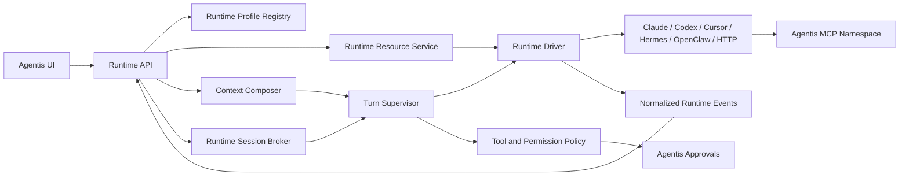

# Agentis Runtime-Native Experience 10X Plan

*Implementation plan for making every connected runtime feel native inside
Agentis. Code-grounded against the repository and the live Hermes failure on
2026-06-12.*

## 1. Executive Decision

Agentis currently has adapters, but it does not yet have a complete runtime
integration layer.

The immediate Hermes failure is not caused by prompt size. Agentis starts a
Hermes ACP turn, receives no bytes while the remote model is waiting, interprets
that silence as an idle process, and cancels the turn exactly at the configured
240-second timeout. Increasing the timeout from 90 seconds to 240 seconds only
moved the deterministic failure boundary.

The broader experience is limited for the same architectural reason: Agentis
treats a runtime mainly as a command that can answer a prompt. A real runtime is
a profile with identity, instructions, models, authentication, tools, skills,
memory, sessions, permissions, configuration, and lifecycle.

The product decision is:

> Agentis must integrate runtime profiles and sessions, not merely invoke
> runtime binaries.

The work below replaces guessed metadata, one-shot processes, generic
instruction files, and transport-specific behavior with a truthful,
runtime-owned contract.

## 2. North Star

Connecting an existing runtime to Agentis should preserve what makes that
runtime valuable:

- Its actual profile and configuration are detected.
- Its real model and provider are shown, with source and effective state.
- Its native instructions, rules, personality, skills, memory, and sessions are
  visible according to the runtime's own semantics.
- Agentis identity and organizational context are added as a controlled overlay,
  not written destructively into user-owned files.
- Conversations resume the correct runtime session and never leak into another
  Agentis conversation.
- The runtime stays warm when useful.
- Runtime tools and Agentis tools coexist.
- Permission requests are governed by Agentis instead of silently allowed.
- Slow provider inference remains visibly alive and is never mislabeled as an
  idle process.
- Agentis adds no meaningful latency beyond the runtime's native baseline.

For a user, Hermes in Agentis should feel like Hermes with Agentis capabilities.
The same standard applies to Claude Code, Codex, Cursor, OpenClaw, and HTTP
runtimes.

## 3. Verified Problems

### 3.1 The 240-second Hermes failure is a false idle timeout

`HermesAgentAdapter.chat()` creates a watchdog from the model-round timeout and
refreshes it only when the ACP child writes to stdout or stderr. Hermes can be
legitimately silent while a remote provider queues or computes a response. The
watchdog therefore cancels a healthy outstanding `session/prompt`.

Current failure:

1. ACP starts.
2. Agentis initializes the runtime and creates a session.
3. Agentis sends `session/prompt`.
4. The provider produces no ACP bytes while waiting.
5. At exactly 240 seconds, Agentis reports "no activity" and cancels.

Silence during inference is not evidence that the process is idle.

### 3.2 Hermes is cold-started for every message

Each call to `HermesAgentAdapter.chat()`:

1. Creates a new `AcpClient`.
2. Spawns `hermes acp`.
3. Initializes ACP.
4. Creates a new Hermes session.
5. Registers MCP servers.
6. Selects a model.
7. Sends one prompt.
8. Disposes the process.

Hermes v0.16.0 supports `session/load` and `session/resume`, but Agentis's ACP
client implements only `session/new`. The existing `#sessionId` therefore does
not provide durable conversation continuity.

### 3.3 Session ownership is wrong in other CLI adapters

Claude Code and Cursor keep one mutable `#sessionId` on the adapter instance and
resume it for later calls. That session is not keyed by Agentis conversation,
task, or execution mode. Two conversations can inherit the same runtime history.

Session identity belongs to a session broker keyed by:

```text
(workspaceId, agentId, conversationId, executionMode)
```

Workflow runs and one-off tasks need their own explicit keys.

### 3.4 The Instructions UI is not a runtime resource system

`agentInstructionFiles.ts` uses a hardcoded filename list. For Hermes it exposes
a generated per-agent `AGENTS.md` plus `AGENTS.md` and `HERMES.md` under the
runtime home. It does not expose the Hermes resources that actually define the
runtime:

- `SOUL.md`
- `config.yaml`
- `memories/MEMORY.md` and other memory resources
- `skills/`
- `plugins/`
- `sessions/`
- profile metadata
- enabled and disabled tools

The Hermes home is platform- and profile-dependent. On this Windows installation
the effective `HERMES_HOME` is:

```text
C:\Users\antar\AppData\Local\hermes
```

Agentis falls back to `~/.hermes` when `HERMES_HOME` is not present in the API
process, rather than asking the runtime which profile is effective.

The UI's "new file" action also creates keys such as `platform:custom.md`, but
every `platform:*` key writes to the same `agents.instructions` database column.
These are not real separate files and disappear back into one `agentis.md` after
reload.

### 3.5 Agentis and the operator can overwrite each other

Hermes chat calls `syncHarnessAgentInstructions()` before every turn. The
adapter holds an instruction snapshot captured when it was registered.

This creates two defects:

- Updating `agents.instructions` does not necessarily refresh the live adapter.
- Editing the generated Hermes `AGENTS.md` directly can be undone by the next
  chat, which writes the adapter's stale snapshot back to disk.

There must be one owner for each resource, optimistic concurrency for edits, and
an explicit synchronization direction.

### 3.6 Identity and context are flattened and duplicated

`ChatSessionExecutor` calls `buildOrchestratorSystemPrompt()` for orchestrators,
managers, and workers. Role-aware identity text has improved, but universal
orchestrator behavior is still appended to every role.

Agent instructions can be delivered twice:

- Written to a runtime-native `AGENTS.md`.
- Embedded again in the Agentis system prompt.

ACP then receives the complete history flattened into one text prompt instead of
preserving typed context layers. The result is hard to reason about and easy to
contradict.

### 3.7 Runtime and model state are often guessed

The current runtime context contract is too small. Several adapters return
placeholder health or model information:

- Claude Code exposes a plausible hardcoded catalog.
- Codex exposes no models from its adapter.
- Hermes knows its real ACP model catalog only after the first chat.
- `runtimeModels.ts` adds fallback model IDs that can disagree with the runtime.
- A configured model can exist in both `agents.runtimeModel` and
  `agents.config.model`.

The live Hermes agent has no configured runtime model, so Hermes silently uses
its own default, currently `stepfun/step-3.7-flash:free`. Agentis presents
`hermes-auto`, which is not the effective model.

### 3.8 Tool ownership and permissions are inconsistent

Agentis infers tool-loop ownership from adapter capabilities, but Hermes runs its
own native MCP loop even when the executor sends `toolMode: caller_loop`.

The ACP client currently auto-selects an allow permission option. Runtime
permission requests are not surfaced through Agentis approvals. This bypasses
the governance layer users expect Agentis to provide.

Claude Code's strict MCP configuration and Codex's ignored user configuration
can also remove a user's existing runtime-native tools. Agentis should add its
tool namespace without silently replacing the rest of the runtime profile.

### 3.9 There is no adapter conformance standard

Tests cover happy paths with immediate fake activity. They do not prove:

- Long silent inference survives.
- Phase-specific deadlines work.
- Processes and sessions are reused.
- Conversations remain isolated.
- Runtime resources are detected correctly on each OS.
- Instruction edits cannot be overwritten.
- Permission requests reach Agentis approval policy.
- The effective model equals the selected model.

Without a conformance kit, adapters can claim the same capability while
providing materially different behavior.

## 4. Target Architecture



### 4.1 Runtime Profile Registry

Owns detection and effective runtime state:

- Binary and version
- Runtime home and selected profile
- Authentication/provider state
- Current/default model
- Model catalog
- Native tools and MCP servers
- Resource manifest
- Session capabilities
- Concurrency limits
- Last probe result and latency

Every field includes provenance:

```ts
type RuntimeValue<T> = {
  value: T;
  source: 'runtime' | 'profile' | 'agent_config' | 'workspace_policy' | 'fallback';
  observedAt: string;
  verified: boolean;
};
```

Fallback values may keep the UI usable, but must never be presented as detected
runtime truth.

### 4.2 Runtime Resource Service

Replaces hardcoded instruction filenames with runtime-provided descriptors:

```ts
interface RuntimeResourceDescriptor {
  id: string;
  kind:
    | 'identity'
    | 'instructions'
    | 'config'
    | 'memory'
    | 'skill'
    | 'plugin'
    | 'session'
    | 'tool_config'
    | 'secret_reference'
    | 'generated_overlay';
  path?: string;
  scope: 'runtime' | 'profile' | 'workspace' | 'project' | 'agent';
  origin: 'runtime' | 'user' | 'agentis';
  editable: boolean;
  sensitive: boolean;
  format: 'markdown' | 'yaml' | 'json' | 'toml' | 'directory' | 'database' | 'opaque';
  loadPolicy: 'startup' | 'session' | 'turn' | 'on_demand';
  reloadPolicy: 'automatic' | 'new_session' | 'restart_required';
  checksum?: string;
  updatedAt?: string;
  effective: boolean;
}
```

Writes require the last observed checksum. A changed checksum returns a conflict
instead of overwriting external edits.

Secrets are represented only as redacted references and health state. Agentis
never reads or returns plaintext secret files through the resource API.

### 4.3 Runtime Session Broker

Owns process and session lifecycle independently from adapters:

- Warm process pool per runtime profile
- Session mapping per Agentis conversation or execution
- Runtime-specific `new`, `load`, `resume`, and close behavior
- Per-runtime concurrency and queueing
- Idle eviction
- Crash detection and controlled recovery
- Session invalidation when profile or model changes require it
- No shared mutable session ID on an adapter singleton

Suggested durable record:

```text
runtime_sessions
  id
  workspace_id
  agent_id
  conversation_id
  execution_mode
  runtime_profile_id
  runtime_session_id
  process_generation
  selected_model
  status
  last_used_at
  created_at
  updated_at
```

The process handle remains in memory. The runtime session mapping is durable so
Agentis can attempt `load` or `resume` after an API restart.

### 4.4 Phase-Aware Turn Supervisor

One generic idle timeout must be removed. A turn has explicit phases:

```text
queued
spawning
handshaking
opening_session
applying_configuration
awaiting_first_event
streaming
awaiting_tool
awaiting_permission
finishing
completed | failed | canceled
```

Each phase has the correct deadline:

| Phase | Deadline behavior |
|---|---|
| Spawn | Short startup timeout |
| Handshake | Short protocol timeout |
| Session open/load | Bounded protocol timeout |
| Awaiting first event | Provider/model SLA, not process-idle timeout |
| Streaming | Stream-gap timeout after first event |
| Tool | Tool-specific deadline |
| Permission | Approval deadline or explicit indefinite wait policy |
| Whole turn | Configurable hard ceiling |

The UI must show the real phase. During a silent model wait it should say
"Waiting for the model" and include elapsed time, selected model, provider, and a
working Cancel action.

Typed terminal failures replace generic strings:

```text
spawn_failed
authentication_failed
handshake_timeout
session_open_failed
model_rejected
first_event_timeout
stream_stalled
tool_failed
permission_expired
runtime_exited
hard_deadline
canceled
```

### 4.5 Context Composer

The system prompt becomes a typed composition with explicit precedence:

1. Security and workspace policy
2. Agent identity
3. Organizational role and domain charter
4. Agentis generated overlay
5. Runtime-native identity and instructions
6. Project/workspace instructions
7. Relevant memory and knowledge
8. Conversation history
9. Current user request

Rules:

- Build role-specific behavior for orchestrator, manager, and worker.
- Do not use the orchestrator prompt builder as a universal prompt builder.
- Do not inject the same instruction text through two channels.
- Preserve runtime-native semantics whenever the protocol supports them.
- Show an "Effective context" preview with source, precedence, token cost, and
  reload behavior.
- Include real domain data: Space charter, ownership, manager, reports,
  permissions, tools, budgets, and relevant resources.

The Agentis overlay is generated and read-only. User-owned runtime files remain
user-owned.

### 4.6 Tool and Permission Bridge

Tool-loop ownership is negotiated explicitly:

```ts
type ToolLoopOwnership = 'runtime_native' | 'agentis_native' | 'hybrid';
```

The runtime driver reports what it can support. The session broker selects a
mode, and the turn supervisor enforces it.

Runtime permission requests become normalized Agentis approval requests. Policy
may auto-approve low-risk actions, but the ACP transport must not auto-allow
permissions by itself.

Runtime-native MCP servers are merged with the Agentis MCP namespace according
to a visible profile policy:

- `native_profile`: preserve user runtime configuration and add Agentis.
- `managed_isolated`: use an Agentis-controlled isolated profile.
- `custom`: explicit include/exclude rules.

The UI shows the exact effective tool catalog and any name conflicts.

## 5. Runtime Driver Contract

Extend the adapter layer with a runtime lifecycle contract. It can be added
incrementally to `AgentAdapter`; a parallel incompatible abstraction is not
required.

```ts
interface RuntimeDriver {
  probe(): Promise<RuntimeProbe>;
  describeRuntime(): Promise<RuntimeDescriptor>;

  listResources(): Promise<RuntimeResourceDescriptor[]>;
  readResource(id: string): Promise<RuntimeResourceContent>;
  writeResource(
    id: string,
    content: string,
    expectedChecksum: string,
  ): Promise<RuntimeResourceWriteResult>;

  openSession(input: RuntimeSessionOpenInput): Promise<RuntimeSessionHandle>;
  sendTurn(
    session: RuntimeSessionHandle,
    input: RuntimeTurnInput,
  ): AsyncIterable<RuntimeEvent>;
  cancelTurn(session: RuntimeSessionHandle): Promise<void>;
  closeSession(session: RuntimeSessionHandle): Promise<void>;

  applyConfiguration(
    patch: RuntimeConfigurationPatch,
  ): Promise<RuntimeConfigurationResult>;
}
```

Every driver must report capabilities truthfully:

- Session new/load/resume/list
- Streaming event types
- Model list/select
- Native tool loop
- MCP merge support
- Permission callback support
- Resource read/write/watch
- Config reload behavior
- Maximum safe concurrency

Unsupported features stay unsupported in the UI. Agentis must not emulate
support with guessed values.

## 6. Runtime-Specific Integration

### 6.1 Hermes

- Detect effective `HERMES_HOME` and active profile by probing Hermes, not by
  reconstructing paths in Agentis.
- Surface `SOUL.md`, safe `config.yaml` sections, memories, skills, plugins, and
  session metadata.
- Keep one warm ACP process per active profile within concurrency limits.
- Add ACP `session/load` and `session/resume`.
- Map each Agentis conversation to its own Hermes session.
- Use the model catalog and current model returned by ACP.
- Do not write Agentis identity into a user-owned Hermes file.
- Remove the prompt-phase idle watchdog.
- Bridge ACP permission requests to Agentis policy.
- Preserve existing Hermes MCP servers and add the Agentis MCP namespace.

### 6.2 Claude Code

- Probe the installed CLI version, authentication, effective model, and config
  directories.
- Surface the effective `CLAUDE.md` hierarchy and safe settings/plugin metadata.
- Preserve user MCP configuration in native-profile mode.
- Key resume IDs by Agentis conversation, never by adapter instance.
- Replace hardcoded model catalogs with runtime or provider-backed discovery
  labeled by provenance.
- Verify the effective model after selection.

### 6.3 Codex

- Detect `CODEX_HOME`, profile, auth state, version, model, reasoning effort,
  service tier, AGENTS hierarchy, rules, skills, and plugins.
- Preserve user configuration in native-profile mode. Use
  `--ignore-user-config` only for an explicitly isolated managed profile.
- Keep Codex threads isolated by Agentis conversation.
- Surface real model and configuration values instead of an empty adapter model
  catalog plus unrelated fallbacks.

### 6.4 Cursor

- Discover user and project rules, skills, profile/config state, and available
  session behavior.
- Key resume IDs by conversation.
- Report limitations honestly when the CLI does not expose a capability.
- Keep project context rooted in the configured workspace instead of a generic
  runtime home.

### 6.5 OpenClaw

- Treat the gateway as a remote runtime profile.
- Add a descriptor/resource endpoint for models, tools, profile, sessions, and
  safe configuration.
- Persist remote session IDs per Agentis conversation.
- Normalize gateway progress, permission, tool, and failure events.
- Use gateway health details instead of a boolean placeholder.

### 6.6 HTTP

Define an optional standard discovery endpoint:

```text
GET /.well-known/agentis-runtime
```

It returns a signed or authenticated runtime descriptor with:

- Version and implementation
- Models and current model
- Capabilities
- Resource endpoints
- Session semantics
- Event transport
- Tool ownership
- Permission callback support

Legacy HTTP agents continue to work with a minimal declared contract, clearly
marked as unverified.

## 7. Delivery Plan

### Phase 0: Stop the Bleeding

**Goal:** Fix the live Hermes failure and prevent destructive instruction
behavior before broader architecture work.

Estimated effort: 2-3 engineering days.

Deliverables:

- Replace Hermes's prompt-phase idle timeout with:
  - startup/handshake deadlines,
  - first-event deadline,
  - post-first-event stream-gap deadline,
  - overall hard ceiling.
- Show "Waiting for model" instead of "no activity."
- Include effective provider/model and elapsed time in the turn status.
- Make Cancel terminate the outstanding ACP prompt and update the UI
  immediately.
- Stop rewriting generated `AGENTS.md` on every turn.
- Refresh or reconstruct adapters when instruction/config state changes.
- Remove fake multi-file `platform:*` creation until real resource storage
  exists.
- Detect Hermes home from effective environment/runtime probe.
- Show a warning when no model is selected and display the actual runtime
  default.
- Add regression tests for a silent ACP prompt lasting longer than 240 seconds
  in simulated time.

Exit criteria:

- The supplied Hermes "Hi" scenario does not fail at 240 seconds.
- A legitimate first response after 241 seconds is accepted.
- A truly stuck handshake still fails quickly with a typed error.
- Editing Agentis instructions cannot be overwritten by a stale adapter.

### Phase 1: Runtime Truth Foundation

**Goal:** Replace guessed runtime state and hardcoded instruction discovery.

Estimated effort: 5-7 engineering days.

Deliverables:

- Add `RuntimeDescriptor`, `RuntimeValue`, and
  `RuntimeResourceDescriptor` types.
- Add runtime probe and resource methods to the adapter contract.
- Add runtime profile registry and cached probe results.
- Implement Hermes and Codex profile/resource discovery first.
- Consolidate model selection into one canonical field and migrate legacy
  `config.model` values.
- Add provenance to model/config APIs.
- Replace placeholder health checks with real probes.
- Add checksum-based resource writes and secret redaction.

Exit criteria:

- Agentis shows the runtime's actual version, home/profile, model, provider, and
  resource list.
- No fallback model appears as detected truth.
- External file edits are visible after refresh and conflicting saves are
  rejected.

### Phase 2: Persistent Session Broker

**Goal:** Make conversations fast, resumable, and isolated.

Estimated effort: 6-9 engineering days.

Deliverables:

- Add `runtime_sessions` persistence.
- Implement process pooling and idle eviction.
- Implement ACP `session/load` and `session/resume`.
- Migrate Hermes chat to the broker.
- Migrate Claude Code and Cursor resume handling from adapter-global state.
- Add crash recovery and process-generation tracking.
- Add per-runtime queue and concurrency policy.
- Prewarm connected runtimes after health validation.

Exit criteria:

- A second Hermes message reuses the warm ACP process.
- Two Agentis conversations never share a runtime session.
- An API restart can resume or explicitly recreate the right runtime session.
- Process crashes recover without attaching the conversation to another
  session.

### Phase 3: Native Context and Resource Experience

**Goal:** Make instructions and identity understandable, complete, and safe.

Estimated effort: 6-8 engineering days.

Deliverables:

- Replace `buildOrchestratorSystemPrompt()` usage with a role-aware
  `ContextComposer`.
- Introduce the read-only Agentis overlay.
- Remove duplicate instruction injection.
- Build the Runtime Resources UI:
  - effective context preview,
  - identity/instruction files,
  - safe config editor,
  - skills and plugins,
  - memory surfaces,
  - sessions,
  - reload status and provenance.
- Add filesystem/runtime watchers where supported.
- Implement Hermes, Claude Code, Codex, and Cursor resource manifests.

Exit criteria:

- A Hermes manager identifies as the configured Agentis manager for its real
  Space while retaining its Hermes personality and skills.
- `SOUL.md` edits made in Agentis affect the next eligible Hermes turn according
  to Hermes reload semantics.
- The UI can explain exactly why each instruction is effective.
- No user-owned file is silently replaced by Agentis.

### Phase 4: Tools, MCP, and Governance

**Goal:** Make runtime-native tools and Agentis governance coexist.

Estimated effort: 5-7 engineering days.

Deliverables:

- Add explicit tool-loop ownership negotiation.
- Route ACP permission requests into Agentis approvals.
- Remove transport-level auto-allow.
- Add native-profile, managed-isolated, and custom tool configuration modes.
- Merge runtime MCP and Agentis MCP catalogs with conflict reporting.
- Apply one policy path to tools regardless of whether they arrived through
  MCP, adapter-native calls, or Agentis execution.
- Add complete tool activity and approval events to the chat timeline.

Exit criteria:

- A risky Hermes tool request pauses in Agentis for approval.
- A denied request is returned to Hermes as denied, without hanging.
- Existing runtime MCP servers remain available in native-profile mode.
- Audit records identify runtime, session, tool, arguments, decision, and actor.

### Phase 5: Conformance, Performance, and Rollout

**Goal:** Hold every runtime to the same product standard.

Estimated effort: 5-7 engineering days.

Deliverables:

- Add an adapter conformance kit.
- Add deterministic fake runtimes for slow inference, crashes, permissions,
  model rejection, and session resume.
- Add optional real-runtime smoke suites.
- Add direct-runtime versus Agentis benchmark tooling.
- Add runtime diagnostics UI and downloadable support bundle with secret
  redaction.
- Roll out behind per-runtime feature flags, then make the new path default.
- Deprecate hardcoded instruction discovery and fallback model catalogs.

Exit criteria:

- Every supported runtime publishes a conformance report.
- Runtime-native mode is enabled only after mandatory tests pass.
- Performance budgets are measured in CI or scheduled benchmark runs.
- Legacy behavior can be disabled without data loss.

## 8. Performance Budgets

Agentis overhead must be measured against the same runtime, model, profile,
prompt, and machine used directly.

Target budgets:

| Metric | Target |
|---|---|
| Warm session acquisition | under 100 ms p95 |
| Agentis local work before prompt dispatch | under 250 ms p95 |
| First visible status after send | under 300 ms p95 |
| Additional TTFT over direct runtime | lower of 500 ms or 10% p95 |
| Warm-turn process spawns | zero |
| Duplicate MCP registration on warm turn | zero |
| Conversation/session cross-contamination | zero |
| False idle cancellation during valid inference | zero |

Telemetry must decompose:

- Queue time
- Process startup
- Protocol handshake
- Session open/load
- Context composition
- MCP registration
- Provider wait to first event
- Streaming duration
- Tool and approval time
- Finalization

Do not collapse these into one "latency" number.

## 9. Conformance Test Matrix

Every driver must pass the applicable tests:

| Area | Required proof |
|---|---|
| Detection | Finds correct binary, version, home, and active profile |
| Models | Lists actual models or reports unsupported; applies and verifies selection |
| Resources | Lists real resources with provenance, redaction, checksums, and reload policy |
| Sessions | Creates, resumes, isolates, cancels, closes, and recovers sessions |
| Liveness | Survives long silent inference; detects dead startup and stalled stream |
| Streaming | Normalizes text, thought, tool, usage, and terminal events |
| Tools | Enforces declared loop ownership and prevents duplicate execution |
| Permissions | Routes approval requests through Agentis policy |
| Context | Applies precedence once and exposes effective-context diagnostics |
| Concurrency | Enforces the runtime's safe parallelism |
| Platforms | Passes Windows, macOS, and Linux path/profile fixtures where supported |
| Security | Never exposes plaintext secrets or writes outside declared resources |

Mandatory regression scenarios:

1. Hermes emits no ACP output for 241 seconds, then answers.
2. Hermes handshake hangs and fails under the startup deadline.
3. Hermes streams one token, then stalls past the stream-gap deadline.
4. Two simultaneous conversations use different Hermes sessions.
5. The API restarts and loads the correct persisted Hermes session.
6. An external `SOUL.md` edit conflicts with an open Agentis editor.
7. An instruction update is not overwritten by a stale adapter.
8. A model rejected by the runtime is not persisted as effective.
9. A permission request is approved, denied, and expired in separate tests.
10. Existing runtime MCP tools remain present after Agentis MCP is mounted.

## 10. API and UI Surface

Suggested endpoints:

```text
GET    /v1/agents/:id/runtime
POST   /v1/agents/:id/runtime/probe
GET    /v1/agents/:id/runtime/resources
GET    /v1/agents/:id/runtime/resources/:resourceId
PUT    /v1/agents/:id/runtime/resources/:resourceId
GET    /v1/agents/:id/runtime/sessions
POST   /v1/agents/:id/runtime/sessions/:sessionId/resume
DELETE /v1/agents/:id/runtime/sessions/:sessionId
PATCH  /v1/agents/:id/runtime/config
GET    /v1/agents/:id/runtime/effective-context
GET    /v1/agents/:id/runtime/tools
```

Agent detail navigation:

- Overview
- Identity
- Runtime
- Resources
- Models and configuration
- Tools and permissions
- Sessions
- Diagnostics

The Runtime header should always answer:

- What is connected?
- Which profile is active?
- Which model/provider is effective?
- Is it healthy?
- Is the process warm?
- Which session is this conversation using?
- What is Agentis adding?

## 11. Migration and Compatibility

- Preserve existing `agents.instructions` as the first Agentis overlay content.
- Stop presenting it as a collection of files.
- Import existing runtime session IDs only when their conversation ownership is
  known; otherwise start a new isolated session.
- Migrate `config.model` into the canonical runtime model field and retain a
  read-only compatibility view during rollout.
- Keep legacy adapter chat paths behind flags until each driver passes
  conformance.
- Never move or rewrite runtime homes during migration.
- Back up a user-owned resource before the first Agentis write when the runtime
  does not provide transactional writes.

## 12. Implementation Order

The dependency order is:

```text
Phase-aware deadlines
  -> Runtime truth contract
  -> Session broker
  -> Context/resource system
  -> Tool/permission bridge
  -> Conformance and default rollout
```

Do not start with a large UI rewrite. The UI cannot be truthful until runtime
profiles, resources, sessions, and provenance exist in the API.

Do not implement separate bespoke orchestration logic inside every adapter. The
driver owns runtime-specific translation; the broker, supervisor, context
composer, policy engine, and resource service own shared product behavior.

## 13. Definition of Done

This initiative is complete only when all of the following are true:

- The live Hermes scenario no longer fails at 90, 240, or another arbitrary
  silence boundary.
- Hermes, Claude Code, Codex, Cursor, OpenClaw, and HTTP integrations expose
  truthful capabilities and state.
- Warm runtimes remain warm across turns.
- Runtime sessions are isolated by Agentis conversation.
- The actual runtime instruction/resource graph is visible.
- Agentis identity and organizational intelligence are composed without
  destructive file writes or duplicate prompt injection.
- Model selection is validated and the effective model is visible.
- Runtime-native and Agentis tools coexist under one approval and audit policy.
- Every adapter passes the conformance suite.
- Benchmarks show Agentis stays within the runtime-native latency budget.

At that point, runtimes will no longer feel attached to Agentis. They will feel
like first-class execution environments inside it.
