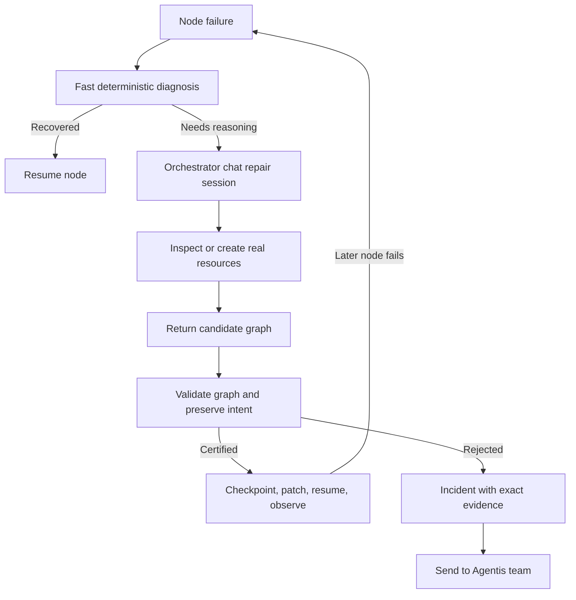

# Self-Healing 10x Plan

## Product promise

Agentis should make every workflow failure reach a useful, visible outcome:

- recover and continue when a grounded repair exists;
- pause with an exact unblock action when an external constraint remains;
- escalate with a complete incident package when autonomous repair is not safe.

This does not mean inventing a successful result when a provider, credential, or
external system remains unavailable. It means no silent dead ends, no blind
retry loops, and no loss of the workflow's original intent.

## Current Foundation

The repair path is chat-native. On a self-healable failure, Agentis:

1. Performs bounded deterministic recovery for a lost runtime or a known output
   contract issue.
2. Invokes the orchestrator through `ChatSessionExecutor`, with the same
   registered chat-tool infrastructure and the full creation/inspection catalog.
   It can inspect, create agents, create capabilities, create workflows, and
   create other internal resources needed for the repair. The engine retains
   exclusive control of live-run patching and resume.
3. Streams thoughts, activity, tool calls, and tool results into the run feed.
4. Accepts only a complete replacement graph, then validates it, checks
   intent preservation, checkpoints it, applies it, and resumes from the
   smallest failed frontier.
5. Stops on duplicate plans, attempt limits, or ungrounded changes and exposes
   the incident for escalation.

## Architecture

## Delivery Roadmap

### Phase 1: Fast, visible recovery

- Keep deterministic diagnosis under a five-second budget before starting the
  orchestrator session.
- Persist a repair timeline with diagnosis, tools used, graph diff, checkpoint,
  cost, and resume target.
- Treat quota, billing, and provider outages as recoverable routing incidents:
  try a grounded reroute first; otherwise pause with a direct operator action.

### Phase 2: Repair sessions, not one-shot fixes

- Give each incident a durable repair session id, transcript, tool-call ledger,
  and repair budget.
- Let the orchestrator observe the resumed node and continue the same session
  when a downstream failure occurs.
- Add per-tool policy: internal resource creation may be autonomous; external
  sends, destructive changes, and credential scope changes require approval.

### Phase 3: Verify before declaring success

- Require a node-specific acceptance check after a repair, not just a successful
  process exit.
- Add canary execution for risky structural changes and rollback on regression.
- Capture stable repair lessons only after repeated verified success.

### Phase 4: Operational resilience

- Classify failures into runtime, quota, credential, rate limit, schema,
  dependency, and logic categories with tailored fallback candidates.
- Track recovery rate, time to repair, repeat-failure rate, plan rejection
  rate, and escalation reasons.
- Add replay fixtures for real incidents and a chaos suite for adapter exits,
  no-credit errors, expired credentials, partial writes, and delayed callbacks.

### Phase 5: Human handoff that is actually useful

- Provide a `Send to Agentis team` action when the repair budget is exhausted
  or the change cannot be certified.
- Include the failing node, run id, error lineage, repair transcript, tool
  results, graph revisions, checkpoint, and a reproducible replay payload.
- Keep the run paused and resumable rather than marking it irretrievably dead.

## Non-Negotiable Invariants

- Preserve the workflow goal, input contract, and declared output meaning.
- Never fabricate outputs merely to satisfy a contract.
- Never modify completed or active nodes during a repair.
- Bound plans, tool calls, elapsed time, and spend.
- Deduplicate repair fingerprints and stop repeated ineffective attempts.
- Make every repair decision observable in the same run activity experience as
  chat.
