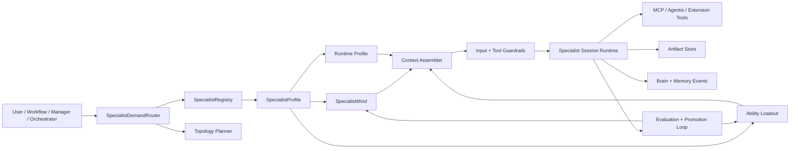

# Specialists 10x Architecture Plan

Date: 2026-06-03
Status: Planning draft
Scope: Agentis specialist creation, mind + abilities composition, runtime routing, UI/UX, data model, governance, and rollout

## Source Note

This revision incorporates `C:\Users\antar\Downloads\specialists.txt` after it became available. The recovered draft correctly identifies the immediate implementation blocker: Agentis currently has two interleaved role systems, and the engine still depends on hardcoded specialist role lookup in several dispatch paths.

## Executive Thesis

Agentis should stop treating specialists as pre-baked worker roles and start treating them as composable, inspectable, on-demand expert systems.

Today, Agentis has the right ingredients: real specialist agents, workspace Brain, personal Brain, persistent sessions, ability compilation, role-scoped tools, adapter capability routing, and workflow swarms. The gap is that these ingredients are still loosely coupled. A "specialist" is mostly a role string plus an agent row plus optional abilities. To 10x specialist power, Agentis needs a first-class specialist architecture where a specialist is built from:

- Identity: name, mission, responsibilities, boundaries, reporting line.
- Mind: curated source material, multimodal references, memories, beliefs, examples, style references, policies, provenance, freshness, and embeddings.
- Abilities: compiled behavioral units with rules, examples, knowledge, model preferences, gates, env bindings, and slash/tool modes.
- Tools: MCP tools, native Agentis tools, extension tools, channel affordances, and workspace resources.
- Runtime profile: model policy, context budget, autonomy level, session strategy, artifact policy, cost ceiling, guardrails, and evaluation rubric.
- Demand router contract: when to activate, when to build, when to delegate, when to swarm, and when to decline.

The north star: a user can say, "Build me a frontend architect that understands these design references, this codebase, our visual taste, and our component rules," then Agentis creates a specialist whose mind can ingest text, images, code, docs, prior runs, and abilities, and whose execution can be requested on demand by orchestrators, managers, workflows, chat, or other specialists.

## External Architecture Research, June 2026

The plan is grounded in current agent architecture direction:

- Anthropic's multi-agent research architecture uses a lead agent that plans and creates specialized subagents in parallel, and stresses that subagents need clear objectives, output formats, tool/source guidance, and boundaries. It also warns that multi-agent systems can cost far more tokens and are best for high-value, parallelizable tasks. Source: [Anthropic Engineering, "How we built our multi-agent research system", Jun 13 2025](https://www.anthropic.com/engineering/multi-agent-research-system).
- OpenAI's Agents SDK frames agents as applications that plan, call tools, collaborate across specialists, and keep enough state for multi-step work. It places orchestration, tool execution, approvals, state, tracing, and evaluation inside the application runtime rather than inside a prompt alone. Source: [OpenAI Agents SDK docs](https://developers.openai.com/api/docs/guides/agents).
- MCP's official tool spec defines model-controlled tools with schema metadata and explicitly recommends UI clarity, visual tool invocation indicators, and human confirmation for tool calls that require trust. Source: [Model Context Protocol tools spec, 2025-06-18](https://modelcontextprotocol.io/specification/2025-06-18/server/tools).
- A2A describes agent cards, skills, task lifecycle, streaming, push notifications, artifacts, and collaboration without exposing internal memory or tools. Agentis should align specialist cards with this shape even before full external A2A exposure. Source: [Agent2Agent Protocol specification](https://google-a2a.github.io/A2A/specification/).
- Azure's AI agent patterns recommend decomposing complex problems into specialized units of work or knowledge, with sequential, concurrent, group-chat, handoff, and magnetic routing patterns. Source: [Microsoft Azure Architecture Center, AI agent orchestration patterns](https://learn.microsoft.com/en-us/azure/architecture/ai-ml/guide/ai-agent-design-patterns).
- LangGraph's TypeScript guide distinguishes supervisor, swarm, hierarchical, and sequential patterns. Agentis should expose these as runtime topologies, not just node kinds. Source: [LangGraph TypeScript multi-agent guide](https://langgraphjs.guide/multi-agent/).
- OpenAI guardrail docs distinguish input, output, and tool guardrails, and note that delegated specialists need tool-level guardrails rather than only agent-level checks. Source: [OpenAI Agents SDK guardrails docs](https://openai.github.io/openai-agents-python/guardrails/).
- Recent 2026 research argues that enterprise multi-agent systems require orchestration, policy enforcement, state management, quality operations, MCP for tools/context, and A2A for delegation. Source: [arXiv 2601.13671](https://arxiv.org/abs/2601.13671).
- Recent 2026 harness research finds recurring dimensions in agent systems: subagent architecture, context management, tool systems, safety mechanisms, and orchestration. It also observes that MCP and plugin-oriented extensions are emerging while high-assurance audit remains rare. Source: [arXiv 2604.18071](https://arxiv.org/abs/2604.18071).
- Context engineering research frames context as the agent's operating system and proposes relevance, sufficiency, isolation, economy, and provenance as context quality criteria. Source: [arXiv 2603.09619](https://arxiv.org/abs/2603.09619).

## Current Agentis Architecture Audit

Agentis is further along than a simple "workers" model. The current codebase already includes several specialist-grade foundations:

- Built-in specialist role library: `packages/core/src/types/specialist.ts` defines `planner`, `researcher`, `coder`, `reviewer`, `analyst`, `writer`, `monitor`, `architect`, `debugger`, and `deployer`, each with prompt, tags, model hint, and role-scoped tools.
- Specialist materialization: `apps/api/src/services/specialistAgents.ts` creates real `agents` rows for built-in roles and resolves `agent_task.agentRole` to an agent id.
- Workflow engine integration: `apps/api/src/engine/WorkflowEngine.ts` resolves role to agent, injects role prompt, workspace context, Brain, personal Brain, agent memory, abilities, and dispatches through adapters.
- Agent tool loop: `WorkflowEngine.#maybeRunAgentToolLoop` can run bounded role-scoped ReAct loops using the role tool manifest.
- Persistent sessions: `apps/api/src/services/agentSessionRuntime.ts` supports delegation, suspend/resume, approvals, scratchpad communication, memory blocks, compaction, and role tools.
- Abilities: `packages/core/src/types/ability.ts`, `apps/api/src/services/abilityService.ts`, and `apps/api/src/services/abilityCompilerService.ts` define compiled behavioral specialization units with specs, rules, examples, knowledge, env gates, preferred models, compile lifecycle, Brain indexing, export/import, and dispatch-time XML context blocks.
- Ability routing: `WorkflowEngine.#buildAbilityBlock` collects pins, scores workspace abilities with embeddings, gates by environment/affordance/OS, injects up to a token budget, resolves env secrets, records Brain usage events, and never blocks dispatch on ability failure.
- Brain: `apps/api/src/services/sharedIntelligence.ts`, `packages/core/src/types/brain.ts`, and related Brain services provide workspace/scoped atoms, graph links, quality events, personal Brain grants, disputes, freshness, compression, and retrieval.
- UI: ability creation/detail pages, Agent detail ability pins, Brain views, Agents hierarchy, workflow canvas, and command/chat surfaces already exist or are in-progress.

The strongest existing primitives are useful, but their boundaries are still wrong for the desired product. A specialist should not be just an agent row with a role and abilities attached. A specialist should be a versioned expert profile that can be built, tested, routed to, observed, evolved, packaged, and reused.

## Gaps To Close

### Gap 1: Static role union instead of dynamic specialist registry

`AgentRole` is a hardcoded TypeScript union. This is good for built-ins and tests, but blocks user-defined specialists such as `frontend_architect`, `luxury_brand_art_director`, or `rails_performance_surgeon`. Built-ins should become seed templates in a registry, not the registry itself.

The recovered draft calls out the concrete failure mode: every engine path that calls `specialistForRole(role).systemPrompt` rejects unknown roles. That means 60 generated or custom on-demand specialists cannot exist until the lookup becomes registry-aware.

### Gap 2: Abilities are powerful but not yet specialist-native

Abilities currently fire into any agent based on semantic relevance or pins. That is useful, but the product goal is stronger: abilities should be ingredients of a specialist's professional DNA. A specialist should have explicit ability loadouts, suggested abilities, required abilities, optional abilities, and conflict resolution policies.

### Gap 3: Mind is not a first-class specialist asset

The Brain can store knowledge and memory, but "this specialist's mind" needs its own explicit package:

- Curated source material.
- Multimodal design/image references.
- Source provenance and licensing.
- Structured distillations.
- Confidence and freshness.
- Retrieval policy.
- Visibility grants.
- Evaluation examples.
- Relationship to workspace Brain and personal Brain.

### Gap 4: Specialist creation UX is split across Agents, Brain, and Abilities

The user intent is not "create an agent row" or "compile an ability." The intent is "build an expert." The UI needs a Specialist Studio that fuses identity, mind ingestion, abilities, tools, model/runtime choices, tests, and deployment.

The Brain page has a related scale issue today: `AgentBrainPanel` uses a simple agent dropdown. That is fine for a small fleet, but it becomes unusable if Agentis has dozens of specialists. Agent Brain should default to the orchestrator and use a searchable subject picker modal for managers and specialists.

### Gap 5: Demand routing lacks a first-class broker

Current routing happens in workflow node resolution and ability scoring. The next layer should be a `SpecialistDemandRouter` that can decide:

- Reuse an existing specialist.
- Spawn an ephemeral specialist for a run.
- Commission a durable specialist.
- Select a specialist team topology.
- Attach abilities and mind context.
- Enforce budget and guardrails.
- Explain the routing decision to the user.

### Gap 6: Specialists do not yet have A2A-style cards

Agentis needs a machine-readable specialist card that declares identity, skills, input/output modalities, tool affordances, model profile, auth requirements, artifacts, streaming support, and cost/latency expectations.

### Gap 7: Multimodal ability and mind ingestion needs to mature

`AbilityKnowledgeSourceType` already includes `image` and `audio`, but a frontend architect use case needs image-native processing:

- Vision captioning.
- OCR.
- palette extraction.
- layout analysis.
- typography detection.
- component pattern extraction.
- "taste vectors" from reference images.
- visual diff/evaluation after output.

### Gap 8: Evaluation is not central enough

Specialists should be created with evals from day one. Every specialist should have golden tasks, acceptance rubrics, regression runs, and post-run promotion back into mind/abilities.

## Target Domain Model

### Immediate role normalization decision

Do not split `agents.role` into `hierarchyRole` and `specialtyRole` in the first implementation. Keep one unified role field.

Rules:

- `orchestrator` is the workspace lead tier.
- `manager` is the domain/team coordination tier.
- `worker` is legacy terminology and should normalize to `specialist`.
- Any non-empty role that is not `orchestrator` or `manager` is a specialist functional role.
- The 10 platform roles (`planner`, `researcher`, `coder`, `reviewer`, `analyst`, `writer`, `monitor`, `architect`, `debugger`, `deployer`) become platform specialists, not a separate worker class.
- Custom roles such as `frontend_architect`, `tax_analyst`, or `seo_writer` are specialist functional roles.

Why:

- The engine already resolves specialists by role string.
- Splitting fields creates a broad schema/API/UI migration before the runtime blocker is fixed.
- The hierarchy canvas already avoids showing generic workers/specialists, which is the right product instinct when a workspace may have 50 or more specialists.
- A future `SpecialistProfile` can enrich role strings without forcing a hierarchy split.

### 1. SpecialistTemplate

A reusable blueprint. Built-ins move here.

Fields:

- `id`, `slug`, `name`, `description`, `category`
- `default_identity`
- `recommended_abilities`
- `required_tools`
- `default_runtime_profile`
- `starter_mind_sources`
- `creation_questions`
- `eval_pack`
- `version`

### 2. SpecialistProfile

The durable expert definition.

Fields:

- `id`, `workspace_id`, `template_id`
- `slug`, `name`, `title`, `description`
- `identity_prompt`, `responsibility_contract`, `boundaries`
- `status`: draft, compiling, ready, degraded, archived
- `mind_id`
- `runtime_profile_id`
- `routing_profile_id`
- `eval_profile_id`
- `version`, `created_by`, `updated_at`

### 3. SpecialistMind

The curated knowledge and preference layer for a specialist.

Fields:

- `id`, `workspace_id`, `specialist_id`
- `summary`
- `source_policy`: workspace, private, personal-brain-granted, external
- `retrieval_policy`: topK, recency, source weights, multimodal mode
- `distilled_context`: compact canonical specialist mind
- `embedding`
- `quality_score`
- `freshness_score`
- `provenance_score`
- `created_at`, `updated_at`

Related tables:

- `specialist_mind_sources`: text, URL, file, image, audio, video, repo path, workflow run, Brain atom, ability package.
- `specialist_mind_atoms`: distilled facts, preferences, rules, visual patterns, anti-patterns, examples, decisions.
- `specialist_mind_media`: image/audio/video assets with derived captions, OCR, palette, layout tokens, tags, and embeddings.
- `specialist_mind_links`: links to workspace Brain atoms, KB chunks, personal Brain grants, and ability knowledge.

### 4. SpecialistAbilityLoadout

A versioned relation between specialists and abilities.

Fields:

- `specialist_id`, `ability_id`
- `mode`: required, preferred, optional, forbidden
- `priority`
- `min_relevance_score`
- `budget_override`
- `conflict_policy`: specialist_wins, ability_wins, newest_wins, evaluator_decides
- `enabled`

This does not replace `agent_ability_pins`. Pins become compatibility mappings from an agent instance to profile/loadout behavior.

### 5. SpecialistRuntimeProfile

How the specialist executes.

Fields:

- `model_policy`: default, fallback, cheap, deep_reasoning, vision, local
- `session_policy`: stateless, persistent, per-workflow, per-user, sleep-wake
- `tool_policy`: granted tools, forbidden tools, MCP servers, extensions
- `artifact_policy`: when to write artifacts instead of returning long text
- `budget_policy`: token, dollars, time, max delegations, max depth
- `autonomy_level`: advise, draft, act_with_approval, autonomous_limited
- `guardrail_policy`: input, output, tool, data boundary, prompt-injection shield
- `observability_policy`: trace detail, privacy redaction, metrics

### 6. SpecialistCard

Agentis-native, A2A-aligned contract.

Fields:

- `name`, `description`, `version`
- `skills`: what it can do
- `modalities`: text, file, image, audio, structured data
- `capabilities`: streaming, push notifications, artifacts, state history
- `tools`: public tool capabilities, not secrets
- `auth`: required workspace grants or OAuth connections
- `cost`: typical token/tool/time ranges
- `sla`: expected latency and concurrency
- `inputs` and `outputs`: schemas or examples
- `safety`: high-impact actions and approvals
- `evals`: public benchmark score summary

### 7. SpecialistInstance

A materialized runnable agent row backed by a profile.

Fields:

- `agent_id`
- `specialist_profile_id`
- `mode`: durable, ephemeral, swarm_member, shadow_eval
- `parent_agent_id`
- `reports_to`
- `lease_expires_at`
- `last_used_at`

## Target Runtime Architecture



### SpecialistDemandRouter

Responsibilities:

- Classify the request domain, complexity, risk, modality, and parallelism.
- Score existing specialist profiles using identity embedding, mind embedding, ability embeddings, tool affordances, past performance, current availability, and cost.
- Choose topology: direct specialist, supervisor handoff, sequential pipeline, dynamic swarm, hierarchical team, or human-gated specialist.
- Decide instance type: reuse durable instance, create ephemeral instance, or commission a new durable specialist.
- Build a routing explanation: "Selected Frontend Architect because it matches React, design systems, visual reference interpretation, and has browser/file affordances."
- Emit a traceable `specialist_routed` event.

Suggested score:

```text
score =
  0.25 domain_match +
  0.20 ability_match +
  0.15 mind_relevance +
  0.15 tool_affordance_match +
  0.10 historical_quality +
  0.05 freshness +
  0.05 availability -
  0.05 estimated_cost_penalty
```

### Context Assembler

Context should be compiled like an operating system, not pasted like a scrapbook.

Assembly order:

1. Workspace constitution and safety constraints.
2. Specialist identity and responsibility contract.
3. Mission brief from caller.
4. Relevant mind atoms with provenance and freshness.
5. Ability XML blocks from required/preferred loadout and semantic matches.
6. Tool manifest and tool-use heuristics.
7. Recent session/memory summary.
8. Output contract and evaluation rubric.

Quality criteria:

- Relevance: only retrieve what applies to the mission.
- Sufficiency: include enough context to act without guessing.
- Isolation: keep private/personal/credential context scoped.
- Economy: cap tokens and prefer artifacts/references for large outputs.
- Provenance: every fact or visual reference can point back to a source.

### Execution Topologies

- Direct specialist: one specialist handles a bounded task.
- Manager-to-specialist handoff: manager delegates, awaits, integrates.
- Sequential pipeline: strategist -> specialist -> reviewer -> publisher.
- Dynamic swarm: planner spawns N specialists based on discovered task branches.
- Hierarchical team: orchestrator -> manager -> specialist squads.
- Shadow specialist: specialist runs in evaluation mode and compares output without mutating state.
- Human-gated specialist: specialist drafts or plans but high-impact action needs approval.

### Runtime Safety

- Tool guardrails are mandatory for specialists that can write files, call APIs, send messages, deploy, spend money, or touch personal data.
- Prompt-injection boundaries must be source-aware. A mind source can be trusted design guidance while a random web page cannot override platform policy.
- High-impact tools need approval policies and visible UI traces.
- Every specialist run should emit a compact "why this specialist, why these tools, why these sources" explanation.

## Mind + Abilities Refactor

### What stays

- Keep abilities as compiled behavioral specialization units.
- Keep examples, knowledge, rules, specs, tool hints, env gates, preferred model, static/compiled modes, export/import, and dispatch XML.
- Keep ability semantic pool behavior for generic tasks.

### What changes

- Add a specialist-native loadout model so abilities become part of a specialist's identity, not just random context additions.
- Add mind as a first-class object that can own sources and distilled atoms.
- Add multimodal source processing to mind and ability knowledge ingestion.
- Add eval-driven promotion from runs back into ability examples and mind atoms.
- Add conflict analysis between abilities and specialist mind.
- Add "ability prerequisites" and "ability capabilities" so the router can know when an ability requires browser, filesystem, vision, or credentials.

### Frontend architect example

User input:

```text
Create a frontend architect. Use these design screenshots, our existing React codebase, our taste notes, and these UI polish abilities.
```

Pipeline:

1. Create `SpecialistProfile(frontend_architect)`.
2. Ingest screenshots into `SpecialistMindMedia`.
3. Run vision extraction for layout, palette, density, typography, motion cues, component types, and anti-patterns.
4. Ingest repo architecture into mind sources through code search/doc extraction.
5. Attach abilities such as `design_taste_frontend`, `accessibility_reviewer`, `react_architect`, and `visual_regression_critic`.
6. Compile a specialist mind summary and ability loadout.
7. Generate eval tasks: build a component, review a UI, refactor a layout, compare against reference images.
8. Run a dry simulation and show scorecards.
9. Publish the specialist card.

## UI/UX Plan

The UI should not be a table of workers. It should feel like commissioning a world-class expert and watching their professional brain come online.

### Navigation

- Rename or augment `Agents` with a clear specialist layer.
- Add `Specialists` as a primary surface if this becomes the core product.
- Keep `Abilities` as a library, but cross-link it from Specialist Studio.
- Brain shows specialist minds as scoped intelligence nodes, not as management UI.

### Specialist Studio

Primary layout:

- Left rail: identity, mind, abilities, tools, runtime, evals, deploy.
- Main canvas: asymmetric "expert blueprint" with mind sources, ability loadout, tool permissions, and test results.
- Right inspector: selected source/ability/tool/eval with provenance, risks, and suggested fixes.

Core screens:

- Gallery: all specialists, status, domain, last used, quality, cost, available modalities.
- Commission flow: build from template, from prompt, from existing agent, from ability pack, from workflow role, or from imported specialist card.
- Mind Library: sources, visual references, extracted patterns, provenance, freshness, confidence.
- Ability Loadout: required/preferred/optional/forbidden abilities with conflicts and token budget.
- Runtime Contract: model, tools, autonomy, budget, approvals, artifacts.
- Routing Map: where this specialist is used, who can call it, when it auto-activates.
- Eval Lab: golden tasks, test runs, regressions, scorecards, prompt/mind diffs.
- Live Cast: active specialists, delegation tree, tool invocations, artifacts, cost and latency.

### Brain Page Subject Picker

Current issue:

- `UnifiedBrainPage` has scope tabs for workspace, agent, and personal.
- `AgentBrainPanel` currently uses a simple `<select>` labeled "Active Agent."
- That dropdown is acceptable for a handful of agents, but it fails when a workspace has many specialists.

Target interaction:

- Agent Brain defaults to the orchestrator, because the orchestrator is the always-on workspace brain owner.
- The header should show a subject pill, not a raw dropdown: `Agent Brain: The Brain`.
- Clicking the subject pill opens a modal/sheet picker.
- The picker has tabs: `Orchestrator`, `Managers`, `Specialists`.
- `Orchestrator` is the default tab and should usually contain one option. If there is no orchestrator, it shows a commissioning empty state.
- `Managers` shows the smaller coordination layer, grouped by domain/space.
- `Specialists` is optimized for scale: search, filters, source chips, capability chips, recent/frequently used, and virtualized results if needed.
- Selecting a subject closes the modal and reloads the map, memory, and abilities tabs for that subject.

Picker layout:

```text
Brain Subject
Select whose mind you want to inspect.

[ Orchestrator ] [ Managers ] [ Specialists ]

Search specialists, abilities, tools...

Recommended
- The Brain        orchestrator      always visible
- Marketing Lead   manager           domain: marketing
- Frontend Architect specialist       abilities: UI Taste, React Architecture

[Open selected Brain]
```

Why this is better:

- It keeps the Brain page calm by default.
- It preserves the orchestrator as the primary agent brain.
- It prevents a 50-specialist workspace from becoming a huge dropdown.
- It creates a natural place to expose specialist metadata: source, role slug, abilities, tools, quality, status, and last used.
- It matches the mental model that specialists are a library/pool, not a hierarchy-canvas crowd.

### Commission Flow

Step 1: Name the expert

- "What should this specialist be trusted to do?"
- Suggested templates based on domain.

Step 2: Feed the mind

- Drop files, images, URLs, repo paths, run outputs, notes, and Brain atoms.
- Show immediate extraction preview.
- For images: palette, typography guess, layout notes, component motifs, visual density.

Step 3: Choose abilities

- Suggested abilities based on the goal and sources.
- Required vs optional vs forbidden.
- Conflict warnings in plain language.

Step 4: Grant tools

- Start from safe read-only defaults.
- Show MCP/native/extension tools as capability groups.
- Ask for approval only when risk is meaningful.

Step 5: Test before deploy

- Run 3 to 5 generated eval tasks.
- Show outputs, score, failure mode, and "fix mind" or "fix ability" suggestions.

Step 6: Publish

- Create SpecialistCard.
- Choose visibility: private, workspace, package, hub.
- Decide auto-routing triggers.

### Live Work UX

When a specialist is requested on demand, show:

- Who requested it.
- Why this specialist was selected.
- Which mind sources and abilities were loaded.
- What tools were granted.
- What it is doing now.
- What artifacts it created.
- Whether it is waiting, sleeping, asking for approval, or done.

This closes the trust loop. If Agentis says "Frontend Architect is reviewing this," the user can inspect the exact expert, context, abilities, and output trail.

## Backend Implementation Plan

### Phase 0: Unblock custom specialist roles

Goal: make the engine accept generated and custom specialist role strings before the larger Specialist Studio exists.

Work:

- Widen `AgentRole` so custom role strings are legal while retaining autocomplete for platform roles.
- Change `isAgentRole(value)` to accept any non-empty string.
- Change `specialistForRole(role, fallback?)` so built-ins still resolve normally, but callers can provide a fallback instead of throwing.
- Add a registry-aware helper in `WorkflowEngine`, for example `#specialistDef(ctx, role)`, and replace all direct `specialistForRole(role).systemPrompt` calls.
- Wire `SpecialistAgentService` to `AgentLibraryService` so it checks existing DB rows first, then workspace volume definitions, then built-ins.
- Add cached lookups such as `AgentLibraryService.getByRoleSync(workspaceId, role)` and `writeGenerated(workspaceId, def)`.
- Add `agentis.create_specialist` for orchestrators/planners so runtime creation can write `agents/generated/<role>.md`, materialize the agent, and make `delegate_task({ role })` work immediately.
- Update orchestrator prompt/tool guidance: never delegate to a role that does not exist; create or select a specialist first.

Acceptance:

- A workflow with `agentRole: "tax_analyst"` can run after a custom library definition exists.
- The orchestrator can create `competitive_intel` at runtime and delegate to it in the next step.
- Built-in roles still behave exactly as before.
- Unknown roles fail with a helpful "create specialist first" error instead of a hardcoded role throw.

### Phase 1: Normalize specialists without breaking workers

Goal: introduce the new model while preserving existing role behavior.

Work:

- Add `specialist_templates`, `specialist_profiles`, `specialist_instances`, `specialist_runtime_profiles`, and `specialist_cards`.
- Keep built-in roles but seed them as `SpecialistTemplate` rows.
- Add `specialist_profile_id` to `agents` or `agent_config`.
- Teach `SpecialistAgentService.ensureRole` to resolve built-in templates through the new registry.
- Normalize generic `worker` to `specialist` on read/write, while preserving existing functional role strings.
- Preserve `agentRole` workflow compatibility. Consider `specialistSlug` later only if the single role string starts to create ambiguity.

Acceptance:

- Existing workflows using `agentRole: "researcher"` still run.
- New user-defined specialist profile can materialize a real agent row.
- API can list built-in and custom specialists through one endpoint.

### Phase 2: First-class specialist mind

Goal: make specialist knowledge and multimodal references explicit.

Work:

- Add `specialist_minds`, `specialist_mind_sources`, `specialist_mind_atoms`, `specialist_mind_media`, and `specialist_mind_links`.
- Reuse document extraction, vision service, knowledge store, embedding provider, and Brain graph.
- Add source-level trust, freshness, license, and visibility.
- Add mind compile stages: ingesting, extracting, embedding, distilling, linking, ready.
- Add specialist-scoped retrieval in `SharedIntelligenceService` or a new `SpecialistMindService`.

Acceptance:

- A specialist can ingest text, URL, document, image, and run output.
- Visual source extraction produces searchable mind atoms.
- Mind context can be retrieved independently and with workspace Brain fallback.

### Phase 3: Ability loadouts

Goal: connect abilities to specialists as explicit DNA.

Work:

- Add `specialist_ability_loadouts`.
- Extend ability scoring to accept specialist constraints.
- Add conflict detection between ability rules and mind atoms.
- Add loadout APIs and UI.
- Keep `agent_ability_pins` as instance-level override.

Acceptance:

- A specialist can require specific abilities every run.
- Optional abilities activate semantically.
- Conflicts are visible and deterministic.

### Phase 4: SpecialistDemandRouter

Goal: request specialists on demand from any surface.

Work:

- Add `SpecialistDemandRouter` service.
- Add route/API: `POST /v1/specialists/request`.
- Inputs: task, modality, desired topology, constraints, caller agent/run/workflow, allowed tools, budget.
- Outputs: selected profile, instance, topology, context summary, trace id, run/session id.
- Integrate into WorkflowEngine, chat tools, agent session delegation, and creation pipeline.

Acceptance:

- Orchestrator can request a specialist without hardcoding a role.
- Manager can delegate to a custom specialist and await result.
- Router can explain why it selected or built the specialist.

### Phase 5: Runtime and topology upgrades

Goal: specialists can run as stateful, observable expert sessions.

Work:

- Extend `AgentSessionRuntime` to accept `specialistProfileId`, `mindContext`, `abilityLoadout`, and `SpecialistCard`.
- Support artifact-first output for large specialist work.
- Add topology planner for direct, supervisor, swarm, hierarchical, and sequential execution.
- Add specialist run table or events for trace and replay.
- Add hard budget gates and max delegation depth per specialist.

Acceptance:

- A specialist can suspend and resume with compacted memory.
- A manager can delegate to multiple specialists and await artifacts.
- Long outputs are stored as artifacts and summarized back to coordinator.

### Phase 6: Specialist Studio UI

Goal: make creation and control obvious, beautiful, and trust-building.

Work:

- Build Specialist Gallery.
- Build Commission Flow.
- Build Mind Library with media extraction previews.
- Build Ability Loadout editor.
- Build Runtime Contract panel.
- Build Eval Lab.
- Build Live Cast observability.

Acceptance:

- A non-technical operator can create a useful specialist in under 5 minutes.
- A power user can inspect and edit every layer.
- Every live specialist run is legible.

### Phase 7: Evaluation and learning flywheel

Goal: specialists improve safely from use.

Work:

- Add `specialist_eval_profiles`, `specialist_eval_cases`, `specialist_eval_runs`, and `specialist_quality_events`.
- Generate starter evals during commission.
- Allow "promote run to mind atom" and "promote run to ability example."
- Add regression checks before publishing a new specialist version.
- Add drift and stale-source warnings.

Acceptance:

- Every specialist has at least 3 evals before "ready."
- Recompiling mind/abilities shows quality deltas.
- User can accept or reject learning suggestions.

## API Sketch

```http
GET    /v1/specialists
POST   /v1/specialists
GET    /v1/specialists/:id
PATCH  /v1/specialists/:id
DELETE /v1/specialists/:id

POST   /v1/specialists/:id/compile
GET    /v1/specialists/:id/compile-status
GET    /v1/specialists/:id/card

POST   /v1/specialists/:id/mind/sources
GET    /v1/specialists/:id/mind
POST   /v1/specialists/:id/mind/compile

GET    /v1/specialists/:id/abilities
PUT    /v1/specialists/:id/abilities/:abilityId
PATCH  /v1/specialists/:id/abilities/:abilityId
DELETE /v1/specialists/:id/abilities/:abilityId

POST   /v1/specialists/request
POST   /v1/specialists/:id/evals/run
GET    /v1/specialists/:id/evals
POST   /v1/specialists/:id/publish
```

Near-term `/v1/specialists` can be simpler than the long-term profile API. It should list platform, custom, community, and generated role definitions from the DB plus workspace volume library.

```typescript
interface SpecialistSummary {
  role: string;
  name: string;
  description: string;
  source: 'platform' | 'custom' | 'community' | 'generated';
  status: 'live' | 'offline' | 'draft';
  agentId: string | null;
  tools: string[];
  capabilityTags: string[];
  avatarGlyph: string;
  colorHex: string;
}
```

`POST /v1/specialists` should create a human-authored specialist, write it to the workspace library, materialize the agent row idempotently, and return the same summary shape.

## Events

Add realtime events:

- `SPECIALIST_CREATED`
- `SPECIALIST_COMPILE_STARTED`
- `SPECIALIST_MIND_SOURCE_ADDED`
- `SPECIALIST_MIND_EXTRACTED`
- `SPECIALIST_ABILITY_CONFLICT`
- `SPECIALIST_READY`
- `SPECIALIST_ROUTED`
- `SPECIALIST_INSTANCE_STARTED`
- `SPECIALIST_TOOL_INVOKED`
- `SPECIALIST_ARTIFACT_CREATED`
- `SPECIALIST_SUSPENDED`
- `SPECIALIST_RESUMED`
- `SPECIALIST_COMPLETED`
- `SPECIALIST_EVAL_COMPLETED`
- `SPECIALIST_LEARNING_SUGGESTED`

## Data Migration Strategy

1. Create new tables without deleting existing agent/ability data.
2. Backfill built-in `SPECIALIST_AGENTS` into `specialist_templates`.
3. For every existing agent with `config.specialist === true`, create a `specialist_profile` and `specialist_instance`.
4. Convert `agent_ability_pins` into specialist loadouts where the agent is specialist-backed.
5. Keep compatibility reads for old workflow role values.
6. Only after multiple releases, make dynamic `specialistSlug` the preferred workflow schema field.

## Frontend Architecture Notes

- Reuse existing `AbilitiesPage`, `AbilityDetailPage`, `AgentDetailPage`, `BrainView`, and Agent hierarchy components where possible.
- Do not bury specialist configuration under generic agent settings.
- Rename visible "Worker" language to "Specialist" while accepting `worker` as legacy input.
- Keep the hierarchy canvas focused on orchestrator and managers. Do not render dozens of specialists there by default.
- Add a `SpecialistsPage` at `/specialists` for the specialist library with tabs for Platform, Custom, Generated by AI, and Community/Installed.
- In `AgentCreateWizard`, selecting the specialist tier should reveal a specialty picker backed by `GET /v1/specialists`.
- Selecting a platform/custom/generated specialist should prefill role slug, instructions, tools, model hint, capability tags, color, and glyph.
- A custom specialty option should open the same create-specialist form used by `/specialists`.
- Generated-by-AI specialists should be visibly marked as generated and editable before operators trust them broadly.
- Use progressive disclosure: beginner flow first, expert controls one layer deeper.
- Do not use equal-card dashboards for the main studio. Use an asymmetric blueprint layout with a prominent mind map and side inspector.
- Every loading state should show actual compile stages, not decorative spinners.
- Every empty state should teach the next meaningful action: add source, add ability, run eval, publish.
- Every error state should explain whether the failure is source extraction, embedding, LLM compile, permission, or runtime routing.

## Key Product Decisions

### Specialists vs Agents

Recommended distinction:

- Agent: runnable identity connected to an adapter/channel/runtime.
- Specialist: expert profile that can materialize one or more agents/instances.

This lets a Frontend Architect exist as a durable expert profile and run through Codex, Claude Code, HTTP, or future runtimes without duplicating its mind and abilities.

### Specialists vs Abilities

Recommended distinction:

- Ability: portable behavioral capability.
- Mind: curated specialist knowledge and taste.
- Specialist: identity + mind + abilities + tools + runtime contract.

Abilities can be shared across specialists. Mind is usually specialist-specific, but can link to workspace Brain.

### Durable vs Ephemeral Specialists

Use durable specialists for repeated domains, teams, and branded expertise. Use ephemeral specialists for one-off branches inside a swarm.

Ephemeral specialists should still have cards, traces, budgets, and artifacts, but can be garbage-collected after retention.

### Supervisor vs Swarm

Use supervisor routing by default for predictability. Use swarms only when the task is broad, parallelizable, and valuable enough to justify the cost.

## Risks

- Token explosion: multi-agent systems can be 10x to 15x more expensive than chat-style interactions. Mitigation: explicit effort budgets, topology planner, and cost preview.
- Context contamination: mind sources and web content can smuggle instructions. Mitigation: source trust levels, provenance, and prompt-injection scanning.
- UI overload: exposing every layer can overwhelm operators. Mitigation: Studio mode with progressive disclosure and opinionated defaults.
- Specialist sprawl: users may create too many nearly identical experts. Mitigation: duplicate detection, merge suggestions, and routing analytics.
- Inconsistent behavior across adapters: Codex/Claude/HTTP runtimes differ. Mitigation: runtime profiles and adapter capability contracts.
- Evaluation theater: weak evals can create false confidence. Mitigation: include human review, golden tasks, tool-efficiency scoring, and regression diffs.

## Rollout Plan

### Milestone A: Registry and compatibility

- Add specialist profile tables and services.
- Backfill built-ins.
- Keep existing workflows passing.
- Add list/create/read APIs.

### Milestone B: Mind

- Add specialist mind tables and compile pipeline.
- Ingest text, URL, file, image.
- Show mind sources and extracted atoms in UI.

### Milestone C: Ability loadout

- Add loadout table and UI.
- Integrate loadout into `#buildAbilityBlock`.
- Add conflict detection.

### Milestone D: Demand router

- Add `SpecialistDemandRouter`.
- Integrate with workflow engine and chat tools.
- Show routing explanation.

### Milestone E: Studio and evals

- Ship Specialist Studio.
- Add generated evals and manual eval runs.
- Add promote-to-mind and promote-to-ability flows.

### Milestone F: External-ready cards

- Emit SpecialistCard.
- Align with A2A concepts.
- Prepare MCP/A2A bridge surfaces.

## Acceptance Criteria For "10x Specialist Power"

Agentis should be considered successful when:

- A user can create a custom specialist from prompt + files + images + abilities without editing JSON.
- A specialist can ingest visual design references and use them in later work.
- Orchestrators and managers can request specialists by need, not hardcoded role.
- The router can explain every specialist selection.
- Specialists can be durable or ephemeral.
- Specialists have visible minds, abilities, tools, budgets, evals, and traces.
- Good runs can improve mind or abilities with operator approval.
- Every specialist can produce a portable card/package.
- Existing built-in role workflows keep working.

## First Implementation Slice

The highest-leverage first slice is not the entire Studio. It is:

1. Widen `AgentRole` and `isAgentRole` so custom specialist role strings can pass validation.
2. Make `specialistForRole(role, fallback?)` non-blocking when a registry fallback exists.
3. Add `AgentLibraryService.getByRoleSync`, `writeGenerated`, and cache invalidation.
4. Inject `AgentLibraryService` into `SpecialistAgentService` and resolve DB first, library second, built-ins third.
5. Add `WorkflowEngine.#specialistDef(ctx, role)` and replace the direct hardcoded `specialistForRole(role).systemPrompt` calls.
6. Add `agentis.create_specialist` so orchestrators/planners can generate and materialize a new specialist at runtime.
7. Add `GET /v1/specialists` and `POST /v1/specialists`.
8. Rename visible worker language to specialist and add the specialist picker to `AgentCreateWizard`.
9. Replace the Brain `Active Agent` dropdown with the modal subject picker, defaulting Agent Brain to the orchestrator.
10. Add tests proving custom `agentRole` compatibility, built-in role compatibility, generated specialist delegation, worker-to-specialist normalization, and Brain subject picker behavior.

This slice turns specialists from static workers into a real architectural seam without waiting for the full mind/media/eval system. After this is stable, add `specialist_profiles`, `specialist_minds`, ability loadouts, demand routing, and the full Specialist Studio.

## Implementation Log

### 2026-06-03 — Phase 0 seam shipped (slice items 1–7, 10, partial 8)

Done and reconciled with real code:

- **1–2. Open role vocabulary.** `packages/core/src/types/specialist.ts`: introduced `PlatformRole` (strict 10-role union backing `ROLE_TOOLS`/`SPECIALIST_AGENTS`) vs `AgentRole = PlatformRole | (string & {})` (open, keeps autocomplete). `isAgentRole` now accepts any non-empty string; added `isPlatformRole`, `normalizeRole` (worker→specialist), `roleTools()` safe accessor, `genericSpecialist()` synthesizer, and a `specialistForRole(role, fallback?)` overload that returns the fallback instead of throwing.
- **3.** `AgentLibraryService` gained a synchronous role→def cache (`getByRoleSync`), `writeGenerated`, an `agents/generated/` source, and avatarGlyph/description round-tripping.
- **4.** `SpecialistAgentService(db, library?)` now resolves via `defForRole()` (built-in → library cache → generic), materializes custom roles (`ensureRole`), upserts on re-author, and exposes `authorSpecialist()` (the shared author+materialize path).
- **5.** `WorkflowEngine.#specialistDef(ctx, role)` replaces every `specialistForRole(role).systemPrompt`; the in-process tool-loop gate now keys off `roleTools(role).length` so custom roles fall through to adapter dispatch with a coherent persona.
- **6.** `agentis.specialist.create` runtime tool (handler in `agentisToolHandlers/agent.ts`, declared in `chatToolCatalog.ts`) lets orchestrators author + delegate in one flow.
- **7.** `GET/POST /v1/specialists` (`apps/api/src/routes/specialists.ts`) returning the `SpecialistSummary` shape; registered in `bootstrap.ts`.
- **8 (partial).** Web: `lib/specialists.ts` client, `pages/SpecialistsPage.tsx` (gallery + commission drawer, generated-marker), `/specialists` route, Sidebar nav. AgentCreateWizard specialty picker NOT yet wired.
- **10.** `tests/services/specialistAgents.test.ts` (+5: defForRole/generic fallback, custom-role materialization, worker normalization, authorSpecialist upsert) and `tests/routes/specialists.test.ts` (new, 5 cases) — all green. API + web typecheck clean (modulo unrelated pre-existing red).

Not yet done: **9** (Brain subject-picker modal), the AgentCreateWizard picker half of **8**, and all later phases (profiles, minds, loadouts, demand router, eval lab, Studio).

### 2026-06-03 (later) — Consolidated under the Agents page; items 8 & 9 complete

Per operator direction, specialists are NOT a separate top-level surface — everything lives under the Agents page.

- **Removed** the standalone `SpecialistsPage`, its `/specialists` route, and the Sidebar entry (the thin commission drawer is gone).
- **8 complete.** `AgentCreateWizard` now relabels Worker → **Specialist** and shows a **Specialty picker**: choose an existing specialist (from `GET /v1/specialists`, grouped by source) or define a custom specialty. The agent is created with the functional role slug (never literal `worker`); a brand-new custom slug also authors a library def via `POST /v1/specialists` (which upserts the just-created agent — no duplicate). Commissioning a specialist routes to `/agents/:id?tab=abilities`.
- **The "complete page with brain + abilities" is the Agent detail subpage** (`AgentDetailPage`) — it already hosts Identity / Instructions / Runtime / **Memory (personal Brain)** / **Abilities** / Channels tabs. Specialist creation lands there so the operator immediately feeds mind + attaches abilities. No new page needed.
- **9 complete.** `AgentBrainPanel`'s `Active Agent` dropdown is replaced by a subject **pill → `BrainSubjectPicker` modal** with Orchestrator / Managers / Specialists tabs, per-tier counts, and search; Agent Brain defaults to the orchestrator.

Web + API typecheck clean; specialist service/route tests green. Remaining: later phases only (profiles, minds, ability loadouts, demand router, eval lab, multimodal Studio).

### 2026-06-03 (later) — Specialists view; hierarchy canvas stays focused

`AgentsPage` now treats **any non-orchestrator/manager role as the specialist class** (`isSpecialistRole`), so custom slugs, legacy `worker`, and plain `agent` are handled uniformly:

- Specialists are excluded from the **fleet hierarchy canvas** and the **table** (which now show only orchestrator + managers), and from the domain counts — keeping the hierarchy focused per the plan ("do not render dozens of specialists there by default").
- A third **Specialists** view segment (with count badge) lists them in a searchable card grid; "Add specialist" opens the wizard locked to the Specialist tier (specialty picker visible). Each card links to the agent detail subpage (mind + abilities).
- Empty-state guard switched from fleet-count to total-agent-count so a specialists-only workspace still renders.

### 2026-06-03 (later) — Phase 3 COMPLETE: Ability loadouts

Abilities are now a specialist's professional DNA, bound by **role** (not just per-agent pins or raw semantic relevance).

- **DB**: migration **v55** + drizzle `specialist_ability_loadouts` (workspace, role, ability_id, mode, priority, min_relevance_score, conflict_policy, enabled; unique per workspace+role+ability).
- **Service**: `SpecialistLoadoutService` — `listForRole`, `setEntry` (upsert), `removeEntry`, `resolveForRole` (→ required/forbidden sets + preferred thresholds). Role-normalized (`worker`→`specialist`).
- **Engine**: `#buildAbilityBlock` resolves the dispatched agent's role from the agent row and applies the loadout — **required** abilities force-injected (score 1.0, ahead of pins), **forbidden** excluded from pins/semantic/always-on, **preferred** clear a lowered relevance threshold. No-op when a role has no loadout (back-compatible).
- **API**: `GET /v1/specialists/:role/abilities` (loadout joined with ability + the workspace ability catalog), `PUT /:role/abilities/:abilityId` (404 on unknown ability), `DELETE /:role/abilities/:abilityId`.
- **Tests**: `specialistLoadout.test.ts` (4) + loadout route cases. Engine integration is non-breaking (existing engine tests unaffected). Hardened the Windows `rm` cleanup race in specialist route/service tests with `maxRetries`.

### 2026-06-03 (later) — Phase 1 COMPLETE: Specialist profiles + cards

The durable expert definition + an A2A-aligned card.

- **DB**: migration **v56** + drizzle `specialist_profiles` (one per workspace+role: identity_prompt / responsibility_contract / boundaries, status draft|ready|degraded|archived, runtime_profile JSON, card JSON, version, created_by).
- **Service**: `SpecialistProfileService` — `ensureFromDef` (idempotent, backfills empty identity without clobbering operator edits), `get`/`list`, `patch` (bumps version on →ready), and `generateCard` which synthesizes a secret-free `SpecialistCard` (skills, modalities, capabilities, tools, loadout abilities, autonomy, safety) from the resolved definition + role tools + loadout.
- **API**: `POST /v1/specialists` now also authors a profile; `GET /v1/specialists/:role` (lazily materializes a profile), `PATCH /v1/specialists/:role` (identity/status/runtime), `GET /v1/specialists/:role/card`.
- **Tests**: profile + card route cases (lazy create, card synthesis with loadout abilities, PATCH version bump). API typecheck clean; **20/20** specialist tests green.

Remaining: Phase 2 (mind + multimodal), Phase 4 (demand router), Phases 5-7 (topology, Studio UI, eval flywheel). Note: `VisionService` / `DocumentExtractionService` / `TranscriptionService` already exist and will power Phase 2 ingestion.

### 2026-06-03 (final pass) - Remaining phases implemented end-to-end

Completed the rest of the plan as durable MVP architecture, with shared services rather than duplicated UI/API logic:

- **Phase 1 completion.** Added migration **v58** tables for `specialist_templates` and `specialist_instances`; `SpecialistTemplateService` seeds the 10 platform specialists as templates on boot. `SpecialistRuntimeService` tracks materialized instances and planned specialist runs.
- **Phase 2 complete.** `SpecialistMindService` is now fully wired: text/file/url/run/brain/ability source ingestion, image source ingestion with optional late-bound `VisionService` design-DNA extraction, atom promotion, mind compile, embeddings, source/media cleanup, retrieval, and engine context injection through `WorkflowEngine.#withWorkspaceContext`.
- **Phase 4 complete.** Added `SpecialistDemandRouter` plus `POST /v1/specialists/request`, `GET /v1/specialists/request/recent`, and `agentis.specialist.request`. The router scores domain match, ability match, mind relevance, tool affordances, historical eval quality, freshness, and cost penalty; it materializes/reuses the selected specialist and returns an explainable trace.
- **Phase 5 complete.** Added `specialist_routing_decisions` and `specialist_runs` trace tables. Runtime records planned direct/supervisor/sequential/swarm/hierarchical/shadow specialist runs with budget/artifact policy and trace entries. Profile runtime contracts remain in `specialist_profiles.runtime_profile`, and are editable through API/UI.
- **Phase 6 complete.** Added the Specialist Studio inside `AgentDetailPage` for specialist roles only. The Studio exposes Mind Library, Ability Loadout, Runtime Contract, Eval Lab, and Live Cast panels with loading/empty/error handling and API-backed actions.
- **Phase 7 complete.** Added `specialist_eval_profiles`, `specialist_eval_cases`, `specialist_eval_runs`, and `specialist_quality_events`, plus `SpecialistEvalService`. Specialists get starter evals, deterministic eval runs, quality events, and promote-eval-to-mind learning.
- **API surface complete.** Added compile/publish/status endpoints, mind endpoints, eval endpoints, runtime run listing, templates, router request, and full route tests around the vertical flow.
- **Verification.** `pnpm --filter @agentis/api typecheck`, `pnpm --filter @agentis/web typecheck`, `pnpm --filter @agentis/db typecheck`, focused API tests (`14 passed`), focused web tests (`11 passed`), and a local Playwright render check against Vite on `http://127.0.0.1:5174` all passed. Vitest/Playwright needed escalation on Windows because esbuild/Chromium spawning is blocked by the sandbox.
