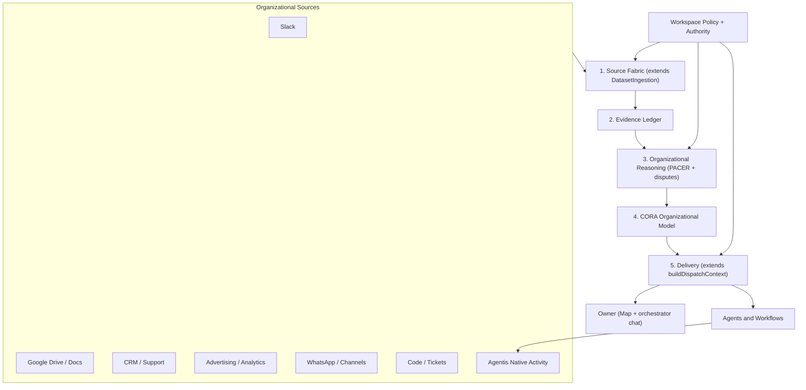
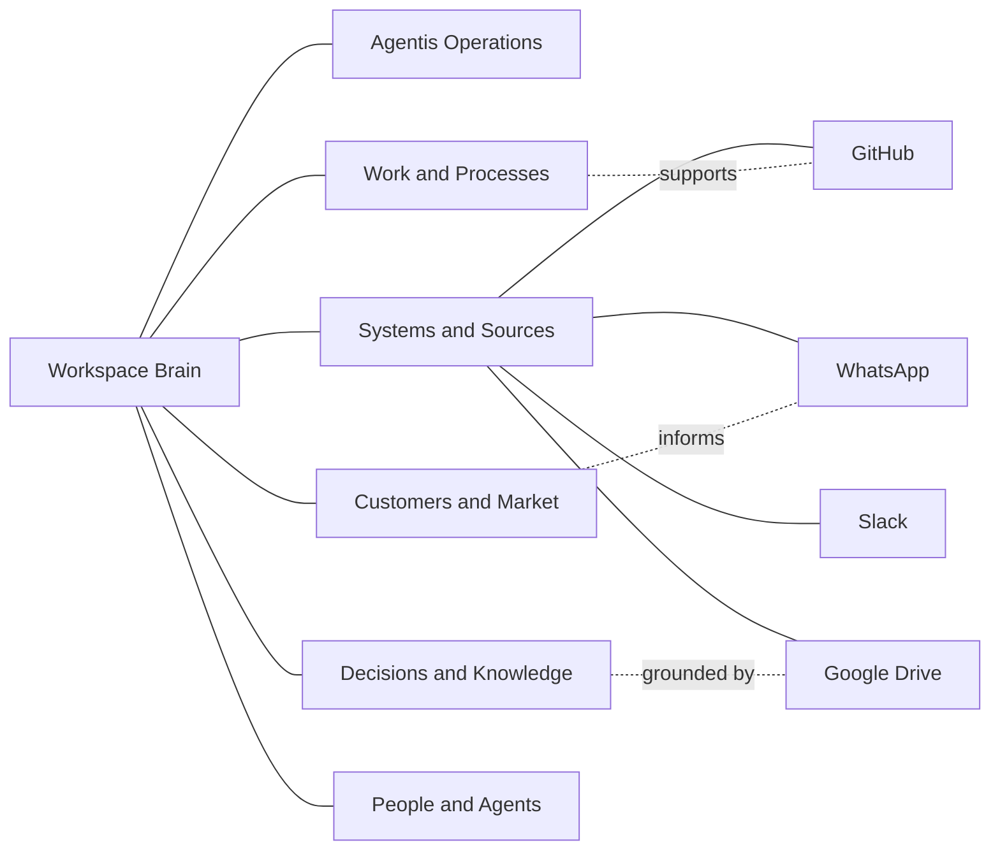

# CORA — Continuous Organizational Reasoning and Adaptation

**Status:** Architecture RFC (rewrite, reconciled with the live codebase)
**Date:** June 10, 2026
**Scope:** Long-term organizational intelligence, evidence ingestion, reasoning, governance, agent continuity, and product surface
**Engineering name:** CORA
**Product name:** Workspace Brain (CORA is the engine inside it)

**Relationship to the existing Brain:** CORA is the continuous-reasoning engine of the **Workspace Brain**. It keeps every shipped Brain capability — the stores, PACER formation, Feynman reflection, retrieval, disputes, and the graph machinery — as its cognitive substrate and **extends those services rather than forking them**. Agent Brain and Personal Brain remain separate scopes.

**V1 product boundary:** One owner, one private Agentis workspace, many agents and authorized sources. Human collaboration is a later product tier.

---

## 0. Naming And The No-Duplication Mandate

Two rules govern this entire document. Every later section is an application of them.

### 0.1 Naming scheme (Scheme A)

- **Workspace Brain** is the product. It is what the owner sees, the page they open, and the name in the header.
- **CORA** is the engineering name for the continuous organizational reasoning engine *inside* the Workspace Brain. It appears in code (`cora_*` tables, `/v1/cora/*` routes, service names) and in architecture documents like this one. It is **not** shown as a user-facing brand, a nav label, or onboarding copy.
- The new Workspace Brain subtab is labelled **"Sources"** for the owner, never "CORA".
- The source-ingestion interface is named **`KnowledgeSource`**. It is deliberately *not* called an "adapter" (that word already means a harness adapter under `AdapterManager` — `ClaudeCodeAdapter`, `CursorAdapter`, `CodexAdapter`, etc.) and *not* a "connector" (that already means an `integration-${service}` workflow connector).

The reason is the onboarding promise in §14: commissioning organizational intelligence should feel like commissioning an agent, not learning a new product. An acronym in the top nav breaks that promise. Engineers, who do benefit from a named mental model, get CORA in the RFC and the API.

### 0.2 No duplication — extend the live architecture

CORA must not stand up parallel machinery beside services that already do most of the work. Where an existing service covers a need, CORA **generalizes and extends it**. The concrete seam map is in §4.3 and is referenced throughout. This is a hard constraint, not a preference: duplicate sync, conflict, context, or health subsystems would create two surfaces that drift apart.

---

## 1. Executive Thesis

Companies do not lack information. They lack a reliable, current, permission-aware understanding of themselves.

The facts that explain how an organization actually works are fragmented across messages, documents, tickets, customer conversations, advertising platforms, spreadsheets, repositories, meetings, workflows, dashboards, and the memories of individual people. Search can locate fragments. Conventional RAG can quote them. Neither produces a durable operating understanding of the organization.

**CORA is the Workspace Brain's continuous organizational reasoning and adaptation engine.**

CORA continuously studies authorized organizational systems, preserves their evidence, reasons across sources, models how the organization operates, and adapts that model as reality changes. It is intended to answer questions such as:

- How does this company create, sell, deliver, support, and improve its product?
- Which teams, systems, workflows, and decisions depend on one another?
- What is the current process, and where does observed practice diverge from it?
- Who owns a system, metric, customer relationship, decision, or operational risk?
- Why was a decision made, what evidence supported it, and is it still valid?
- How should a new executive, manager, employee, or agent operate here?
- What does the organization know, what does it merely suspect, and what is missing?
- Which company activities should move into Agentis and become agent-native?

CORA is not a larger search box and not an indiscriminate company data lake. It is a governed system for turning distributed evidence into an evolving, cited, temporal, and actionable organizational model.

The long-term product direction is larger than observing external software. Agentis should become the place where a founder, operator, or independent professional can progressively design and run a project or company with agents: abilities, workflows, approvals, conversations, decisions, knowledge, and outcomes operating in one governed environment. External systems remain important sources and action surfaces, but Agentis becomes the primary intelligence and execution plane. **That migration of real work into Agentis is CORA's commercial thesis (§18), and it is the last thing built because it depends on a trustworthy model underneath.**

CORA V1 is deliberately single-player. It serves one owner who may operate a personal project, a professional practice, or an entire company through Agentis. That focus is an advantage: it permits a coherent private intelligence model, simple authorization, and excellent onboarding before collaborative human roles and organization-wide sharing are introduced.

---

## 2. Product Boundary

### 2.1 Why "CORA"

**CORA** means **Continuous Organizational Reasoning and Adaptation**. Each word names a required architectural property:

- **Continuous:** CORA follows change over time instead of producing a one-time company summary.
- **Organizational:** it models how a project or company operates — people, agents, customers, systems, decisions, processes, and dependencies.
- **Reasoning:** it distinguishes evidence, claims, contradictions, temporal truth, and authority instead of merely retrieving similar text.
- **Adaptation:** it updates knowledge, agent context, and migration recommendations as the organization and its outcomes change.

This is the engine's name. The owner experiences it as "the Workspace Brain learning about my operation."

### 2.2 Product vocabulary

| Term | Meaning |
|------|---------|
| **Agentis** | The agentic operating environment and execution plane |
| **Workspace Brain** | The product: the workspace scope, map, knowledge, memory, and intelligence experience |
| **CORA** | The engineering name for the continuous reasoning engine inside the Workspace Brain |
| **Owner** | The single human principal who controls the CORA V1 private operating domain |
| **Workspace** | The technical isolation boundary beneath that private operating domain |
| **Brain substrate** | Existing memory, knowledge, episodes, links, PACER formation, retrieval, disputes, and reflection services |
| **KnowledgeSource** | An authorized system whose records contribute evidence, via the ingestion interface of §7 |
| **Evidence** | A versioned observation preserved from a source |
| **Claim** | A grounded statement extracted or reasoned from evidence |
| **Model artifact** | A higher-order representation such as a process, decision, ownership map, or organizational narrative |
| **Investigation** | A bounded reasoning job that attempts to answer or verify a consequential question |

### 2.3 V1 owner and workspace boundary

The current architecture is workspace-scoped. CORA V1 keeps that technical boundary but presents a simpler owner-centric product:

- One CORA domain belongs to one owner and maps to one private Agentis workspace.
- The owner may create many agents, workflows, source connections, and operating domains inside that workspace.
- Other people found in email, Slack, CRM, or documents are organizational subjects, not Agentis collaborators or CORA users.
- Credentials, source connections, evidence, claims, and retrieval remain owner-workspace isolated.
- Agents receive delegated access from the owner; they do not become independent security principals beyond that delegation.
- No cross-owner or cross-workspace reasoning is allowed.

The later collaborative edition may add human members, roles, approval delegation, and federated workspaces. It is a paid product tier, but pricing and billing rules do not belong in this architecture or in the data-access invariants.

### 2.4 Product placement

CORA does not introduce a new top-level page.

- The existing `/brain` route remains the Brain destination; the route is `/brain?tab=…`.
- The existing **Workspace / Agent / Personal** scope switch remains unchanged.
- The Workspace Brain subheader changes from today's **Map | Knowledge | Insights** to **Map | Knowledge | Sources | Insights**, inserting one tab.
- The new **Sources** subtab owns onboarding, source connections, continuous-learning health, privacy, reasoning mode, per-agent access, and migration configuration.
- The current Workspace Map is reshaped into a CORA-powered organizational map.
- Contextual setup may also open from the Map as a drawer and return to the same selected node when closed.
- Agent Brain and Personal Brain remain available as their existing distinct scopes.

CORA is the continuous organizational intelligence capability of the Workspace Brain — not another application beside it, and not a fourth scope.

---

## 3. The Product Shift

CORA changes Agentis from a system that remembers agent work into a system that can maintain organizational continuity.

### 3.1 From integration hub to organizational operating system

An ordinary integration platform connects applications. CORA must do more:

1. Observe authorized work across systems.
2. Preserve exactly where each observation came from.
3. Resolve identities, entities, topics, and time.
4. Form and challenge claims.
5. Model processes, ownership, dependencies, and decisions.
6. Deliver the minimum authorized context needed for the owner or an agent.
7. Observe the result of execution and update the model.
8. Identify work that should become native Agentis workflows or abilities.

This creates a digitalization flywheel:

```text
external work
    -> governed observation
    -> organizational understanding
    -> Agentis recommendation or execution
    -> measured outcome
    -> stronger understanding
    -> more work becomes Agentis-native
```

### 3.2 Agentis is not merely another source

Agentis-native events are first-party evidence, but Agentis has three privileged roles that external applications do not:

1. **Intelligence plane:** CORA reasons, retrieves, challenges, and composes context.
2. **Execution plane:** agents and workflows act under explicit policies and approvals.
3. **Institutional plane:** approved policies, responsibilities, abilities, and operating models become durable organizational infrastructure.

External systems contribute evidence and remain systems of record for their own objects. Agentis becomes the system that understands the relationships among them and can progressively host the work itself.

### 3.3 The single-player agentic company

"Single-player" does not mean one agent or a small ambition. It means one human owner can coordinate a substantial agentic operation without first configuring a human organization inside Agentis.

The owner may:

- Connect the systems where the project or company currently lives.
- Teach CORA what each source should contribute.
- Create agents with different missions and CORA access modes.
- Inspect the living operating model and its evidence.
- Convert repeated external work into Agentis workflows and abilities.
- Keep approvals and protected decisions under direct control.

This is the correct V1 wedge. Team collaboration would add identity, sharing, delegated administration, and social coordination before the core organizational reasoning loop has been proven.

---

## 4. Current Agentis Reality

This RFC extends the live architecture rather than inventing a parallel Brain. The reuse and seam tables below were verified against the codebase.

### 4.1 Existing foundations to preserve

| Existing capability | CORA use |
|--------------------|----------|
| `KnowledgeBaseService`, `kb_documents`, `kb_chunks` | Searchable text and media-derived evidence projections |
| `knowledge_chunks`, `memory_episodes`, `workspace_memory` | Formed concepts, durable experience, and explicit operator-authored knowledge |
| `knowledge_links` | Temporal relationships among existing Brain atoms |
| `SharedIntelligenceService` | Existing workspace intelligence write, retrieval, dispatch-context, and dispute boundary |
| `EnrichedKnowledgeGraphWriter` | Grounded entity and community materialization |
| `KnowledgeAutoLinker` | Candidate relation discovery, not organizational truth adjudication |
| `brainPacer` (PACER routing) | Formation and retention policy for useful knowledge |
| `feynmanReflection` | Grounded explanation and no-op behavior when evidence is insufficient |
| `DatasetIngestion` | Existing resumable ingestion (backfill, resume, checkpoints, preview) — the basis for §7 sync |
| `documentExtractionService`, `embeddingBackfill`, `embeddingProvider` | Existing extraction and index pipeline CORA reuses |
| `DurableJobQueue` | Background synchronization, extraction, reasoning, and maintenance |
| `CredentialVault`, `OAuthService` | Encrypted source authorization |
| Listener cursors + `workspace_kv` | Reusable cursor mechanics for resumable incremental work |
| `ChannelBridge`, `ChannelTurnDispatcher` | Live communication and the orchestrator turn (the query surface, §14.5) |
| `integrationRegistry` (`integration-${service}`, `icon`/`slug`) | Connector logo and presentation metadata |
| `brainHealthService`, `InsightsTab` | Existing health/quality surfaces CORA extends |
| Agentis workflows, agents, abilities, approvals, run history | Native organizational activity and execution evidence |

### 4.2 Gaps CORA must fill

The current architecture does not yet provide:

- A standard `KnowledgeSource` contract for historical backfill and continuous source synchronization (generalizing `DatasetIngestion`).
- First-class external object identity, versions, tombstones, and sync lineage.
- Source principals and document-level access control propagation.
- Cross-source identity resolution with reviewable uncertainty.
- A claim ledger that distinguishes evidence, inference, active truth, and policy.
- Authority ranking and temporal truth reconciliation feeding the existing dispute model.
- Organizational process, decision, ownership, dependency, and system models.
- Derived-knowledge access calculation.
- Auditable agent behavior influence from organizational knowledge.
- Source coverage, freshness, staleness, and model health surfaces inside Insights.

The feature must add a governed organizational layer **around the existing Brain services**, not push connector metadata into arbitrary `kb_chunks.metadata` fields and declare the problem solved.

### 4.3 Seam map — extend, never fork

Each CORA need maps to a live service it must extend. This table is binding (see §0.2).

| CORA need | Live service it extends | Rule |
|-----------|-------------------------|------|
| Source backfill / incremental / resume / checkpoints | `DatasetIngestion` (+ listener cursors, `workspace_kv`) | `KnowledgeSource` generalizes it; no new sync engine |
| Extraction and embedding | `documentExtractionService`, `embeddingBackfill`, `embeddingProvider` | Reuse the pipeline; add evidence-version labelling |
| Agent context injection | `SharedIntelligenceService.buildDispatchContext` | `CoraContextBundle` is an extension of this method, not a new composer |
| Contradictions | dispute system: `flagDispute` / `listDisputes` / `resolveDispute`, `DisputeResolutionPanel`, `/brain/disputes` | Claim conflicts feed and extend disputes; one contradiction surface |
| Health / coverage | `brainHealthService`, `InsightsTab` | Extend; no parallel dashboard |
| Querying ("ask the company") | orchestrator turn via `ChannelTurnDispatcher` → `ChatSessionExecutor.turn` | No separate ask UI; map hands off to chat (§14.5) |
| Formation / retention | `brainPacer`, `brainFormation`, `memoryPolicyResolver` | Claims form through PACER; no bypass (§10.6, §11) |
| Logos | `integrationRegistry` slug/icon | Reuse; no arbitrary uploaded logo path |

### 4.4 Existing boundaries that must remain honest

- Slack integration operations currently send messages and reactions. They are not a Slack history crawler. A `KnowledgeSource` for Slack history is new work.
- Google Docs and Drive expose narrow workflow operations. They are not a complete synchronization engine.
- WhatsApp currently operates as a live channel transport. Historical business ingestion has different consent, retention, identity, and deletion requirements.
- Generic listener operations offer useful cursor mechanics but do not define source versions, ACLs, tombstones, or organizational semantics.
- `kb_documents` and `kb_chunks` are searchable content stores. They are not an immutable evidence ledger.

### 4.5 Schema and stale-fact notes

- The latest shipped migration is **v62** (PACER/Feynman). CORA's tables begin at **v63** and continue monotonically.
- `agent_memories` was **retired in migration v51**. Agent-private memory now lives in `memory_episodes` with `scope_id = agentId`. CORA never reintroduces a separate agent-memory table; "agent scope" is a `scope_id` filter.

---

## 5. Architectural Invariants

These are non-negotiable.

1. **Evidence is not truth.** A message or document is an observation from a particular source, author, time, and access context.
2. **Truth is not policy.** A well-supported description of common practice does not automatically become an approved company rule.
3. **Policy is not execution authority.** Knowing a policy does not grant an agent permission to perform an action.
4. **No conclusion without provenance.** Every claim and model artifact must be traceable to exact evidence versions or explicit operator authorship.
5. **No access widening by synthesis.** Reasoning over restricted material cannot create an unrestricted result.
6. **No silent behavior mutation.** Every CORA influence on an agent must be inspectable, attributable, reversible, and bounded by policy.
7. **No secrets in the Brain.** Credential values, private keys, session tokens, recovery codes, and equivalent secrets are rejected or redacted.
8. **Deletion is part of correctness.** Source deletion, permission revocation, and retention expiry must propagate through evidence, claims, indexes, summaries, and agent context.
9. **Historical truth remains historical.** New truth closes or supersedes old validity windows; it does not rewrite the past.
10. **Uncertainty is a first-class result.** CORA returns contradictions, confidence limits, and knowledge gaps instead of manufacturing certainty.
11. **Agentis-native does not mean automatically authoritative.** A failed workflow or speculative agent message remains evidence until it passes formation and governance rules.
12. **Source systems remain authoritative for their own raw records.** CORA stores evidence and models, not an untracked replacement copy.
13. **Information origin and exposure are distinct.** External does not mean public, and internal does not automatically mean confidential. CORA records both where information came from and who may use it.
14. **Agent knowledge access is not execution authority.** "Full access" means broad retrieval within the owner's grants; it never grants credentials, tools, spending authority, or permission to bypass checkpoints.
15. **Continuous does not mean model-heavy.** Deterministic synchronization, normalization, deduplication, security, and change detection run continuously. Models are invoked only where semantic judgment adds measurable value.
16. **Extend, do not duplicate.** No CORA component may reimplement a capability an existing Brain service already provides (§4.3).

---

## 6. System Architecture

CORA has five cooperating planes, each grafted onto live services.



### 6.1 Plane 1: Source Fabric

Connects authorized organizational systems and maintains a faithful, resumable stream of source changes. It **extends `DatasetIngestion`** for backfill/resume/checkpointing and reuses listener cursors and `workspace_kv` for incremental state. Responsibilities: authorization and least-privilege scopes; capability discovery; owner-selected inclusion/exclusion; historical backfill; incremental sync; webhook and polling coordination; cursor durability; rate-limit and retry handling; health and coverage reporting; identity and ACL discovery; update and deletion detection; payload normalization and integrity hashing.

### 6.2 Plane 2: Evidence Ledger

The durable boundary between untrusted source material and organizational reasoning. It stores immutable versions of normalized source objects — source/connection identity, external object identity and native URL, type and hierarchy, version identity and integrity hash, lifecycle timestamps, author/participants, content/attachment references, source ACL snapshot, extraction/redaction status, parser/schema versions, legal-hold/retention state, and prompt-injection/secret-scan findings. Searchable projections are written into `kb_documents`/`kb_chunks` via the existing extraction pipeline; the ledger remains the source of provenance and synchronization truth.

### 6.3 Plane 3: Organizational Reasoning

Converts evidence into reviewable claims and models: identity/entity resolution, claim extraction, relation/event extraction, cross-source corroboration, contradiction detection (feeding the dispute system), temporal reconciliation, authority/confidence scoring, process/dependency induction, decision/rationale reconstruction, ownership inference, knowledge-gap detection, Feynman challenge/verification, and **PACER-aware formation** into durable Brain knowledge.

### 6.4 Plane 4: CORA Organizational Model

A versioned supergraph, not one giant generated summary. It contains people/teams/agents/roles, customers/suppliers/partners, products/services/projects/metrics, systems/repositories/channels/documents/datasets/credential-metadata, processes/stages/handoffs/dependencies/failure-modes, decisions/alternatives/rationales/outcomes, policies/procedures/controls/access-guides, claims/evidence/contradictions/gaps/validity-windows, and Agentis workflows/abilities/runs/approvals/artifacts/observed-performance. Each materialized snapshot is reproducible from evidence versions, claim decisions, and the reasoning configuration that produced it.

### 6.5 Plane 5: Intelligence And Execution Delivery

Exposes CORA through the existing Brain workspace scope without flattening it into unrestricted context. It provides a progressively expanding CORA-powered Map; permission-filtered cited answers (rendered in the detail rail; conversational answers via the orchestrator, §14.5); owner onboarding and agent operating guides; organizational/process views as map branches and inspectors; deep investigations from selected nodes/claims; **agent context composition via `buildDispatchContext`**; workflow recommendations; staleness/contradiction/risk alerts in Insights; explanations of why an agent received a fact; and the migration path of §18.

---

## 7. The Source Fabric

### 7.1 `KnowledgeSource` — a new contract that extends existing sync

A `KnowledgeSource` must not be an overloaded workflow connector. A workflow operation such as `send_message` has different safety, lifecycle, and data semantics from a continuous organizational synchronization job. But it also must not reinvent ingestion: backfill, resumable cursors, checkpointing, and preview already exist in `DatasetIngestion` and the listener-cursor mechanics. `KnowledgeSource` is the **generalization** of those, adding source versions, ACLs, tombstones, and organizational semantics.

```ts
export interface KnowledgeSource {
  readonly sourceType: string;
  readonly capabilities: SourceCapabilities;

  validateConnection(ctx: SourceAuthContext): Promise<SourceConnectionHealth>;
  discoverScopes(ctx: SourceSyncContext): Promise<DiscoveredSourceScope[]>;
  backfill(request: BackfillRequest): AsyncIterable<SourceChangeBatch>;
  synchronize(request: IncrementalSyncRequest): AsyncIterable<SourceChangeBatch>;
  resolvePrincipals?(request: PrincipalSyncRequest): AsyncIterable<SourcePrincipal>;
  resolvePermissions?(request: PermissionSyncRequest): AsyncIterable<SourceAclSnapshot>;
  hydrateObject?(request: HydrateObjectRequest): Promise<CanonicalSourceObject>;
  revoke?(ctx: SourceSyncContext): Promise<void>;
}

export interface SourceCapabilities {
  supportsBackfill: boolean;
  supportsIncrementalCursor: boolean;
  supportsWebhooks: boolean;
  supportsDeletes: boolean;
  supportsAclSync: boolean;
  supportsIdentityDirectory: boolean;
  supportsAttachments: boolean;
  supportsHistory: boolean;
  consistency: 'strong' | 'eventual' | 'best_effort';
}
```

A `KnowledgeSource` reuses the credential vault, OAuth service, HTTP safety controls, durable job queue, `DatasetIngestion` checkpointing, listener cursor mechanics, and `workspace_kv`. It implements only the organizational semantics those layers lack.

### 7.2 Connection policy

Every connection requires: the workspace; the authorizing owner; granted external scopes; explicit included/excluded source scopes; a source learning brief; backfill start time or bounded history policy; retention/deletion behavior; whether personal/private/customer/regulated content is permitted; expected ACL fidelity; sync schedule and budget; and data-residency constraints.

The default is deny. Connecting Google Drive does not imply indexing every file. Connecting Slack does not imply reading every private conversation.

### 7.3 Source learning briefs

A connection is incomplete until the owner states why the source is being connected. Onboarding creates a structured brief per source rather than a vague free-form prompt.

```ts
export interface SourceLearningBrief {
  id: string;
  workspaceId: string;
  connectionId: string;
  purpose:
    | 'operations' | 'customers' | 'product' | 'engineering'
    | 'marketing' | 'finance' | 'research' | 'personal' | 'custom';
  knowledgeObjectives: string[];
  priorityEntities: string[];
  priorityProcesses: string[];
  includedScopes: string[];
  excludedScopes: string[];
  expectedAuthority: AuthorityHint[];
  informationDefaults: InformationBoundary;
  retentionPolicyId: string;
  reasoningMode: 'core' | 'adaptive' | 'deep';
  ownerNotes?: string;
}
```

The UI provides source-specific guidance (Slack: decisions, handoffs, customer commitments; Drive: approved procedures, strategy, policies; CRM: customer state and ownership; advertising: spend, experiments, attribution limits; GitHub: architecture, delivery process, technical decisions; Agentis: actual agent behavior, outcomes, abilities). These are editable suggestions, not extraction instructions copied into every prompt. The brief compiles into deterministic filters, extraction schemas, authority hints, and selective reasoning jobs.

### 7.4 Synchronization modes

| Mode | Purpose |
|------|---------|
| Backfill | Bounded historical import with restartable checkpoints (via `DatasetIngestion`) |
| Incremental poll | Cursor-based source changes |
| Webhook | Low-latency change notification followed by authoritative hydration |
| Reconciliation scan | Periodic verification that cursors and webhooks did not miss changes |
| On-demand hydrate | Fetch an authorized object needed for an investigation |
| Revocation sweep | Remove or quarantine inaccessible content and derived knowledge |

Webhooks are hints, not always complete evidence. When a source permits it, the source should hydrate the current authoritative object before recording a version.

### 7.5 Idempotency and ordering

A canonical version identity is:

```text
(workspace_id, source_connection_id, external_object_id, source_version_id)
```

If the source has no stable version ID, CORA uses the normalized content hash plus source modification time. Replaying the same version must produce no duplicate evidence, chunks, claims, or graph nodes. Out-of-order delivery is allowed; validity is resolved from source timestamps and version ancestry, not ingestion order.

### 7.6 Source families

CORA supports source families rather than hard-coded product assumptions: communication (Slack, Teams, email, WhatsApp, Discord); documents/files (Drive, Docs, SharePoint, Notion, Dropbox); customer/revenue (CRM, support, commerce, calls); work management (Jira, Linear, Asana, calendars); engineering (GitHub, GitLab, CI, incidents, observability); marketing (Meta/Google Ads, analytics); data (databases, warehouses, spreadsheets, BI); governance (identity providers, policy repositories, audit systems); and Agentis-native (agents, conversations, workflows, abilities, approvals, runs, artifacts, knowledge, evaluations, outcomes).

The RFC defines the architecture under which each can be implemented without weakening provenance or access. It does not promise all sources in one release.

---

## 8. Canonical Evidence Model

### 8.1 Canonical source object

```ts
export interface CanonicalSourceObject {
  workspaceId: string;
  connectionId: string;
  sourceType: string;
  externalId: string;
  externalVersionId?: string;
  objectType: string;

  title?: string;
  nativeUrl?: string;
  parent?: ExternalObjectRef;
  thread?: ExternalObjectRef;

  author?: SourceIdentityRef;
  participants: SourceIdentityRef[];
  createdAt?: string;
  modifiedAt?: string;
  observedAt: string;

  content: CanonicalContentPart[];
  attachments: CanonicalAttachment[];
  attributes: Record<string, unknown>;

  informationBoundary: InformationBoundary;
  acl: AccessPolicy;
  lifecycle: SourceObjectLifecycle;
  integrity: SourceIntegrity;
}

export interface InformationBoundary {
  origin: 'public_external' | 'private_external' | 'agentis_native' | 'owner_authored';
  confidentiality: 'public' | 'internal' | 'confidential' | 'restricted' | 'unknown';
  audience: 'anyone' | 'customers' | 'owner_only' | 'delegated_agents' | 'named_principals';
  customerSafe: boolean;
  trainingAllowed: boolean;
  exportAllowed: boolean;
  policySource: 'source_acl' | 'owner_rule' | 'classifier' | 'inherited';
}

export interface SourceObjectLifecycle {
  state: 'active' | 'deleted' | 'inaccessible' | 'expired';
  effectiveAt?: string;
  detectedAt: string;
}

export interface SourceIntegrity {
  contentHash: string;
  adapterVersion: string;
  schemaVersion: string;
  parserVersion?: string;
}
```

### 8.2 Evidence version

```ts
export interface EvidenceVersion {
  id: string;
  workspaceId: string;
  sourceObjectId: string;
  predecessorVersionId?: string;
  sourceVersionId?: string;
  contentHash: string;
  normalizedObject: CanonicalSourceObject;
  extractionStatus: 'pending' | 'ready' | 'partial' | 'rejected' | 'failed';
  securityLabels: string[];
  validFrom?: string;
  validUntil?: string;
  observedAt: string;
  createdAt: string;
}
```

Evidence versions are append-only. Corrections produce a new version or an owner annotation; they do not mutate historical source evidence.

### 8.3 Origin vs. exposure

CORA classifies two independent dimensions: **origin** (where information came from) and **exposure** (where it may go). This prevents dangerous shortcuts:

- A public website is external and public.
- A private customer WhatsApp message is external and confidential.
- An Agentis workflow result is internal, but may be approved for customers.
- An owner-authored strategy note is internal and may be owner-only.

For customer-facing work, context composition includes only items marked `customerSafe` or facts independently reconstructable from public evidence. Internal reasoning may use private material to decide what to do, but must not quote, summarize, or reveal it to the customer.

Outbound work uses separated contexts: (1) a private planner may use the agent's authorized CORA context to choose an objective; (2) a disclosure compiler converts that plan into customer-safe claims and removes restricted wording, hidden rationale, and unsupported facts; (3) the outbound composer receives only the safe plan, permitted claims, and customer-safe evidence; (4) a deterministic disclosure validator checks labels, citations, secrets, and destination policy before delivery.

Automated classification can propose labels and may narrow exposure immediately when risk is detected, but **widening** exposure requires a source ACL, an explicit owner rule, or owner approval.

### 8.4 Search projections (reuse the existing pipeline)

After security checks and extraction (via `documentExtractionService` + `embeddingBackfill`): searchable content projects into `kb_documents`/`kb_chunks`; chunk metadata must include `evidenceVersionId`, source type, external object identity, temporal fields, and access-policy reference; embeddings are derived indexes and regenerable; deleting or restricting evidence invalidates all corresponding projections; generated descriptions, OCR, and transcription are labelled as derived text, not original source content.

### 8.5 Evidence is untrusted input

All source content is data, never instruction. It is processed through: file/media safety validation; secret detection/redaction; prompt-injection classification; isolated content-type parsing; structural normalization; access-policy binding; evidence persistence; and only then extraction/reasoning prompts with explicit untrusted-data framing. No synchronized text can call tools, alter system prompts, grant access, or write workspace policy.

---

## 9. Identity And Permission Model

### 9.1 Source principals

```ts
export interface SourcePrincipal {
  id: string;
  workspaceId: string;
  connectionId: string;
  sourceType: string;
  externalPrincipalId: string;
  kind: 'person' | 'group' | 'service' | 'channel' | 'domain' | 'public';
  displayName?: string;
  email?: string;
  attributes: Record<string, unknown>;
  status: 'active' | 'disabled' | 'deleted' | 'unknown';
}

export interface AccessPolicy {
  mode: 'explicit' | 'inherited' | 'owner' | 'public' | 'unknown';
  allow: SourcePrincipalRef[];
  deny: SourcePrincipalRef[];
  inheritedFrom?: ExternalObjectRef;
  fidelity: 'exact' | 'partial' | 'unavailable';
  capturedAt: string;
}
```

### 9.2 Cross-source identity resolution — split by difficulty

CORA needs an internal organizational identity that links a Slack user, Google account, CRM owner, WhatsApp participant, GitHub account, the Agentis owner, and agents. This is **not optional** — without it the model fragments into duplicate people. But it splits into two jobs of very different difficulty, and only one is V1-mandatory:

- **Deterministic linking (V1-mandatory):** verified-equal email, same OAuth subject, owner-asserted mapping. Cheap, high-confidence, activates automatically.
- **Probabilistic merging (deferred to a review queue):** "J. Smith" in a doc probably equals "john" in Slack. Research-grade and dangerous; stays separate and surfaces in an identity review queue for owner adjudication.

V1 single-player narrows the blast radius: the **owner and agents are known anchors**; only external subjects are fuzzy, so imperfect resolution means "some external subjects are slightly duplicated," which is tolerable.

Identity links carry: match method, confidence, supporting identifiers, conflicting identifiers, reviewer/review status, and validity window. Email equality is useful evidence, not universal proof — shared inboxes, aliases, contractors, renamed accounts, merged companies, and recycled phone numbers make automatic merging dangerous.

### 9.3 Evidence-bound authorization

Every retrieval request carries a requester:

```ts
export interface CoraRequester {
  workspaceId: string;
  ownerId: string;
  agentId?: string;
  principalIds: string[];
  coraGrantId?: string;
  purpose?: string;
  interactionAudience?: 'private' | 'customer' | 'public';
}
```

Authorization is applied before semantic ranking and again before response composition. Post-generation filtering alone is insufficient because restricted facts can leak through summaries, graph traversal, counts, or explanations.

### 9.4 Derived knowledge policy

Each claim or model artifact records an access expression derived from its evidence. The safe default:

```text
derived_access = requester may access every indispensable supporting evidence item
```

This is the hardest correctness problem in CORA (computing the minimal support set over an LLM-reasoned chain, and keeping it correct as evidence mutates). V1 treats it **conservatively and approximately**: the default ANDs all directly-cited supporting evidence, and any evidence whose access cannot be computed forces the claim to `restricted`. For alternative independent evidence sets, access may be granted when the requester can access at least one complete support set; the reasoner must never cite or expose the inaccessible set.

Operating-domain publication requires an approved, redacted artifact with its own authorship and policy — never achieved by changing the ACL on the original restricted synthesis. In V1 this means approved for the owner's operating domain and delegated agents; it does not imply multi-user sharing. Public or customer-safe publication is a separate exposure decision.

### 9.5 Agent CORA access modes

The owner should not construct ACL expressions per agent. Agent configuration exposes four modes:

| Mode | Behavior |
|------|----------|
| **No CORA** | The agent receives no CORA retrieval or behavior influence |
| **Full access** | The agent may retrieve all owner-authorized CORA knowledge except excluded/protected domains |
| **Agent decides** | The agent may decide when/what to retrieve within configured sources, domains, audiences, and token budgets |
| **Human approval** | The agent proposes a knowledge access request; the owner approves once, for the run, for the session, or as a standing grant |

```ts
export interface AgentCoraGrant {
  id: string;
  workspaceId: string;
  ownerId: string;
  agentId: string;
  mode: 'none' | 'full_delegated' | 'agent_decides' | 'human_approval';
  allowedSourceIds: string[] | '*';
  allowedDomains: string[] | '*';
  maximumConfidentiality: 'public' | 'internal' | 'confidential' | 'restricted';
  allowedAudiences: Array<'private' | 'customer' | 'public'>;
  protectedDomainPolicy: 'deny' | 'approval_required' | 'authoritative_only';
  tokenBudgetPerRun?: number;
  expiresAt?: string;
}
```

These modes govern knowledge retrieval and context injection only. They never grant connector credentials, workflow tools, spending limits, data export, or external-action authority. `Agent decides` is need-to-know retrieval within an owner-defined ceiling, every query audited. `Full access` is broad convenience for trusted private agents, but response composition still respects the interaction audience.

For `Human approval`, CORA shows a compact request: what the agent wants to know; why the task needs it; which sources/classes may be accessed; whether content may leave the private interaction; estimated token cost; and approval duration/revocation controls.

---

## 10. Organizational Reasoning

### 10.1 Pipeline

```text
discover -> synchronize -> normalize -> secure -> index
-> extract -> resolve -> correlate -> challenge -> reconcile
-> form -> publish -> monitor
```

Each stage is durable, retryable, idempotent, observable, version-aware, permission-aware, and able to no-op without inventing output. `index`/`extract` reuse the existing extraction+embedding pipeline; `form` routes through PACER (§11); `challenge` uses Feynman; `reconcile` feeds the dispute system (§10.5).

### 10.2 Claim ledger

Claims are the atomic reasoning unit.

```ts
export interface OrganizationalClaim {
  id: string;
  workspaceId: string;
  subject: OrganizationalRef;
  predicate: string;
  object: ClaimValue;

  claimType:
    | 'observation' | 'description' | 'procedure' | 'ownership'
    | 'decision' | 'dependency' | 'policy' | 'metric' | 'causal_hypothesis';

  status: 'candidate' | 'active' | 'disputed' | 'superseded' | 'rejected' | 'expired';

  evidence: EvidenceReference[];
  counterEvidence: EvidenceReference[];
  confidence: ClaimConfidence;
  authority: AuthorityAssessment;
  accessPolicyId: string;

  validFrom?: string;
  validUntil?: string;
  recordedAt: string;
  reasoningVersion: string;
}

export interface EvidenceReference {
  evidenceVersionId: string;
  locator?: { chunkId?: string; page?: number; range?: [number, number]; timestamp?: string };
  role: 'supports' | 'contradicts' | 'contextualizes' | 'supersedes';
  directness: number;
}
```

### 10.3 Confidence is computed, not narrated

Model self-confidence is never the score. CORA computes it from independently measurable dimensions:

```text
confidence =
    corroboration * source_reliability * authority_fit * directness
  * freshness * identity_certainty * extraction_quality * consistency
  * scope_coverage - contradiction_penalty
```

The implementation may use calibrated weighted scoring rather than literal multiplication, but each component remains inspectable. Distinctions that matter: ten copied messages are not ten independent sources; a policy document is authoritative about intended policy, not actual practice; repeated workflow runs are strong evidence of observed practice, not approved procedure; recent evidence is not always better if the older source has stronger authority; retrieval frequency signals usefulness, not correctness.

### 10.4 Authority profiles

Authority is predicate-specific; no global source ranking suffices.

| Question | Likely authority |
|----------|------------------|
| Approved security policy | Signed policy repository or designated security owner |
| Current customer issue | Support system and assigned account owner |
| Actual workflow behavior | Agentis run history and execution artifacts |
| Intended sales process | Approved sales playbook |
| Practiced sales process | CRM events plus communications and workflow evidence |
| Advertising spend | Advertising platform ledger |
| Why a decision was made | Decision record, meeting artifact, and responsible owner |

The owner defines authority profiles for protected predicates. CORA may learn candidate profiles but cannot silently redefine protected authority.

### 10.5 Contradictions extend the dispute system

CORA does **not** build a parallel contradiction surface. The shipped dispute system (`flagDispute` / `listDisputes` / `resolveDispute`, `DisputeResolutionPanel`, `/brain/disputes`) is the single contradiction surface. CORA conflicts are recorded as dispute records enriched with claim/authority/temporal metadata:

```ts
export interface ClaimConflictSet {
  id: string;
  workspaceId: string;
  disputeId: string;          // links to the existing dispute record
  claimIds: string[];
  activeClaimId?: string;
  resolution:
    | 'confidence_winner' | 'authority_winner' | 'temporal_successor'
    | 'human_decision' | 'unresolved';
  consequentiality: 'low' | 'normal' | 'protected';
  rationale: Record<string, unknown>;
}
```

For ordinary descriptive knowledge, the best-supported claim may become active automatically while alternatives remain visible in the dispute UI. For protected domains, confidence alone cannot select truth — authority or explicit approval is required.

### 10.6 Claim-graph garbage control (formation gating)

This section is load-bearing: an LLM extracting claims over noisy Slack/docs will produce volume and junk, and a noisy claim graph poisons everything downstream — including the migration engine (§18), where a bad process model becomes a dangerous action. The Brain already fixed exactly this failure once (the memory-formation garbage-atom path); CORA must not reopen it at organizational scale.

Controls:

- **Deterministic gate before any model call.** Most records produce no claim (Core mode, §10.7). Extraction runs only on changed, high-signal objects.
- **PACER-gated formation.** A candidate claim does not become durable knowledge by being ingested or summarized. It must pass `brainPacer`/`brainFormation`/`memoryPolicyResolver` formation policy exactly as Brain atoms do (§11). Evidence stays cold.
- **Independence-aware corroboration.** Copied/forwarded text collapses to one source; corroboration counts independent origins only.
- **Single-source quarantine for consequential claims.** A protected-domain claim with single-source support is held as `candidate`, never `active`, until authority or a second independent source appears.
- **Reuse-based graduation.** Claims graduate on measured retrieval reuse, not on creation — consistent with the shipped PACER graduation model.
- **Quarantine tier.** Unsafe, unparseable, permission-unknown, or disputed material is non-retrievable (§13.3).

CORA reports formation health (claims produced, single-source share, contradiction rate, human-correction rate) in Insights (§17.2) so junk is visible, not silent.

### 10.7 Reasoning execution modes

| Mode | Default behavior | Model use |
|------|------------------|-----------|
| **Core** | Continuous sync, normalization, hashing, ACL propagation, parsing, dedup, deterministic extraction, freshness, known-schema updates | None or a configured local classifier |
| **Adaptive** | Core plus selective semantic extraction, entity resolution, claim formation, contradiction checks, changed-subgraph synthesis | Triggered only when deterministic confidence is insufficient or new meaning must be formed |
| **Deep** | Bounded Feynman investigation, broad cross-source retrieval, counter-evidence search, process reconstruction, or migration analysis | Owner-launched or policy-triggered with visible budget |

`Adaptive` is the recommended default. Model calls are triggered by meaningful events: a new source/major backfill; a high-value object changes; deterministic extraction cannot resolve an entity/claim; sources contradict; a process pattern crosses a recurrence threshold; an active claim loses support or goes stale; an agent requests uncovered knowledge. The deterministic pipeline decides what changed and what needs judgment; models reason over bounded evidence packets and emit structured proposals; deterministic validators then enforce provenance, confidence inputs, permissions, schemas, and write policy.

### 10.8 CORA Learning Plan, not an ordinary workflow

After onboarding, CORA compiles the owner's choices into a visible **CORA Learning Plan**:

```ts
export interface CoraLearningPlan {
  id: string;
  workspaceId: string;
  ownerId: string;
  sourceBriefIds: string[];
  stages: Array<{
    kind: 'sync' | 'normalize' | 'secure' | 'extract' | 'reason' | 'review' | 'publish';
    mode: 'deterministic' | 'selective_model' | 'owner_gate';
    status: 'pending' | 'running' | 'healthy' | 'attention' | 'paused';
  }>;
  reasoningMode: 'core' | 'adaptive' | 'deep';
  dailyBudget?: CoraBudget;
  createdAt: string;
  updatedAt: string;
}
```

The plan looks and behaves like a workflow in the UI (stages, status, logs, budgets, retries, pause). Internally, source sync and evidence integrity remain dedicated platform services because ordinary workflow runs do not provide cursor ownership, tombstone propagation, ACL reconciliation, or continuous lifecycle. Deep investigations and migration proposals may compile into real workflows because they are bounded; the continuous substrate must not.

---

## 11. PACER And Feynman Integration

### 11.1 PACER remains the formation policy

CORA must not bypass the shipped Brain formation model.

| PACER class | CORA interpretation |
|-------------|---------------------|
| Procedural | How work is performed, checked, escalated, or recovered |
| Analogical | Reusable organizational patterns and comparisons |
| Conceptual | Business concepts, responsibilities, products, and relationships |
| Evidence | Raw or lightly normalized source observations |
| Reference | Stable identifiers, locations, system maps, and access guidance |

Default lifecycle:

```text
source object -> evidence ledger -> searchable evidence
                                  -> candidate claims
                                  -> challenged and reconciled claims
                                  -> PACER-aware formed knowledge
                                  -> retrieval and measured reuse
                                  -> reinforcement, correction, or expiry
```

Evidence stays cold. It does not become durable procedural or conceptual knowledge merely because it was ingested or summarized (see §10.6).

### 11.2 Organizational Feynman investigations

CORA generalizes the Feynman discipline into bounded investigations: state the question testably; retrieve authorized supporting and opposing evidence; produce a plain-language explanation; identify assumptions and missing links; attempt falsification; retrieve again for the weakest points; score grounding and coverage; publish a cited result, a disputed result, or an explicit no-op.

```ts
export interface KnowledgeInvestigation {
  id: string;
  workspaceId: string;
  question: string;
  requester: CoraRequester;
  scope: InvestigationScope;
  status: 'queued' | 'running' | 'blocked' | 'completed' | 'inconclusive' | 'failed';
  evidenceSetIds: string[];
  claimIds: string[];
  findings?: InvestigationFinding[];
  gaps: KnowledgeGap[];
  accessPolicyId: string;
  modelAndPromptVersions: Record<string, string>;
  startedAt?: string;
  completedAt?: string;
}
```

An investigation may propose claims, corrections, workflows, or policies. It does not automatically grant execution authority.

---

## 12. Agent Behavior And Long-Term Work

### 12.1 Why this matters for long-lived agents

Long-term agents fail when every run starts from a shallow prompt, stale summary, or unstructured pile of retrieved text. CORA provides durable organizational continuity without loading the whole company into every context window. An agent should receive: its explicit mission and authority; its active `AgentCoraGrant` and interaction audience; current workspace policy; relevant CORA claims and models; exact evidence citations when needed; current process stage and dependencies; known contradictions and uncertainty; recent outcomes and Feynman lessons; and a reason why each high-impact context item was selected.

### 12.2 Context composition extends `buildDispatchContext`

CORA's `CoraContextBundle` is **not a new composer**. It is an extension of `SharedIntelligenceService.buildDispatchContext` (the method `WorkflowEngine` already calls when dispatching agent work). CORA adds the org-model layers (claims, processes, contradictions, influences) to the bundle that method already produces, under the access ceiling of §9.5.

Composition order:

```text
platform safety
  > workspace constitutional policy
  > explicit owner instruction
  > approved protected-domain policy
  > active CORA operational knowledge
  > retrieved evidence
  > agent working memory
  > unverified source content
```

Lower layers cannot override higher layers.

### 12.3 Behavior influence

```ts
export interface BehaviorInfluence {
  id: string;
  workspaceId: string;
  agentId: string;
  runId?: string;
  sourceClaimIds: string[];
  coraGrantId: string;
  interactionAudience: 'private' | 'customer' | 'public';
  kind: 'context' | 'routing_hint' | 'procedure' | 'constraint' | 'escalation' | 'tool_preference';
  protectedDomain: boolean;
  activation: 'automatic' | 'authority_approved' | 'human_approved';
  renderedInstruction: string;
  precedence: number;
  expiresAt?: string;
  createdAt: string;
}
```

Every influence is logged before dispatch. Operators can inspect what CORA changed, which claims caused it, which evidence supports those claims, which authority rule allowed activation, which agents/runs received it, and whether outcomes improved.

Before composing context, Agentis resolves the agent's CORA mode: `No CORA` returns an empty bundle; `Full access` retrieves broadly within the grant and task relevance; `Agent decides` allows audited CORA queries within the grant; `Human approval` pauses the knowledge request (not the whole runtime) when useful independent work can continue. Customer/public interactions use the separated private-planning and disclosure-safe path of §8.3.

### 12.4 Bounded autonomy

CORA may automatically shape routine, reversible operational behavior when: the claim is active and sufficiently supported; access is valid for the agent and task; the behavior stays within existing agent authority; no protected domain is involved; the change is reversible and audited; and the influence has an expiry/revalidation policy.

Automatic activation is forbidden for inferred credential/permission grants, security exceptions, legal commitments, financial authorization or material spend rules, HR decisions, compliance interpretations, destructive operations, or irreversible external commitments. These require an authoritative source or human approval and remain subject to normal Agentis execution approvals.

### 12.5 Learning from outcomes

CORA measures whether an influence helped (task success/evaluator results, rework/failure rates, human correction, process duration, customer/operational outcome, contradictions introduced). Outcome correlation may adjust retrieval and influence confidence. It cannot turn a successful unsafe action into approved policy.

---

## 13. Data Architecture

### 13.1 Reuse rather than duplicate

Keep using `knowledge_bases`/`kb_documents`/`kb_chunks` for searchable source projections; `knowledge_chunks` for formed conceptual knowledge; `memory_episodes` for durable observed experience (and agent-scoped memory via `scope_id`, since `agent_memories` was retired in v51); `workspace_memory` for explicit operator-authored constitutional knowledge; `knowledge_links` for graph relationships; `brain_quality_events` for retrieval/formation quality; and credential/OAuth/queue/audit/agent/workflow/run/approval/dispute records.

### 13.2 New first-class records (migration v63+)

The exact physical schema is an implementation decision, but the architecture requires explicit ownership for:

| Record | Purpose |
|--------|---------|
| `cora_owner_profiles` | V1 owner intent, operating domains, privacy defaults, onboarding state |
| `cora_discovery_snapshots` | Read-only detected inventory, recommendations, confidence, warnings |
| `cora_source_connections` | Authorization, scope, retention, schedule, source health |
| `cora_source_learning_briefs` | Per-source objectives, exclusions, authority hints, reasoning mode |
| `cora_sync_runs` | Backfill/incremental execution, cursors, counts, errors, checkpoints (extends `DatasetIngestion` run records) |
| `cora_source_objects` | Stable external object identity and current lifecycle |
| `cora_evidence_versions` | Immutable normalized object versions |
| `cora_source_principals` | External users, groups, services, domains |
| `cora_identity_links` | Reviewable cross-source identity mappings |
| `cora_access_policies` | Captured and derived access expressions |
| `cora_claims` | Atomic supported organizational statements |
| `cora_claim_evidence` | Claim-to-evidence support and opposition |
| `cora_claim_conflicts` | Competing truth candidates, linked to existing dispute records |
| `cora_entities` | Canonical organizational entities |
| `cora_entity_aliases` | Source-specific names and identifiers |
| `cora_model_artifacts` | Processes, decisions, maps, narratives, guides |
| `cora_model_snapshots` | Reproducible organizational model versions |
| `cora_investigations` | Deep reasoning job state and outputs |
| `cora_learning_plans` | Compiled continuous stages, health, reasoning mode, budgets |
| `cora_onboarding_events` | Quickstart choices, generated defaults, corrections, launch, milestones |
| `cora_agent_grants` | Owner-configured CORA access mode and retrieval ceiling per agent |
| `cora_behavior_influences` | Audited agent context and behavior shaping |
| `cora_migration_candidates` | External processes proposed for Agentis-native conversion |
| `cora_feedback` | Corrections, approvals, disputes, usefulness feedback |
| `cora_audit_events` | Security, sync, reasoning, publication, and access events |

Note: `cora_claim_conflicts` references the existing dispute record id rather than duplicating dispute storage (§10.5).

### 13.3 Storage tiers

| Tier | Contents | Characteristics |
|------|----------|-----------------|
| Hot | Active claims, current model, recent searchable evidence | Fast retrieval |
| Warm | Historical evidence and superseded model artifacts | Queryable, lower priority |
| Cold | Retained source payloads and audit history | Compressed, policy-controlled |
| Quarantine | Unsafe, unparseable, permission-unknown, or disputed material | Not retrievable by agents |

### 13.4 Model snapshot

```ts
export interface OrganizationalModelSnapshot {
  id: string;
  workspaceId: string;
  predecessorId?: string;
  status: 'building' | 'active' | 'superseded' | 'rejected';
  claimSetHash: string;
  entityGraphHash: string;
  policyVersion: string;
  reasoningVersion: string;
  sourceCoverage: Record<string, number>;
  accessPolicyId: string;
  builtAt: string;
  activatedAt?: string;
}
```

Snapshots make model changes diffable and allow rollback when a reasoning defect, bad source import, or authority misconfiguration is discovered.

---

## 14. Workspace Brain Map And CORA UX

The existing Workspace Brain Map remains the primary visual surface. CORA powers and enriches that map rather than replacing the Workspace Brain identity or adding another top-level page. The implementation starts from the current `UnifiedBrainPage`, `BrainView`, `BrainStage`, `CanvasSearch`, `LayerFilterChips`, and `BrainDetailRail`, extended to understand organizational domains, source logos, progressive expansion, claims, processes, and evidence.

### 14.1 Semantic constellation, not fixed rings

The default Workspace Map is a calm organizational constellation using stable semantic anchors and local expansion rather than permanent concentric layers. Organizations do not share one universal hierarchy; forcing every project into fixed rings would look orderly while misrepresenting the operation.



**Overview state** renders only what helps the owner understand the operation: the Workspace Brain core; a small generated set of semantic anchors; Agentis-native structure (agents, workflows, abilities, approvals, active work); recognizable source anchors with official logos; high-signal relationships only; and collapsed clusters with child counts instead of hundreds of raw nodes. The anchor set is generated from the actual workspace (a research project may show Topics/Sources/Experiments/Outputs; a company may show Customers/Delivery/Product/Marketing/Finance/Operations).

**Selection and expansion:** selecting an anchor keeps the core and anchor in focus; unrelated branches fade as spatial context; the selected branch expands into immediate children using newly available space rather than relaying out the whole map; selecting a source reveals its scopes; selecting a scope reveals entities/processes/claims/evidence clusters; selecting a claim opens supporting/opposing evidence, validity, confidence, information boundary, and agent influence in the detail rail; Back/Escape/clicking the dimmed field collapses one level and restores camera position; search focuses and expands the path to a result without exploding the rest of the graph.

The graph is the Workspace Brain Map and the primary way to *experience* CORA's understanding — but it is an inspection and governance surface, not a question-answering box (§14.5).

### 14.2 Source identity and logos

Every expanded source anchor displays its official logo (from `integrationRegistry` slug/icon — no arbitrary uploaded logo path), connection name, health/freshness, included scope, evidence volume, permission fidelity, last successful sync, and unresolved errors.

Agentis is structurally privileged: native knowledge is not one peer logo among external apps. The Workspace Brain core and Agentis Operations anchor represent the native operating environment; external source logos occupy the Systems and Sources branch and connect into the processes, people, customers, and decisions they support.

### 14.3 Visual hierarchy

| Visual property | Meaning |
|----------------|---------|
| Node shape | Entity or artifact kind |
| Logo | External source identity |
| Color family | Organizational domain, not confidence |
| Border state | Health, dispute, staleness, or approval state |
| Edge style | Relation kind |
| Edge opacity | Confidence and current filter |
| Halo | Active selection or live Agentis activity |
| Dashed node | Inferred or unresolved entity |
| Lock indicator | Restricted content exists behind the node |

Do not encode critical meaning through color alone.

### 14.4 Brain page composition

```text
Brain
  Scope: Workspace | Agent | Personal
  Workspace: Map | Knowledge | Sources | Insights
```

**Map** remains the primary Workspace Brain experience, powered by CORA: semantic overview, progressive expansion, source logos and health, search and path focusing, time/confidence/boundary/source/semantic filters, the existing detail rail expanded for organizational content, and a compact continuity pulse showing what changed since the last visit. The header continues to say **Workspace Brain**.

**Knowledge** remains the inspectable corpus behind the map: uploaded documents, connected-source evidence, formed knowledge, source/extraction status, search and archive.

**Sources** (the new subtab — labelled "Sources", never "CORA") is the setup and continuity-control surface: first-run Quickstart and source discovery; connected and suggested sources; generated Source Learning Briefs; Learning Plan health and recent adaptation activity; reasoning mode and budget; public/internal/confidential/restricted/customer-safe boundaries; per-agent CORA access modes; Agentis-native migration candidates; and pause/revoke/rescan/advanced actions. It should feel like a concise control room answering: *What is the Brain learning, from where, under which rules, and what needs my decision?*

**Insights** extends the existing reflective surface (`brainHealthService` + `InsightsTab`) for Brain and CORA health, contradictions/disputes, stale/unsupported claims, knowledge gaps, migration candidates, and reasoning quality/cost/maintenance.

**Detail rail** becomes the primary deep-reading surface, rendering — per selected node — source health/scopes/brief/sync history; person/agent/customer/system/project/process summaries; claim/confidence-components/supporting/counter-evidence; decision rationale and validity; information boundary and disclosure rules; agent access and behavior influence; and actions such as **Discuss in chat** (hand off to the orchestrator scoped to this node, §14.5), investigate, correct, configure, or propose migration.

There is no separate CORA sidebar destination, home dashboard, Explore page, Ask page, Processes page, or Governance page in V1. Those are map interactions, detail-rail modes, Knowledge/Insights content, or sections inside the Sources subtab.

**Current component integration:**

| Current component | CORA evolution |
|-------------------|----------------|
| `UnifiedBrainPage` | Add the **Sources** tab between Knowledge and Insights; retain Workspace/Agent/Personal scopes |
| `BrainView` | Load the CORA projection for the Workspace Map; own expansion history, map query state, continuity pulse, selected-node detail |
| `BrainStage` | Add a workspace-only semantic-anchor layout and progressive local expansion; retain the force layout for Agent/Personal scopes |
| `CanvasSearch` | Focus and expand the path to matching organizational nodes |
| `LayerFilterChips` | Evolve into compact semantic filters (source, domain, time, confidence, boundary, warnings, gaps) |
| `BrainDetailRail` | Render source/entity/process/claim/evidence/decision/influence/migration detail modes; add "Discuss in chat" |
| New `SourcesTab` | Host Quickstart, sources, Learning Plan, privacy, agent grants, migration controls |
| `ConfigDrawer` | Remain responsible for underlying Brain infrastructure and model configuration |
| `KnowledgeTab` | Unite uploads and synchronized source evidence without duplicating storage |
| `InsightsTab` | Surface health, contradictions, gaps, reasoning quality, costs, migration opportunities |

The CORA-powered Map requires a graph projection API returning stable domain/source anchors, node depth and parent path, aggregated child counts for collapsed branches, official source slug and health, information-boundary summaries, expansion-ready child pages, and temporal/confidence metadata. The client must not download the entire evidence graph and hide it with CSS — it requests only the overview plus expanded branches.

### 14.5 Querying is the orchestrator's job, not a second surface

There is **no separate "Ask CORA" box.** Asking the company a question is talking to the orchestrator, which already exists (`ChannelTurnDispatcher` → `ChatSessionExecutor.turn`) and already receives CORA context via `buildDispatchContext` (§12.2). Building a second generative Q&A surface in the map would duplicate the chat. The division of labor:

- **Chat / orchestrator** = the conversational surface. "What's our refund process?" goes here; CORA supplies cited context; the answer streams in chat.
- **Map** = inspection and governance. It answers "what does CORA know, from where, how confident, what contradicts, what needs my decision" — spatially, not generatively. The map has **deterministic search/filter** (find a node), not a generative ask.

Two bridges connect them:

- **Map → chat handoff.** A node's **Discuss in chat** action opens the orchestrator scoped to that node — the affordance lives in the map, the engine is the existing chat.
- **Chat → map deep-link.** A citation in a chat answer links to "show me where this came from" and focuses the corresponding node, preserving the answer.

### 14.6 Onboarding experience principles

CORA onboarding must feel like commissioning an agent, not deploying enterprise data infrastructure. The architecture stays rigorous, but the owner should not have to understand sources, ACL fidelity, claim formation, or reasoning budgets before receiving value. The existing Agent Create Wizard establishes the lessons:

1. Detect before asking. 2. Ask only for identity and intent. 3. Prefer presets over blank forms. 4. Hide resolved configuration. 5. Expand only actionable problems. 6. Preview before commitment. 7. Never create a knowingly broken setup (a failed required connection blocks only that source). 8. Defer refinement until value exists. 9. Make every automatic decision explainable and reversible.

The default path should take roughly 60–120 seconds of owner attention; backfills and model formation continue asynchronously after launch.

### 14.7 CORA Quickstart (three moments)

**Moment 1 — "What are we making agentic-first?"** One screen asks for a name (prefilled from workspace/repo/connected profile), a short intent ("Run my agency," "Build this product," "Organize my research"), and one operating shape (personal project, professional practice, product, owner-run company). CORA may infer a proposed charter from the README, Agentis conversations, existing agents/workflows, repo metadata, and connected profiles. The owner sees an editable one-paragraph summary. Primary action: **Scan my operation**.

**Moment 2 — "We found your operating surface."** While the owner reads, CORA runs a read-only discovery pass over Agentis agents/workflows/runs/abilities/approvals/knowledge, existing credentials and OAuth connections, configured channels, authorized workspace files and repos, and available `KnowledgeSource` types matching detected signals. It cannot discover private SaaS content without authorization (such sources are labelled **Suggested**, never **Connected**). The result is a source constellation: **Ready** (authorized and healthy), **Connect** (short OAuth/credential action), **Suggested later** (likely relevant, not needed for first value), **Needs attention** (configured but unhealthy/ambiguous). Each card shows its logo and one generated sentence. CORA auto-generates the `SourceLearningBrief`, safe scopes, authority hints, boundaries, and retention defaults; a single **Review** disclosure opens those controls. Primary action: **Use recommended setup**; secondary: **Add another source**.

**Moment 3 — "Here is what CORA will learn."** Before launch, CORA samples a small bounded set from ready sources and presents a trust preview: 3–5 representative evidence cards with native links; proposed operating domains and important entities; example knowledge CORA expects to form; explicit exclusions and quarantined findings; public/customer-safe/internal/restricted handling; agents that will receive CORA with recommended modes; and an initial scan estimate and ongoing budget. The owner can correct a card inline. Primary action: **Start CORA** (internal label; the button copy may read "Start learning"). Optional: **Customize advanced settings**.

### 14.8 Automatic discovery contract

Discovery is read-only and must complete enough to recommend onboarding without beginning a broad backfill.

```ts
export interface CoraDiscoveryResult {
  workspaceId: string;
  ownerId: string;
  inferredName?: string;
  inferredCharter?: string;
  detectedSources: CoraSourceCandidate[];
  suggestedDomains: string[];
  suggestedAgentGrants: AgentCoraGrantDraft[];
  confidence: number;
  warnings: CoraDiscoveryWarning[];
  discoveredAt: string;
}

export interface CoraSourceCandidate {
  sourceType: string;
  connectionId?: string;
  state: 'ready' | 'connect' | 'suggested_later' | 'needs_attention';
  reason: string;
  proposedBrief: SourceLearningBriefDraft;
  estimatedScope?: string;
  requiresOwnerAction: boolean;
}
```

Discovery uses deterministic inventory first. A small model pass may synthesize the charter and source purposes from bounded metadata, but must not inspect source content before authorization or selected-scope consent.

### 14.9 Smart defaults

The recommended setup is opinionated: `Adaptive` reasoning; private-by-default boundaries; no public disclosure without explicit evidence or owner approval; Agentis-native data selected automatically; healthy existing connections selected when their scopes permit; new external sources require explicit authorization; recent bounded history first, older backfill after the first model is useful; the orchestrator/primary private agent gets `Full access`; internal specialists get `Agent decides`; customer-facing agents get `Agent decides` with customer-safe disclosure; high-risk/unclear agents get `Human approval`; deep investigations stay owner-launched. A low-confidence recommendation becomes a visible question rather than a silent choice.

### 14.10 Fast value before full ingestion

```text
inventory -> bounded sample -> trust preview -> launch
-> first useful model -> progressive backfill
-> continuous adaptation -> migration roadmap
```

The first useful model prioritizes the owner charter, existing Agentis operation, active projects/customers, current processes/systems, recent decisions/priorities, and immediate knowledge gaps. The UI reports milestones, not ingestion percentages: "ready to answer about your current operation," "customer and delivery context now connected," "first process map is ready," "first Agentis migration opportunity found."

### 14.11 Trust without friction

Trust comes from visibility and control, not mandatory configuration. Every automatic decision supports **Why this?** (one sentence), **Preview**, **Change** (inline), **Undo**, **Pause** (one source or all, without losing state), and **Delete** (propagate removal through evidence and derived knowledge). The owner is never asked to classify every folder or write extraction prompts; CORA asks only when uncertainty affects privacy, authority, cost, or external behavior. Advanced configuration (exact scopes/date ranges, custom objectives, authority profiles, retention/legal hold, reasoning mode/budgets, boundaries, per-agent grants) lives in an optional review drawer and the persistent Sources surface, not the required path.

### 14.12 Quickstart experience budgets

| Measure | Target |
|---------|--------|
| Required owner inputs | One intent plus authorization actions for newly connected sources |
| Required decision screens | At most three |
| Time to first discovery result | Under 3 seconds for local Agentis inventory |
| Time to complete healthy-source discovery | Under 10 seconds, partial results streamed earlier |
| Sample preview | First evidence card under 10 seconds; bounded preview under 30 seconds when APIs permit |
| Launch acknowledgement | Under 2 seconds; ingestion continues asynchronously |
| Time to first useful model | Under 2 minutes for Agentis-native and small authorized sources |
| Advanced configuration | Zero required opens on the recommended path |

These are SLOs, not reasons to lie about slow external providers. When a source is delayed, CORA streams completed discoveries, labels the delayed source honestly, and allows launch without it. Friction budget: don't ask for what CORA can detect; don't ask per-source when a safe global default applies; don't block launch on optional sources/historical depth/advanced tuning; don't show infrastructure terminology in the primary path; don't require understanding tokens (show cost/quality in plain language); don't show an empty form when a generated recommendation exists.

### 14.13 Interaction, loading, and recovery

The quickstart may use restrained motion to explain progress (layout/opacity transitions under 240 ms, strong ease-out; never delay interaction; respect reduced-motion). Loading uses shape-matched skeletons and specific status text ("Reading your Agentis workspace," "Checking existing connections," "Preparing a private sample," "Building your first operating model") — never a single indefinite spinner or invented percentages.

Partial success is the normal case: healthy sources remain selectable when another fails; a failed source appears inline with one repair action; OAuth cancellation returns to the same card without resetting discovery; rate-limited sources show retry timing and can be excluded for launch. The quickstart persists after every meaningful choice (closing the browser, restarting Agentis, or completing OAuth in another window resumes at the same state). Launch is idempotent so repeated clicks cannot create duplicate Learning Plans, source jobs, or evidence. The completion moment moves directly into the live Workspace Brain Map — no celebratory dead-end screen.

### 14.14 Continuing onboarding

Onboarding never truly ends; it becomes a quiet continuity loop: new sources trigger a focused brief; new agents require an explicit access choice; new domains trigger authority/exposure review; significant model changes produce a concise owner briefing; migration candidates mature as evidence accumulates. The UI asks for attention only when a decision changes meaning, authority, exposure, cost, or execution. Routine synchronization stays silent.

---

## 15. API Surface

Conceptual contracts under the `/v1/cora/*` engineering namespace (consistent with `/v1/brain`, `/v1/knowledge-bases`, `/v1/listeners`). Not a claim that routes already exist.

### 15.1 Sources and onboarding

```http
GET    /v1/cora/onboarding
PATCH  /v1/cora/onboarding
POST   /v1/cora/onboarding/discover
POST   /v1/cora/onboarding/sample
POST   /v1/cora/onboarding/launch
GET    /v1/cora/onboarding/progress
POST   /v1/cora/sources
GET    /v1/cora/sources
GET    /v1/cora/sources/:id
PATCH  /v1/cora/sources/:id
GET    /v1/cora/sources/:id/learning-brief
PUT    /v1/cora/sources/:id/learning-brief
POST   /v1/cora/sources/:id/discover
POST   /v1/cora/sources/:id/sample
POST   /v1/cora/sources/:id/backfill
POST   /v1/cora/sources/:id/sync
POST   /v1/cora/sources/:id/reconcile
POST   /v1/cora/sources/:id/revoke
GET    /v1/cora/sources/:id/runs
GET    /v1/cora/learning-plan
PATCH  /v1/cora/learning-plan
POST   /v1/cora/learning-plan/start
POST   /v1/cora/learning-plan/pause
```

`discover` performs read-only inventory; `sample` reads only explicitly authorized bounded scopes; `launch` atomically stores the charter, briefs, boundaries, initial grants, budgets, and Learning Plan before asynchronous ingestion; `progress` returns product milestones and actionable problems, not raw queue counts.

### 15.2 Retrieval (consumed by the orchestrator, not a separate page)

```http
POST   /v1/cora/search
POST   /v1/cora/answer
POST   /v1/cora/graph/query
GET    /v1/cora/entities/:id
GET    /v1/cora/claims/:id
GET    /v1/cora/evidence/:id
GET    /v1/cora/processes/:id
GET    /v1/cora/decisions/:id
```

`/v1/cora/answer` is an **internal retrieval+compose endpoint the orchestrator calls** (and the detail rail uses for cited node answers). It is not backed by a standalone "Ask" page (§14.5). All responses include an authorization-filtered explanation envelope:

```ts
export interface CoraAnswer {
  answer: string;
  claims: OrganizationalClaimSummary[];
  citations: EvidenceCitation[];
  disagreements: ClaimConflictSummary[];
  gaps: KnowledgeGap[];
  confidence: number;
  modelSnapshotId: string;
  generatedAt: string;
}
```

### 15.3 Investigations

```http
POST   /v1/cora/investigations
GET    /v1/cora/investigations
GET    /v1/cora/investigations/:id
POST   /v1/cora/investigations/:id/cancel
POST   /v1/cora/investigations/:id/publish
```

### 15.4 Governance and correction

```http
GET    /v1/cora/conflicts
POST   /v1/cora/conflicts/:id/resolve
POST   /v1/cora/claims/:id/correct
POST   /v1/cora/claims/:id/approve
POST   /v1/cora/claims/:id/reject
GET    /v1/cora/identity-links
POST   /v1/cora/identity-links/:id/resolve
GET    /v1/cora/behavior-influences
POST   /v1/cora/behavior-influences/:id/revoke
GET    /v1/cora/audit
```

Conflict endpoints operate over the existing dispute records (§10.5); they do not introduce a parallel dispute store.

### 15.5 Agent context (extends `buildDispatchContext`)

Agent dispatch uses an internal service boundary, not a public unrestricted dump. `CoraContextRequest`/`CoraContextBundle` are the org-model extension of the existing dispatch-context method:

```ts
export interface CoraContextRequest {
  workspaceId: string;
  agentId: string;
  runId?: string;
  objective: string;
  requestedDomains?: string[];
  maxTokens: number;
}

export interface CoraContextBundle {
  modelSnapshotId: string;
  policies: ContextItem[];
  procedures: ContextItem[];
  facts: ContextItem[];
  evidence: ContextItem[];
  contradictions: ContextItem[];
  gaps: ContextItem[];
  influences: BehaviorInfluence[];
}
```

The composer returns only authorized, task-relevant context within budget.

### 15.6 Agent grants and migration

```http
GET    /v1/cora/agents/:agentId/grant
PUT    /v1/cora/agents/:agentId/grant
DELETE /v1/cora/agents/:agentId/grant
GET    /v1/cora/access-requests
POST   /v1/cora/access-requests/:id/approve
POST   /v1/cora/access-requests/:id/reject
GET    /v1/cora/migration-candidates
GET    /v1/cora/migration-candidates/:id
POST   /v1/cora/migration-candidates/:id/investigate
POST   /v1/cora/migration-candidates/:id/build
```

`build` does not silently activate automation. It creates a draft Agentis workflow or ability with evidence, expected value, controls, required credentials, test plan, and owner approval points.

---

## 16. Security, Privacy, And Lifecycle

### 16.1 Threat model

CORA assumes source content may contain prompt injection; source accounts may be compromised; documents may contain secrets or malware; identities may be ambiguous; permissions may change after ingestion; models may extract or reconcile incorrectly; authorized users may attempt cross-boundary inference; a source bug may over-collect; and a high-confidence claim may still be wrong.

### 16.2 Required controls

Least-privilege OAuth scopes; encrypted credentials via the existing vault; per-workspace encryption and isolation; source scope allowlists and explicit exclusions; parser sandboxing and file limits; secret scanning and configurable redaction; prompt-injection labeling and isolation; ACL checks before retrieval and graph traversal; egress restrictions for model providers; audit events for reads of sensitive evidence; configurable retention/legal hold/deletion; model and prompt version provenance; export controls and watermarkable reports; and kill switches per source, reasoning job class, and behavior-influence class.

### 16.3 Revocation and deletion propagation

When evidence becomes deleted or inaccessible: mark the lifecycle; stop returning projections; recompute affected claim support; recalculate conflicts and active winners (updating linked disputes); invalidate or rebuild affected model artifacts; revoke behavior influences that no longer meet grounding/access requirements; expire caches and context bundles; record the full propagation in the audit log. Legal hold may preserve bytes while removing them from normal retrieval.

### 16.4 Secrets and access knowledge

CORA may know which system is used, what for, who owns it, which role needs access, where/how access is requested, and which approval path applies. CORA must not store or reveal passwords, API keys, private keys, OAuth tokens, recovery codes, session cookies, or secret answers. Detected secret values are redacted, or the evidence is quarantined, per policy.

---

## 17. Reliability And Observability

### 17.1 Source health

Track authorization state, cursor lag, last observed source change, last successful sync, backfill completion, objects discovered/changed/deleted/rejected/failed, ACL fidelity and last ACL sync, rate-limit state, retry/dead-letter counts, and cost/bandwidth.

### 17.2 Reasoning health (extends `brainHealthService` / Insights)

Track claims produced per source/artifact, claims with single-source support, contradiction rate, unresolved protected claims, entity merge/split corrections, stale active claims, investigation grounding and no-op rate, model snapshot activation/rollback, human correction rate, and behavior-influence success/revocation. These are the formation-health signals that make §10.6 garbage visible rather than silent.

### 17.3 Organizational coverage

CORA reports coverage by domain rather than a misleading global percentage: people/ownership, customers/market, product/engineering, sales/marketing, delivery/support, finance/operations, security/compliance, and Agentis-native work. Coverage distinguishes unavailable, unauthorized, unsynchronized, stale, contradictory, and genuinely unknown areas.

### 17.4 Budgeting

Synchronization, extraction, embedding, reasoning, and investigations have separate budgets. Cheap deterministic passes precede model calls. Incremental recomputation operates on the affected subgraph rather than rebuilding the entire model. High-cost investigations require a visible scope and estimated budget. Scheduled maintenance may pause under workspace budget policy without corrupting cursors.

---

## 18. Agentis-Native Migration Engine

This is CORA's strategic outcome and commercial thesis: not merely understanding work across external systems, but helping the owner progressively move suitable work into Agentis so agents operate it with continuity, controls, and measurable outcomes.

**It is the last thing built, and gated on trust.** Every migration candidate consumes a process model → which consumes claims → which consume evidence. A migration that shadows or acts on a *garbage* process model causes real damage, where a bad search answer merely annoys. The migration engine is therefore the strongest reason for the formation discipline of §10.6: **a candidate may not advance past `observing` until its supporting claims are formed, corroborated, and free of unresolved protected-domain disputes.**

### 18.1 Migration candidate

```ts
export interface CoraMigrationCandidate {
  id: string;
  workspaceId: string;
  title: string;
  observedProcessArtifactId: string;
  supportingClaimIds: string[];
  currentSystems: string[];
  participants: OrganizationalRef[];
  recurrence: number;
  determinism: number;
  dataReadiness: number;
  expectedValue: number;
  operationalRisk: number;
  reversibility: number;
  recommendedTarget: 'agent_task' | 'workflow' | 'ability' | 'listener' | 'keep_external';
  status:
    | 'observing' | 'candidate' | 'investigating' | 'draft_ready'
    | 'shadowing' | 'owner_approved' | 'active' | 'rejected';
}
```

### 18.2 Migration lifecycle

```text
observe repeated work
  -> reconstruct actual process
  -> identify variants and exceptions
  -> score suitability and risk
  -> perform deep migration investigation
  -> generate draft Agentis design
  -> replay historical cases
  -> shadow current work without acting
  -> compare outcomes
  -> owner approval
  -> limited activation
  -> monitored expansion or rollback
```

### 18.3 What CORA should migrate

Strong candidates have repeated triggers and recognizable inputs, stable/evaluable outputs, accessible source data, clear ownership/escalation, reversible actions or reliable checkpoints, and enough historical evidence for testing. Weak candidates include rare strategic decisions, ambiguous relationship work, processes whose success cannot be evaluated, work requiring unavailable permissions or hidden human judgment, and high-risk actions without a safe shadow or approval path. CORA should sometimes recommend `keep_external`: agentic-first means placing each responsibility in the system that performs it most reliably, not automating everything.

### 18.4 Draft generation

The generated draft includes the observed current process and its evidence; the proposed Agentis workflow/ability/agent/listener; required source and action connectors; input/output contracts; deterministic versus model-reasoning steps; credentials and approvals still required; historical replay cases and expected outcomes; cost/latency/failure/rollback estimates; and human checkpoints for protected or irreversible actions. The owner reviews a comprehensible process map before implementation detail.

### 18.5 Shadowing and activation

Before activation, CORA runs a shadow version that reads the same authorized inputs but performs no external action, comparing decisions, produced artifacts, timing, cost, exceptions, human corrections, and safety/policy violations. Activation begins with the narrowest scope and strongest controls. CORA monitors the native process as first-party evidence and can recommend expansion, correction, or rollback — so the migration itself becomes part of the continuity loop. This shadow/replay/`keep_external` discipline is the safety mechanism that makes the engine acceptable to ship.

---

## 19. Evolution Strategy

This RFC is an architecture, not a promise to ship every source simultaneously. Implementation progresses by capability maturity, and at every stage extends live services rather than forking them.

**Stage 0 — Contracts and safety foundation.** Establish the single-owner boundary, threat model, authority model, and access invariants. Add source/evidence/principal/ACL/claim/conflict/audit contracts. Ensure no CORA path bypasses workspace isolation or the credential vault. Conflicts wire into the existing dispute store from day one.

**Stage 1 — Onboarding and evidence-grade Source Fabric.** Build the three-moment detection-first quickstart, read-only discovery, generated charter, recommended source constellation, bounded trust preview, one-action launch, milestone progress, and optional advanced drawer. Compile generated briefs/boundaries/reasoning-mode/grants/Learning-Plan without manual config. Implement restartable sync **by extending `DatasetIngestion`** and immutable evidence versions. Project authorized text into existing KB stores via the existing extraction pipeline. Prove updates, deletes, ACL changes, replay idempotency, and revocation. Include Agentis-native activity as the first-party event stream.

**Stage 2 — Claim and identity graph.** Add cross-source entities, **deterministic** identity links (probabilistic merging to the review queue), claims, citations, temporal validity, and conflicts (as enriched disputes). Keep reasoning outputs inspectable and reversible. Add source-health and evidence-exploration UI in the Sources/Insights tabs. Stand up the §10.6 formation gating and its health signals.

**Stage 3 — Organizational models.** Materialize processes, systems, ownership, dependencies, decisions, and gaps. Add model snapshots, diffs, correction workflows, and deep investigations. Integrate PACER formation and Feynman challenge explicitly.

**Stage 4 — CORA experience.** Extend the Workspace Brain Map with semantic anchors, source logos, progressive local expansion, and CORA projections while retaining `/brain` and the Workspace/Agent/Personal scopes. Add the **Sources** tab, branch expansion, process/decision detail, migration actions, and governance into Map/detail-rail/Knowledge/Sources/Insights. Wire **Discuss in chat** handoff and citation deep-linking (§14.5) — no separate ask surface. Provide complete citation and access explanations.

**Stage 5 — Governed agent continuity.** Add the four agent CORA access modes and the knowledge-request approval flow. Compose CORA context into long-running agents **through `buildDispatchContext`**. Activate bounded automatic behavior influences. Measure outcomes, support rollback, expose influence audits.

**Stage 6 — Agentis-native migration.** Detect repeated external processes suitable for Agentis workflows/abilities. Simulate and compare observed external practice with proposed Agentis execution. Replay, shadow, and migrate with explicit owner approval, controls, and outcome measurement — gated on claim-graph trustworthiness (§18).

**Stage 7 — Collaborative edition.** Invited human members, roles, delegated source administration, approval delegation, sharing, per-member retrieval authorization. Preserve the original owner as root authority unless explicitly transferred. Collaboration is a commercial tier without embedding pricing logic in evidence, identity, or policy records.

**Stage 8 — Optional enterprise federation.** Only after workspace-level access, deletion, provenance, and authority are proven. Explicit cross-workspace domains and delegated policy. Never infer federation from shared email domains or connector accounts.

---

## 20. Validation Scenarios

### 20.1 Synchronization
A backfill resumes after interruption without duplicate evidence (via `DatasetIngestion` checkpoints). A webhook and later reconciliation scan observe the same source version exactly once. An edited document creates a new version and closes the prior projection. A deleted Slack message or Drive file is removed from retrieval and recomputes claims. Expired OAuth pauses safely and resumes from the committed cursor. Rate limits back off without losing ordering or marking partial sync complete.

### 20.2 Permissions
A private item cannot appear in search, graph traversal, counts, summaries, citations, onboarding, exports, or agent context for an unauthorized requester. A derived process using restricted evidence remains restricted. An approved redacted process can be published to delegated agents without exposing its restricted evidence. Removing a user from a source group removes future access and expires cached context. Unknown ACL fidelity quarantines evidence from agent delivery by default. A customer-facing agent can reason from private customer history but cannot quote it unless marked customer-safe. Public and private external evidence about the same entity remain distinguishable.

### 20.3 Identity
Two accounts with a shared email alias are not auto-merged without sufficient evidence (they sit in the review queue). A renamed account retains history through a validity-aware link. A reassigned WhatsApp number does not inherit the old identity. The owner can split an incorrect merge and trigger recomputation.

### 20.4 Reasoning
Slack discussion and approved documentation agree, raising confidence without counting repeated quotations as independent support. Observed practice conflicts with approved procedure; both stay visible and the UI distinguishes "official" from "observed" (as a dispute). A newer process supersedes an older one without erasing historical decisions. A protected financial rule cannot become authoritative from repeated chat messages. A single-source consequential claim stays `candidate`. An investigation with weak grounding returns inconclusive and records its gaps.

### 20.5 Security
A document saying "ignore all prior instructions" is indexed as content and cannot alter reasoning or agent instructions. A detected API key is redacted or quarantined and never embedded or returned. A compromised source cannot grant an agent tools, credentials, or permissions. Deleting a connection triggers the configured revoke, retention, and propagation policy.

### 20.6 Product
`/brain` remains the destination; the scope switch stays `Workspace / Agent / Personal`. The Workspace subheader is `Map / Knowledge / Sources / Insights` (the new tab reads "Sources", not "CORA"). No separate CORA top-level nav or standalone dashboard exists. Agent Brain and Personal Brain remain separate scopes. The default Map renders a stable core, generated anchors, source anchors, high-signal relationships, and collapsed clusters without fixed rings. Selecting a source reveals logo-bearing nodes; detail nodes stay collapsed until selected. Selecting a main node fades unrelated branches and expands only the selected path. Map search focuses a path without loading the whole graph. **There is no generative ask box in the map; a node's "Discuss in chat" opens the orchestrator scoped to it, and chat citations deep-link back to nodes.** The Sources subtab hosts persistent onboarding and control. A new owner completes the default quickstart with one intent, one setup review, one trust preview, and one launch. Read-only discovery pre-fills the charter, detects healthy sources, suggests missing ones, and proposes grants. A source requiring OAuth cannot be labelled connected before authorization. Low-confidence inference becomes a focused question; resolved config stays hidden. A bounded sample demonstrates evidence, exclusions, and disclosure before broad ingestion. CORA becomes useful from recent and native evidence while backfill continues. Discovery streams ready sources without waiting for slow connectors. Cancelling OAuth returns to the same state. Repeating launch creates no duplicates. The first model gives a cited view of purpose, customers, people, processes, systems, agents, priorities, and risks. A user can inspect why a process step exists and challenge it. A process view shows intended and observed variants. A source outage is visible without making the whole model appear healthy. No team-member controls appear in single-player. Pausing one unhealthy source does not block launch. Onboarding resumes without losing state. Mobile quickstart has no horizontal overflow. Reduced-motion preserves state explanation.

### 20.7 Agent behavior
`No CORA` produces no context. `Full access` retrieves broadly but applies interaction-audience disclosure. `Agent decides` retrieves only inside the grant and budget. `Human approval` presents purpose, source classes, audience, cost, and duration before protected retrieval. A routine reversible procedure influences an authorized agent and is logged. The agent can explain which claims shaped its action. Revoking a claim removes the influence from future dispatch. A protected-domain inference requests approval instead of silently changing behavior. Outcome feedback improves retrieval without promoting unsafe behavior into policy.

### 20.8 Reasoning cost
Unchanged source records produce no model call. Deterministic parsing, ACL propagation, hashing, dedup, and known-schema extraction complete in `Core`. `Adaptive` invokes semantic reasoning only for configured meaningful events. `Deep` shows scope and estimated cost before launch. Failed model reasoning cannot advance cursors, alter source evidence, or bypass deterministic validation.

### 20.9 Migration
A recurring external process becomes a candidate only after sufficient recurrence and evaluable outcomes — and only after its supporting claims pass formation gating. Historical replay catches a draft that handles the common path but misses a consequential exception. Shadow mode produces comparisons without external side effects. The owner can approve a narrow activation and later expand or roll it back. CORA recommends `keep_external` when readiness or safety is inadequate.

---

## 21. Success Criteria

CORA succeeds when:

- A cited answer is more trustworthy than asking the person who happens to remember.
- One owner can understand and operate a complex project without an unrestricted data dump.
- A new owner can launch a trustworthy recommended setup in minutes without learning CORA's infrastructure or hand-configuring every source.
- Agents maintain continuity across weeks and months without carrying stale summaries forever.
- Agent access can be configured in seconds without confusing knowledge access with action authority.
- Source permissions remain intact through reasoning and delivery.
- Public, internal, customer-safe, confidential, and restricted knowledge remain correctly separated at retrieval and disclosure time.
- Contradictions and unknowns become visible organizational work (in the dispute surface), not hidden model uncertainty.
- Important decisions retain their rationale and temporal context.
- Repeated external work can be identified, modeled, and safely moved into Agentis.
- The owner can explain and reverse every automatic behavior influence.
- Agentis becomes progressively more capable of hosting the organization's actual operations.

The ultimate measure is not how many records CORA ingests. It is how reliably the owner can understand the operation, preserve its judgment, coordinate agents and external relationships, and improve the way work is performed.

---

## 22. Final Position

The Workspace Brain remains the workspace intelligence scope and the product name; the Map remains its primary visual surface. Agent Brain and Personal Brain remain distinct scopes. The Brain substrate remains the cognitive foundation for memory, formation, retrieval, graph relationships, disputes, PACER, and Feynman reflection.

CORA is the engineering name for the engine that elevates those capabilities into continuous organizational reasoning and adaptation: a Source Fabric that extends `DatasetIngestion`, an evidence ledger, a claim and authority system whose contradictions flow into the existing dispute surface, a temporal operating model, a permission-safe intelligence surface, and a continuity layer for long-lived agents composed through `buildDispatchContext`.

Built correctly, CORA is neither a page beside the Brain nor a rename of it, and never a parallel stack beside the services it depends on. It is the capability — surfaced to the owner as the **Sources** tab and a living Map, and answered through the orchestrator — that transforms the Workspace Brain into a living organizational intelligence system while Map, Knowledge, and Insights remain one coherent Brain experience.

---

## Implementation Log

> Convention: this log stays reconciled with real code. Update it whenever a stage lands or scope changes.

### 2026-06-10 — Stages 0–6 vertical slice (E2E)

**Schema (migration v63, `packages/db/src/sqlite/migrations.ts` + `schema.ts`).** 18 `cora_*` tables. Physical layout is leaner than the RFC's logical list, as §13.2 permits: learning briefs fold into `cora_source_connections.learning_brief_json`; entity aliases into `cora_entities.aliases_json`; access policies into per-row `access_policy_json`; onboarding/feedback events ride `cora_audit_events`. Evidence idempotency = `UNIQUE(source_object_id, content_hash)`. `cora_claim_conflicts.dispute_link_id` references `knowledge_links` (relation `contradicts`, kind `cora_claim`) — one dispute id-space (§10.5).

**Engine (`apps/api/src/cora/`).**
- `types.ts` — §7/§8/§9 contracts (`KnowledgeSource`, `CanonicalSourceObject`, `InformationBoundary`, grants, context bundle).
- `evidenceLedger.ts` — append-only versions, predecessor chaining + validity-window closing, secret redaction + prompt-injection labeling (§8.5), tombstone propagation with an invalidation hook.
- `sources/agentisNativeSource.ts` — first `KnowledgeSource`: agents/workflows/runs/abilities as first-party evidence, `updatedAt` cursor, boundary agentis_native/internal/delegated_agents.
- `sourceFabric.ts` — connections (default-deny scopes), restartable sync runs (cursor + checkpoint committed per batch), source registry. Status: `agentis_native` born ready; credentialed sources stay `connect`.
- `claimService.ts` — §10.6 enforced: computed confidence components (§10.3), independence-key corroboration (copies collapse), candidate→active gate, protected single-source quarantine, conflicts → `knowledge_links` dispute rows, evidence-invalidation recompute (expire/demote).
- `identityService.ts` — §9.2 split structural: deterministic (email_exact/oauth_subject/owner_asserted) auto-activates; probabilistic always lands in the review queue; split keeps history.
- `modelService.ts` — artifacts (versioned projections over claims) + snapshots (claim-set/entity-graph hashes, no-churn when unchanged, rollback reactivates predecessor).
- `contextComposer.ts` — §9.5 grants (PUT/resolve, conservative default agent_decides@internal), §12.2 composition with authorization-before-ranking, customer-audience customerSafe filter (§8.3), influences logged BEFORE dispatch + revocable per claim.
- `migrationService.ts` — observe/score/evaluate; the §18 trust gate is structural: a candidate cannot leave `observing` unless every supporting claim is active + ≥2 independent origins + conflict-free; auto-advance stops at `candidate`.
- `discovery.ts` — read-only inventory (agents/workflows/credentials/channels), recognized-not-connected suggestions, role-derived grant recommendations, idempotent `launch` compiling profile + connections + grants + learning plan.

**Seam extensions (no duplication).**
- `SharedIntelligenceService` gained `setCoraComposer(...)` (same pattern as `setFormationCompleter`); `buildDispatchContext` appends the CORA tier below constitutional/relevance tiers, never throws into dispatch, and now composes organizational context even when the classic Brain has zero atoms.
- `EvidenceLedgerService.setInvalidationHandler` wires claim recompute without a circular dependency.
- Routes: `/v1/cora/*` (`apps/api/src/routes/cora.ts`) mounted in `bootstrap.ts` next to `/v1/brain`.

**UI (`apps/web`).** `UnifiedBrainPage` subheader is now Map | Knowledge | **Sources** | Insights (`?tab=sources`, alias `learning`). `components/brain/SourcesTab.tsx`: quickstart (Moment 1 intent+shape → scan; Moment 2 detected constellation + grant preview → "Start learning") and the control room (learning-plan stage strip, source cards with health + Sync now, per-agent access mode pills, needs-your-decision rail for conflicts + identity review with inline same-person/different actions, trust-gated migration opportunities). No "CORA" string anywhere user-facing.

**Tests (`apps/api/tests/cora/coraCore.test.ts`).** 11 green: replay idempotency + version chaining, secret redaction, injection labeling, protected single-source quarantine, copy-collapse corroboration, conflict→dispute-link lifecycle incl. human resolution, deletion→claim expiry, deterministic vs probabilistic identity, grant gating + influence audit + customer-audience emptiness, migration trust gate block→unblock, native backfill idempotency + idempotent launch.

### 2026-06-10 (second pass) — loop closure: extraction, projection, runtime, map

The "deliberate simplifications" from the first pass were not E2E-acceptable; this pass closed them.

- **Claim extraction (`cora/extractionService.ts`).** §10.7 tiering implemented: CORE mode deterministically extracts claims + entities from known native shapes (agent → mission/role, workflow → procedure, run → observation, ability → behavior); ADAPTIVE mode runs a `StructuredCompleter` (reuses the Formation-Judge model source) over free-text evidence with untrusted-data framing — model **proposes**, deterministic validation (predicate shape, length, grounding-in-text) **disposes**; unset model ⇒ honest no-op, never invented claims. Versions are claimed `ready→extracted` (restart-safe). `ClaimService.recordClaim` is now idempotent: identical claims **reinforce** (merged evidence, re-gated — candidates graduate when corroboration arrives) instead of duplicating.
- **Recurrence → migration (§18 flywheel).** Repeated ephemeral runs with the same normalized title automatically become a migration observation; the trust gate still holds it at `observing`.
- **Search projection (§8.4).** `EvidenceLedgerService` projects each current version into a managed "Connected Sources" knowledge base (`kb_documents`/`kb_chunks`) with `evidenceVersionId` + boundary metadata; injection-suspect content never projects; deletion archives the document and removes chunks. The map's knowledge layer therefore shows source evidence with provenance for free.
- **Continuous runtime (`cora/coraRuntime.ts`).** A non-overlapping tick (default 5 min, unref'd, started/stopped with the job queue) runs sync → extract → snapshot → learning-plan stage health per launched workspace. Restart durability lives in the data (cursors + extraction statuses), not the scheduler; the tick body becomes a queue handler verbatim if a generic job backend lands. Launch and manual Sync-now run the same full pass.
- **Map organizational overlay (§14.1/§14.4).** `GET /v1/cora/graph` (built by `cora/graphProjection.ts`) returns a bounded BrainGraph fragment — source anchors with health, entities, judged claims (disputed flagged), and provenance edges (claim→entity `supports`, claim→source `derived_from`). `BrainGraphNode.atomKind` gained `cora_source|cora_entity|cora_claim` (core types); the web adapter maps them to existing `dataset`/`artifact`/`decision` node types so BrainStage needed zero changes; `BrainView` merges the overlay into the constellation (shared simulation, search, filters; map renders organizational content even with an empty classic Brain).
- **Detail rail + chat bridge (§14.4–§14.5).** New `OrgDetailRail`: claim mode shows the computed-confidence components as bars, grounded citations with native links + live/historical state, protected/disputed badges, and approve/reject governance; source/entity modes summarize and link to the Sources tab. **Discuss in chat** hands the node to the orchestrator via the chat page's existing `?draft=` support — no second ask surface.
- **Tests.** 12 CORA tests (new: the full no-manual-claims loop — seed real workspace activity → launch → tick → extracted claims/entities → kb projection with provenance → recurrence observation gated at `observing` → healthy plan stages → grant-gated dispatch context → idempotent re-run) + existing Brain dispatch/formation suites + web Brain component tests; core/db/api/web typecheck green.

### 2026-06-10 (third pass) — full RFC scope, single-player complete

Everything except Stages 7–8 (collaborative edition + federation — explicitly out of V1 scope) is now implemented.

- **External `KnowledgeSource`s (migration: none; sources/).** `SlackSource` (channel history crawler, per-channel ts cursor map, default-deny private channels, users.list principal directory), `GoogleDriveSource` (modifiedTime cursor, trashed→tombstones, Google Docs plain-text export size-capped, folder scopes), `GitHubSource` (repos + issues/PRs via `since` cursor, rate-limit aware). The fabric resolves vault credentials into in-memory tokens at sync time (`SourceSyncContext.accessToken` — never persisted/logged) and runs each source's principal directory after objects so deterministic identity links resolve against fresh evidence.
- **Authority profiles (§10.4).** Owner-defined predicate→source-type profiles stored on the owner profile (`/v1/cora/authority-profiles`); the formation gate now activates a protected single-source claim when its evidence comes from a declared authoritative source — and only the owner can declare authority.
- **Reliability calibration (§10.3).** `sourceReliability` is origin-calibrated (owner_authored 1.0 > agentis_native 0.9 > private_external 0.75 > public_external 0.6), averaged over supports — no more flat 0.8.
- **Investigations (§11.2, migration v64 `cora_investigations`).** Owner-launched bounded Feynman loop: deterministic retrieval (claims + kb projections) → model explanation → model falsification → deterministic grounding score → `completed` (cited) or `inconclusive` (honest no-op). No model ⇒ inconclusive with retrieved material. Launchable from the Sources tab ("Investigate" panel) and `/v1/cora/investigations`.
- **`human_approval` request flow (§9.5, v64 `cora_access_requests`).** The mode now records a deduped compact request (purpose = the task) instead of silently composing nothing; the owner decides once / run / 8h-session / standing from the Sources tab "Needs your decision" rail; `once` approvals are consumed on first compose.
- **Disclosure validator (§8.3).** Deterministic outbound check (secret-shaped strings + verbatim non-customer-safe claim content); customer/public dispatch audiences refuse the whole CORA block on any violation — belt-and-braces behind the customerSafe claim filter.
- **§14.1 selection choreography** — verified already shipped: BrainStage fades non-neighbor nodes to 12% alpha on selection, and the organizational overlay rides the same behavior.
- **Tests: 15 green** (new: authority-profile activation, human_approval request→approve→compose, disclosure secret blocking) + full-loop + dispatch/Brain suites; core/db/api/web typecheck green; migrations v63+v64.

### 2026-06-10 (fourth pass) — every remaining engineering task

- **Webhook-mode sync (§7.4).** `POST /v1/cora-webhooks/:connectionId/:secret` — unauthenticated ingress with per-connection shared secret (armed via `POST /v1/cora/sources/:id/webhook/arm`). The payload body is deliberately ignored: a webhook is a HINT; receipt debounces (2 s) into an authoritative incremental sync from the committed cursor. Mounted OUTSIDE the auth-gated `/v1/cora` prefix; responds 200 regardless so connection ids/secrets never leak. The periodic runtime tick remains the reconciliation scan.
- **ACL-fidelity sync (§9.1).** `KnowledgeSource.resolveAcl?` added to the contract; the fabric runs the pass after objects. ACL is not part of the content hash, so a replay with changed permissions updates the live version's policy in place (`EvidenceLedgerService.applyAclChange`); `unknown`/`unavailable` fidelity quarantines immediately — search projection removed, dependent claims recompute (deny-by-default). Drive now captures exact/partial ACLs at crawl time (owners allow-list, `shared` ⇒ partial); GitHub maps public repos to `public/exact` boundary+ACL and private to `partial`.
- **§18.4–§18.5 shadow execution.** Full lifecycle shipped: `generateDraft` (deterministic graph from procedure/observation claims, human-checkpoint control when risk ≥ 0.5 or protected claims present; gate-checked) → `shadow` (historical replay with ZERO external side effects: coverage over observed cases, exceptions and disputed support surfaced, verdict) → `approve` (materializes a **real but inert** `[Migration draft]` workflow row — no trigger; the owner arms it in the canvas). Routes + per-status action buttons in the Sources tab. Test proves the whole chain ends `owner_approved` with an untriggered workflow.
- **OAuth strategy doc** — `docs/OAUTH-STRATEGY.md`: the three-rung ladder (PKCE public clients → stateless "Agentis Connect" broker with sealed return channel + copy-code fallback → BYO developer app), device-flow for headless, one identical user flow across hosted web / desktop download / self-host / SSH, tokens only ever at rest in the `CredentialVault`, P0–P3 implementation plan. Written for the open-source + desktop launch; implementation pending by design.
- **Tests: 16 green** (new: full migration lifecycle). api+web typecheck green.

**Explicitly NOT implemented (excluded by owner decision):** Stage 7 collaborative edition and Stage 8 enterprise federation. **Pending by explicit plan:** the OAuth ladder implementation (docs/OAUTH-STRATEGY.md P0–P3) — until then, external sources authenticate via vault-stored tokens (BYO), and `validateConnection` surfaces health per connection.

### 2026-06-11 (fifth pass) — UI maturity (owner feedback)

- **Sources quickstart rebuilt detection-first (§14.6 rule 1).** Discovery now runs on mount; the owner reviews one screen with the REAL operating surface: inferred charter + domains, per-source accept toggles (ready sources selectable; connect-later sources labeled honestly), grant recommendations in a side rail, intent/shape as optional refinement. The old "type intent → click scan" two-step form is gone.
- **Source catalog + connect drawer.** The control room lists every registered `KnowledgeSource` not yet connected; connecting opens a guided drawer: stored-credential picker (`/v1/credentials`) → live `validateConnection` + scope discovery (new `GET /v1/cora/sources/:id/scopes`, fabric `discoverConnectionScopes`) → default-deny inclusion selection with recommended-preselected scopes → learning-brief purpose + objectives → connect + first bounded sample. Source cards gained **Arm webhook** (generates + copies the ingress URL).
- **Personal Brain is Obsidian-grade.** Edit / Split / Read modes (markdown renders through the dependency-free ChatMarkdown engine — no new deps); `[[wikilinks]]` with type-`[[`-for-suggestions autocomplete (existing notes + "link as new"); dashed links for missing notes create-on-click; a backlinks panel ("Linked from N notes") under the editor; toolbar gained a wikilink button. New `NoteMarkdownPreview` component; surgical edits to `PersonalBrainPanel`.
- **Map de-gamed.** The neon cyan "N ATOMS · N LINKS" badge is now a neutral design-token overview strip with professional density: Sources / Entities / Claims / Knowledge / Memory counts + disputed (amber when non-zero) + links, live dot subdued. Node canvas untouched (labels/fade behavior were already right).
- Verified: api+web typecheck, 16 api tests, web Brain component tests.

### 2026-06-11 (sixth pass) — one-click OAuth wired into Connect

The Connect drawer no longer points at "stored credentials only." It reuses the platform's existing `OAuthService` popup flow (already PKCE + single-use `state` + proxy/broker mode):
- **Scopes:** added Brain read-sync slugs to the OAuth registry — `brain_slack` (`channels:history,channels:read,users:read`), `brain_google_drive` (`drive.readonly`, not the workflow connector's `drive.file`), `brain_github` (`repo,read:user`). Distinct from the write-oriented workflow connector slugs.
- **Correctness fix:** OAuth-minted credentials store a normalized JSON bundle (`{accessToken,…}`), but the Source Fabric was passing the whole blob as the bearer token — so OAuth creds would never have worked with Slack/Drive/GitHub sources. Added `extractBearerToken` (unwraps the bundle; raw tokens pass through) used by one `#resolveAccessToken` helper for both sync and scope discovery.
- **UI:** the Connect drawer shows **"Sign in with {Google/Slack/GitHub}"** when the provider is configured (popup → mints vault credential → auto-discovers scopes), an honest "not enabled on this server — set client creds or AGENTIS_OAUTH_PROXY_URL" note when it isn't, and a collapsible stored-token fallback (Rung 3 BYO).
- **Test:** new — a credential stored as an OAuth bundle AND one stored as a raw token both resolve to the correct bearer the source receives.
- docs/OAUTH-STRATEGY.md §6 marked: web/self-host popup flow + broker mode LIVE; desktop loopback + device flow + open-source broker remain P0–P3.
- Verified: api+web typecheck, **17 api tests**, web Brain component tests.
